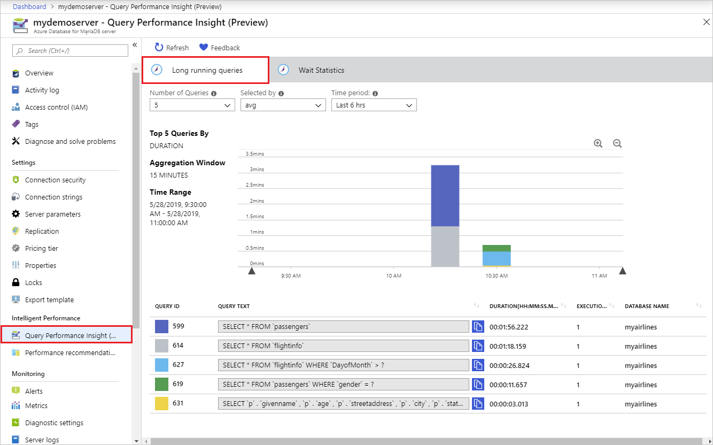
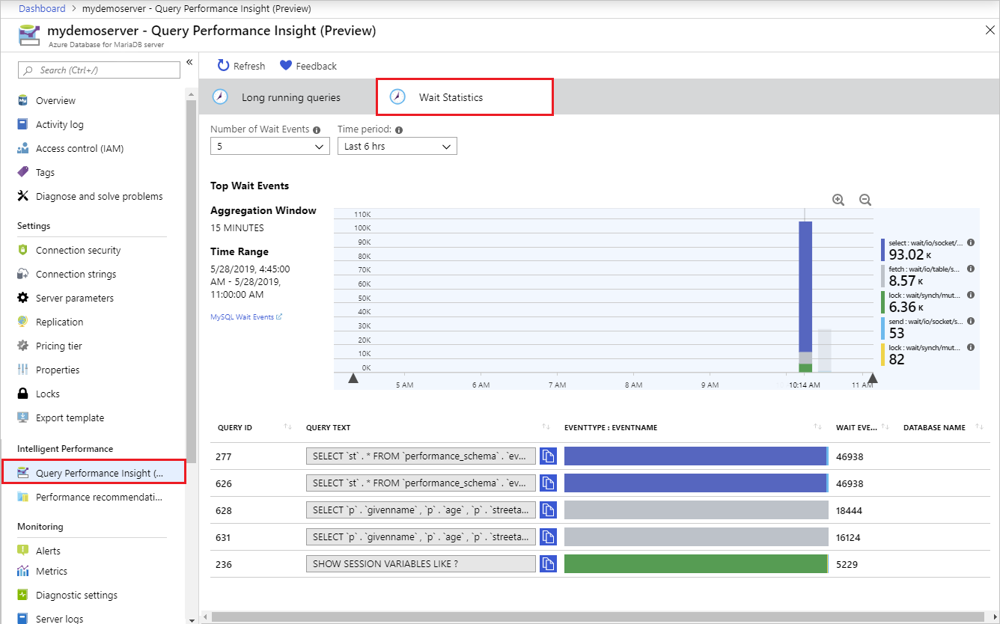

# Query Performance Insight in Azure Database for MariaDB

**Applies to:** Azure Database for MariaDB 10.2

> [!NOTE]
> Query Performance Insight is in preview.

Query Performance Insight helps you to quickly identify what your longest running queries are, how they change over time, and what waits are affecting them.

## Common scenarios

### Long running queries

- Identifying longest running queries in the past X hours
- Identifying top N queries that are waiting on resources
 
### Wait statistics

- Understanding wait nature for a query
- Understanding trends for resource waits and where resource contention exists

## Permissions

**Owner** or **Contributor** permissions required to view the text of the queries in Query Performance Insight. **Reader** can view charts and tables but not query text.

## Prerequisites

For Query Performance Insight to function, data must exist in the [Query Store](concepts-query-store.md).

## Viewing performance insights

The [Query Performance Insight](concepts-query-performance-insight.md) view in the Azure portal will surface visualizations on key information from Query Store.

In the portal page of your Azure Database for MariaDB server, select **Query Performance Insight** under the **Intelligent Performance** section of the menu bar.

### Long running queries

The **Long running queries** tab shows the top 5 queries by average duration per execution, aggregated in 15-minute intervals. You can view more queries by selecting from  the **Number of Queries** drop down. The chart colors may change for a specific Query ID when you do this.

You can click and drag in the chart to narrow down to a specific time window. Alternatively, use the zoom in and out icons to view a smaller or larger time period respectively.

### Wait statistics 

> [!NOTE]
> Wait statistics are meant for troubleshooting query performance issues. It is recommended to be turned on only for troubleshooting purposes.

Wait statistics provides a view of the wait events that occur during the execution of a specific query. Learn more about the wait event types in the [MySQL engine documentation](https://go.microsoft.com/fwlink/?linkid=2098206).

Select the **Wait Statistics** tab to view the corresponding visualizations on waits in the server.

Queries displayed in the wait statistics view are grouped by the queries that exhibit the largest waits during the specified time interval.

## Next steps

- Learn more about [monitoring and tuning](concepts-monitoring.md) in Azure Database for MariaDB.