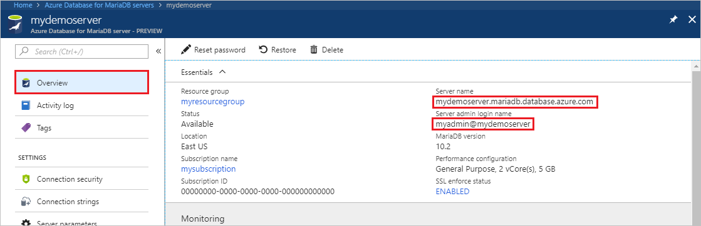
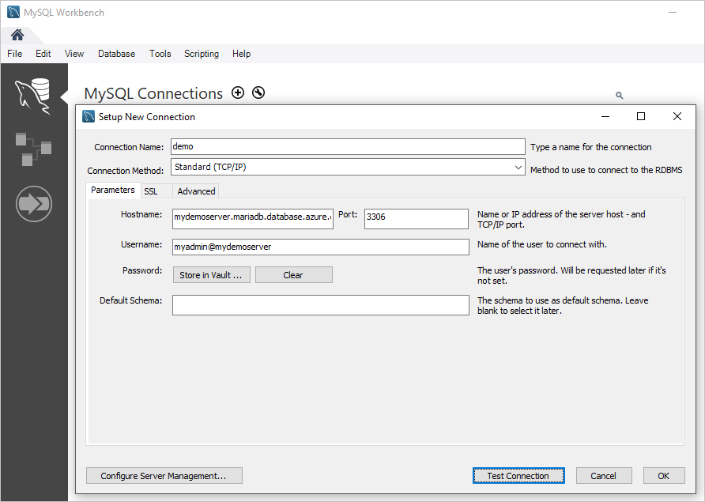

# Azure Database for MariaDB: Use MySQL Workbench to connect and query data

This quickstart demonstrates how to connect to an Azure Database for MariaDB instance by using MySQL Workbench. 

## Prerequisites

This quickstart uses the resources that are created in either of the following guides as a starting point:

- [Create an Azure Database for MariaDB server by using the Azure portal](./quickstart-create-mariadb-server-database-using-azure-portal.md)
- [Create an Azure Database for MariaDB server by using the Azure CLI](./quickstart-create-mariadb-server-database-using-azure-cli.md)

## Install MySQL Workbench

[Download MySQL Workbench](https://dev.mysql.com/downloads/workbench/) and install it on your computer.

## Get connection information

Get the connection information that's required to connect to the Azure Database for MariaDB instance. You need the fully qualified server name and sign-in credentials.

1. Sign in to the [Azure portal](https://portal.azure.com/).

2. In the left menu in the Azure portal, select **All resources**. Search for the server you created (such as **mydemoserver**).

3. Select the server name.

4. On the server's **Overview** page, make a note of the values for **Server name** and **Server admin login name**. If you forgot your password, you can also reset the password on this page.

   

## Connect to the server by using MySQL Workbench

To connect to an Azure Database for MariaDB server by using MySQL Workbench:

1. Open MySQL Workbench on your computer. 

2. In the **Setup New Connection** dialog box, on the **Parameters** tab, enter the following information:

   | Setting | Suggested value | Field description |
   |---|---|---|
   |   Connection Name | **Demo connection** | Specify a label for this connection. |
   | Connection Method | **Standard (TCP/IP)** | Standard (TCP/IP) is sufficient. |
   | Hostname | *server name* | Specify the server name value that you used to create the Azure Database for MariaDB instance. Our example server is **mydemoserver.mariadb.database.azure.com**. Use the fully qualified domain name (\*.mariadb.database.azure.com) as shown in the example. If you don't remember your server name, complete the steps in the preceding section to get the connection information.  |
   | Port | **3306** | Always use port 3306 when you connect to Azure Database for MariaDB. |
   | Username |  *server admin login name* | Enter the server admin login user name you used to create the Azure Database for MariaDB instance. Our example user name is **myadmin\@mydemoserver**. If you don't remember the server admin login name, complete the steps in the preceding section to get the connection information. The format is *username\@servername*.
   | Password | *your password* | To save the password, select **Store in Vault**. |

   

3. To check that all parameters are configured correctly, select **Test Connection**. 

4. Select **OK** to save the connection. 

5. Under **MySQL Connections**, select the tile that corresponds to your server. Wait for the connection to be established.

   A new SQL tab opens with a blank editor where you can type your queries.
    
   > [!NOTE]
   > By default, SSL connection security is required and is enforced on your Azure Database for MariaDB server. Although typically no additional configuration for SSL certificates is required for MySQL Workbench to connect to your server, we recommend binding the SSL CA certification with MySQL Workbench. If you need to disable SSL, on the server overview page in the Azure portal, select **Connection security** from the menu. For **Enforce SSL connection**, select **Disabled**.

## Create table and insert, read, update, and delete data

1. Copy and paste the following sample SQL code into the page of a blank SQL tab to illustrate some sample data.

    This code creates an empty database named **quickstartdb**. Then, it creates a sample table named **inventory**. The code inserts some rows, and then reads the rows. It changes the data with an update statement, and then reads the rows again. Finally, the code deletes a row, and then reads the rows again.
    
    ```sql
    -- Create a database
    -- DROP DATABASE IF EXISTS quickstartdb;
    CREATE DATABASE quickstartdb;
    USE quickstartdb;
    
    -- Create a table and insert rows
    DROP TABLE IF EXISTS inventory;
    CREATE TABLE inventory (id serial PRIMARY KEY, name VARCHAR(50), quantity INTEGER);
    INSERT INTO inventory (name, quantity) VALUES ('banana', 150);
    INSERT INTO inventory (name, quantity) VALUES ('orange', 154);
    INSERT INTO inventory (name, quantity) VALUES ('apple', 100);
    
    -- Read
    SELECT * FROM inventory;
    
    -- Update
    UPDATE inventory SET quantity = 200 WHERE id = 1;
    SELECT * FROM inventory;
    
    -- Delete
    DELETE FROM inventory WHERE id = 2;
    SELECT * FROM inventory;
    ```

    The screenshot shows an example of the SQL code in MySQL Workbench and the output after it runs:
    
    

2. To run the sample SQL code, on the **SQL File** tab, select the lightening bolt icon on the toolbar.
3. Note the three tabbed results in the **Result Grid** section in the middle of the page. 
4. Note the **Output** list at the bottom of the page. The status of each command is shown. 

In this quickstart, you connected to Azure Database for MariaDB by using MySQL Workbench, and you queried data by using the SQL language.

<!--
## Next steps
> [!div class="nextstepaction"]
> [Migrate your database using Export and Import](./concepts-migrate-import-export.md)
-->
