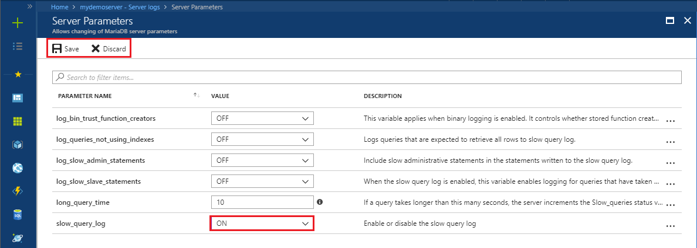

# Configure and access server logs in the Azure portal

You can configure, list, and download the [Azure Database for MariaDB slow query logs](concepts-server-logs.md) from the Azure portal.

## Prerequisites
To step through this how-to guide, you need:
- [Azure Database for MariaDB server](quickstart-create-mariadb-server-database-using-azure-portal.md)

## Configure logging
Configure access to the slow query log. 

1. Sign in to the [Azure portal](https://portal.azure.com/).

2. Select your Azure Database for MariaDB server.

3. Under the **Monitoring** section in the sidebar, select **Server Logs**. 
   

4. Select the heading **Click here to enable logs and configure log parameters** to see the server parameters.

5. Change the parameters that you need to adjust, including turning the "slow_query_log" to "ON". All changes you make in this session are highlighted in purple. 

   Once you have changed the parameters, you can click **Save**. Or you can **Discard** your changes.

   

6. Return to the list of logs by clicking the **close button** (X icon) on the **Server Parameters** page.

## View list and download logs
Once logging begins, you can view a list of available slow query logs and download individual log files on the Server Logs pane. 

1. Open the Azure portal.

2. Select your Azure Database for MariaDB server.

3. Under the **Monitoring** section in the sidebar, select **Server Logs**. The page shows a list of your log files, as shown:

   

   > [!TIP]
   > The naming convention of the log is **mysql-slow-< your server name>-yyyymmddhh.log**. The date and time used in the file name is the time is when the log was issued. Logs files are rotated every 24 hours or 7.5 GB, whichever comes first.

4. If needed, use the **search box** to quickly narrow down to a specific log based on date/time. The search is on the name of the log.

5. Download individual log files using the **download** button (down arrow icon) next to each log file in the table row as shown:

   

## Set up diagnostic logs

1. Under the **Monitoring** section in the sidebar, select **Diagnostic settings**.

1. Click on "+ Add diagnostic setting"

1. Provide a diagnostic setting name.

1. Specify which data sinks to send the slow query logs (storage account, event hub, and/or Log Analytics workspace).

1. Select "MySqlSlowLogs" as the log type.

1. Once you've configured the data sinks to pipe the slow query logs to, you can click **Save**.

1. Access the slow query logs by exploring them in the data sinks you configured. It may take up to 10 minutes for the logs to appear.

## Next steps
- See [access slow query Logs in CLI](howto-configure-server-logs-cli.md) to learn how to download slow query logs programmatically.
- Learn more about [slow query Logs](concepts-server-logs.md) in Azure Database for MariaDB.
- For more information about the parameter definitions and logging, see the MariaDB documentation on [Logs](https://mariadb.com/kb/en/library/slow-query-log-overview/).