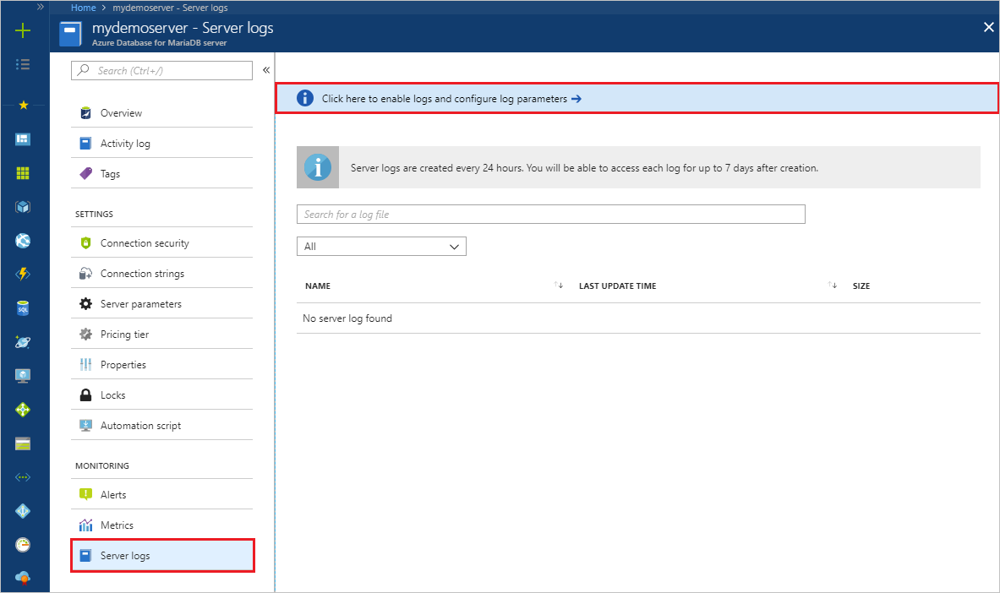
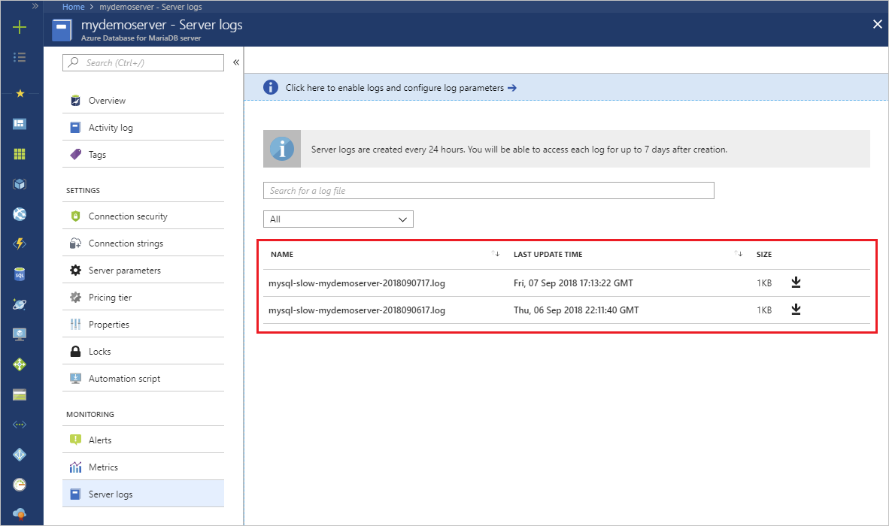
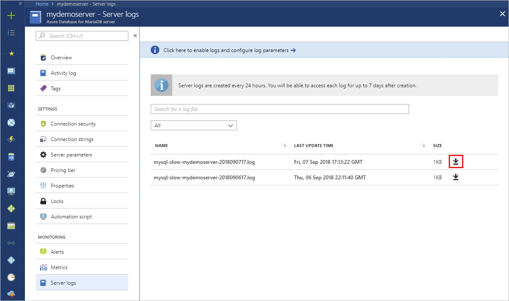
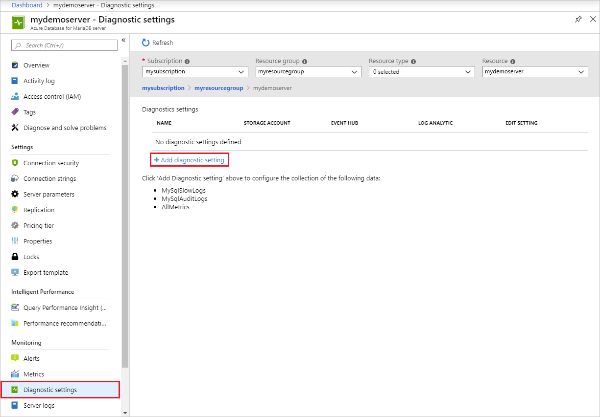

# Configure and access Azure Database for MariaDB slow query logs from the Azure portal

[!INCLUDE [azure-database-for-mariadb-deprecation](includes/azure-database-for-mariadb-deprecation.md)]

You can configure, list, and download the [Azure Database for MariaDB slow query logs](concepts-server-logs.md) from the Azure portal.

## Prerequisites

The steps in this article require that you have [Azure Database for MariaDB server](quickstart-create-mariadb-server-database-using-azure-portal.md).

## Configure logging

Configure access to the slow query log.

1. Sign in to the [Azure portal](https://portal.azure.com/).

2. Select your Azure Database for MariaDB server.

3. Under the **Monitoring** section in the sidebar, select **Server logs**. 
   

4. To see the server parameters, select **Select here to enable logs and configure log parameters**.

5. Turn **slow_query_log** to **ON**.

6. Select where to output the logs to using **log_output**. To send logs to both local storage and Azure Monitor Diagnostic Logs, select **File**.

7. Change any other parameters needed.

8. Select **Save**.

   :::image type="content" source="./media/howto-configure-server-logs-portal/3-save-discard.png" alt-text="Screenshot of slow query log parameters and save.":::

From the **Server Parameters** page, you can return to the list of logs by closing the page.

## View list and download logs

After logging begins, you can view a list of available slow query logs, and download individual log files.

1. Open the Azure portal.

2. Select your Azure Database for MariaDB server.

3. Under the **Monitoring** section in the sidebar, select **Server logs**. The page shows a list of your log files.

   

   > [!TIP]
   > The naming convention of the log is **mysql-slow-< your server name>-yyyymmddhh.log**. The date and time used in the file name is the time when the log was issued. Log files are rotated every 24 hours or 7.5 GB, whichever comes first.

4. If needed, use the search box to quickly narrow down to a specific log, based on date and time. The search is on the name of the log.

5. To download individual log files, select the down-arrow icon next to each log file in the table row.

   

## Set up diagnostic logs

1. Under the **Monitoring** section in the sidebar, select **Diagnostic settings** > **Add diagnostic setting**.

   

1. Provide a diagnostic setting name.

1. Specify which data sinks to send the slow query logs (storage account, event hub, or Log Analytics workspace).

1. Select **MySqlSlowLogs** as the log type.

1. After you've configured the data sinks to pipe the slow query logs to, select **Save**.

1. Access the slow query logs by exploring them in the data sinks you configured. It can take up to 10 minutes for the logs to appear.

## Next steps

- See [Access slow query logs in CLI](howto-configure-server-logs-cli.md) to learn how to download slow query logs programmatically.
- Learn more about [slow query logs](concepts-server-logs.md) in Azure Database for MariaDB.
- For more information about the parameter definitions and logging, see the MariaDB documentation on [logs](https://mariadb.com/kb/en/library/slow-query-log-overview/).
