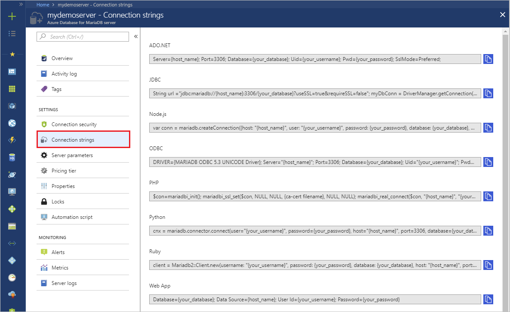

# How to connect applications to Azure Database for MariaDB

[!INCLUDE [azure-database-for-mariadb-deprecation](includes/azure-database-for-mariadb-deprecation.md)]

This topic lists the connection string types that are supported by Azure Database for MariaDB, together with templates and examples. You might have different parameters and settings in your connection string.

- To obtain the certificate, see [How to configure SSL](./howto-configure-ssl.md).
- {your_host} = [servername].mariadb.database.azure.com
- {your_user}@{servername} = userID format for authentication correctly.  If you only use the userID, the authentication will fail.

## ADO.NET

```csharp
Server={your_host}; Port=3306; Database={your_database}; Uid={username@servername}; Pwd={your_password}; SslMode=Preferred;
```

In this example, the server name is `mydemoserver`, the database name is `wpdb`, the user name is `WPAdmin`, and the password is `mypassword!2`. As a result, the connection string should be:

```csharp
Server= "mydemoserver.mariadb.database.azure.com"; Port=3306; Database= "wpdb"; Uid= "WPAdmin@mydemoserver"; Pwd="mypassword!2"; SslMode=Required;
```

## JDBC

```java
String url ="jdbc:mariadb://{your_host}:3306/{your_database}?useSSL=true&trustServerCertificate=true"; myDbConn = DriverManager.getConnection(url, "{username@servername}", {your_password});
```

## Node.js

```javascript
var conn = mysql.createConnection({host: "{your_host}", user: "{your_username}", password: {your_password}, database: {your_database}, port: 3306, ssl:{ca:fs.readFileSync({ca-cert filename})}});
```

## ODBC

```cpp
DRIVER={MARIADB ODBC 3.0 Driver}; Server="{your_host}"; Port=3306; Database={your_database}; Uid="{username@servername}"; Pwd={your_password}; sslca={ca-cert filename}; sslverify=1;
```

## PHP

```php
$con=mysqli_init(); mysqli_ssl_set($con, NULL, NULL, {ca-cert filename}, NULL, NULL); mysqli_real_connect($con, "{your_host}", "{username@servername}", {your_password}, {your_database}, 3306);
```

## Python

```python
cnx = mysql.connector.connect(user="{username@servername}", password={your_password}, host="{your_host}", port=3306, database={your_database}, ssl_ca={ca-cert filename}, ssl_verify_cert=true)
```

## Ruby

```ruby
client = Mysql2::Client.new(username: "{username@servername}", password: {your_password}, database: {your_database}, host: "{your_host}", port: 3306, sslca:{ca-cert filename}, sslverify:false, sslcipher:'AES256-SHA')
```

## Get the connection string details from the Azure portal

In the [Azure portal](https://portal.azure.com), go to your Azure Database for MariaDB server, and then select **Connection strings** to get the string list for your instance:


The string provides details such as the driver, server, and other database connection parameters. Modify these examples to use your own parameters, such as database name, password, and so on. You can then use this string to connect to the server from your code and applications.

<!-- 
## Next steps

- For more information about connection libraries, see [Concepts - Connection libraries](./concepts-connection-libraries.md).
- -->
