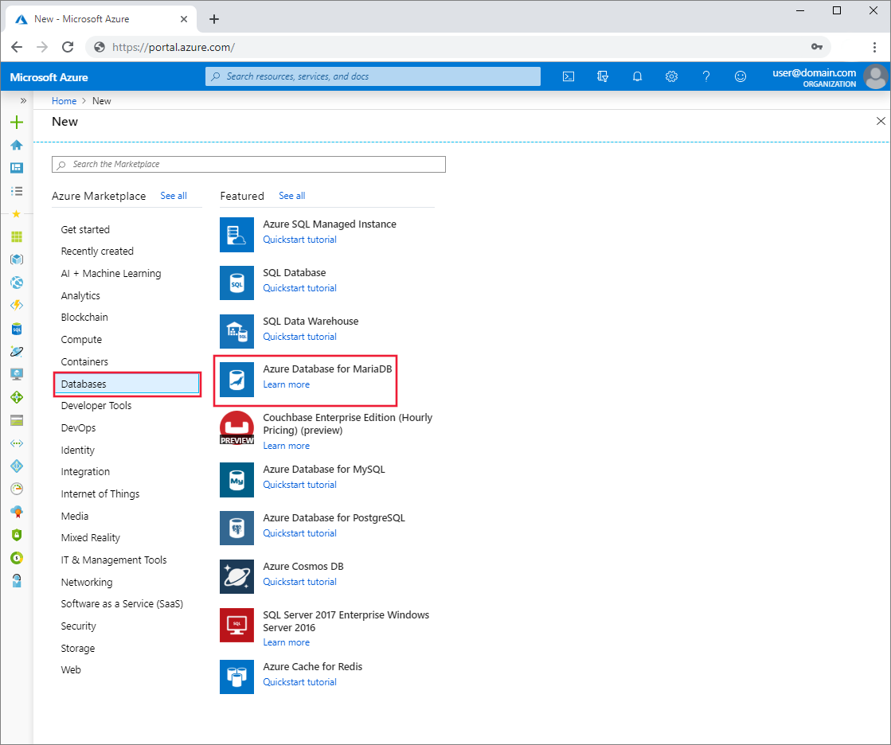
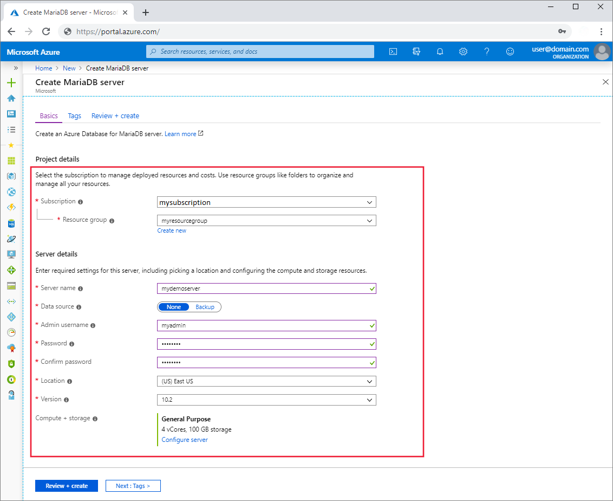
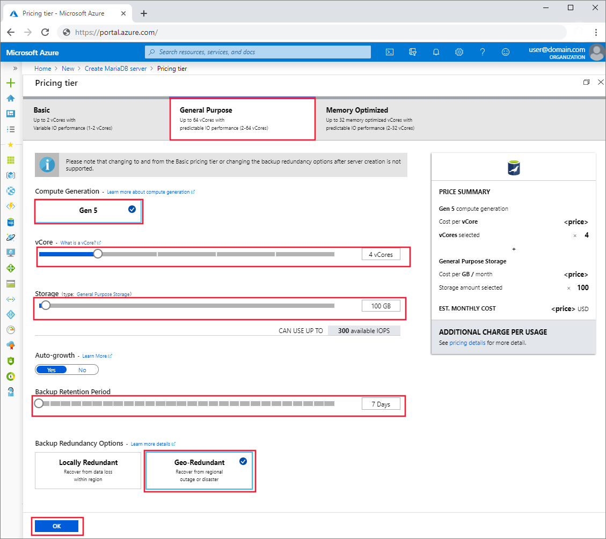
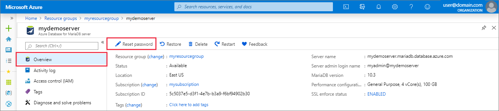
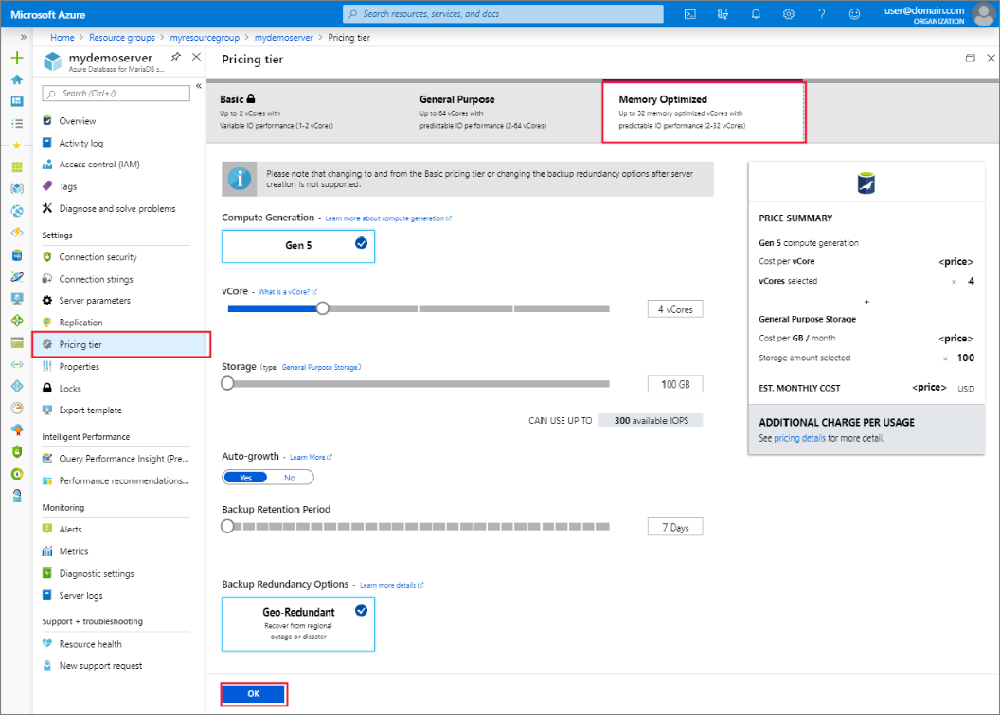
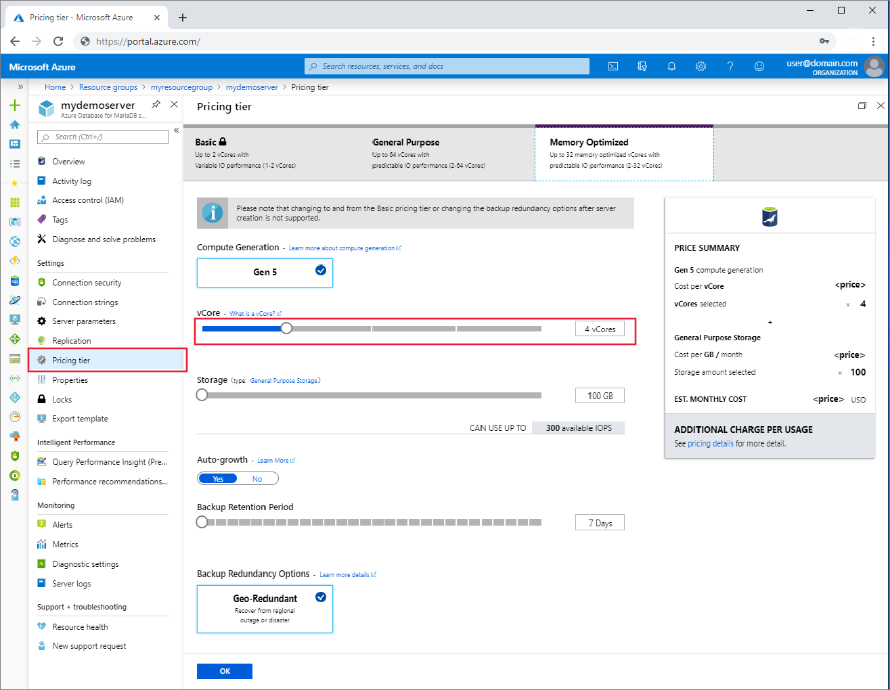
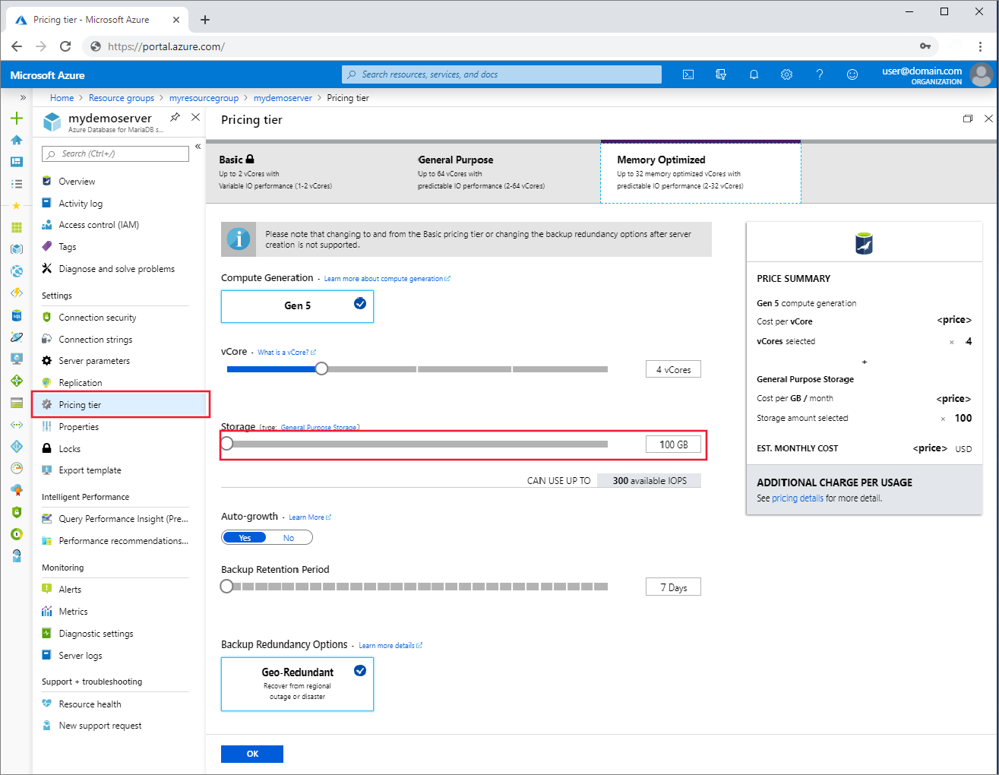
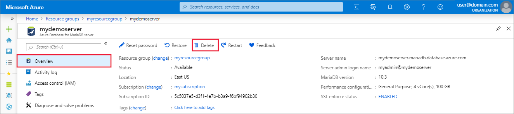
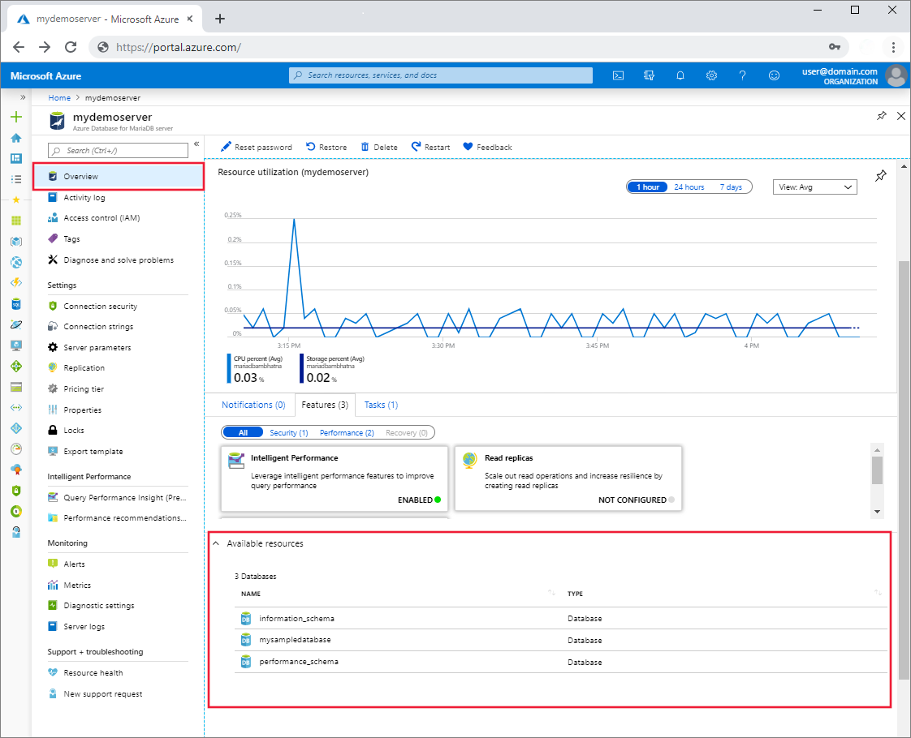
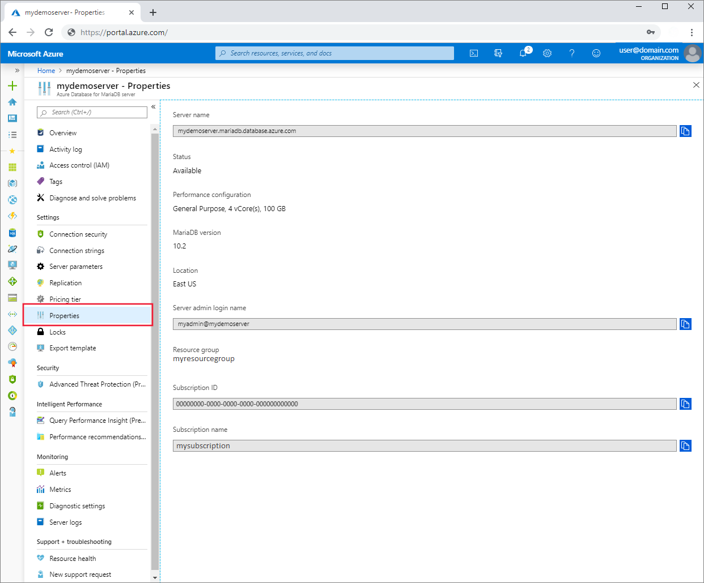

# Create and manage Azure Database for MariaDB server using Azure portal
This topic describes how you can quickly create a new Azure Database for MariaDB server. It also includes information about how to manage the server by using the Azure portal. Server management includes viewing server details and databases, resetting the password, scaling resources, and deleting the server.

## Log in to the Azure portal
Log in to the [Azure portal](https://portal.azure.com).

## Create an Azure Database for MariaDB server
Follow these steps to create an Azure Database for MariaDB server named “mydemoserver.”

1. Click the **Create a resource** button located in the upper left-hand corner of the Azure portal.

2. On the New page, select **Databases**, and then on Databases page, select **Azure Database for MariaDB**.

    > An Azure Database for MariaDB server is created with a defined set of [compute and storage](./concepts-pricing-tiers.md) resources. The database is created within an Azure resource group and in an Azure Database for MariaDB server.

   

3. Fill out the Azure Database for MariaDB form by using the following information:

    | **Form Field** | **Field Description** |
    |----------------|-----------------------|
    | *Server name* | mydemoserver (server name is globally unique) |
    | *Subscription* | mysubscription (select from the drop-down menu) |
    | *Resource group* | myresourcegroup (create a new resource group or use an existing one) |
    | *Select source* | Blank (create a blank MariaDB server) |
    | *Server admin login* | myadmin (setup admin account name) |
    | *Password* | set admin account password |
    | *Confirm password* | confirm admin account password |
    | *Location* | Southeast Asia (select between North Europe and West US) |
    | *Version* | 10.3 (choose Azure Database for MariaDB server version) |

   

4. Click **Configure Server** to specify the service tier and performance level for your new server. Select the **General Purpose** tab. *Gen 5*, *4 vCores*, *100 GB*, and *7 days* are the default values for **Compute Generation**, **vCore**, **Storage**, and **Backup Retention Period**. You can leave those sliders as it is. To enable your server backups in geo-redundant storage select **Geographically Redundant** from the **Backup Redundancy Options**.

   

5. Click **Review + Create** to go to the review screen and verify all the details. Click **Create** to provision the server. Provisioning takes a few minutes.

    > Select the **Pin to dashboard** option to allow easy tracking of your deployments.

## Update an Azure Database for MariaDB server
After the new server has been provisioned, the user has several options for configuring the existing server, including resetting the administrator password, changing the pricing tier and scaling the server up or down by changing vCore or storage.

### Change the administrator user password
1. From the server **Overview**, click **Reset password** to show the password reset window.

   

2. Enter a new password and confirm the password in the window as shown:

   

3. Click **OK** to save the new password.

### Change the pricing tier
> [!NOTE]
> Scaling is only supported from General Purpose to Memory Optimized service tiers and vice-versa. Please note that changing to and from the Basic pricing tier after server creation is not supported in Azure Database for MariaDB.
> 
1. Click on **Pricing tier**, located under **Settings**.
2. Select the **Pricing tier** you want to change to.

    

4. Click **OK** to save changes. 

### Scale vCores up/down

1. Click on **Pricing tier**, located under **Settings**.

2. Change the **vCore** setting by moving the slider to your desired value.

    

3. Click **OK** to save changes.

### Scale Storage up

1. Click on **Pricing tier**, located under **Settings**.

2. Change the **Storage** setting by moving the slider to your desired value.

    

3. Click **OK** to save changes.

## Delete an Azure Database for MariaDB server

1. From the server **Overview**, click the **Delete** button to open the delete confirmation prompt.

    

2. Type the name of the server into the input box for double confirmation.

    

3. Click the **Delete** button to confirm deleting the server. Wait for the “Successfully deleted MariaDB server" pop up to appear in the notification bar.

## List the Azure Database for MariaDB databases
From the server **Overview**, scroll down until you see the database tile at the bottom. All databases in the server are listed in the table.

   

## Show details of an Azure Database for MariaDB server
Click on **Properties**, located under **Settings** to view detailed information about the server.

## Next steps

[Quickstart: Create Azure Database for MariaDB server using Azure portal](./quickstart-create-mariadb-server-database-using-azure-portal.md)