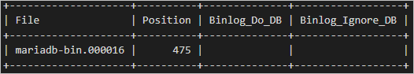

# Configure Data-in Replication in Azure Database for MariaDB

[!INCLUDE [azure-database-for-mariadb-deprecation](includes/azure-database-for-mariadb-deprecation.md)]

This article describes how to set up [Data-in Replication](concepts-data-in-replication.md) in Azure Database for MariaDB by configuring the source and replica servers. This article assumes that you have some prior experience with MariaDB servers and databases.

To create a replica in the Azure Database for MariaDB service, [Data-in Replication](concepts-data-in-replication.md) synchronizes data from a source MariaDB server on-premises, in virtual machines (VMs), or in cloud database services. Data-in Replication is based on the binary log (binlog) file position-based replication native to MariaDB. To learn more about binlog replication, see the [binlog replication overview](https://mariadb.com/kb/en/library/replication-overview/).

Review the [limitations and requirements](concepts-data-in-replication.md#limitations-and-considerations) of Data-in replication before performing the steps in this article.

> [!NOTE]
> If your source server is version 10.2 or newer, we recommend that you set up Data-in Replication by using [Global Transaction ID](https://mariadb.com/kb/en/library/gtid/).

> [!NOTE]
> This article contains references to the term *slave*, a term that Microsoft no longer uses. When the term is removed from the software, we'll remove it from this article.

## Create a MariaDB server to use as a replica

1. Create a new Azure Database for MariaDB server (for example, replica.mariadb.database.azure.com). The server is the replica server in Data-in Replication.

    To learn about server creation, see [Create an Azure Database for MariaDB server by using the Azure portal](quickstart-create-mariadb-server-database-using-azure-portal.md).

   > [!IMPORTANT]
   > You must create the Azure Database for MariaDB server in the General Purpose or Memory Optimized pricing tiers.

2. Create identical user accounts and corresponding privileges.

    User accounts aren't replicated from the source server to the replica server. To provide user access to the replica server, you must manually create all accounts and corresponding privileges on the newly created Azure Database for MariaDB server.

3. Add the source server's IP address to the replica's firewall rules.

   Update firewall rules using the [Azure portal](howto-manage-firewall-portal.md) or [Azure CLI](howto-manage-firewall-cli.md).

## Configure the source server

The following steps prepare and configure the MariaDB server hosted on-premises, in a VM, or in a cloud database service for Data-in Replication. The MariaDB server is the source in Data-in Replication.

1. Review the [primary server requirements](concepts-data-in-replication.md#requirements) before proceeding.

2. Ensure the source server allows both inbound and outbound traffic on port 3306 and that the source server has a **public IP address**, the DNS is publicly accessible, or has a fully qualified domain name (FQDN).

   Test connectivity to the source server by attempting to connect from a tool such as the MySQL command line hosted on another machine or from the [Azure Cloud Shell](../cloud-shell/overview.md) available in the Azure portal.

   If your organization has strict security policies and won't allow all IP addresses on the source server to enable communication from Azure to your source server, you can potentially use the below command to determine the IP address of your Azure Database for MariaDB server.

   1. Sign in to your Azure Database for MariaDB using a tool like MySQL command line.
   2. Execute the below query.

      ```sql
      SELECT @@global.redirect_server_host;
      ```

      Below is some sample output:

      ```output
      +-----------------------------------------------------------+
      | @@global.redirect_server_host                             |
      +-----------------------------------------------------------+
      | e299ae56f000.tr1830.westus1-a.worker.database.windows.net |
       +-----------------------------------------------------------+
      ```

   3. Exit from the MySQL command line.
   4. Execute the below in the ping utility to get the IP address.

      ```terminal
      ping <output of step 2b>
      ```

      For example:

      ```terminal
      C:\Users\testuser> ping e299ae56f000.tr1830.westus1-a.worker.database.windows.net
      Pinging tr1830.westus1-a.worker.database.windows.net (**11.11.111.111**) 56(84) bytes of data.
      ```

   5. Configure your source server's firewall rules to include the previous step's outputted IP address on port 3306.

   > [!NOTE]
   > This IP address may change due to maintenance/deployment operations. This method of connectivity is only for customers who cannot afford to allow all IP address on 3306 port.

3. Turn on binary logging.

    To see if binary logging is enabled on the primary, enter the following command:

   ```sql
   SHOW VARIABLES LIKE 'log_bin';
   ```

   If the variable [`log_bin`](https://mariadb.com/kb/en/library/replication-and-binary-log-server-system-variables/#log_bin) returns the value `ON`, binary logging is enabled on your server.

   If `log_bin` returns the value `OFF`, edit the **my.cnf** file so that `log_bin=ON` turns on binary logging. Restart the server to make the change take effect.

4. Configure source server settings.

    Data-in Replication requires the parameter `lower_case_table_names` to be consistent between the source and replica servers. The `lower_case_table_names` parameter is set to `1` by default in Azure Database for MariaDB.

   ```sql
   SET GLOBAL lower_case_table_names = 1;
   ```

5. Create a new replication role and set up permissions.

   Create a user account on the source server that's configured with replication privileges. You can create an account by using SQL commands or MySQL Workbench. If you plan to replicate with SSL, you must specify this when you create the user account.

   To learn how to add user accounts on your source server, see the [MariaDB documentation](https://mariadb.com/kb/en/library/create-user/).

   By using the following commands, the new replication role can access the source from any machine, not just the machine that hosts the source itself. For this access, specify **syncuser\@'%'** in the command to create a user.

   To learn more about MariaDB documentation, see [specifying account names](https://mariadb.com/kb/en/library/create-user/#account-names).

   **SQL command**

   - Replication with SSL

       To require SSL for all user connections, enter the following command to create a user:

       ```sql
       CREATE USER 'syncuser'@'%' IDENTIFIED BY 'yourpassword';
       GRANT REPLICATION SLAVE ON *.* TO ' syncuser'@'%' REQUIRE SSL;
       ```

   - Replication without SSL

       If SSL isn't required for all connections, enter the following command to create a user:

       ```sql
       CREATE USER 'syncuser'@'%' IDENTIFIED BY 'yourpassword';
       GRANT REPLICATION SLAVE ON *.* TO ' syncuser'@'%';
       ```

   **MySQL Workbench**

   To create the replication role in MySQL Workbench, in the **Management** pane, select **Users and Privileges**. Then select **Add Account**.

   

   Enter a username in the **Login Name** field.

   

   Select the **Administrative Roles** panel, and then in the list of **Global Privileges**, select **Replication Slave**. Select **Apply** to create the replication role.

   

6. Set the source server to read-only mode.

   Before you dump a database, the server must be placed in read-only mode. While in read-only mode, the source can't process any write transactions. To help avoid business impact, schedule the read-only window during an off-peak time.

   ```sql
   FLUSH TABLES WITH READ LOCK;
   SET GLOBAL read_only = ON;
   ```

7. Get the current binary log file name and offset.

   To determine the current binary log file name and offset, run the command [`show master status`](https://mariadb.com/kb/en/library/show-master-status/).

   ```sql
   show master status;
   ```

   The results should be similar to the following table:

   

   Note the binary file name, because it will be used in later steps.

8. Get the GTID position (optional, needed for replication with GTID).

   Run the function [`BINLOG_GTID_POS`](https://mariadb.com/kb/en/library/binlog_gtid_pos/) to get the GTID position for the corresponding binlog file name and offset.

    ```sql
    select BINLOG_GTID_POS('<binlog file name>', <binlog offset>);
    ```

## Dump and restore the source server

1. Dump all the databases from the source server.

   Use mysqldump to dump all the databases from the source server. It isn't necessary to dump the MySQL library and test library.

    For more information, see [Dump and restore](howto-migrate-dump-restore.md).

2. Set the source server to read/write mode.

   After the database has been dumped, change the source MariaDB server back to read/write mode.

   ```sql
   SET GLOBAL read_only = OFF;
   UNLOCK TABLES;
   ```

3. Restore the dump file to the new server.

   Restore the dump file to the server created in the Azure Database for MariaDB service. See [Dump & Restore](howto-migrate-dump-restore.md) for how to restore a dump file to a MariaDB server.

   If the dump file is large, upload it to a VM in Azure within the same region as your replica server. Restore it to the Azure Database for MariaDB server from the VM.

## Link the source and replica servers to start Data-in Replication

1. Set the source server.

   All Data-in Replication functions are done by stored procedures. You can find all procedures at [Data-in Replication Stored Procedures](reference-stored-procedures.md). Stored procedures can be run in the MySQL shell or MySQL Workbench.

   To link two servers and start replication, sign in to the target replica server in the Azure DB for MariaDB service. Next, set the external instance as the source server by using the `mysql.az_replication_change_master` or `mysql.az_replication_change_master_with_gtid` stored procedure on the Azure DB for MariaDB server.

   ```sql
   CALL mysql.az_replication_change_master('<master_host>', '<master_user>', '<master_password>', 3306, '<master_log_file>', <master_log_pos>, '<master_ssl_ca>');
   ```

   or

   ```sql
   CALL mysql.az_replication_change_master_with_gtid('<master_host>', '<master_user>', '<master_password>', 3306, '<master_gtid_pos>', '<master_ssl_ca>');
   ```

   - master_host: hostname of the source server
   - master_user: username for the source server
   - master_password: password for the source server
   - master_log_file: binary log file name from running `show master status`
   - master_log_pos: binary log position from running `show master status`
   - master_gtid_pos: GTID position from running `select BINLOG_GTID_POS('<binlog file name>', <binlog offset>);`
   - master_ssl_ca: CA certificate's context. If you're not using SSL, pass in an empty string.*

    *We recommend passing in the master_ssl_ca parameter as a variable. For more information, see the following examples.

   **Examples**

   - Replication with SSL

       Create the variable `@cert` by running the following commands:

       ```sql
       SET @cert = '-----BEGIN CERTIFICATE-----
       PLACE YOUR PUBLIC KEY CERTIFICATE\'S CONTEXT HERE
       -----END CERTIFICATE-----'
       ```

       Replication with SSL is set up between a source server hosted in the domain companya.com, and a replica server hosted in Azure Database for MariaDB. This stored procedure is run on the replica.

       ```sql
       CALL mysql.az_replication_change_master('master.companya.com', 'syncuser', 'P@ssword!', 3306, 'mariadb-bin.000016', 475, @cert);
       ```

   - Replication without SSL

       Replication without SSL is set up between a source server hosted in the domain companya.com, and a replica server hosted in Azure Database for MariaDB. This stored procedure is run on the replica.

       ```sql
       CALL mysql.az_replication_change_master('master.companya.com', 'syncuser', 'P@ssword!', 3306, 'mariadb-bin.000016', 475, '');
       ```

2. Start replication.

   Call the `mysql.az_replication_start` stored procedure to start replication.

   ```sql
   CALL mysql.az_replication_start;
   ```

3. Check replication status.

   Call the [`show slave status`](https://mariadb.com/kb/en/library/show-slave-status/) command on the replica server to view the replication status.

   ```sql
   show slave status;
   ```

   If `Slave_IO_Running` and `Slave_SQL_Running` are in the state `yes`, and the value of `Seconds_Behind_Master` is `0`, replication is working. `Seconds_Behind_Master` indicates how late the replica is. If the value isn't `0`, then the replica is processing updates.

4. Update the corresponding server variables to make data-in replication safer (required only for replication without GTID).

    Because of a native replication limitation in MariaDB, you must set  [`sync_master_info`](https://mariadb.com/kb/en/library/replication-and-binary-log-system-variables/#sync_master_info) and [`sync_relay_log_info`](https://mariadb.com/kb/en/library/replication-and-binary-log-system-variables/#sync_relay_log_info) variables on replication without the GTID scenario.

    Check your replica server's `sync_master_info` and `sync_relay_log_info` variables to make sure the data-in replication is stable, and set the variables to `1`.

## Other stored procedures

### Stop replication

To stop replication between the source and replica server, use the following stored procedure:

```sql
CALL mysql.az_replication_stop;
```

### Remove the replication relationship

To remove the relationship between the source and replica server, use the following stored procedure:

```sql
CALL mysql.az_replication_remove_master;
```

### Skip the replication error

To skip a replication error and allow replication, use the following stored procedure:

```sql
CALL mysql.az_replication_skip_counter;
```

## Next steps

Learn more about [Data-in Replication](concepts-data-in-replication.md) for Azure Database for MariaDB.
