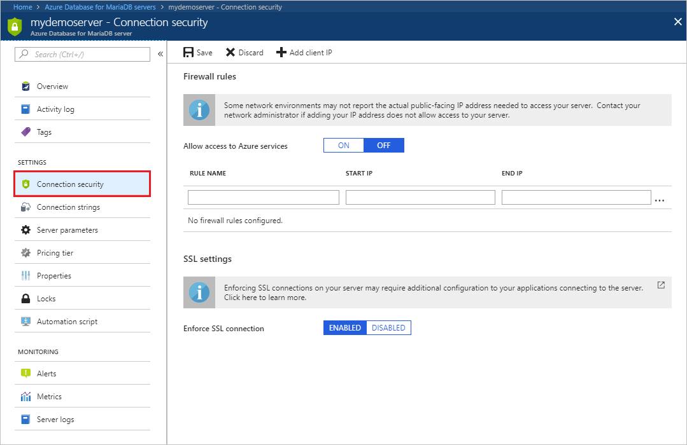
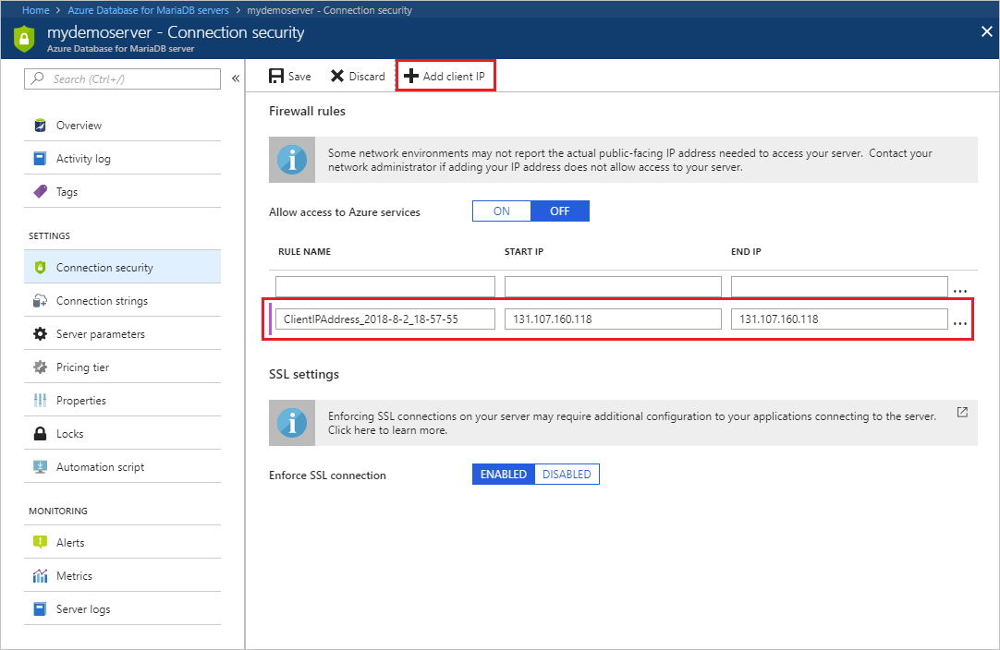
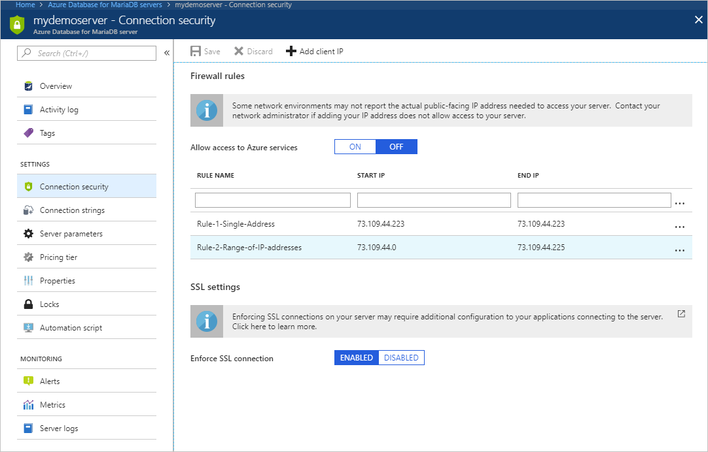
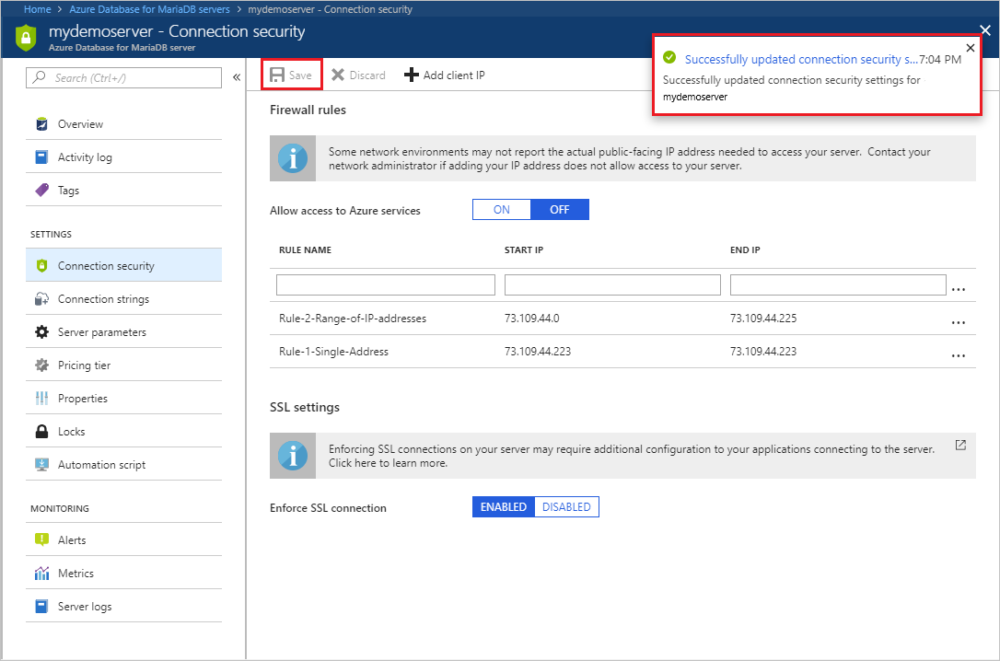

# Create and manage Azure Database for MariaDB firewall rules by using the Azure portal
Server-level firewall rules can be used to manage access to an Azure Database for MariaDB Server from a specified IP address or a range of IP addresses.

Virtual Network (VNet) rules can also be used to secure access to your server. Learn more about [creating and managing Virtual Network service endpoints and rules using the Azure portal](howto-manage-vnet-portal.md).

## Create a server-level firewall rule in the Azure portal

1. On the MariaDB server page, under Settings heading, click **Connection Security** to open the Connection Security page for the Azure Database for MariaDB.

   

2. Click **Add My IP** on the toolbar. This automatically creates a firewall rule with the public IP address of your computer, as perceived by the Azure system.

   

3. Verify your IP address before saving the configuration. In some situations, the IP address observed by Azure portal differs from the IP address used when accessing the internet and Azure servers. Therefore, you may need to change the Start IP and End IP to make the rule function as expected.

   Use a search engine or other online tool to check your own IP address. For example, search "what is my IP address".

4. Add additional address ranges. In the firewall rules for the Azure Database for MariaDB, you can specify a single IP address or a range of addresses. If you want to limit the rule to a single IP address, type the same address in the Start IP and End IP fields. Opening the firewall enables administrators, users, and application to access any database on the MariaDB server to which they have valid credentials.

   

5. Click **Save** on the toolbar to save this server-level firewall rule. Wait for the confirmation that the update to the firewall rules is  successful.

   

## Connecting from Azure
To allow applications from Azure to connect to your Azure Database for MariaDB server, Azure connections must be enabled. For example, to host an Azure Web Apps application, or an application that runs in an Azure VM, or to connect from an Azure Data Factory data management gateway. The resources do not need to be in the same Virtual Network (VNet) or Resource Group for the firewall rule to enable those connections. When an application from Azure attempts to connect to your database server, the firewall verifies that Azure connections are allowed. There are a couple of methods to enable these types of connections. A firewall setting with starting and ending address equal to 0.0.0.0 indicates these connections are allowed. Alternatively, you can set the **Allow access to Azure services** option to **ON** in the portal from the **Connection security** pane and click **Save**. If the connection attempt is not allowed, the request does not reach the Azure Database for MariaDB server.

> [!IMPORTANT]
> This option configures the firewall to allow all connections from Azure including connections from the subscriptions of other customers. When selecting this option, make sure your login and user permissions limit access to only authorized users.
> 

## Manage existing firewall rules in the Azure portal
Repeat the steps to manage the firewall rules.
* To add the current computer, click **+ Add My IP**. Click **Save** to save the changes.
* To add additional IP addresses, type in the **RULE NAME**, **START IP**, and **END IP**. Click **Save** to save the changes.
* To modify an existing rule, click any of the fields in the rule, and then modify. Click **Save** to save the changes.
* To delete an existing rule, click the ellipsis […], and then click **Delete**. Click **Save** to save the changes.

## Next steps
 - Similarly, you can script to [Create and manage Azure Database for MariaDB firewall rules using Azure CLI](howto-manage-firewall-cli.md).
 - Further secure access to your server by [creating and managing Virtual Network service endpoints and rules using the Azure portal](howto-manage-vnet-portal.md).