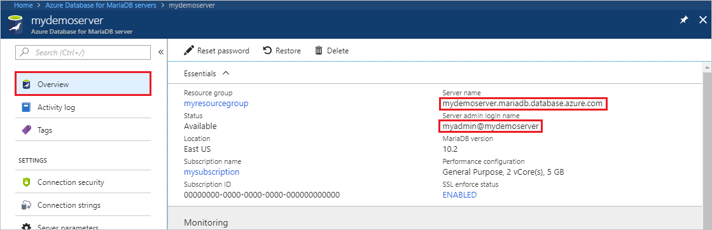

# Migrate your MariaDB database to Azure Database for MariaDB using dump and restore
This article explains two common ways to back up and restore databases in your Azure Database for MariaDB
- Dump and restore from the command-line (using mysqldump) 
- Dump and restore using PHPMyAdmin

## Before you begin
To step through this how-to guide, you need to have:
- [Create Azure Database for MariaDB server - Azure portal](quickstart-create-mariadb-server-database-using-azure-portal.md)
- [mysqldump](https://mariadb.com/kb/en/library/mysqldump/) command-line utility installed on a machine.
- MySQL Workbench [MySQL Workbench Download](https://dev.mysql.com/downloads/workbench/), Toad, Navicat, or other third-party MySQL tool to do dump and restore commands.

## Use common tools
Use common utilities and tools such as MySQL Workbench, mysqldump, Toad, or Navicat to remotely connect and restore data into Azure Database for MariaDB. Use such tools on your client machine with an internet connection to connect to the Azure Database for MariaDB. Use an SSL encrypted connection for best security practices, see also [Configure SSL connectivity in Azure Database for MariaDB](concepts-ssl-connection-security.md). You do not need to move the dump files to any special cloud location when migrating to Azure Database for MariaDB. 

## Common uses for dump and restore
You may use MySQL utilities such as mysqldump and mysqlpump to dump and load databases into an Azure Database for MariaDB server in several common scenarios. 

<!--In other scenarios, you may use the [Import and Export](howto-migrate-import-export.md) approach instead.-->

- Use database dumps when you are migrating the entire database. This recommendation holds when moving a large amount of data, or when you want to minimize service interruption for live sites or applications. 
-  Make sure all tables in the database use the InnoDB storage engine when loading data into Azure Database for MariaDB. Azure Database for MariaDB supports only InnoDB Storage engine, and therefore does not support alternative storage engines. If your tables are configured with other storage engines, convert them into the InnoDB engine format before migration to Azure Database for MariaDB.
   For example, if you have a WordPress or WebApp using the MyISAM tables, first convert those tables by migrating into InnoDB format before restoring to Azure Database for MariaDB. Use the clause `ENGINE=InnoDB` to set the engine used when creating a new table, then transfer the data into the compatible table before the restore. 

   ```sql
   INSERT INTO innodb_table SELECT * FROM myisam_table ORDER BY primary_key_columns
   ```
- To avoid any compatibility issues, ensure the same version of MariaDB is used on the source and destination systems when dumping databases. For example, if your existing MariaDB server is version 10.2, then you should migrate to Azure Database for MariaDB configured to run version 10.2. The `mysql_upgrade` command does not function in an Azure Database for MariaDB server, and is not supported. If you need to upgrade across MariaDB versions, first dump or export your lower version database into a higher version of MariaDB in your own environment. Then run `mysql_upgrade`, before attempting migration into an Azure Database for MariaDB.

## Performance considerations
To optimize performance, take notice of these considerations when dumping large databases:
-	Use the `exclude-triggers` option in mysqldump when dumping databases. Exclude triggers from dump files to avoid the trigger commands firing during the data restore. 
-	Use the `single-transaction` option to set the transaction isolation mode to REPEATABLE READ and sends a START TRANSACTION SQL statement to the server before dumping data. Dumping many tables within a single transaction causes some extra storage to be consumed during restore. The `single-transaction` option and the `lock-tables` option are mutually exclusive because LOCK TABLES causes any pending transactions to be committed implicitly. To dump large tables, combine the `single-transaction` option with the `quick` option. 
-	Use the `extended-insert` multiple-row syntax that includes several VALUE lists. This results in a smaller dump file and speeds up inserts when the file is reloaded.
-  Use the `order-by-primary` option in mysqldump when dumping databases, so that the data is scripted in primary key order.
-	Use the `disable-keys` option in mysqldump when dumping data, to disable foreign key constraints before load. Disabling foreign key checks provides performance gains. Enable the constraints and verify the data after the load to ensure referential integrity.
-	Use partitioned tables when appropriate.
-	Load data in parallel. Avoid too much parallelism that would cause you to hit a resource limit, and monitor resources using the metrics available in the Azure portal. 
-	Use the `defer-table-indexes` option in mysqlpump when dumping databases, so that index creation happens after tables data is loaded.
-   Copy the backup files to an Azure blob/store and perform the restore from there, which should be a lot faster than performing the restore across the Internet.

## Create a backup file
To back up an existing MariaDB database on the local on-premises server or in a virtual machine, run the following command using mysqldump: 
```bash
$ mysqldump --opt -u [uname] -p[pass] [dbname] > [backupfile.sql]
```

The parameters to provide are:
- [uname] Your database username 
- [pass] The password for your database (note there is no space between -p and the password) 
- [dbname] The name of your database 
- [backupfile.sql] The filename for your database backup 
- [--opt] The mysqldump option 

For example, to back up a database named 'testdb' on your MariaDB server with the username 'testuser' and with no password to a file testdb_backup.sql, use the following command. The command backs up the `testdb` database into a file called `testdb_backup.sql`, which contains all the SQL statements needed to re-create the database. 

```bash
$ mysqldump -u root -p testdb > testdb_backup.sql
```
To select specific tables in your database to back up, list the table names separated by spaces. For example, to back up only table1 and table2 tables from the 'testdb', follow this example: 
```bash
$ mysqldump -u root -p testdb table1 table2 > testdb_tables_backup.sql
```
To back up more than one database at once, use the --database switch and list the database names separated by spaces. 
```bash
$ mysqldump -u root -p --databases testdb1 testdb3 testdb5 > testdb135_backup.sql 
```
To back up all the databases in the server at one time, you should use the --all-databases option.
```bash
$ mysqldump -u root -p --all-databases > alldb_backup.sql 
```

## Create a database on the target server
Create an empty database on the target Azure Database for MariaDB server where you want to migrate the data. Use a tool such as MySQL Workbench, Toad, or Navicat to create the database. The database can have the same name as the database that is contained the dumped data or you can create a database with a different name.

To get connected, locate the connection information in the **Overview** of your Azure Database for MariaDB.



Add the connection information into your MySQL Workbench.


## Restore your MariaDB database
Once you have created the target database, you can use the mysql command or MySQL Workbench to restore the data into the specific newly created database from the dump file.
```bash
mysql -h [hostname] -u [uname] -p[pass] [db_to_restore] < [backupfile.sql]
```
In this example, restore the data into the newly created database on the target Azure Database for MariaDB server.
```bash
$ mysql -h mydemoserver.mariadb.database.azure.com -u myadmin@mydemoserver -p testdb < testdb_backup.sql
```

## Export using PHPMyAdmin
To export, you can use the common tool phpMyAdmin, which you may already have installed locally in your environment. To export your MariaDB database using PHPMyAdmin:
1. Open phpMyAdmin.
2. Select your database. Click the database name in the list on the left. 
3. Click the **Export** link. A new page appears to view the dump of database.
4. In the Export area, click the **Select All** link to choose the tables in your database. 
5. In the SQL options area, click the appropriate options. 
6. Click the **Save as file** option and the corresponding compression option and then click the **Go** button. A dialog box should appear prompting you to save the file locally.

## Import using PHPMyAdmin
Importing your database is similar to exporting. Do the following actions:
1. Open phpMyAdmin. 
2. In the phpMyAdmin setup page, click **Add** to add your Azure Database for MariaDB server. Provide the connection details and login information.
3. Create an appropriately named database and select it on the left of the screen. To rewrite the existing database, click the database name, select all the check boxes beside the table names, and select **Drop** to delete the existing tables. 
4. Click the **SQL** link to show the page where you can type in SQL commands, or upload your SQL file. 
5. Use the **browse** button to find the database file. 
6. Click the **Go** button to export the backup, execute the SQL commands, and re-create your database.

## Next steps
- [Connect applications to Azure Database for MariaDB](./howto-connection-string.md).
 
<!--
- For more information about migrating databases to Azure Database for MariaDB, see the [Database Migration Guide](https://aka.ms/datamigration).
-->
