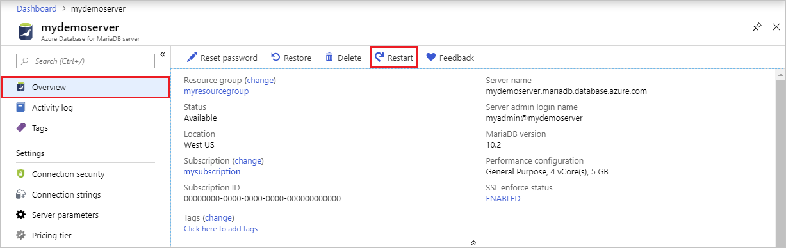
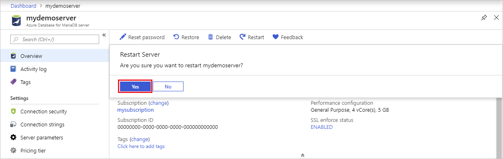
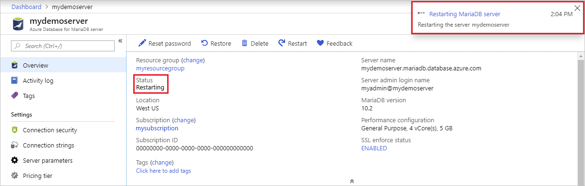
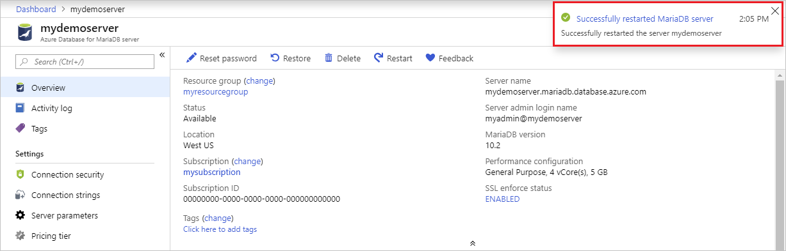

# Restart Azure Database for MariaDB server using Azure portal

[!INCLUDE [azure-database-for-mariadb-deprecation](includes/azure-database-for-mariadb-deprecation.md)]

This topic describes how you can restart an Azure Database for MariaDB server. You may need to restart your server for maintenance reasons, which causes a short outage as the server performs the operation.

The server restart will be blocked if the service is busy. For example, the service may be processing a previously requested operation such as scaling vCores.

The time required to complete a restart depends on the MariaDB recovery process. To decrease the restart time, we recommend you minimize the amount of activity occurring on the server prior to the restart.

## Prerequisites

To complete this how-to guide, you need:
- An [Azure Database for MariaDB server](./quickstart-create-mariadb-server-database-using-azure-portal.md)

## Perform server restart

The following steps restart the MariaDB server:

1. In the Azure portal, select your Azure Database for MariaDB server.

2. In the toolbar of the server's **Overview** page, select **Restart**.

   

3. Select **Yes** to confirm restarting the server.

   

4. Observe that the server status changes to "Restarting".

   

5. Confirm server restart is successful.

   

## Next steps

[Quickstart: Create Azure Database for MariaDB server using Azure portal](./quickstart-create-mariadb-server-database-using-azure-portal.md)
