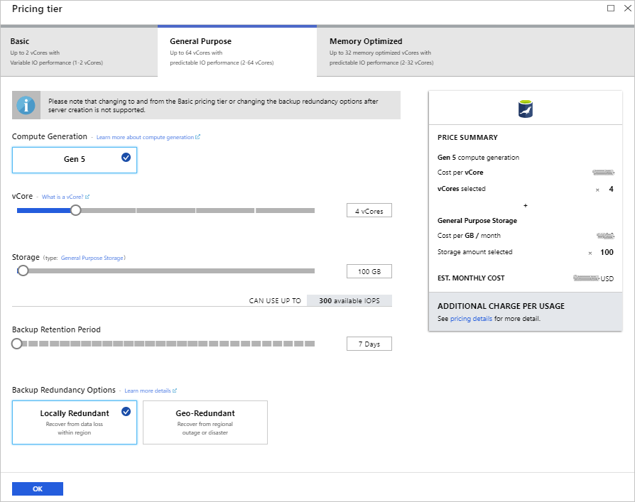
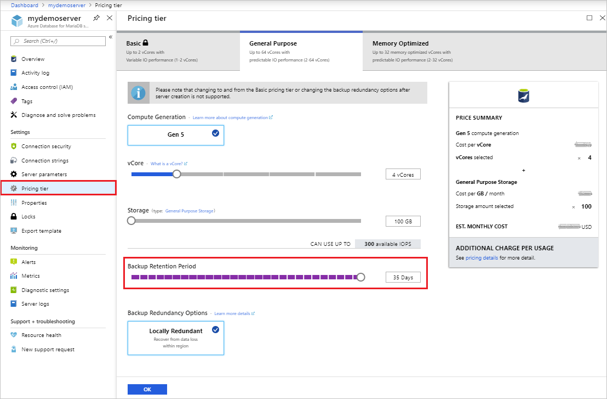
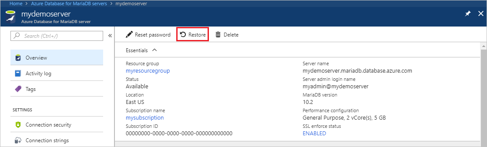

# How to backup and restore a server in Azure Database for MariaDB using the Azure portal

[!INCLUDE [azure-database-for-mariadb-deprecation](includes/azure-database-for-mariadb-deprecation.md)]

## Backup happens automatically

Azure Database for MariaDB servers are backed up periodically to enable Restore features. Using this feature you may restore the server and all its databases to an earlier point-in-time, on a new server.

## Prerequisites

To complete this how-to guide, you need:
- An [Azure Database for MariaDB server and database](quickstart-create-mariadb-server-database-using-azure-portal.md)

## Set backup configuration

You make the choice between configuring your server for either locally redundant backups or geographically redundant backups at server creation, in the **Pricing Tier** window.

> [!NOTE]
> After a server is created, the kind of redundancy it has, geographically redundant vs locally redundant, can't be switched.
>

While creating a server through the Azure portal, the **Pricing Tier** window is where you select either **Locally Redundant** or **Geographically Redundant** backups for your server. This window is also where you select the **Backup Retention Period** - how long (in number of days) you want the server backups stored for.

   

For more information about setting these values during create, see the [Azure Database for MariaDB server quickstart](quickstart-create-mariadb-server-database-using-azure-portal.md).

The backup retention period can be changed on a server through the following steps:
1. Sign in to the [Azure portal](https://portal.azure.com).

2. Select your Azure Database for MariaDB server. This action opens the **Overview** page.

3. Select **Pricing Tier** from the menu, under **SETTINGS**. Using the slider you can change the **Backup Retention Period** to your preference between 7 and 35 days.
In the screenshot below it has been increased to 35 days.

4. Select **OK** to confirm the change.

The backup retention period governs how far back in time a point-in-time restore can be retrieved, since it's based on backups available. Point-in-time restore is described further in the following section.

## Point-in-time restore

Azure Database for MariaDB allows you to restore the server back to a point-in-time and into to a new copy of the server. You can use this new server to recover your data, or have your client applications point to this new server.

For example, if a table was accidentally dropped at noon today, you could restore to the time just before noon and retrieve the missing table and data from that new copy of the server. Point-in-time restore is at the server level, not at the database level.

The following steps restore the sample server to a point-in-time:
1. In the Azure portal, select your Azure Database for MariaDB server.

2. In the toolbar of the server's **Overview** page, select **Restore**.

   

3. Fill out the Restore form with the required information:

   
   - **Restore point**: Select the point-in-time you want to restore to.
   - **Target server**: Provide a name for the new server.
   - **Location**: You cannot select the region. By default it is same as the source server.
   - **Pricing tier**: You cannot change these parameters when doing a point-in-time restore. It is same as the source server.

4. Select **OK** to restore the server to restore to a point-in-time.

5. Once the restore finishes, locate the new server that is created to verify the data was restored as expected.

The new server created by point-in-time restore has the same server admin login name and password that was valid for the existing server at the point-in-time chose. You can change the password from the new server's **Overview** page.

The new server created during a restore does not have the VNet service endpoints that existed on the original server. These rules need to be set up separately for this new server. Firewall rules from the original server are restored.

## Geo restore

If you configured your server for geographically redundant backups, a new server can be created from the backup of that existing server. This new server can be created in any region that Azure Database for MariaDB is available.

1. Select the **Create a resource** button (+) in the upper-left corner of the portal. Select **Databases** > **Azure Database for MariaDB**.

   :::image type="content" source="./media/howto-restore-server-portal/2_navigate-to-mariadb.png" alt-text="Navigate to Azure Database for MariaDB.":::

2. Provide the subscription, resource group, and name of the new server.

3. Select **Backup** as the **Data source**. This action loads a dropdown that provides a list of servers that have geo redundant backups enabled.

   :::image type="content" source="./media/howto-restore-server-portal/3-geo-restore.png" alt-text="Select data source.":::

   > [!NOTE]
   > When a server is first created it may not be immediately available for geo restore. It may take a few hours for the necessary metadata to be populated.
   >

4. Select the **Backup** dropdown.

   :::image type="content" source="./media/howto-restore-server-portal/4-geo-restore-backup.png" alt-text="Select backup dropdown.":::

5. Select the source server to restore from.

   :::image type="content" source="./media/howto-restore-server-portal/5-select-backup.png" alt-text="Select backup.":::

6. The server will default to values for number of **vCores**, **Backup Retention Period**, **Backup Redundancy Option**, **Engine version**, and **Admin credentials**. Select **Continue**.

   :::image type="content" source="./media/howto-restore-server-portal/6-accept-backup.png" alt-text="Continue with backup.":::

7. Fill out the rest of the form with your preferences. You can select any **Location**.

    After selecting the location, you can select **Configure server** to update the **Compute Generation** (if available in the region you have chosen), number of **vCores**, **Backup Retention Period**, and **Backup Redundancy Option**. Changing **Pricing Tier** (Basic, General Purpose, or Memory Optimized) or **Storage** size during restore is not supported.

   :::image type="content" source="./media/howto-restore-server-portal/7-create.png" alt-text="Fill form.":::

8. Select **Review + create** to review your selections.

9. Select **Create** to provision the server. This operation may take a few minutes.

The new server created by geo restore has the same server admin login name and password that was valid for the existing server at the time the restore was initiated. The password can be changed from the new server's **Overview** page.

The new server created during a restore does not have the VNet service endpoints that existed on the original server. These rules need to be set up separately for this new server. Firewall rules from the original server are restored.

## Next steps

- Learn more about the service's [backups](concepts-backup.md)
- Learn about [replicas](concepts-read-replicas.md)
- Learn more about [business continuity](concepts-business-continuity.md) options
