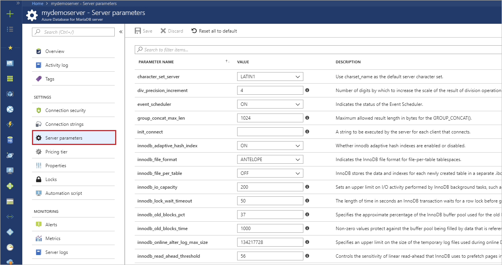
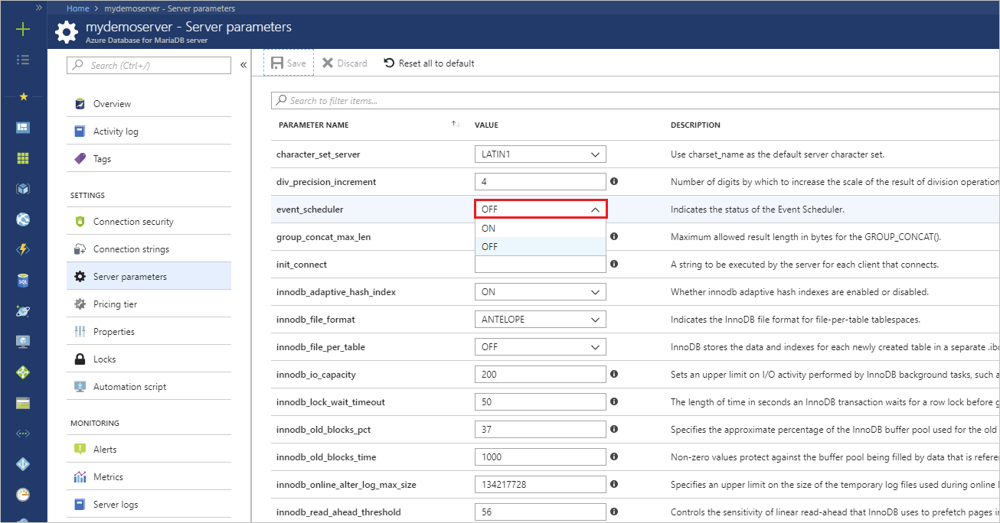
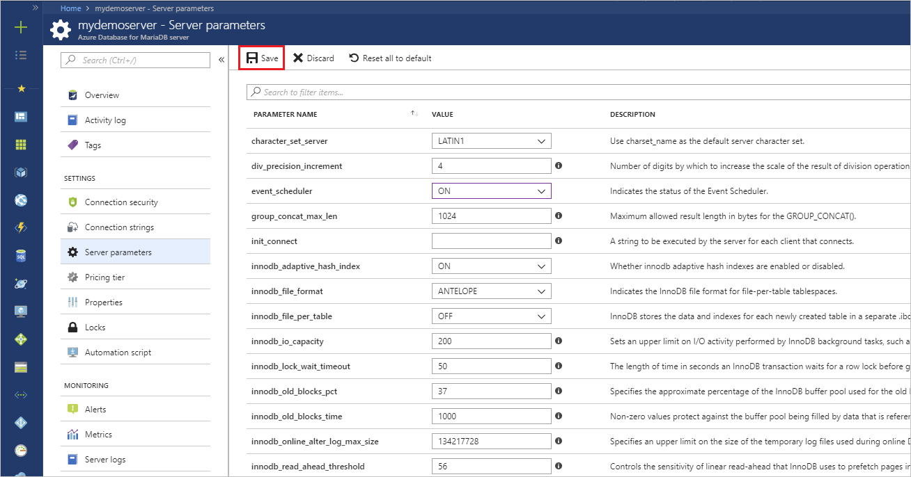
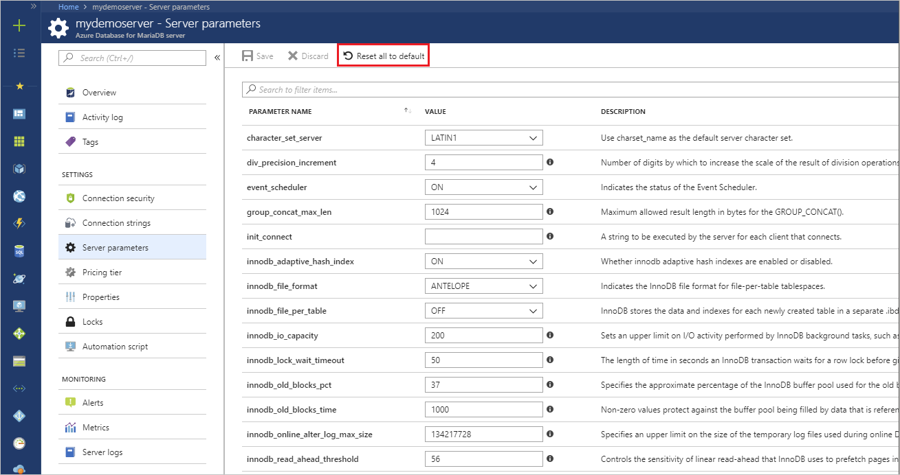
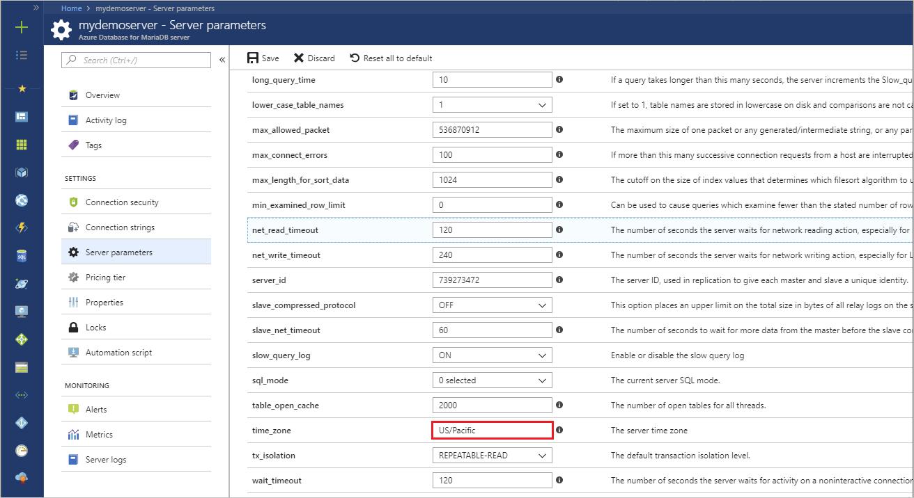

# How to configure server parameters in Azure Database for MariaDB by using the Azure portal

Azure Database for MariaDB supports configuration of some server parameters. This article describes how to configure these parameters by using the Azure portal. Not all server parameters can be adjusted.

## Navigate to Server Parameters on Azure portal

1. Sign in to the Azure portal, then locate your Azure Database for MariaDB server.
2. Under the **SETTINGS** section, click **Server parameters** to open the server parameters page for the Azure Database for MariaDB server.

3. Locate any settings you need to adjust. Review the **Description** column to understand the purpose and allowed values.

4. Click  **Save** to save your changes.

5. If you have saved new values for the parameters, you can always revert everything back to the default values by selecting **Reset all to default**.


## List of configurable server parameters

The list of supported server parameters is constantly growing. Use the server parameters tab in Azure portal to get the definition and configure server parameters based on your application requirements.

## Non-configurable server parameters

InnoDB Buffer Pool and Max Connections are not configurable and tied to your [pricing tier](concepts-pricing-tiers.md).

|**Pricing Tier**| **vCore(s)**|**InnoDB Buffer Pool (MB)**| **Max Connections**|
|---|---|---|---|
|Basic| 1| 1024| 50|
|Basic| 2| 2560| 100|
|General Purpose| 2| 3584| 300|
|General Purpose| 4| 7680| 625|
|General Purpose| 8| 15360| 1250|
|General Purpose| 16| 31232| 2500|
|General Purpose| 32| 62976| 5000|
|General Purpose| 64| 125952| 10000|
|Memory Optimized| 2| 7168| 600|
|Memory Optimized| 4| 15360| 1250|
|Memory Optimized| 8| 30720| 2500|
|Memory Optimized| 16| 62464| 5000|
|Memory Optimized| 32| 125952| 10000|

These additional server parameters are not configurable in the system:

|**Parameter**|**Fixed value**|
| :------------------------ | :-------- |
|innodb_file_per_table in Basic tier|OFF|
|innodb_flush_log_at_trx_commit|1|
|sync_binlog|1|
|innodb_log_file_size|512MB|

Other server parameters that are not listed here are set to their MariaDB out-of-box default values for [MariaDB](https://mariadb.com/kb/en/library/xtradbinnodb-server-system-variables/).

## Working with the time zone parameter

### Populating the time zone tables

The time zone tables on your server can be populated by calling the `az_load_timezone` stored procedure from a tool like the MySQL command line or MySQL Workbench.

> [!NOTE]
> If you are running the `az_load_timezone` command from MySQL Workbench, you may need to turn off safe update mode first using `SET SQL_SAFE_UPDATES=0;`.

```sql
CALL mysql.az_load_timezone();
```

To view available time zone values, run the following command:

```sql
SELECT name FROM mysql.time_zone_name;
```

### Setting the global level time zone

The global level time zone can be set from the **Server parameters** page in the Azure portal. The below sets the global time zone to the value "US/Pacific".



### Setting the session level time zone

The session level time zone can be set by running the `SET time_zone` command from a tool like the MySQL command line or MySQL Workbench. The example below sets the time zone to the **US/Pacific** time zone.

```sql
SET time_zone = 'US/Pacific';
```

Refer to the MariaDB documentation for [Date and Time Functions](https://mariadb.com/kb/en/library/convert_tz/).

<!--
## Next steps

- [Connection libraries for Azure Database for MariaDB](concepts-connection-libraries.md).
-->
