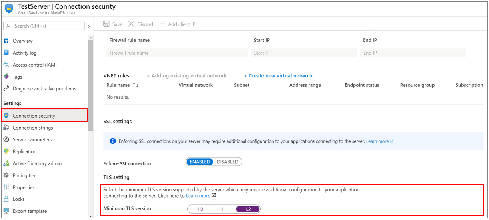
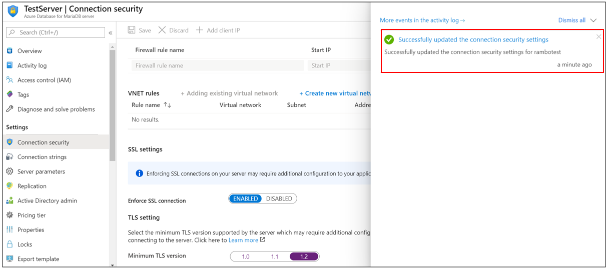

# Configuring TLS settings in Azure Database for MariaDB using Azure portal

This article describes how you can configure an Azure Database for MariaDB server to enforce minimum TLS version for connections to go through and deny all connections with lower TLS version than configured minimum TLS version thereby enhancing the network security.

You can enforce TLS version for connecting to their Azure Database for MariaDB by setting the minimum TLS version for their database server. For example, setting the minimum TLS setting version to TLS 1.0 means your server will allow connections from clients using TLS 1.0, 1.1, and 1.2+. Alternatively, setting this to 1.2 means that you only allow connections from clients using TLS 1.2+ and all connections with TLS 1.0 and TLS 1.1 will be rejected.

## Prerequisites

To complete this how-to guide, you need:

* An [Azure Database for MariaDB](quickstart-create-mariaDB-server-database-using-azure-portal.md)

## Set TLS configurations for Azure Database for MariaDB

Follow these steps to set MariaDB server minimum TLS version:

1. In the [Azure portal](https://portal.azure.com/), select your existing Azure Database for MariaDB server.

1. On the MariaDB server page, under **Settings**, click **Connection security** to open the connection security configuration page.

1. In **Minimum TLS version**, select **1.2** to deny connections with TLS version less than TLS 1.2 for your MariaDB server.

    

1. Click **Save** to save the changes.

1. A notification will confirm that connection security setting was successfully enabled.

    

## Next steps

Learn about [how to create alerts on metrics](howto-alert-metric.md)