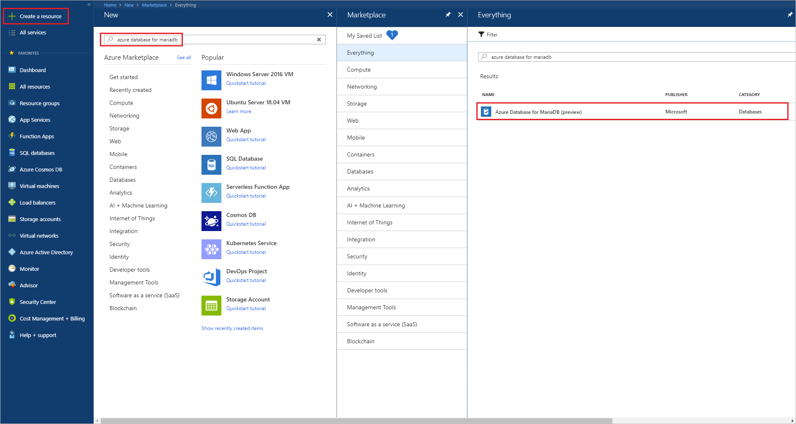
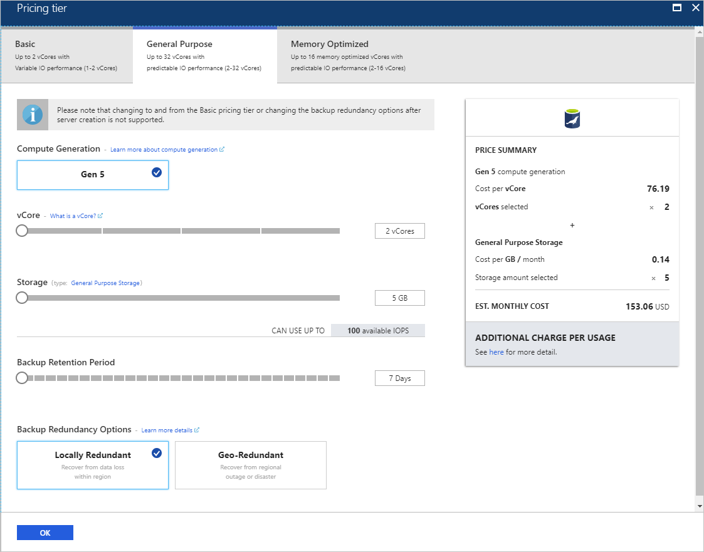
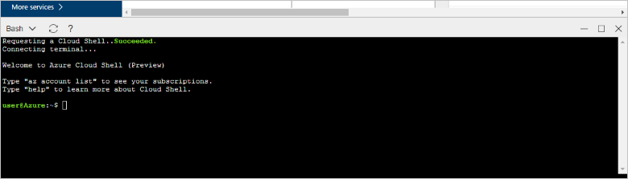
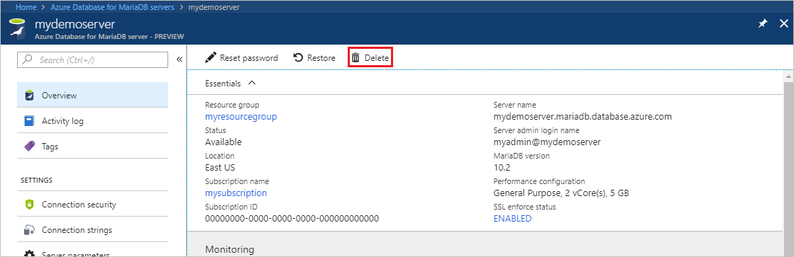

# Create an Azure Database for MariaDB server by using the Azure portal

Azure Database for MariaDB is a managed service you can use to run, manage, and scale highly available MariaDB databases in the cloud. This quickstart shows you how to create an Azure Database for MariaDB server in about five minutes by using the Azure portal.  

If you don't have an Azure subscription, create a [free Azure account](https://azure.microsoft.com/free/) before you begin.

## Sign in to the Azure portal

In your web browser, go to the [Azure portal](https://portal.azure.com/). Enter your credentials to sign in to the portal. The default view is your service dashboard.

## Create an Azure Database for MariaDB server

You create an Azure Database for MariaDB server with a defined set of [compute and storage resources](concepts-pricing-tiers.md). You create the server within an [Azure resource group](../azure-resource-manager/management/overview.md).

To create an Azure Database for MariaDB server:

1. Select the **Create a resource** button (+) in the upper left corner of the portal.

2. Select **Databases** > **Azure Database for MariaDB**. You can also type **MariaDB** in the search box to find the service.

   

3. Enter or select the following server details:

   

    Setting | Suggested value | Description
    ---|---|---
    Server name | *a unique server name* | Choose a unique name that identifies your Azure Database for MariaDB server. For example, **mydemoserver**. The domain name *.mariadb.database.azure.com* is appended to the server name you enter. The server name can contain only lowercase letters, numbers, and the hyphen (-) character. It must contain between 3 and 63 characters.
    Subscription | *your subscription* | Select the Azure subscription that you want to use for your server. If you have multiple subscriptions, choose the subscription in which you are billed for the resource.
    Resource group | **myresourcegroup** | Enter a new resource group name or select an existing resource group. 
    Select source | **Blank** | Select **Blank** to create a new server from scratch. (Select **Backup** if you are creating a server from a geo-backup of an existing Azure Database for MariaDB server.)
    Server admin login | **myadmin** | A sign-in account to use when you're connecting to the server. The admin sign-in name cannot be **azure_superuser**, **admin**, **administrator**, **root**, **guest**, or **public**.
    Password | *your choice* | Enter a new password for the server admin account. It must contain between 8 and 128 characters. Your password must contain characters from three of the following categories: English uppercase letters, English lowercase letters, numbers (0-9), and non-alphanumeric characters (!, $, #, %, and so on).
    Confirm password | *your choice*| Confirm the admin account password.
    Location | *the region closest to your users*| Choose the location that is closest to your users or to your other Azure applications.
    Version | *the latest version*| The latest version (unless you have specific requirements to use a different version).
    Pricing tier | See description. | The compute, storage, and backup configurations for your new server. Select **Pricing tier** > **General Purpose**. Keep the default values for the following settings:<br><ul><li>**Compute Generation** (Gen 5)</li><li>**vCore** (4 vCores)</li><li>**Storage** (100 GB)</li><li>**Backup Retention Period** (7 days)</li></ul><br>To enable your server backups in geo-redundant storage, for **Backup Redundancy Options**, select **Geographically Redundant**. <br><br>To save this pricing tier selection, select **OK**. The next screenshot captures these selections.
  
   > [!NOTE]
   > Consider using the Basic pricing tier if light compute and I/O are adequate for your workload. Note that servers created in the Basic pricing tier cannot later be scaled to General Purpose or Memory Optimized. See the [pricing page](https://azure.microsoft.com/pricing/details/mariadb/) for more information.

   

4. Select **Review + create** to provision the server. Provisioning can take up to 20 minutes.

5. To monitor the deployment process, select **Notifications** on the toolbar (the bell icon).

By default, the following databases are created under your server: **information_schema**, **mysql**, **performance_schema**, and **sys**.

## <a name="configure-firewall-rule"></a>Configure a server-level firewall rule

The Azure Database for MariaDB service creates a firewall at the server level. The firewall prevents external applications and tools from connecting to the server or to any databases on the server unless a firewall rule is created to open the firewall for specific IP addresses. 

To create a server-level firewall rule:

1. When deployment is finished, locate your server. If necessary, you can search for it. For example, in the left menu, select **All Resources**. Then, enter the server name. For example, enter **mydemoserver** to search for your newly created server. Select the server name from the search result list. The **Overview** page for your server opens. You can change additional settings on this page.

2. On the server overview page, select **Connection security**.

3. Under **Firewall rules**, select the blank text box in the **Rule Name** column to begin creating the firewall rule. Specify the precise IP range of the clients that will connect to this server.

   

4. On the upper toolbar of the **Connection security** page, select **Save**. Before you continue, wait until you see the notification that says the update has finished successfully.

   > [!NOTE]
   > Connections to Azure Database for MariaDB communicate over port 3306. If you try to connect from inside a corporate network, outbound traffic over port 3306 might not be allowed. In this case, to connect to your server, your IT department must open port 3306.

## Get connection information

To connect to your database server, you need the full server name and admin sign-in credentials. You might have noted those values earlier in this article. If you didn't, you can easily find the server name and sign-in information on the server **Overview** page or on the **Properties** page in the Azure portal:

1. Go to your server's **Overview** page. Make a note of the values for **Server name** and **Server admin login name**.

2. To copy the values, place your cursor over the field you want to copy. The copy icon appears to the right of the text. Select the copy icon as needed to copy the values.

In our example, the server name is **mydemoserver.mariadb.database.azure.com** and the server admin login name is **myadmin\@mydemoserver**.

## Connect to Azure Database for MariaDB by using the mysql command line

You can use a variety of applications to connect to your Azure Database for MariaDB server.

First, we'll use the [mysql](https://dev.mysql.com/doc/refman/5.7/en/mysql.html) command-line tool to illustrate how to connect to the server. You can also use a web browser and Azure Cloud Shell without installing software. If you have the mysql utility installed locally, you also can connect from there.

1. Start Azure Cloud Shell via the terminal icon (**>_**) on the upper right toolbar in the Azure portal.
   

2. Azure Cloud Shell opens in your browser. You can use bash shell commands in Cloud Shell.

   

3. At the Cloud Shell prompt, connect to your Azure Database for MariaDB server by entering the mysql command line.

    To connect to an Azure Database for MariaDB server by using the mysql utility, use the following format:

    ```cmd
    mysql --host <fully qualified server name> --user <server admin login name>@<server name> -p
    ```

    For example, the following command connects to our example server:

    ```cmd
    mysql --host mydemoserver.mariadb.database.azure.com --user myadmin@mydemoserver -p
    ```

    mysql parameter |Suggested value|Description
    ---|---|---
    --host | *server name* | The server name value that you used to create the Azure Database for MariaDB server. Our example server is **mydemoserver.mariadb.database.azure.com**. Use the fully qualified domain name (**\*.mariadb.database.azure.com**) as shown in the example. If you don't remember your server name, complete the steps in the preceding section to get the connection information.
    --user | *server admin login name* |The server admin login user name that you used to create the Azure Database for MariaDB server. If you don't remember the user name, complete the steps in the preceding section to get the connection information. The format is *username\@servername*.
    -p | *your password*<br>(wait until prompted) |When prompted, enter the password that you used to create the server. The typed password characters are not shown on the bash prompt when you type them. After you enter the password, press Enter.

   When the mysql utility is connected, it displays a `mysql>` prompt. You can enter commands at the prompt.

   Here's an example of mysql output:

    ```output
    Welcome to the MySQL monitor.  Commands end with ; or \g.
    Your MySQL connection id is 65505
    Server version: 5.6.39.0 MariaDB Server
    
    Copyright (c) 2000, 2017, Oracle and/or its affiliates. All rights reserved.
    
    Oracle is a registered trademark of Oracle Corporation and/or its
    affiliates. Other names may be trademarks of their respective
    owners.

    Type 'help;' or '\h' for help. Type '\c' to clear the current input statement.
    
    mysql>
    ```
    
    > [!TIP]
    > If the firewall isn't configured to allow the IP address of Azure Cloud Shell, the following error occurs:
    >
    >   ERROR 2003 (28000): Client with IP address 123.456.789.0 is not allowed to access the server.
    >
    > To resolve the error, ensure that the server configuration matches the steps that are described in [Configure a server-level firewall rule](#configure-firewall-rule).

4. To verify the connection, enter **status** at the `mysql>` prompt to check the server status.

    ```sql
    status
    ```

   > [!TIP]
   > For additional commands, see [MySQL 5.7 Reference Manual - Chapter 4.5.1](https://dev.mysql.com/doc/refman/5.7/en/mysql.html).

5. Create a blank database at the `mysql>` prompt by entering the following command:

   ```sql
   CREATE DATABASE quickstartdb;
   ```
   The command might take a few minutes to finish. 

   You can create one or more databases on an Azure Database for MariaDB server. You can create a single database per server to utilize all resources, or you can create multiple databases to share the resources. There's no limit on the number of databases that you can create, but multiple databases share the same server resources. 

6. To list the databases, at the `mysql>` prompt, enter the following command:

    ```sql
    SHOW DATABASES;
    ```

7. Enter **\q**, and then press Enter to close the mysql tool. Then, you can close Azure Cloud Shell.

You have connected to the Azure Database for MariaDB server and created a blank user database. In the next section, you connect to the same server by using another common tool, MySQL Workbench.

## Connect to the server by using MySQL Workbench

To connect to the server by using MySQL Workbench:

1. Open MySQL Workbench on your client computer. To download and install MySQL Workbench, go to [Download MySQL Workbench](https://dev.mysql.com/downloads/workbench/).

2. To create a new connection, select the plus icon (**+**) next to the **MySQL Connections** heading.

3. In the **Setup New Connection** dialog box, on the **Parameters** tab, enter your server connection information. Placeholder values are shown as an example. Replace **Hostname**, **Username**, and **Password** with your own values.

   

    |Setting |Suggested value|Field description|
    |---|---|---|
     Connection name | **Demo connection** | A label for this connection. |
    Connection method | **Standard (TCP/IP)** | Standard (TCP/IP) is sufficient. |
    Hostname | *server name* | The server name value that you used to create the Azure Database for MariaDB server. Our example server is **mydemoserver.mariadb.database.azure.com**. Use the fully qualified domain name (**\*.mariadb.database.azure.com**) as shown in the example. If you don't remember your server name, complete the steps earlier in this article to get the connection information.|
     Port | 3306 | The port to use when you connect to your Azure Database for MariaDB server. |
    Username |  *server admin login name* | The server admin sign-in information that you used to create the Azure Database for MariaDB server. Our example user name is **myadmin\@mydemoserver**. If you don't remember the user name, complete the steps earlier in this article to get the connection information. The format is *username\@servername*.
    Password | *your password* | To save the password, select **Store in Vault**. |

4. To check that all parameters are configured correctly, select **Test Connection**. Then, select **OK** to save the connection. 

    > [!NOTE]
    > SSL is enforced by default on your server. It requires additional configuration to connect successfully. For more information, see [Configure SSL connectivity in your application to securely connect to Azure Database for MariaDB](./howto-configure-ssl.md). To disable SSL for this quickstart, on the server overview page in the Azure portal, select **Connection security** in the menu. For **Enforce SSL connection**, select **Disabled**.

## Clean up resources

You can clean up the resources that you created in this quickstart in two ways. You can delete the [Azure resource group](../azure-resource-manager/management/overview.md). This option deletes all the resources in the resource group. If you want to keep the other resources intact, delete only the one server resource.

> [!TIP]
> Other quickstarts in this collection build on this quickstart. If you plan to continue working with Azure Database for MariaDB quickstarts, don't clean up the resources that you created in this quickstart. If you don't plan to continue, use the following steps to delete all the resources that you created in this quickstart.

To delete the entire resource group, including the newly created server:

1. In the Azure portal, locate your resource group. In the left menu, select **Resource groups**, and then select the name of your resource group (in our example, **myresourcegroup**).

2. On the resource group page, select **Delete**. Then, enter the name of your resource group (in our example, **myresourcegroup**) to confirm deletion. Select **Delete**.

To delete only the newly created server:

1. In the Azure portal, locate your server if you don't already have it open. In the left menu, select **All resources**. Then, search for the server you created.

2. On the **Overview** page, select **Delete**.

   

3. Confirm the name of the server you want to delete. Show the databases under it that will be affected by the deletion. Enter your server name (in our example, **mydemoserver**) to confirm deletion. Select **Delete**.

## Next steps

- [Design your first Azure Database for MariaDB database](./tutorial-design-database-using-portal.md)
