<properties
   pageTitle="Get Started with private Templates | Microsoft Azure"
   description="Add, manage and share your customized templates using the Azure portal, the Azure CLI, or PowerShell."
   services="marketplace"
   documentationCenter=""
   authors="VybavaRamadoss"
   manager="asimm"
   editor=""
   tags="marketplace, azure, azure-resource-manager, templates"
   keywords="Marketplace, Templates, Azure Portal, Azure"/>

<tags
   ms.service="marketplace"
   ms.devlang="na"
   ms.topic="get-started-article"
   ms.tgt_pltfrm="na"
   ms.workload="na"
   ms.date="05/03/2016"
   ms.author="vybavar"/>

# Get Started with private Templates

An [Azure Resource Manager](../resource-group-authoring-templates.md) (ARM) template is a declarative template used to define your deployment. You can define the resources to deploy for a solution, and specify parameters and variables that enable you to input values for different environments. The template consists of JSON and expressions which you can use to construct values for your deployment.

At //build/ 2016, we announced a new `Templates` capability in the [Azure Portal](https://portal.azure.com) along with the `Microsoft.Gallery` resource provider as an extension of the [Azure Marketplace](https://azure.microsoft.com/marketplace/) to enable users to create, manage and deploy private templates from a personal library.

This document walks you through adding, managing and sharing a private `Template` using the Azure Portal.

## Guidance

The following suggestions will help you take full advantage of `Templates` when working with your solutions:

- A `Template` is an encapsulating resource that contains an ARM template and additional metadata. It behaves very similarly to an item in the Marketplace. The key difference is that it is a private item as opposed to the public Marketplace items.
- The `Templates` library works well for users who need to customize their deployments.
- `Templates` work well for users who need a simple repository within Azure.
- Start with an existing ARM template. Find templates in [github](https://github.com/Azure/azure-quickstart-templates) or [Export template](https://azure.microsoft.com/blog/export-template/) from an existing resource group.
- `Templates` are tied to the user who publishes them. The publisher name is visible to everyone who has read access to it.
- `Templates` are ARM resources and cannot be renamed once published.

## Add a Template resource

There are two ways to create a `Template` resource in the Azure portal.

### A. Create a new Template resource from a running resource group

1. Navigate to an existing resource group on the Azure Portal. Select **Export template** in **Settings**.
2. Once the ARM template is exported, use the `Save Template` button to save it to the `Templates` repository. Find complete details for Export template [here](https://azure.microsoft.com/blog/export-template/).
  
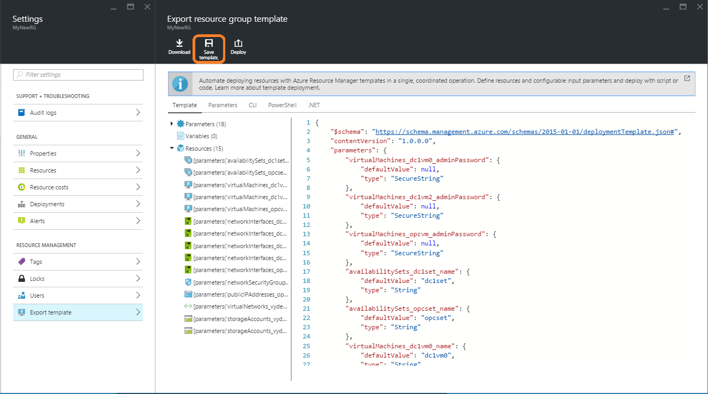   

3. Select the **Save to Template** command button.
  

4. Enter the following information:

    - Name – Name of the template object (NOTE: This is an ARM based name. All naming restrictions apply and it cannot be changed once created).
    - Description – Quick summary about the template.

    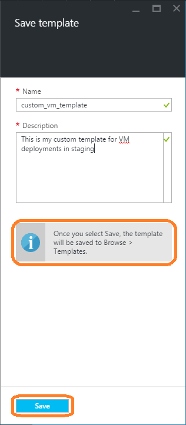   

5. Click **Save**.

    > [AZURE.NOTE] The Export template blade shows notifications when the exported ARM template has errors, but you will still be able to save this ARM template to the Templates. Ensure that you check and fix any ARM template issues before redeploying the exported ARM template.

    > [AZURE.NOTE] Microsoft.Gallery is a Tenant based Azure resource provider. The Template resource is tied to the user who created it. It is not tied to any specific subscription. A subscription needs to be chosen only when deploying a Template.

### B. Add a new Template resource from browse

You can also add a new `Template` from scratch using the +Add command button in `Browse > Templates`. You will need to provide a Name, Description and the ARM template JSON.

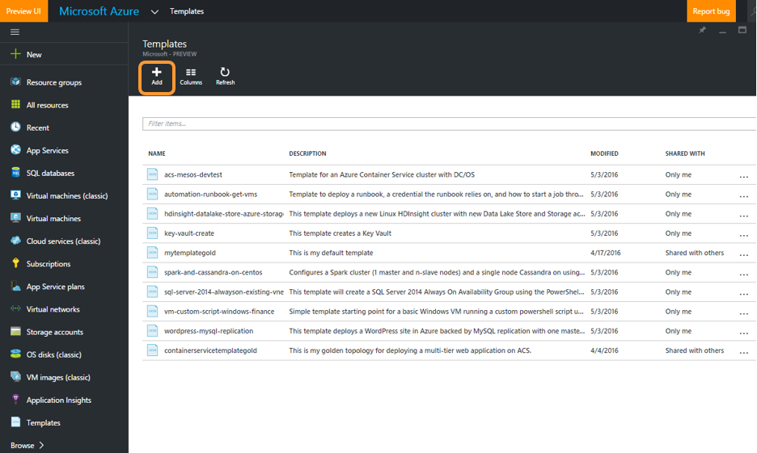   

## View Template resources

All `Templates` available to you can be seen at `Browse > Templates`. This includes `Templates` you have created as well as ones that have been shared with you with varying levels of permissions. More details in the [access control](#access-control-for-a-tenant-resource-provider) section below.

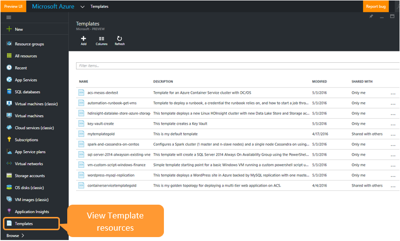   

You can view the details of a `Template` by clicking into an item in the list.

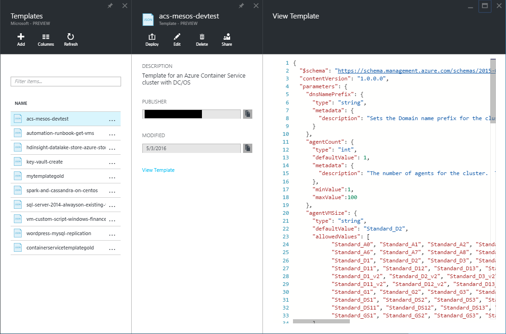   

## Edit a Template resource

You can initiate the edit flow for a `Template` by right clicking the item on the Browse list or by choosing the Edit command button.

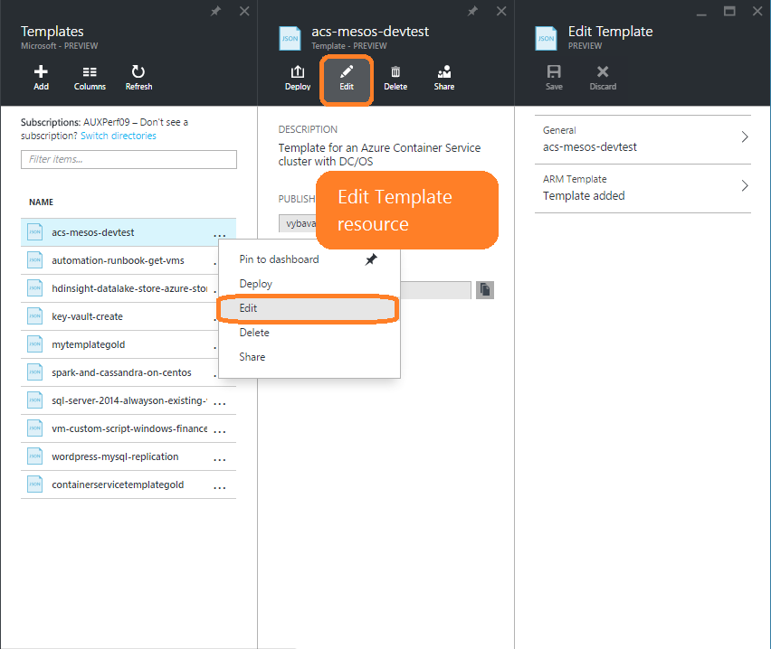   

You can edit the description or ARM template text. You cannot edit the name since it is an ARM resource name. When you edit the ARM template JSON we will validate to ensure that it is valid JSON. Choose **OK** and then **Save** to save your updated template.

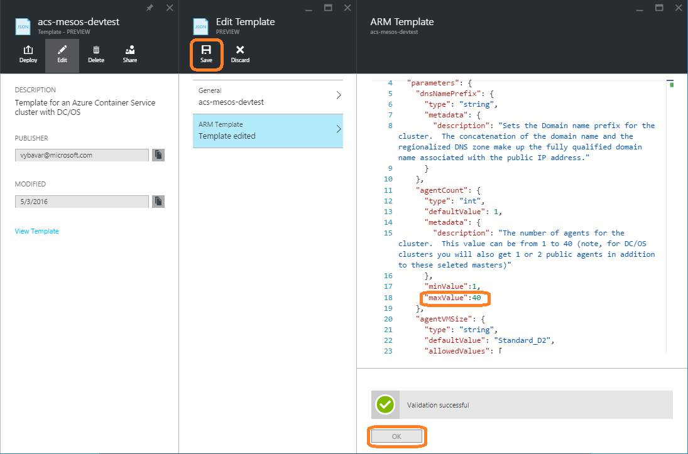   

Once the `Template` is saved you will see a confirmation notification.

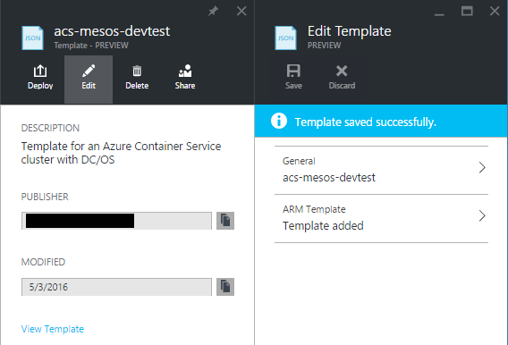   

## Deploy a Template resource

You can deploy any `Template` that you have `Read` permissions on. The deployment flow launches the standard Azure Template deployment blade. Fill out the values for the ARM template parameters to proceed with the deployment.

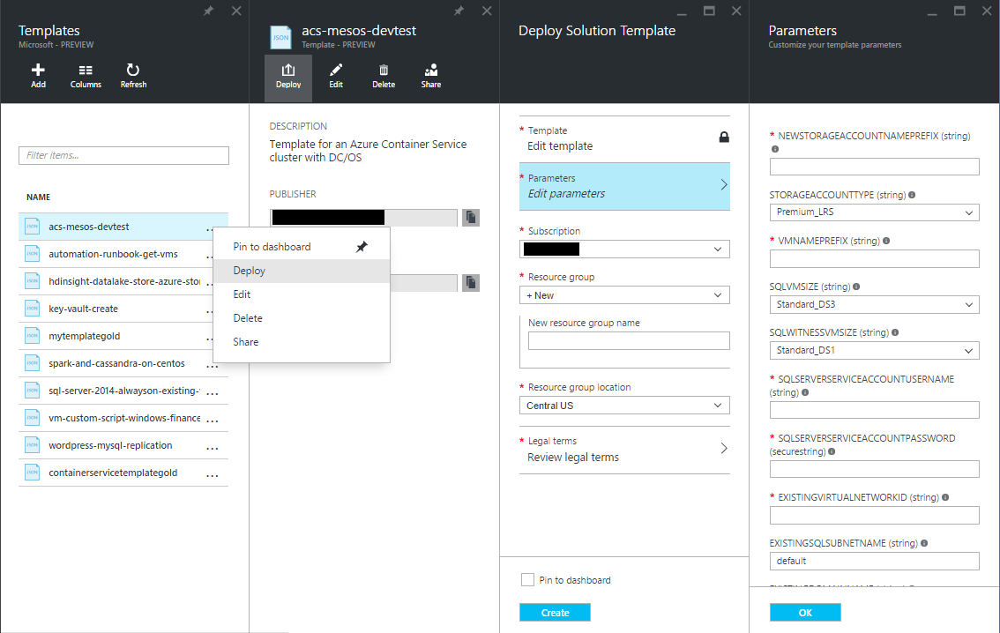   

## Share a Template resource

A `Template` resource can be shared with your peers. Sharing behaves similarly to [role assignment for any resource on Azure](../active-directory/role-based-access-control-configure.md). The `Template` owner provides permissions to other users who can interact with a Template resource. The person or group of people you share the `Template` with will be able to see the ARM template and its gallery properties.

### Access control for the Microsoft.Gallery resources

Role | Permissions
---|----
`Owner` | `Allows full control on the Template resource including Share`
`Reader` | `Allows Read and Execute(Deploy) on the Template resource`
`Contributor` | `Allows Edit and Delete permission on the Template resource. User cannot Share the Template with others`

Select **Share** on the browse item by right clicking or on the view blade of a specific item. This launches a Share experience.

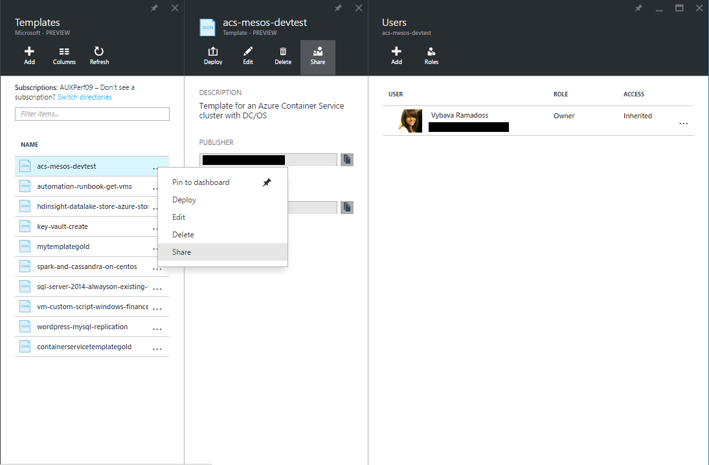   

 You can now choose a role and a user or group to provide access to a particular `Template`. The available roles are Owner, Reader and Contributor. More details in the [access control](#access-control-for-a-tenant-resource-provider) section below.

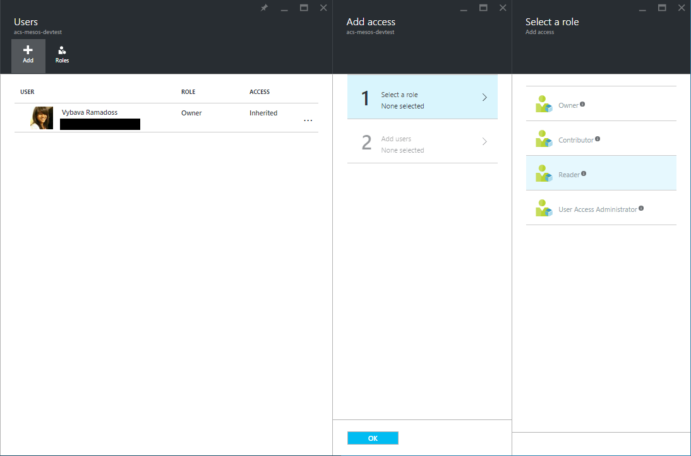   

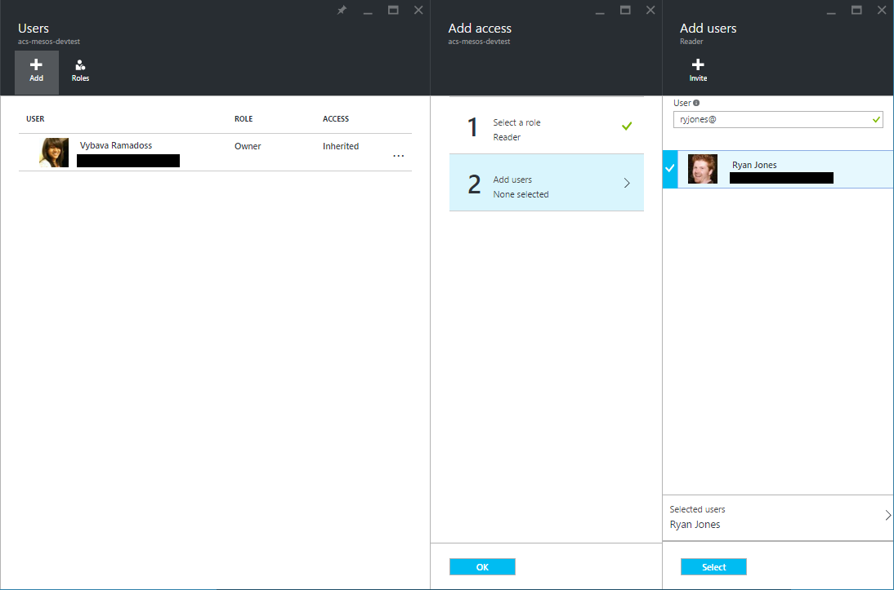   

Click **Select** and **Ok**. You can now see the users or groups you added to the resource.

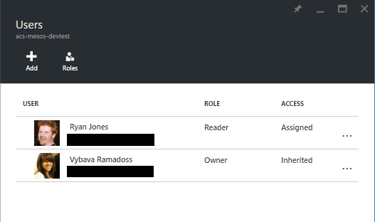   

> [AZURE.NOTE] A Template can only be shared with users and groups in the same Azure Active Directory tenant. If you share a Template with an email address that is not in your tenant, an invitation will be sent asking the user to join the tenant as a guest.

## Next steps

- To learn about creating ARM templates, see [Authoring templates](../resource-group-authoring-templates.md)
- To understand the functions you can use in an ARM template, see [Template functions](../resource-group-template-functions.md)
- For guidance on designing your templates, see [Best practices for designing Azure Resource Manager templates](../best-practices-resource-manager-design-templates.md)
