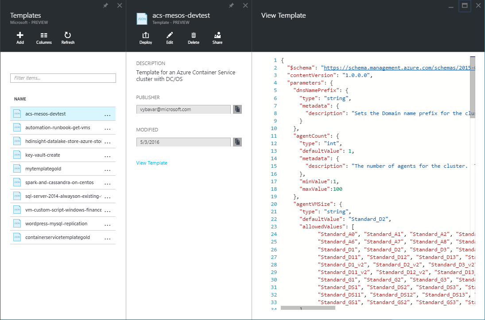
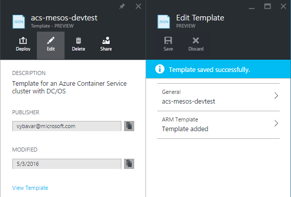
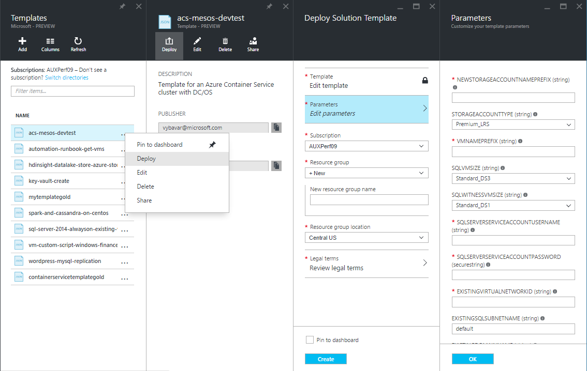
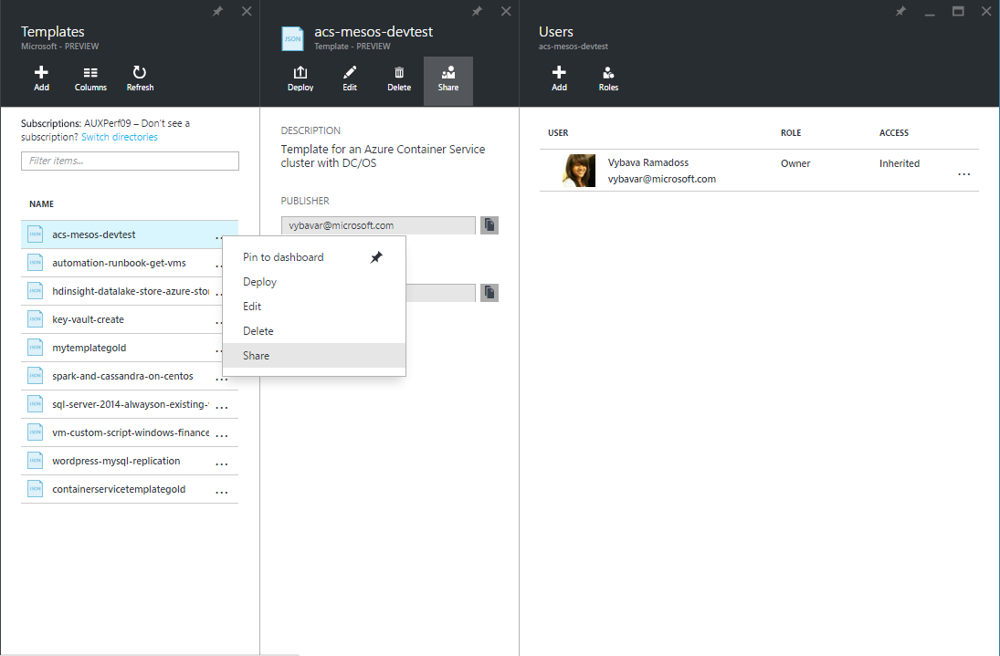
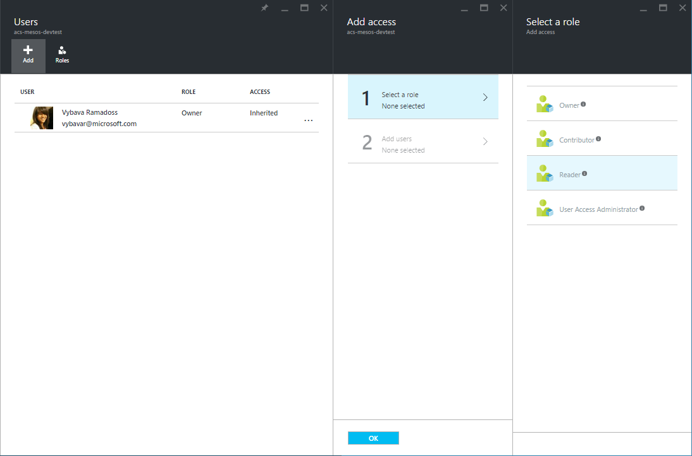
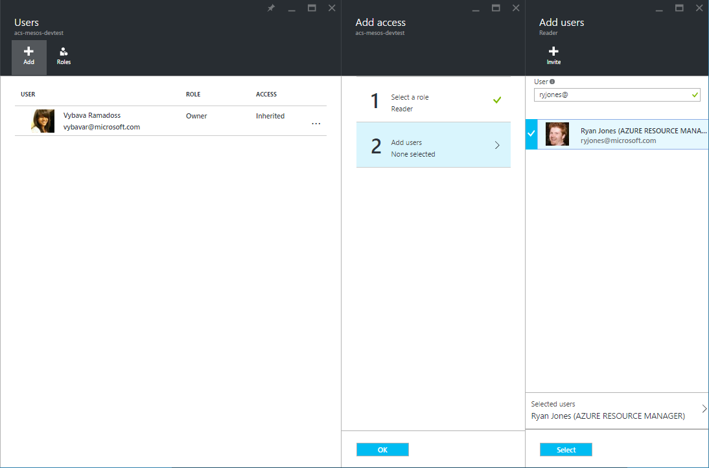
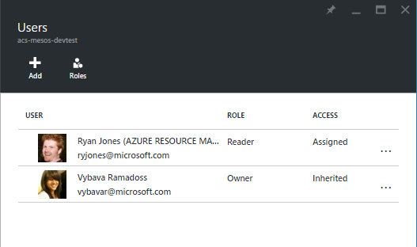

<properties
   pageTitle="Get Started with private Templates | Microsoft Azure"
   description="Add, manage and share your customized templates using the Azure portal, the Azure CLI, or PowerShell."
   services="marketplace"
   documentationCenter=""
   authors="vybavar"
   manager="asimm"
   editor=""
   tags="marketplace, azure, azure-resource-manager, templates"
   keywords="Marketplace, Templates, Azure Portal, Azure"/>

<tags
   ms.service="marketplace"
   ms.devlang="na"
   ms.topic="get-started-article"
   ms.tgt_pltfrm="na"
   ms.workload="na"
   ms.date="05/03/2016"
   ms.author="vybavar"/>

# Get Started with private Templates

The [Azure Resource Manager](https://azure.microsoft.com/en-us/documentation/articles/resource-group-authoring-templates/) template is a declarative template used to define your deployment. You can define the resources to deploy for a solution, and specify parameters and variables that enable you to input values for different environments. The template consists of JSON and expressions which you can use to construct values for your deployment.

At //build/ 2016, we announced a new `Templates` capability in the [Azure Portal](https://portal.azure.com) along with the `Microsoft.Gallery` (resource provider) service as an extension of the [Azure Marketplace](https://azure.microsoft.com/en-us/marketplace/) to enable users to create, manage and deploy private templates from a personal library.

This document walks you through adding, managing and sharing a private `Template` using the [Azure portal](#working-with-templates-using-the-azure-portal).

## Guidance

The following suggestions will help you take full advantage of `Templates` when working with your solutions:

- A `Template` is a encapsulating resource that contains an ARM template and additional metadata. It behaves very similar to a gallery item in the Marketplace. The key difference is that it is a private item as opposed to the Marketplace items.
- The `Templates` library works well for users who need to customize their deployments
- `Templates` work well for users who need a simple repository within Azure
- Start with an existing ARM template. Find templates in [github](https://github.com/Azure/azure-quickstart-templates) OR [Export template](https://azure.microsoft.com/en-us/blog/export-template/) from an exiting resource group.
- `Templates` are tied to the publishing user. The publisher identity is visible to everyone who has read access to it. Ensure you publish using the right user you expect people to see
- `Template` **names** cannot be changed since they are ARM resources

## Add a Template resource

There are two ways to create a `Template` resource in the Azure portal.

### Create a new Template resource from a running resource group

Log into the Azure portal. Click the **Resource groups** and select a existing resource group. Select **Export template** in **Settings**. Once the template is exported, you can choose to save it to `Templates` repository. Find complete details for Export Template [here](https://azure.microsoft.com/en-us/blog/export-template/).

   

Select the **Save to Template** command button.

   

Enter the following information:

- Name – Name of the template object (NOTE: This is an ARM based name. All naming restrictions apply and it cannot be changed once created).
- Description – Quick summary about the template.

Click **Save**.

> [AZURE.NOTE] The Export template blade shows notifications when the exported ARM template has errors. You will still be able to save this ARM template to the Templates library. Ensure that you check and fix the template issues before redeploying a new instance.

> [AZURE.NOTE] The Templates service is a Tenant based azure resource provider. The Template resource is tied to the user who created it. It is not tied to any specific subscription. The ARM template is associated with a subscription only during deployment time.

### Add a new Template resource from browse

You can also add a new `Template` from scratch using the +Add command button in `Browse > Templates`. You would need to provide a Name, Description and the ARM template text.

   

## View Template resources

The list all `Templates` you can be seen at `Browse > Templates`. This includes `Templates` with varying levels of permissions. More details in the [access control](#access-control-for-a-tenant-resource-provider) section below.

   

You can view the details of a `Template` by clicking into an item in the list.

   

## Edit a Template resource

You can initiate the edit flow for a `Template` by right clicking the item on the Browse list or by choosing the Edit command button.

   

You can edit the description or ARM template text for the item. You currently cannot edit the name since it is an ARM resource name. When you edit the ARM template text the blade will perform a quite validation to ensure that it is valid JSON. You would need to choose ok and then the Save command button.

   

Once the `Template` is saved it will pop a confirmation notification.

   

## Deploy a Template resource

You can deploy a `Template` that you Read and Execute permissions on. The deployment flow launches the standard Azure Template deployment blade. You will need to fill out the parameters set up in the ARM template and proceed with the deployment.

   

## Share a Template resource

A `Template` resource can be shared with your peers. Sharing behaves very similar to sharing of any resource on Azure. The person OR group of people you share the `Template` with will be able to see the ARM template and the metadata.

Select **Share** on the browse item by right clicking or on the view blade of a specific item. This launches a Share experience.

   

 You can now choose a role and a user or group to provide access to a particular `Template`. The available roles are Owner, Reader & Contributor. More details in the [access control](#access-control-for-a-tenant-resource-provider) section below.

   

   

Click **Select** and **Ok**. You can now see the users or groups you added to the resource.

   

## Access control for a Tenant Resource Provider

Resource provider details:

- The `Microsoft.Gallery` Resource Provider is a Tenant based service under Azure Resource Manager
- The `Template` owner provides permissions to other users who can interact with a Template resource
- The available roles are : Owner, Reader & Contributor.
- The process of providing permissions works in exactly the same way as other resources on the Azure Portal.

Role | Permissions
---|----
`Owner` | `Allows full control on the Template resource including Share`
`Reader` | `Allows Read and Execute(Deploy) on the Template resource`
`Contributor` | `Allows Edit and Delete permission on the Template resource. User cannot Share the Template with others`

### Using Microsoft IDs vs. Org IDs  

You can use the private `Templates` capability with your organization ID or a standard Microsoft Account. Remember though that sharing is only allowed for users within your Active Directory Tenant. If you attempt to Share a Template with someone outside your Tenant, it will send them an invitation similar to standard Azure AD functioning.

## Next steps

- To learn about creating ARM templates, see [Authoring templates](https://azure.microsoft.com/en-us/documentation/articles/resource-group-authoring-templates/)
- To understand the functions you can use in a ARM template, see [Template functions](https://azure.microsoft.com/en-us/documentation/articles/resource-group-template-functions/)
- For guidance on designing your templates, see [Best practices for designing Azure Resource Manager templates](https://azure.microsoft.com/en-us/documentation/articles/best-practices-resource-manager-design-templates/)
