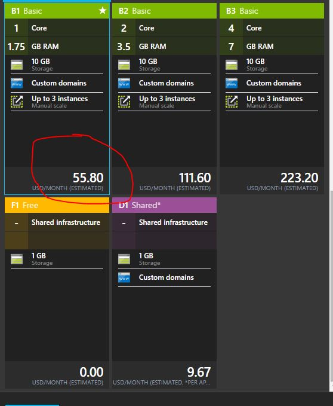

# **Developer Service On-boarding Guide**#

###Deploy Resource Provider as Azure Websites

1. Navigate to [Portal](https://portal.azure.com/). 
2.	Sign in with MSA and Azure Subscription (from Part 1 – Non-Technical steps).
3.	(Once Portal Loads) Confirm in the top right that the Azure Subscription and Tenant (aka Directory) selected is correct.
4.	Navigate to “+NEW” (top left of portal)
5.	Select “Web + Mobile”
6.	Select “Web App”
7.	Provide the required Azure Storage settings/configurations such as website name subscritpion etcetera.
8.	For App Service Plan, create new
9.	Fill in the required details, but make sure you select a plan higher than Free or Shared. 
    
10. Create the website.

###Enabling SSL on Azure Websites

The steps to enable SSL on azure websites is given [here.](http://azure.microsoft.com/blog/2015/07/02/enabling-client-certificate-authentication-for-an-azure-web-app/)

[<<Back to Main Page](3.0.CREATE-AND-DEPLOY-RESOURCE-PROVIDER.md)