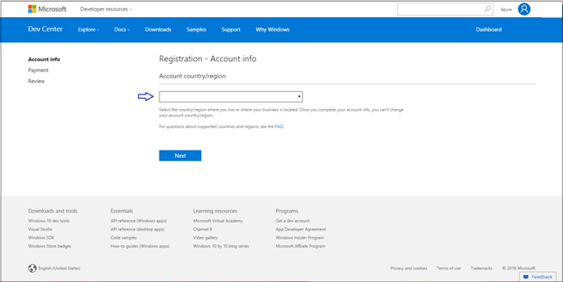
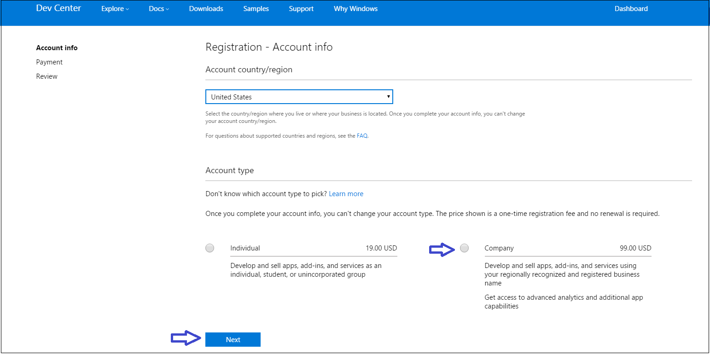
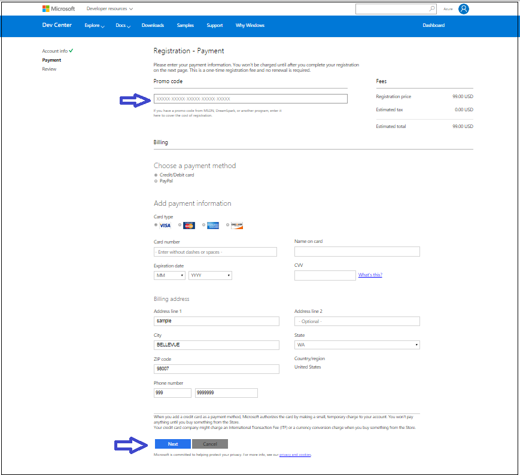
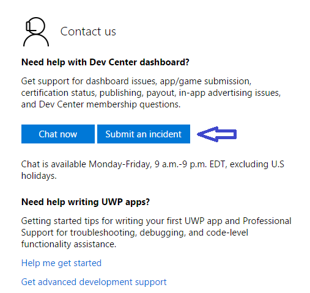
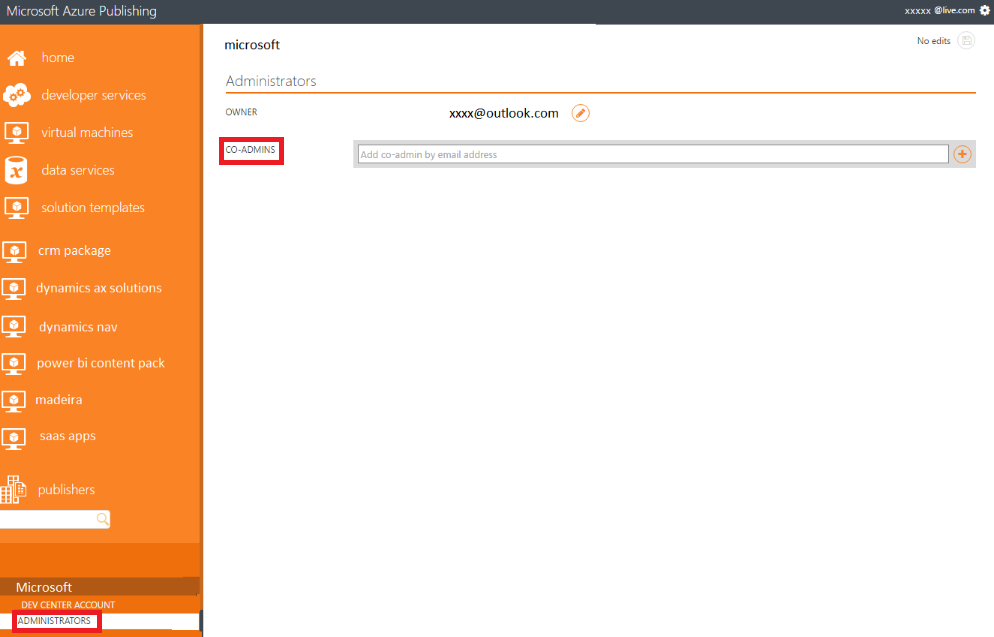

<properties
   pageTitle="Creating and registering the publisher account | Microsoft Azure"
   description="Instructions for creating a Microsoft Developer account so, upon approval, you can sell various offer types on the Azure Marketplace."
   services="Azure Marketplace"
   documentationCenter=""
   authors="HannibalSII"
   manager=""
   editor=""/>

<tags
   ms.service="marketplace"
   ms.devlang="na"
   ms.topic="article"
   ms.tgt_pltfrm="na"
   ms.workload="na"
   ms.date="07/27/2016"
   ms.author="hascipio"/>

# Create a Microsoft Developer account
This article walks you through the necessary account creation and registration process to become an approved Microsoft Developer for the Azure Marketplace.

## 1. Create a Microsoft account
To start the publishing process, you will need to create a Microsoft account. This account will be used to register in to both the **Microsoft Developer Center** and **Azure Publishing Portal**. You should have only one Microsoft account for your Azure Marketplace offerings. It should not be specific to services or offers.

The address that forms the user name should be on your domain and controlled by your IT team. All the publishing related activities should be done through this account.

  >[AZURE.WARNING] Words like **"Azure"** and **"Microsoft"** are not supported for Microsoft account registration. Avoid using these words to complete the account creation and registration process.

### Instructions

1. Create a distribution list (DL) or security group (SG) within your company's domain. Using a DL allows multiple people to receive email notifications that are important for reporting of payout information. It also ensures that ownership of the Microsoft account can be transferred and isn’t tied to a single individual.
Follow the instructions given below.

  1. Add your onboarding team to the DL.
  2. Ensure that the DL/SG is an active email address and is able to receive emails because the payment, tax information, and reporting will be routed through this account.
  3. c.	We recommend using something like marketplace@partnercompany.com as the email address for the DL/SG.

2. Open a new Chrome Incognito or Internet Explorer InPrivate browsing session to ensure that you’re not signed in to an existing account.
3. 3.	Register the DL created in step 1 as a Microsoft account by using the link [https://signup.live.com/signup.aspx](https://signup.live.com/signup.aspx). Follow the instructions below.

  1. During registering your account as a Microsoft account, you need to provide a valid phone number for the system to send you an account verification code as a text message or an automated call.
  2. During registering your account as a Microsoft account, you need to provide a valid email id for receiving an automated email for account verification.

4. Verify the email address sent to the DL.
5. You’re now ready to use the new Microsoft account in the Microsoft Developer Center.

## 2. Create your Microsoft Developer Center account
The Microsoft Developer Center is used to register the company information once. The registrant must be a valid representative of the company, and must provide their personal information as a way to validate their identity. The person registering must use a Microsoft account that is shared for the company, **and the same account must be used in the Azure Publishing Portal.** You should check to make sure your company does not already have a Microsoft Developer Center account before you attempt to create one. During the process, we will collect company address information, bank account information, and tax information. These are typically obtainable from finance or business contacts.

> [AZURE.IMPORTANT] You must complete the following Developer profile components in order to progress through the various phases of offer creation and deployment.

| Developer profile | To start draft | Staging | Publish free and solution template | Publish commercial |
|----|----|----|----|----|
|Company registration | Must have | Must have | Must have | Must have |
|Tax profile ID | Optional | Optional | Optional | Must have |
|Bank account | Optional | Optional | Optional | Must have |

> [AZURE.NOTE] Bring Your Own License (BYOL) is supported only for virtual machines and is considered a **free** offering.

### Register your company account
1. Open a new  Internet Explorer InPrivate or Chrome Incognito browsing session to ensure that you’re not signed in to a personal account.

2. Go to [http://dev.windows.com/registration?accountprogram=azure](http://dev.windows.com/registration?accountprogram=azure) to register yourself as a seller in the Dev Center. Please read the following important note before you proceed.

    >[AZURE.IMPORTANT] Ensure that the email id or distribution list (a distribution list is recommended to remove dependency from individuals) which you will be using for registering in the Dev Center is at first registered as a Microsoft account. If not, then please register using this [link](https://signup.live.com/signup?uaid=e479342fe2824efeb0c3d92c8f961fd3&lic=1). Also, **any email id under the Microsoft company domain i.e. @microsoft.com cannot be used** for Dev Center registration.

    ![drawing][img-signin]

3. Complete the "Help us protect your account" wizard, which will verify your identity via phone number or email address.

    ![drawing][img-verify]

4. In the "Registration-Account Info" section, select your **Account country/region** from the dropdown menu.

    

    > [AZURE.WARNING] **"Sell-from" Countries:** In order to sell your services on the Azure Marketplace, your registered entity needs to be from one of the approved “sell-from” countries above. This restriction is for payout and taxation reasons. We are actively looking to expand this list of countries in the near future, so stay tuned. For more information, see the  [Marketplace participation policies](http://go.microsoft.com/fwlink/?LinkID=526833).

5. Select your "Account Type" as **Company** and then click the **Next** button.

    > [AZURE.IMPORTANT] To better understand account types and which is best for you to choose, please view page [Account types, locations, and fees](https://msdn.microsoft.com/library/windows/apps/jj863494.aspx)

    

6. Enter the **Publisher display name**, typically the name of your company.

    > [AZURE.TIP] Currently, the Azure Publishing Portal does not use Publisher display name. But this must be filled to complete the registration process.

7. Enter the **Contact info** for the account.

    > [AZURE.IMPORTANT] You must provide accurate contact information because it will be used in our verification process for your company to be approved in the Developer Center.

8. 8.	Enter the contact information for the **Company Approver**. Company approver is the person who can verify that you are authorized to create an account in the Dev Center on behalf of your organization. Click on **Next** to move to the **"Payment section"** once you are finished.

    

9. Enter your payment info to pay for your account. If you have a promo code that covers the cost of registration, you can enter that here. Otherwise, provide your credit card info (or PayPal in supported markets). When you are finished, click **Next** to move on to the **"Review screen"**.

    

10. Review your account info and confirm that everything is correct. Then, read and accept the terms and conditions of the [Microsoft Azure Marketplace Publisher Agreement](http://go.microsoft.com/fwlink/?LinkID=699560). Check the box to indicate you have read and accepted these terms.

11. Click **Finish** to confirm your registration. We'll send a confirmation message to your email address.

12. If you are planning to publish only free offers, click **Go to Azure Marketplace Publishing Portal** and you can skip to section 3 of this document, [Register your account in the publishing portal](#3-register-your-account-in-the-publishing-portal).

If you are planning to publish commercial offers (e.g. Virtual Machine offers with hourly billing model), click **Update your account information** where you must fill in the tax and banking information in your Developer Center account.

If you prefer to update your tax and bank information later, then you can move to the next section i.e. section 3 of this document, [Register your account in the publishing portal](#3-register-your-account-in-the-publishing-portal), and come back later by using links in the Azure Publishing Portal.

> [AZURE.IMPORTANT] In case of commercial offers, you will not be able to push your offers to production without completing the tax and bank account information.

If you prefer to update your tax and bank information later, you can go to section 3, [Register your account in the publishing portal](#3-register-your-account-in-the-publishing-portal), and come back later by using links in the Azure Publishing Portal.

### Add tax and banking information
 If you want to publish commercial offers for purchase, you also need to add payout and tax information and submit it for validation in the Developer Center. If you will publish only free offers (or BYOL offers), then you do not need to add this information. You can add it later, but it takes some time to validate the tax information. If you know that you will offer commercial offers for purchase, we recommend that you add it as soon as possible.

**Bank Information**

1. Sign in to the [Microsoft Developer Center](http://dev.windows.com/registration?accountprogram=azure) with your Microsoft account.

2. Click **Payout account** in the left menu, under **Choose payment method** click **Bank account** or **PayPal**.

    > [AZURE.IMPORTANT] If you have commercial offers that customers purchase in the Marketplace, this is the account where you will receive payout for those purchases.

3. Enter the payment info, and click **Save** when you are satisfied.

    > [AZURE.IMPORTANT] If you need to update or change your payout account, follow the same steps above, replacing the current info with the new info. Changing your payout account can delay your payments by up to one payment cycle. This delay occurs because we need to verify the account change, just as we did when you first set up the payout account. You'll still get paid for the full amount after your account has been verified; any payments due for the current payment cycle will be added to the next one.

4. Click **Next**.

**Tax Information**

1. Sign in to the [Microsoft Developer Center](http://dev.windows.com/registration?accountprogram=azure) with your Microsoft account (if needed).

2. Click **Tax profile** in the left menu.

3. On the **Set up your tax form** page, select the country or region where you have permanent residency, and then select the country or region where you hold primary citizenship. Click **Next**.

4. Enter your tax details, and then click **Next**.

> [AZURE.WARNING] You will not be able to push to production your commercial offers without completing the tax and bank account information in your Microsoft Developer Center account.

If you have issues with Developer Center registration, please log a support ticket as below

1. Go to the support link [https://developer.microsoft.com/windows/support](https://developer.microsoft.com/windows/support)
2. Under **Contact Us** section, click on the button **Submit an incident** (as shown in the screenshot below)

    

3. Choose "Help with Dev Center" as **Problem type** and "Publish and manage apps" as **Category**. After that click on the button "Start email".

    

4. You will be provided with a login page. Use any Microsoft account sign in. If you do not have a Microsoft account then create one using this [link](https://signup.live.com/signup?uaid=0089f09ccae94043a0f07c2aaf928831&lic=1).
5. Fill in the details of the issue and subit the ticket by clicking on the **Submit** button.

    

## 3. Register your account in the publishing portal
The [Publishing portal](http://publish.windowsazure.com) is used to publish and manage your offer(s).

1. Open a new Chrome Incognito or Internet Explorer InPrivate browsing session to ensure that you’re not signed in to a personal account.

2. Go to [http://publish.windowsazure.com](http://publish.windowsazure.com).

3. If you are a new user and signing in to the Publishing portal for the first time, then you must sign in with the same email id with which your Dev Center account is registered. In this way your Dev Center account and Publishing portal account will be linked with each other. You can later add the other members of the company, who are working on the application, as a co-admin in the Publishing portal by following the steps below.

If you are added as a co-admin in the Publishing portal, then you can sign in with your co-admin account.

  > [AZURE.TIP] The participation policies are described on the [Azure website](https://azure.microsoft.com/support/legal/marketplace/participation-policies/).

## Steps to add a co admin in the publishing portal
**Assuming that you are the admin,** given below are the steps to add a co-admin.

>[AZURE.NOTE] Before you add a co-admin in the Publishing portal, ensure that you have created at least one application in the Publishing portal. This is required as the **PUBLISHERS** tab appear only after creating at least one application in the Publishing portal.

1. Ensure that the co-admin email id is a Microsoft account(MSA). If not, register it as a MSA using this [link](https://signup.live.com/signup?uaid=0089f09ccae94043a0f07c2aaf928831&lic=1).
2. Ensure that there is at least one application under the admin account before trying to add a co-admin.
3. After the above steps are done, login to the Publishing portal with the co-admin email id and then log out.
4. Now login to the Publishing portal with the admin email id.
5. Navigate to Publishers->select your account->Administrators->Add the co-admin (screenshot given below)

  

## Next steps
Now that your account is created and registered, ensure you fulfill or meet all of the non-technical pre-requisites to publish your offer by reviewing [Non-technical pre-requisites](marketplace-publishing-pre-requisites.md).

## See also
- [Getting started: How to publish an offer to the Azure Marketplace](marketplace-publishing-getting-started.md)

[img-msalive]:media/marketplace-publishing-accounts-creation-registration/creating-msa-account-msa-live.jpg
[img-email]:media/marketplace-publishing-accounts-creation-registration/creating-msa-account-msa-verifyemail.jpg
[img-sd-url]:media/marketplace-publishing-accounts-creation-registration/seller-dashboard-incognito.jpg
[img-signin]:media/marketplace-publishing-accounts-creation-registration/seller-dashboard-login.jpg
[img-verify]:media/marketplace-publishing-accounts-creation-registration/seller-dashboard-verify.jpg
[img-sd-top]:media/marketplace-publishing-accounts-creation-registration/seller-dashboard-personal-acc-details.jpg
[img-sd-info]:media/marketplace-publishing-accounts-creation-registration/seller-dashboard-personal.jpg
[img-sd-type]:media/marketplace-publishing-accounts-creation-registration/seller-dashboard-personal-acc-type.jpg
[img-sd-mktg1]:media/marketplace-publishing-accounts-creation-registration/seller-dashboard-personal-comp-det1.jpg
[img-sd-mktg2]:media/marketplace-publishing-accounts-creation-registration/seller-dashboard-personal-comp-det2.jpg
[img-sd-addr]:media/marketplace-publishing-accounts-creation-registration/seller-dashboard-personal-comp-add.jpg
[img-sd-legal]:media/marketplace-publishing-accounts-creation-registration/seller-dashboard-personal-cmp.jpg
[img-sd-submit]:media/marketplace-publishing-accounts-creation-registration/seller-dashboard-approval.jpg

[link-msdndoc]: https://msdn.microsoft.com/library/jj552460.aspx
[link-sellerdashboard]: http://sellerdashboard.microsoft.com/
[link-pubportal]: https://publish.windowsazure.com
[link-single-vm]:marketplace-publishing-vm-image-creation.md
[link-single-vm-prereq]:marketplace-publishing-vm-image-creation-prerequisites.md
[link-multi-vm]:marketplace-publishing-solution-template-creation.md
[link-multi-vm-prereq]:marketplace-publishing-solution-template-creation-prerequisites.md
[link-datasvc]:marketplace-publishing-data-service-creation.md
[link-datasvc-prereq]:marketplace-publishing-data-service-creation-prerequisites.md
[link-devsvc]:marketplace-publishing-dev-service-creation.md
[link-devsvc-prereq]:marketplace-publishing-dev-service-creation-prerequisites.md
[link-pushstaging]:marketplace-publishing-push-to-staging.md
