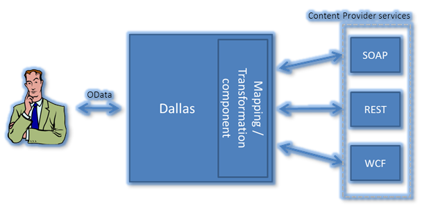

<properties
   pageTitle="Guide to creating a Data Service for the  Marketplace | Microsoft Azure"
   description="Detailed instructions of how to create, certify and deploy a Data Service for purchase on the Azure Marketplace."
   services="marketplace-publishing"
   documentationCenter=""
   authors="HannibalSII"
   manager=""
   editor=""/>

   <tags
      ms.service="marketplace"
      ms.devlang="na"
      ms.topic="article"
      ms.tgt_pltfrm="na"
      ms.workload="na"
      ms.date="01/04/2016"
      ms.author="hascipio; avikova" />

# Mapping an existing web service to OData through CSDL

This article gives an overview on how to use a CSDL to map an existing service to an OData compatible service. It explains how to create the mapping document (CSDL) that transforms the input request from the client via a service call and the output (data) back to the client via an OData compatible feed. Microsoft’s Azure Marketplace exposes services to the end-users by using the OData protocol. Services that are exposed by content providers (Data Owners) are exposed in a variety of forms, such as REST, SOAP, etc.

## What is a CSDL and its structure?
A CSDL (Conceptual Schema Definition Language) is a specification defining how to describe web service or database service in common XML verbiage to the Azure Marketplace.

Simple overview of the **request flow:**

  `Client -> Azure Marketplace -> Content Provider’s Web Service (Get, Post, Delete, Put)`

The **data flow** is in the opposite direction:

  `Client <- Azure Marketplace <- Content Provider’s WebService`

**Figure 1** diagrams how a client would obtain data from a content provider (your service) by going through the Azure Marketplace.  The CSDL is used by the Mapping/Transformation component to handle the request and data pass between the content provider’s service(s) and the requesting client.

*Figure 1: Detailed flow from requesting client to content provider via Azure Marketplace*

  

For background on Atom, Atom Pub, and the OData protocol upon which the Azure Marketplace extensions build, please review: [http://msdn.microsoft.com/library/ff478141.aspx](http://msdn.microsoft.com/library/ff478141.aspx)

Excerpt from above link:
  	*“The purpose of the Open Data protocol (hereafter referred to as OData) is to provide a REST-based protocol for CRUD-style operations (Create, Read, Update and Delete) against resources exposed as data services. A “data service” is an endpoint where there is data exposed from one or more “collections” each with zero or more “entries”, which consist of typed named-value pairs. OData is published by Microsoft under OASIS (Organization for the Advancement of Structured Information Standards) Standards so that anyone that wants to can build servers, clients or tools without royalties or restrictions.”*

### Three Critical Pieces that have to be defined by the CSDL are:

- The **endpoint** of the Service Provider
  The Web Address (URI) of the Service
- The **data parameters** being passed as input to the Service Provider
  The definitions of the parameters being sent to the Content Provider’s service down to the data type.
- **Schema** of the data being returned to the Requesting Service
  The schema of the data being delivered by the Content Provider’s service, including Container, collections/tables, variables/columns, and data types.

The following diagram shows an overview of the flow from where the client enters the OData statement (call to the content provider’s web service) to getting the results/data back.

  

### Steps:

1. Client sends request via Service call complete with Input Parameters defined in XML to the Azure Marketplace
2. CSDL is used to validate the Service call.
	- The Formatted Service Call is then sent to the Content Providers Service by the Azure Marketplace
3. The Webservice executes and preforms the action of the Http Verb (i.e. GET)
  The data is returned to Azure Marketplace where the requested data (if any) is exposes in XML Format to the Client using the Mapping defined in the CSDL.
4. The Client is sent the data (if any) in XML or JSON format

## Definitions

### OData ATOM pub

An extension to the ATOM pub where each entry represents one row of a result set. The content part of the entry is enhanced to contain the values of the row – as key value pairs. More information is found here:
[https://www.odata.org/documentation/odata-version-3-0/atom-format/](https://www.odata.org/documentation/odata-version-3-0/atom-format/)

### CSDL - Conceptual Schema Definition Language

Allows defining functions (SPROCs) and entities that are exposed through a database. More information found here: [http://msdn.microsoft.com/library/bb399292.aspx](http://msdn.microsoft.com/library/bb399292.aspx)  

> [AZURE.TIP] Click the **other versions** dropdown and select a version if you don’t see the article.

### EDM - Entry Data Model
- Overview: [http://msdn.microsoft.com/library/vstudio/ee382825(v=vs.100).aspx][OverviewLink]
[OverviewLink]:http://msdn.microsoft.com/library/vstudio/ee382825(v=vs.100).aspx
- Preview: [http://msdn.microsoft.com/library/aa697428(v=vs.80).aspx][PreviewLink]
[PreviewLink]:http://msdn.microsoft.com/library/aa697428(v=vs.80).aspx
- Data types: [http://msdn.microsoft.com/library/bb399548(v=VS.100).aspx][DataTypesLink]
[DataTypesLink]:http://msdn.microsoft.com/library/bb399548(v=VS.100).aspx

The following shows the detailed Left to Right flow from where the client enters the OData statement (call to the content provider’s web service) to getting the results/data back:

  

## CSDL Basics

A CSDL (Conceptual Schema Definition Language) is a specification defining how to describe web service or database service in common XML verbiage to the Azure Marketplace. CSDL describes the critical pieces that **makes the passing of data from the Data Source to the Azure Marketplace possible.** The main pieces are described here:

- Interface information describing all publicly available functions (FunctionImport Node)
- Data type information for all message requests(input) and message responses(outputs) (EntityContainer/EntitySet/EntityType Nodes)
- Binding information about the transport protocol to be used (Header Node)
- Address information for locating the specified service (BaseURI attribute)

In a nutshell, the CSDL represents a platform- and language-independent contract between the service requestor and the service provider. Using the CSDL, a client can locate a web service/database service and invoke any of its publicly available functions.

### Relating a CSDL to a Database or a Collection
**The CSDL Specification**

CSDL is XML grammar for describing a web service. The specification itself is divided into 4 major elements:  EntitySet, FunctionImport; NameSpace, and EntityType.

To make this abstraction easier to understand lets relate a CSDL to a table.

Remember;

  CSDL represents a platform- and language-independent contract between the **service requestor** and the **service provider**. Using CSDL, a **client** can locate a **web service/database service** and invoke any of its publicly available **functions.**

For a Data Service the four parts of a CSDL can be thought of in terms of a Database, Table, Column, and Store Procedure.

Relating these as follows for a Data Service:

- EntityContainer  ~=  Database
- EntitySet  ~=  Table
- EntityType  ~= Columns
- FunctionImport  ~=  Stored Procedure

**HTTP Verbs allowed**
- GET – returns values from the db (returns a Collection)
- POST – used to pass data to and optional return values from the db (Create a new entry in the collection, return id/URI)
- DELETE – Deletes data from the DB (Deletes a collection)
- PUT – Update data into a DB (replace a collection or create one)

## Metadata/Mapping Document

The metadata/mapping document is used to map a content provider’s existing web services so that it can be exposed as an OData web service by the Azure Marketplace system. It is based on CSDL and implements a few extensions to CSDL to accommodate the needs of REST based web services exposed through Azure Marketplace. The extensions are found in the [http://schemas.microsoft.com/dallas/2010/04](http://schemas.microsoft.com/dallas/2010/04) namespace.

An example of the CSDL follows:  (Copy and paste the below example CSDL into an XML editor and change to match your Service.  Then paste into CSDL Mapping under DataService tab when creating your service in the  [Azure Marketplace Publishing Portal](https://publish.windowsazure.com)).

**Terms:**
Relating the CSDL terms to the [Publishing Portal](https://publish.windowsazure.com) UI (PPUI) terms.
- Offer “Title” in the PPUI relates to MyWebOffer
- MyCompany in the PPUI relates to **Publisher Display Name** in the [Microsoft Developer Center](http://dev.windows.com/registration?accountprogram=azure) UI
- Your API relates to a Web or Data Service (a Plan in the PPUI)

**Hierarchy:**
  A Company (Content Provider) owns Offer(s) which have Plan(s), namely service(s), which line up with an API.

### WebService CSDL Example

Connects to a service that is exposing an web application endpoint (like a C# application)

        <?xml version="1.0" encoding="utf-8"?>
        <!-- The namespace attribute below is used by our system to generate C#. You can change “MyCompany.MyOffer” to something that makes sense for you, but change “MyOffer” consistently throughout the document. -->
        <Schema Namespace="MyCompany.MyWebOffer" Alias="MyOffer" xmlns="http://schemas.microsoft.com/ado/2009/08/edm" xmlns:d="http://schemas.microsoft.com/dallas/2010/04" >
        <!-- EntityContainer groups all the web service calls together into a single offering. Every web service call has a FunctionImport definition. -->
          <EntityContainer Name="MyOffer">
        <!-- EntitySet is defined for CSDL compatibility reasons, not required for ReturnType=”Raw”
        @Name is used as reference by FunctionImport @EntitySet. And is used in the customer facing UI as name of the Service.
        @EntityType is used to point at the type definition near the bottom of this file. -->
            <EntitySet Name="MyEntities" EntityType="MyOffer.MyEntityType" />
        <!-- Add a FunctionImport for every service method. Multiple FunctionImports can share a single return type (EntityType). -->
        <!-- ReturnType is either Raw() for a stream or Collection() for an Atom feed. Ex. of Raw: ReturnType=”Raw(text/plain)” -->
        <!—EntitySet is the entityset defined above, and is needed if ReturnType is not Raw -->
        <!-- BaseURI attribute defines the service call, replace & with the encode value (&amp;).
        In the input name value pairs {param} represents passed in value.
        Or the value can be hard coded as with AccountKey. -->
        <!-- AllowedHttpMethods optional (default = “GET”), allows the CSDL to specifically specify the verb of the service, “Get”, “Post”, “Put”, or “Delete”. -->
        <!-- EncodeParameterValues, True encodes the parameter values, false does not. -->
        <!-- BaseURI is translated into an URITemplate which defines how the web service call is exposed to marketplace customers.
        Ex. https://api.datamarket.azure.com/mycompany/MyOfferPlan?name={name}
        BaseURI is XML encoded, the {...} point to the parameters defined below.
        Marketplace will read the parameters from this URITemplate and fill the values into the corresponding parameters of the BaseUri or RequestBody (below) during calls to your service.  
        It is okay for @d:BaseUri to include information only for Marketplace consumption, it will not be exposed to end users. i.e. the hardcoded AccountKey in the above BaseURI does not show up in the client facing URITemplate. -->
            <FunctionImport Name="MyWebServiceMethod"
                            EntitySet="MyEntities"
                            ReturnType="Collection(MyOffer.MyEntityType)"
        d:AllowedHttpMethods="GET"
        d:EncodeParameterValues="true"
        d:BaseUri="http://services.organization.net/MyServicePath?name={name}&amp;AccountKey=22AC643">
        <!-- Definition of the RequestBody is only required for HTTP POST requests and is optional for HTTP GET requests. -->
        <d:RequestBody d:httpMethod="POST">
                <!-- Use {} for placeholders to insert parameters. -->
                <!-- This example uses SOAP formatting, but any POST body can be used. -->
        	<!-- This example shows how to pass userid and password via the header -->
                <![CDATA[<soapenv:Envelope xmlns:soapenv="http://schemas.xmlsoap.org/soap/envelope/" xmlns:MyOffer="http://services.organization.net/MyServicePath">
                  <soapenv:Header/>
                  <soapenv:Body>
                    <MyOffer:ws_MyWebServiceMethod>
                      <myWebServiceMethodRequest>
                        <!--This information is not exposed to end users. -->
                        <UserId>userid</UserId>
                        <Password>password</Password>
                        <!-- {name} is replaced with the value read from @d:UriTemplate above -->
                        <Name>{name}</Name>
                        <!-- Parameters can be used more than once and are not limited to appearing as the value of an element -->
                        <CustomField Name="{name}" />
                        <MyField>Static content</MyField>
                      </myWebServiceMethodRequest>
                    </MyOffer:ws_MyWebServiceMethod>
                  </soapenv:Body>
                </soapenv:Envelope>      
              ]]>
        </d:RequestBody>
        <!-- Title, Rights and Description are optional and used to specify values to insert into the ATOM feed returned to the end user.  You can specify the element to contain a fixed message by providing a value for the element (this is the default value).  @d:Map is an XPath expression that points into the response returned by your service and is optional.  -->
        <d:Title d:Map="/MyResponse/Title">Default title.</d:Title>
        <d:Rights>© My copyright. This is a fixed response. It is okay to also add a d:Map attribute to override this text.</d:Rights>
        <d:Description d:Map="/MyResponse/Description"></d:Description>
        <d:Namespaces>
        <d:Namespace d:Prefix="p"  d:Uri="http://schemas.organization.net/2010/04/myNamespace" />
        <d:Namespace d:Prefix="p2" d:Uri="http://schemas.organization.net/2010/04/MyNamespace2" />
        </d:Namespaces>
        <!-- Parameters of the web service call:
        @Name should match exactly (case sensitive) the {…} placeholders in the @d:BaseUri, @d:UriTemplate, and d:RequestBody, i.e. “name” parameter in above BaseURI.
        @Mode is always "In", compatibility with CSDL
        @Type is the EDM.SimpleType of the parameter, see http://msdn.microsoft.com/library/bb399548(v=VS.100).aspx
        @d:Nullable indicates whether the parameter is required.
        @d:Regex - optional, attribute to describe the string, limiting unwanted input at the entry of the system
        @d:Description - optional, is used by Service Explorer as help information
        @d:SampleValues - optional, is used by Service Explorer as help information. Multiple Sample values are separated by '|', e.g. "804735132|234534224|23409823234"
        @d:Enum - optional for string type. Contains an enumeration of possible values separated by a '|', e.g. d:enum="english|metric|raw". Will be converted in a dropdown list in the Service Explorer.
        -->
        <Parameter name="name" Mode="In" Type="String" d:Nullable="false" d:Regex="^[a-zA-Z]*$" d:Description="A name that cannot contain any spaces or non-alpha non-English characters"
        d:Enum="George|John|Thomas|James"
        d:SampleValues="George"/>
        <Parameter Name=" AccountKey" Mode="In" Type="String" d:Nullable="false" />

        <!-- d:ErrorHandling is an optional element. Use it define standardized errors by evaluating the service response. -->
        <d:ErrorHandling>
        <!-- Any number of d:Condition elements are allowed, they are evaluated in the order listed.
        @d:Match is an Xpath query on the service response, it should return true or false where true indicates an error.
        @d:httpStatusCode is the error code to return if an response matches the error.
        @d:errorMessage is the user friendly message to return when an error occurs.
        -->
        <d:Condition d:Match="/Result/ErrorMessage[text()='Invalid token']" d:HttpStatusCode="403" d:ErrorMessage="User cannot connect to the service." />
        </d:ErrorHandling>
           </FunctionImport>

        	<!-- The EntityContainer defines the output data schema -->
        </EntityContainer>
        <!-- The EntityType @d:Map defines the repeating node (an XPath query) in the response (output data schema). -->
        <!-- If these nodes are outside a namespace, add the prefix in the xpath. -->
        <!--
        @Name - define your user readable name, will become an XML element in the ATOM feed, so comply with the XML element naming restrictions (no spaces or other illegal characters).
        @Type is the EDM.SimpleType of the parameter, see http://msdn.microsoft.com/library/bb399548(v=VS.100).aspx.
        @d:Map uses an Xpath query to point at the location to extract the content from your services response.
        The "." is relative to the repeating node in the EntityType @d:Map Xpath expression.
        -->
            <EntityType Name="MyEntityType" d:Map="/MyResponse/MyEntities">
        <Property Name="ID"	d:IsPrimaryKey="True" Type="Int32"	Nullable="false" d:Map="./Remaining[@Amount]"/>
        <Property Name="Amount"	Type="Double"	Nullable="false" d:Map="./Remaining[@Amount]"/>
        <Property Name="City"	Type="String"	Nullable="false" d:Map="./City"/>
        <Property Name="State"	Type="String"	Nullable="false" d:Map="./State"/>
        <Property Name="Zip"	Type="Int32"	Nullable="false" d:Map="./Zip"/>
        <Property Name="Updated"	Type="DateTime"	Nullable="false" d:Map="./Updated"/>
        <Property Name="AdditionalInfo" Type="String" Nullable="true"
        d:Map="./Info/More[1]"/>
            </EntityType>
        </Schema>

> [AZURE.TIP] View more CSDL Web Service examples in the article [Examples of mapping an existing web service to OData through CSDLs](marketplace-publishing-data-service-creation-odata-mapping-examples.md)

###DataService CSDL Example

Connects to a service that is exposing a database table or view as an endpoint
Below example shows two APIs for Data base based API CSDL (can use views rather than tables).

        <?xml version="1.0"?>
        <!-- The namespace attribute below is used by our system to generate C#. You can change “MyCompany.MyOffer” to something that makes sense for you, but change “MyOffer” consistently throughout the document. -->
        <Schema Namespace="MyCompany.MyDataOffer" Alias="MyOffer" xmlns:xsd="http://www.w3.org/2001/XMLSchema" xmlns:xsi="http://www.w3.org/2001/XMLSchema-instance" xmlns="http://schemas.microsoft.com/ado/2009/08/edm">
        <!-- EntityContainer groups all the data service calls together into a single offering. Every web service call has a FunctionImport definition. -->
        <EntityContainer Name="MyOfferContainer">
        <!-- EntitySet is defined for CSDL compatibility reasons, not required for ReturnType=”Raw”
        	Think of the EntitySet as a Service
        @Name is used in the customer facing UI as name of the Service.
        @EntityType is used to point at the type definition (returned set of table columns). -->
        <EntitySet Name="CompanyInfoEntitySet" EntityType="MyOffer.CompanyInfo" />
        <EntitySet Name="ProductInfoEntitySet" EntityType="MyOffer.ProductInfo" />
        </EntityContainer>
        <!-- EntityType defines result (output); the table (or view) and columns to be returned by the data service.)
        	Map is the schema.tabel or schema.view
        	dals.TableName is the table Name
        	Name is the name identifier for the EntityType and the Name of the service exposed to the client via the UI.
        	dals:IsExposed determines if the table schema is exposed (generally true).
        	dals:IsView (optional) true if this is based on a view rather than a table
        	dals:TableSchema is the schema name of the table/view
        -->
        <EntityType
        Map="[dbo].[CompanyInfo]"
        dals:TableName="CompanyInfo"
        Name="CompanyInfo"
        dals:IsExposed="true"
        dals:IsView="false"
        dals:TableSchema="dbo"
        xmlns:dals="http://schemas.microsoft.com/dallas/2010/04">
        <!-- Property defines the column properties and the output of the service.
        	dals:ColumnName is the name of the column in the table /view.
        	Type is the emd.SimpleType
        	Nullable determines if NULL is a valid output value
        	dals.CharMaxLenght is the maximum length of the output value
        	Name is the name of the Property and is exposed to the client facing UI
        	dals:IsReturned is the Boolean that determines if the Service exposes this value to the client.
        	IsQueryable is the Boolean that determines if the column can be used in a database query
        	(For data Services: To improve Performance make sure that columns marked ISQueryable=”true” are in an index.)
        	dals:OrdinalPosition is the numerical position x in the table or the View, where x is from 1 to the number of columns in the table.
        	dals:DatabaseDataType is the data type of the column in the database, i.e. SQL data type dals:IsPrimaryKey indicates if the column is the Primary key in the table/view.  (The columns marked ISPrimaryKey are used in the Order by clause when returning data.)
        -->
        <Property dals:ColumnName="data" Type="String" Nullable="true" dals:CharMaxLength="-1" Name="data" dals:IsReturned="true" dals:IsQueryable="false" dals:IsPrimaryKey="false" dals:OrdinalPosition="3" dals:DatabaseDataType="nvarchar" />
        <Property dals:ColumnName="id" Type="Int32" Nullable="false" Name="id" dals:IsReturned="true" dals:IsQueryable="true" dals:IsPrimaryKey="true" dals:OrdinalPosition="1" dals:NumericPrecision="10" dals:DatabaseDataType="int" />
        <Property dals:ColumnName="ticker" Type="String" Nullable="true" dals:CharMaxLength="10" Name="ticker" dals:IsReturned="true" dals:IsQueryable="true" dals:IsPrimaryKey="false" dals:OrdinalPosition="2" dals:DatabaseDataType="nvarchar" />
        </EntityType>
        <EntityType Map="[dbo].[ProductInfo]" dals:TableName="ProductInfo" Name="ProductInfo" dals:IsExposed="true" dals:IsView="false" dals:TableSchema="dbo" xmlns:dals="http://schemas.microsoft.com/dallas/2010/04">
        <Property dals:ColumnName="companyid" Type="Int32" Nullable="true" Name="companyid" dals:IsReturned="true" dals:IsQueryable="true" dals:IsPrimaryKey="false" dals:OrdinalPosition="2" dals:NumericPrecision="10" dals:DatabaseDataType="int" />
        <Property dals:ColumnName="id" Type="Int32" Nullable="false" Name="id" dals:IsReturned="true" dals:IsQueryable="true" dals:IsPrimaryKey="true" dals:OrdinalPosition="1" dals:NumericPrecision="10" dals:DatabaseDataType="int" />
        <Property dals:ColumnName="product" Type="String" Nullable="true" dals:CharMaxLength="50" Name="product" dals:IsReturned="true" dals:IsQueryable="true" dals:IsPrimaryKey="false" dals:OrdinalPosition="3" dals:DatabaseDataType="nvarchar" />
        </EntityType>
        </Schema>

## See Also
- If you are interested in learning and understanding the specific nodes and their parameters, read this article [Data Service OData Mapping Nodes](marketplace-publishing-data-service-creation-odata-mapping-nodes.md) for definitions and explanations, examples, and use case context.
- If you are interested in reviewing examples, read this article [Data Service OData Mapping Examples](marketplace-publishing-data-service-creation-odata-mapping-examples.md) to see sample code and understand code syntax and context.
- To return to the prescribed path for publishing a Data Service to the Azure Marketplace, read this article [Data Service Publishing Guide](marketplace-publishing-data-service-creation.md).
