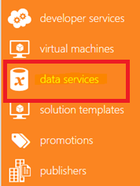
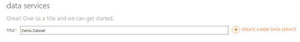
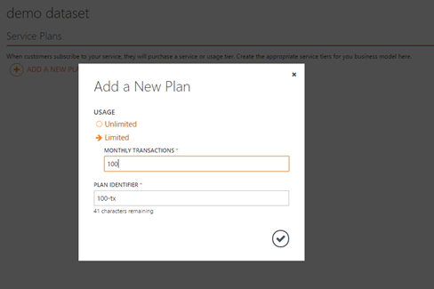
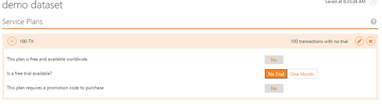
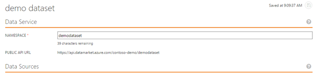
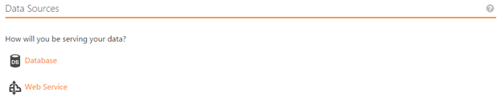
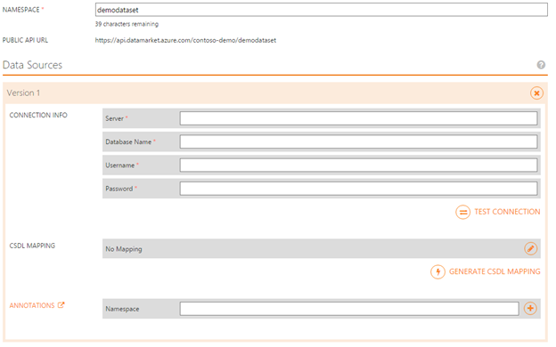
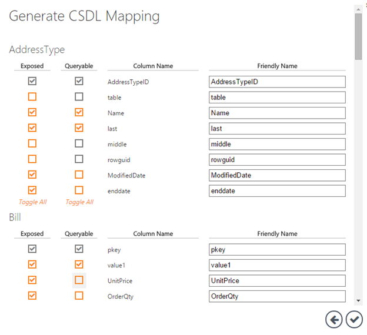
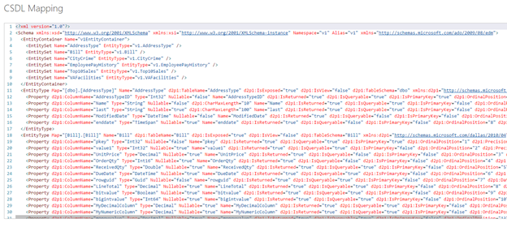
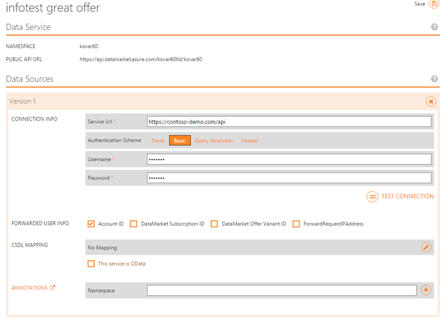

<properties
   pageTitle="Guide to creating a Data Service for the  Marketplace | Microsoft Azure"
   description="Detailed instructions of how to create, certify and deploy a Data Service for purchase on the Azure Marketplace."
   services="marketplace-publishing"
   documentationCenter=""
   authors="HannibalSII"
   manager=""
   editor=""/>

   <tags
      ms.service="marketplace"
      ms.devlang="na"
      ms.topic="article"
      ms.tgt_pltfrm="na"
      ms.workload="na"
      ms.date="06/28/2016"
      ms.author="hascipio; avikova" />

# Data Service Publishing Guide for the Azure Marketplace
After completing the step 1, [Account Creation and Registration](marketplace-publishing-accounts-creation-registration.md), we guided you through the [General Non-Technical](marketplace-publishing-pre-requisites.md) and [Technical Requirements](marketplace-publishing-data-service-creation-prerequisites.md) of a Data Service offer on Azure Marketplace. Now we will walk you through the steps for creating a Data Service offer on the [Publishing Portal][link-pubportal] for the Azure Marketplace.

## 1.	Login to the Publishing Portal.

Go to [https://publish.windowsazure.com](https://publish.windowsazure.com. )

**For first time login to Publishing Portal, use the same account with which your company’s Seller Profile was registered in Developer Center.**  (Later you can add any employee of your company as a co-admin in the Publishing Portal).

Click on the **Publish a Data Services** tile if this is the first login into the publishing portal.

## 2.	Choose **Data Services** in the navigation menu on the left side.

  

## 3.	Create a New Data Service

Fill in the title for your new Data Service Offer and click on “+” on the right.

  

## 4.	Review the sub-menu under the newly created Data Service in the navigation menu.

Click on the **Walkthrough** tab and review all necessary steps needed to publish properly the Data Service on the Azure Marketplace.

> [AZURE.TIP] You always can click on the links in the “Walkthrough” page or use tabs on the Data Service offer’s sub-menu on the left side.

## 5.	Create a new Plan.

### Offers, Plans, transactions.

Each Offer can have multiple Plans, but must have at least one (1) Plan. When end-users subscribe to your offer they subscribe for one of the offer’s Plan. Each plan defines how end-users will be able to use your service.

Currently Azure Marketplace support only Monthly Subscription Transaction Based model for Data Services, i.e. end-users will pay monthly fee according to the price of the specific plan they subscribed to and will be able to consume each month number of
transaction defined by the plan.

Each Transaction usually defined as number of records your Data Service will return based on the query sent to the Service. The default is 100. Number of transactions returned to each query will be number of records divided by 100 and rounded up to the closest integer.

It’s Azure Marketplace Service layer responsibility to monitor (meter) number of transactions consumed by each query.

> [AZURE.IMPORTANT] End-Users which reached the transaction limit during the month will be blocked from continuing to use the service until end of their monthly subscription cycle.

> The plan or one of the plans can (but not must) include unlimited number of transactions.

### Create a plan.
1. Click on **“+”** next to the “Add a new plan”.

2. Choose one of the options: **Unlimited** or **Limited** usage for this plan.  If Limited then provide the number of transaction the plan will allow to consume in a month.

      

    Publishing Portal will also suggest “Plan Identifier”, which will be used to communicate to the end-users the name of the plan in the UI and also used by the Market Place Service to identify the Plan. You can change the “Plan Identifier” if you want.

    > [AZURE.NOTE] The “Plan Identifier” must be unique within the scope of each offer. As many other Identifiers used in the Publishing Portal Plan identifier will be locked after the first publishing to production and you will not be able to change this identifier.

3. Click to accept your choice.

4. Then you will be asked few additional questions regarding your newly created Plan.

    

|Question|Significance|
|----|----|
|**This Plan is free and available world-wide?**|You can create a completely free-of-charge plan. If it’s the only plan for this offer – it means that you are publishing “Free Offer” in the Marketplace. If it’s only for one (of few) Plan, the it gives you an option to offer end-users to learn more about your service with a relatively small number of transactions per month.  If the answer is "Yes," then no further questions will be asked.|

> [AZURE.NOTE] End users can always upgrade to the paid plans.

|Question|Significance|
|----|----|
|**Is free trial available?**|You can choose between “No Trial” at all or give an option to use your Plan for “One Month”. Publishers like to use this option to provide end-users the possibility to understand the benefits of the offer for free for one month.|

> [AZURE.IMPORTANT] End-users will only be able to purchase a free trial if they have established payment instrument e.g. credit card, enterprise agreement.

> After one month of the free trial, Azure Marketplace will start charging customers the price as of the date of the subscription, unless the customer initiated the subscription cancellation. No special notification will be provided to the end-users.

|Question|Significance|
|----|----|
|**This plan requires a promotion code to purchase?**| Publishers have an option to limit access to their Service Plans by providing a special code, called “A Promocode” to specific customers. Only end-users which will have this Promocode will be able to subscribe to the Plan. If you choose “No”, then you agree that everyone from the region where the offer is available (See [Marketplace Marketing Content Guide](marketplace-publishing-push-to-staging.md) for more details) will be able to subscribe to this plan. No further questions will be asked.|
|**Also hide this plan from anyone who doesn’t have a valid promotion code?**|If the answer to the previous question is “Yes” the Publisher has an option to completely remove this plan from appearing in the UI of the Marketplace. It means, customers will not see this plan in the Offer’s details page. End-users which will receive a promocode to purchase it, will be able to subscribe to it using this promocode.|

## 6.	Create your Marketplace marketing content
For How to provide information required in **Marketing, Pricing, Support and Categories** tabs please visit [Marketplace Marketing Content Guide](marketplace-publishing-push-to-staging.md) which is common to all artifacts published in the Azure Marketplace.  

## 7.	Connect your offer to your Service (SQL Azure based or Web Service based).

Click on the **Data Services** sub-menu.

On the upper half of the page you’ll be asked to provide the offer’s **Namespace**.  

  

The below question will define how the Publisher is going to expose newly created offer to Azure Marketplace. (For more details see the [Data Services Technical Prerequisite Guide](marketplace-publishing-data-service-creation-prerequisites.md)).

  

**Publishing the Database based service**

Click on **Database**. The following page will appear:

  

To create a CSDL mapping for the Dataset based on the SQL Azure DB:

  

And then for each table

  

  

If Web Service

  

> [AZURE.IMPORTANT] Read [Mapping an existing web service to OData through CSDL](marketplace-publishing-data-service-creation-odata-mapping.md) for detailed instructions and examples for creating a CSDL Web Service.

## Next Steps
Now that you've created your Data Service offer, please ensure that you complete the instructions in the [Marketplace Marketing Content Guide](marketplace-publishing-push-to-staging.md) before you move forward to [Testing your Data Service in Staging](marketplace-publishing-data-service-test-in-staging.md).

## See Also
- [Getting Started: How to publish an offer to the Azure Marketplace](marketplace-publishing-getting-started.md)
- If you are interested in understanding the overall OData mapping process and purpose, read this article [Data Service OData Mapping](marketplace-publishing-data-service-creation-odata-mapping.md) to review definitions, structures, and instructions.
- If you are interested in learning and understanding the specific nodes and their parameters, read this article [Data Service OData Mapping Nodes](marketplace-publishing-data-service-creation-odata-mapping-nodes.md) for definitions and explanations, examples, and use case context.
- If you are interested in reviewing examples, read this article [Data Service OData Mapping Examples](marketplace-publishing-data-service-creation-odata-mapping-examples.md) to see sample code and understand code syntax and context.

[link-pubportal]:https://publish.windowsazure.com
