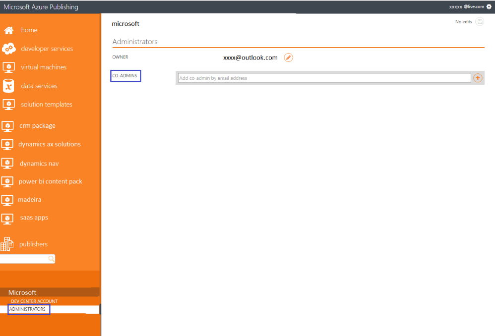

<properties
   pageTitle="Non-technical prerequisites for creating an offer for the Azure Marketplace | Microsoft Azure"
   description="Understand the requirements for creating and deploying an offer to the Azure Marketplace for others to purchase."
   services="marketplace-publishing"
   documentationCenter=""
   authors="HannibalSII"
   manager=""
   editor=""/>

<tags
  ms.service="marketplace"
  ms.devlang="na"
  ms.topic="article"
  ms.tgt_pltfrm="Azure"
  ms.workload="na"
  ms.date="07/27/2016"
  ms.author="hascipio; v-divte"/>

# General prerequisites for creating an offer for the Azure Marketplace
Understand the general, business-process-centric prerequisites that are needed to move forward with the offer creation process.

## Ensure that you are registered as a seller with Microsoft
For detailed instructions on registering a seller account with Microsoft, go to [Account creation and registration](marketplace-publishing-accounts-creation-registration.md).

- **If your company is already registered as a seller in the Dev Center and you want to create a new offer,** then login to the Publishing portal with the same email id with which Dev Center registration is done. This step is required so that the Dev Center and Publishing portal are linked with each other.
- **If your company is already registered as a seller in the Dev Center and you want to edit an existing offer,** then either login to the Publishing portal with the admin account or with an account which is added as a co-admin in the Publishing portal. Steps to add a co-admin account is given below.

## Steps to add a co-admin in the Publishing Portal
Admins of the Publishing portal can add the other members of the company, who are working on the application, as a co-admin in the Publishing portal. **Assuming that you are the admin,** given below are the steps to add a co-admin.

>[AZURE.NOTE] For new users, before you add a co-admin in the Publishing portal, ensure that you have created at least one application in the Publishing portal. This is required as the **PUBLISHERS** tab appear only after creating at least one application in the Publishing portal.

1. Ensure that the co-admin email id is a Microsoft account(MSA). If not, register it as a MSA using this [link](https://signup.live.com/signup?uaid=0089f09ccae94043a0f07c2aaf928831&lic=1).
2. Ensure that there is at least one application under the admin account before trying to add a co-admin.
3. After the above steps are done, login to the Publishing portal with the co-admin email id and then log out.
4. Now login to the Publishing portal with the admin email id.
5. Navigate to Publishers->select your account->Administrators->Add the co-admin (screenshot given below)

    

6. Ensure that email ids provided at the various stages of the publishing process (e.g. Dev Center, Publishing portal) are monitored for any communication from Microsoft.
7. For Dev Center registration, avoid using an account associated with a single person. This is suggested for removing dependency from one individual.
8. If you face any issues with Dev Center registration, then please raise a ticket using this [link](https://developer.microsoft.com/en-us/windows/support).

> [AZURE.IMPORTANT] You do not have to complete company tax and bank information if you are planning to publish only free offers (or bring your own license).

> The company registration must be completed to get started. However, while your company works on the tax and bank information in the Microsoft Developer account, the developers can start working on creating the virtual machine image in the [Publishing Portal](https://publish.windowsazure.com), getting it certified, and testing it in the Azure staging environment. You will need the complete seller account approval only for the final step of publishing your offer to the Azure Marketplace.

## Acquire an Azure "pay-as-you-go" subscription
This is the subscription that you will use to create your VM images and hand over the images to the [Azure Marketplace](https://azure.microsoft.com/marketplace/). If you do not have an existing subscription, then please sign up at https://account.windowsazure.com/signup?offer=ms-azr-0003p.

## "Sell-from" countries
> [AZURE.WARNING]
In order to sell your services on the Azure Marketplace, you must make sure that your registered entity is from one of the approved “sell-from” countries. This restriction is for payout and taxation reasons. We are actively looking to expand this list of countries in the near future, so stay tuned. For the complete list, see section 1b of the [Azure Marketplace participation policies](http://go.microsoft.com/fwlink/?LinkID=526833).

## Next steps
Once the non-technical pre-requisites are fulfilled, next are the offer specific technical prerequisites. Click the link to the article for the respective offer type that you would like to create for the Azure Marketplace.

- [VM technical pre-requisites](marketplace-publishing-vm-image-creation-prerequisites.md)
- [Solution Template technical pre-requisites](marketplace-publishing-solution-template-creation-prerequisites.md)

## See also
- [Getting started: How to publish an offer to the Azure Marketplace](marketplace-publishing-getting-started.md)
