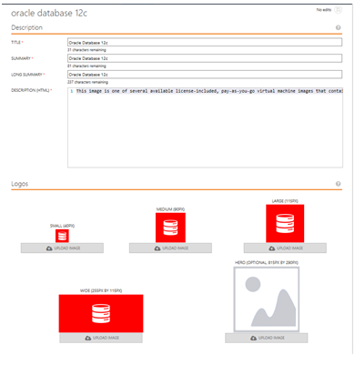
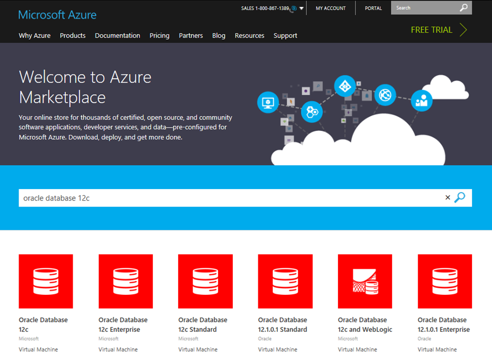
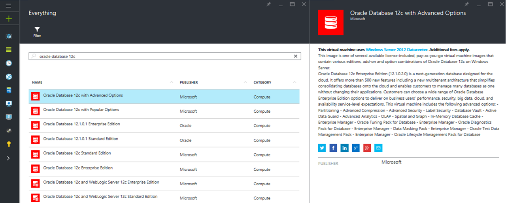
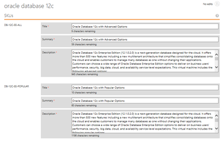

<properties
   pageTitle="Preparing and testing your offer for deployment to the Azure Marketplace | Microsoft Azure"
   description="Detailed instructions on providing marketing content, configuring pricing plans, and testing your offer before deploying to the Azure Marketplace."
   services="marketplace-publishing"
   documentationCenter=""
   authors="HannibalSII"
   manager=""
   editor=""/>

<tags
   ms.service="marketplace-publishing"
   ms.devlang="na"
   ms.topic="article"
   ms.tgt_pltfrm="Azure"
   ms.workload="na"
   ms.date="10/08/2015"
   ms.author="hascipio"/>

# Complete the offer creation with marketing content
In this step of the publishing process. Here you will need to provide certain marketing content and details about your offering and/or SKUs in the Azure Marketplace such as description of your product, company logos, price plans, details of plants and other information necessary to push your offer and/or SKU to staging. This information is used as marketing content in our Azure Portal. You will begin this process in the [Publishing Portal][link-pubportal].

## Step 1. Provide Marketplace marketing content
**English is the default and only supported language;** please ensure that all information provided in the fields is in English. All information can be edited at any time until you push to staging.

  1. Go to the Publishing Portal, [https://publish.windowsazure.com](https://publish.windowsazure.com)
  2. In the left menu, click **Marketing** tab.
  3. In the main panel, click **English (US)** button.

### Details
1. Enter the offer summary, long summary, and description for your offer.
2.	Upload images of the required specifications (mentioned on Publishing Portal) in PNG format, one for each size.

  

  *Offer Title, Description, and logos*

Below is the detailed view of how the publisher portal offer marketing details are used on the [Azure Marketplace](http://azure.microsoft.com/marketplace).

*Offer catalog listing on Microsoft [Azure Marketplace](http://azure.microsoft.com/marketplace) website*

*Offer details page on Microsoft [Azure Marketplace](http://azure.microsoft.com/marketplace) website*

*Offer details panel in Microsoft [Azure Preview Portal](https://ms.portal.azure.com)*

### Links
In the links tab on the left bar, enter any links with information that may help customers. Enter a name and URL for each link.

### Sample images (optional)
> [AZURE.NOTE] Including a sample image is an optional step. You could complete the other marketing content to fulfill requirements for push to staging.

In the **Sample Images** tab on the left menu, upload a new image by clicking **Upload a new image**. If you have an existing image and you would like to replace it, click **Replace image**.

### Plans

### Legal
In the Legal tab, provide a link to your policies/terms of use. Enter or paste the terms in the large Terms of Use box.

> [AZURE.IMPORTANT] All fields must have entries, including the images, in order to be able to push to staging.

## Step 2: Set your prices
### Pricing Models
|Pricing Model |Description |
|---------------|------------------------------------------|
|Base| Flat monthly rate paid at time of purchase e.g. $10/month|
|Consumption (aka Usage, Meter) | Pay per use, which is defined by the publisher of the offer. Overage cannot be defined per seat, per user, etc as there is no concept of a fraction of a user or capability to do proration. Usage is reported by the Partner on an hourly basis. Customer pays at the of monthly billing cycle as opposed to upfront like monthly plans. |
|Free Trial | Customer may use for free for a limited time and then pay normal rates thereafter |
|Free Tier | Plan is always free |
| Migration (aka conversion or upgrade/downgrade) of Plan | Concept of a user moving from their current plan to another acceptable plan; defined by partner |

**Pricing models available by offer type**

> [AZURE.IMPORTANT] Availability of certain pricing models vary by offer type. See the table below.

| | Base Only | Consumption Only | Base + Consumption |
|---|---|---|---|
| Virtual Machine Image | No | Yes | No|
| Developer Service | Yes | Yes | Yes |
| Data Service | Yes | No | No |

### 2.1. Set your VM prices
> [AZURE.NOTE] BYOL is only supported for virtual machines.

1.	Under the **Pricing** tab, you will see all of the supported markets. Select the appropriate one to bring up the pricing fields.
2.	The provided link on the Publishing Portal will show pricing information to help you in determining the prices of your SKU(s).
3.	If your SKU is BYOL, select the checkbox for ‘Externally-licensed (BYOL) SKU availability.
4.	If your SKU is hourly, enter the pricing for your software. SKUs without pricing will not be available for purchase or use.

  > [AZURE.NOTE] If you have both BYOL as well as Hourly SKUs, then make sure both the requisites are covered: BYOL checkbox and price values for Hourly.

5.	A pricing wizard will open; proceed through this to complete your pricing, including pricing for other countries, if you choose to allow purchases from outside your specified market.
6.	Some countries are ISV Remit countries. To sell in an ISV Remit country, you must be able to charge and collect tax on your SKUs, and should calculate and pay tax to the government of the country. Microsoft is not in a position to provide legal or tax guidance.  See section ““Sell-to” countries of the Offer” under Introduction of this document for more information on “Sell To Countries”.

### 2.2. Set your developer service prices
Plans can be any combination of Base + Consumption, where BASE is monthly price and Overage is pay-per-use price (see below for more details)

**Example:**  Contoso Developer Service Offering

| Plan | Price | Includes | Migration Path |
|-------|------|-------|-------|
|Free|$0/month|Basic functionality|Can migrate to any other plan|
|Bronze|$10/month|Basic functionality and a quota of 1,000 of feature X|Can migrate to Bronze Plus, Silver, and Gold Plans|
|Bronze Plus|Free Trial period: $0/month + $0/meter01 |Basic functionality and a quota of 10,000 of feature X.  Once feature X quota is used, the customer can pay per use via meter01.|Can migrate to Silver Plus and Gold Plans|
|Bronze Plus| Paid period (aka Free Trial expired): $10/month + $0.05/meter01|Basic functionality and a quota of 10,000 of feature X.  Once feature X quota is used, the customer can pay per use via meter01.|Can migrate to Silver Plus and Gold Plans|
|Silver|$0.15/meter01|The customer can pay-per-use via meter01, which is for feature X|Can migrate to Bronze and Gold Plans|
|Silver Plus|$20/month + $0.15/meter01 + $0.01/meter02|Basic functionality and a quota of 10,000 of feature X and 100 of feature Y.  Once feature X quota is used, the customer can pay per use via meter01.  Once feature Y quota is used, the customer can pay per use via meter02|Can migrate to Bronze Plus and Gold Plans|
|Gold|$1000/month|Quota of 10,000 of feature X, 1,000 of feature Y, and unlimited of feature Z|Can migrate to all plans except free|

## Step 3: Provide support information
Some of this information will have been completed during the certification step. You may add or edit information as in the steps below. The contact details are used for internal communications between partner and Microsoft only. Support URL will be available to the end customers.

1.	Go to the Support heading on the left side of the Publishing Portal.
2.	Enter information under Engineering Contact.
3.	Enter information under Customer Support. If you only provide email support, enter a dummy phone number, and your provided email will be used instead.
4.	Enter Support URL

## Step 4: Choose Azure Marketplace categories
In the **Categories** tab, there will be an array of selections provided. Your offer may fall under these, and you may select up to five (5) categories.

## Next steps
Now that your Marketplace content is loaded, lets move forward with the **Step 3: Testing your offer in Staging**. However, you must select the appropriate offer type from the list below as steps vary by offer type.

||Virtual Machine Image |Developer Service | Data Service | Solution Template |
|----|----|----|----|----|
| **Step 3. Push your offer to Staging** | [Test your VM offer in Staging](marketplace-publishing-vm-image-test-in-staging.md) | Test your Developer Service offer in Staging | Test your Data Service offer in Staging | [Test your Solution Template in Staging](marketplace-publishing-solution-template-test-in-staging.md) |

## See Also
- [Getting Started: How to publish an offer to the Azure Marketplace](marketplace-publishing-getting-started.md)

[img-map-acom]:media/marketplace-publishing-push-to-staging/pubportal-mapping-acom.jpg
[img-map-portal]:media/marketplace-publishing-push-to-staging/pubportal-mapping-azure-portal.jpg
[img-map-link]:media/marketplace-publishing-push-to-staging/marketing-content-guide-links.jpg
[img-map-logo]:media/marketplace-publishing-push-to-staging/marketing-content-guide-logos.jpg
[img-map-title]:media/marketplace-publishing-push-to-staging/marketing-content-guide-publisher-offer.png

[link-pubportal]:https://publish.windowsazure.com
[link-push-to-production]:marketplace-publishing-push-to-production.md
