<properties
   pageTitle="Prepare and test your offer for deployment to the Azure Marketplace | Microsoft Azure"
   description="Detailed instructions on providing marketing content, configuring pricing plans, and testing your offer before deploying to the Azure Marketplace."
   services="marketplace-publishing"
   documentationCenter=""
   authors="HannibalSII"
   manager=""
   editor=""/>

<tags
   ms.service="marketplace"
   ms.devlang="na"
   ms.topic="article"
   ms.tgt_pltfrm="Azure"
   ms.workload="na"
   ms.date="07/27/2016"
   ms.author="hascipio"/>

# Complete the offer creation with marketing content
In this step of the publishing process, you will need to provide certain marketing content and details about your offer and/or SKUs in the Azure Marketplace. For example, you will provide a description of your product, company logos, price plans, details of plans, and other information necessary to push your offer and/or SKU to staging. This information is used as marketing content in the Azure portal. You will begin this process in the [publishing portal][link-pubportal].

## Step 1: Provide Marketplace marketing content
**English is the default and only supported language.** Please ensure that all information provided in the fields is in English. All information can be edited at any time until you push to staging.

  1. Go to the publishing portal, [https://publish.windowsazure.com](https://publish.windowsazure.com).
  2. On the left menu, click the **Marketing** tab.
  3. In the main panel, click the **English (US)** button.

  > [AZURE.IMPORTANT] All fields must have entries, including the images, for you to be able to push to staging.

### Details and plans
1.	Enter the offer title (maximum 50 characters), offer summary (maximum 100 characters), offer long summary (maximum 256 characters), offer description (maximum 1300 characters), logos under the **Details** tab
2.	Enter plan title (maximum 50 characters), plan summary (maximum 100 characters), plan description (maximum 2000 characters) under the **Plans** tab.

    >[AZURE.NOTE] You can use the following HTML tags to format the summary, long summary and description of the offer and plans. The allowed HTML tags are h1, h2, h3, h4, h5, p, ol, ul, li, a[target|href], strong, em, b, i.

3.	Do not enter duplicate text under offer and plan description.
4.	Do not enter duplicate text under plan’s title and offer long summary.
5.	Do not enter duplicate text under plan title and offer summary.
6.  Do not enter identical plan titles for an offer with multiple plans.
7.	Upload images of the required specifications (mentioned in the Publishing Portal) in PNG format, one for each size.
8.	Ensure that the logos follow the Azure Marketplace logo guidelines mentioned below.

  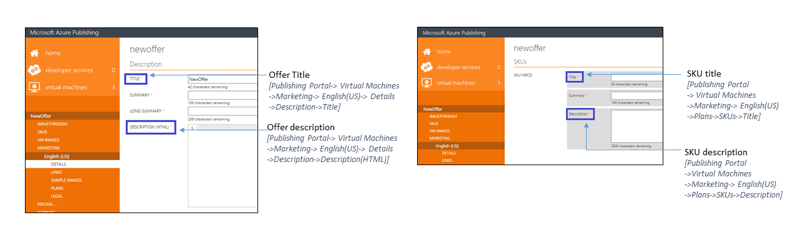

**Azure Marketplace Logo Guidelines**

All the logos uploaded in the Publishing Portal should follow the below guidelines:

- The Azure design has a simple color palette. Keep the number of primary and secondary colors on your logo low.
- The theme colors of the Azure portal are white and black. Hence avoid using these colors as the background color of your logos. Use some color that would make your logos prominent in the Azure portal. We recommend simple primary colors. **If you are using transparent background, then make sure that the logos/text are not white or black.**
- Do not use a gradient background on the logo.
- Avoid placing text, even your company or brand name, on the logo. The look and feel of your logo should be 'flat' and should avoid gradients.
- The logo should not be stretched.
- Small logo should be of size 40 X 40 px
- Medium logo should be of size 90 X 90 px
- Large logo should be of size 115 X 115 px
- Wide logo should be of size 255 X 115 px
- Hero logo should be of size 815 X 290 px

>[AZURE.NOTE] The Hero logo is optional. The publisher can choose not to upload a Hero logo. However once uploaded the hero icon cannot be deleted from the Publishing portal. At that time, the partner must follow the Azure Marketplace guidelines for Hero icons.

  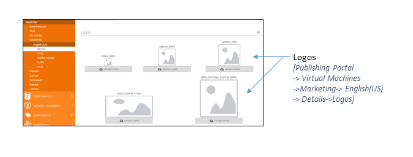

**Additional guidelines for the Hero logo icon (optional)**

- The Hero logo is optional. The publisher can choose not to upload a Hero logo. **However once uploaded the hero icon cannot be deleted from the Publishing portal. At that time, the partner must follow the Azure Marketplace guidelines for Hero icons else the offer will not be approved to production.**
- The Publisher Display Name, plan title and the offer long summary are displayed in white font color. Hence you should avoid keeping any light color in the background of the Hero Icon. Black, white and transparent background is not allowed for Hero icons.
- The publisher display name, plan title, the offer long summary and the create button are embedded programmatically inside the Hero logo once the offer goes listed. So you should not enter any text while you are designing the Hero logo. Just leave empty space on the right because the text (i.e. publisher display name, plan title, the offer long summary) will be included programmatically by us over there. The empty space for the text should be 415x100 on the right (and it is offset by 370px from the left).

  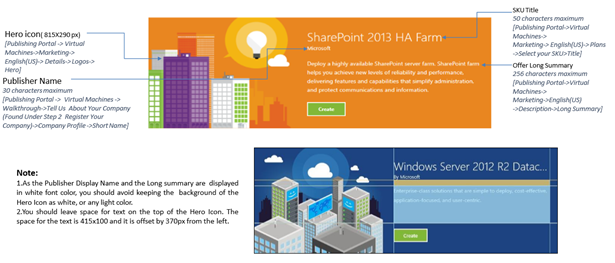

### Links
On the **Links** tab on the left bar, enter any links with information that may help customers. Enter a name and URL for each link.

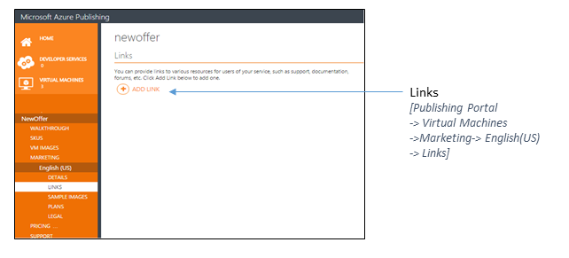

### Sample images (optional)
> [AZURE.NOTE] Including a sample image is an optional step.
> Even though you can upload multiple sample images in the Publishing portal, only one image (randomly selected by the system) gets displayed in the Azure portal. For this reason, we recommend uploading at most one sample image.

On the **Sample Images** tab on the left menu, upload a new image by clicking **Upload a new image**. If you have an existing image and you would like to replace it, click **Replace image**.

### Legal
On the **Legal** tab, provide a link to your policies/terms of use. Enter or paste the terms in the large **Terms of Use** box. The character limit for the legal terms of use is 1,000,000 characters.

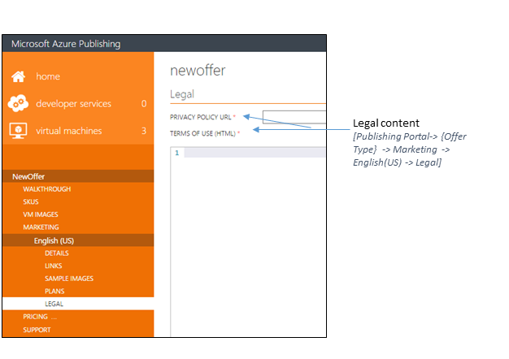

**Note:**
For Virtual Machine offers, once an offer/SKU is staged in the Azure Portal, you cannot change the fields given below:

- **Offer Identifier:** [Publishing portal -> Virtual Machines -> your Offer -> VM Images tab -> Offer Identifier]
- **SKU Identifier:** [Publishing portal -> Virtual Machines -> Select your Offer -> SKUs tab -> Add a SKU]
- **Publisher Namespace:** [Publishing portal -> Virtual Machines -> Walkthrough tab -> Tell Us About Your Company (Found Under “Step 2 Register Your Company”) -> Publisher Namespace ->Namespace]

For Virtual Machine offers, once the offer/SKU is listed in the Azure Marketplace, you cannot change the fields given below:

- **Offer Identifier:** [Publishing portal -> Virtual Machines -> select your Offer -> VM Images -> Offer Identifier]
- **SKU Identifier:** [Publishing portal -> Virtual Machines -> Select your Offer -> SKUs tab -> Add a SKU]
- **Publisher Namespace:** [Publishing portal -> Virtual Machines -> Walkthrough tab -> Tell Us About Your Company (Found Under Step 2 Register) Publisher Namespace ->Namespace]
- **Ports:** [Publishing portal -> Virtual Machines -> your Offer -> VM Images tab -> Open Ports]
- **Pricing Change of listed SKU(s)**
- **Billing Model Change of listed SKU(s)**
- **Removal of billing regions of listed SKU(s)**
- **Changing the data disk count of listed SKU(s)**

## Step 2: Set your prices
### Pricing models
|Pricing model |Description |
|---------------|------------------------------------------|
|Base| Flat monthly rate paid at time of purchase; e.g., $10/month.|
|Consumption (a.k.a. usage, meter) | Pay per use, which is defined by the publisher of the offer. Overage cannot be defined per seat, per user, etc., as there is no concept of a fraction of a user or capability to do proration. Usage is reported by the partner on an hourly basis. Customer pays at the of monthly billing cycle, as opposed to up front like monthly plans. |
|Free trial | Customer may use for free, for a limited time, and then pay normal rates thereafter. |
|Free tier | Plan is always free. |
| Migration (a.k.a. conversion or upgrade/downgrade) of plan | Concept of a user moving from their current plan to another acceptable plan; defined by partner. |

**Pricing models available by offer type**

> [AZURE.IMPORTANT] Availability of certain pricing models vary by offer type. See the table below.

| | Base only | Consumption only | Base + consumption |
|---|---|---|---|
| Virtual machine image | No | Yes | No|
| Developer service | Yes | Yes | Yes |
| Data service | Yes | No | No |

### 2.1. Set your VM prices
> [AZURE.NOTE] BYOL is supported only for virtual machines.

1.	Under the **Pricing** tab, you will see all of the supported markets. Select the appropriate one to bring up the pricing fields.
2.	The provided link in the publishing portal will show pricing information to help you in determining the prices of your SKU(s).
3.	If your SKU is BYOL, select the check box for externally licensed (BYOL) SKU availability.
4.	If your SKU is hourly, enter the pricing for your software. SKUs without pricing will not be available for purchase or use.

  > [AZURE.NOTE] If you have both BYOL and hourly SKUs, then make sure both the requisites are covered: BYOL check box and price values for hourly.

5.	A pricing wizard will open. Proceed through this to complete your pricing, including pricing for other countries, if you choose to allow purchases from outside your specified market.
6.	Some countries are ISV Remit countries. To sell in an ISV Remit country, you must be able to charge and collect tax on your SKUs, and you should calculate and pay tax to the government of the country. Microsoft is not in a position to provide legal or tax guidance.  See the section “Sell-to countries of the offer” in the introduction of this document for more information on sell-to countries.

  > [AZURE.NOTE] For Virtual Machines, you cannot change the following once a SKU goes live as this impacts the billing of existing customers: **Pricing change**, **Billing model change**, and **Removal of billing regions**.

### 2.2. Set your Developer service prices
Plans can be any combination of base + consumption, where base is the monthly price and overage is the pay-per-use price. (See below for more details.)

**Example:**  Contoso developer service offering

| Plan | Price | Includes | Migration path |
|-------|------|-------|-------|
|Free|$0/month|Basic functionality.|Can migrate to any other plan|
|Bronze|$10/month|Basic functionality and a quota of 1,000 of feature X.|Can migrate to Bronze Plus, Silver, and Gold plans|
|Bronze Plus|Free trial period: $0/month + $0/meter01 |Basic functionality and a quota of 10,000 of feature X.  Once feature X quota is used, the customer can pay per use via meter01.|Can migrate to Silver Plus and Gold plans|
|Bronze Plus| Paid period (a.k.a. free trial expired): $10/month + $0.05/meter01|Basic functionality and a quota of 10,000 of feature X.  Once feature X quota is used, the customer can pay per use via meter01.|Can migrate to Silver Plus and Gold plans|
|Silver|$0.15/meter01|The customer can pay per use via meter01, which is for feature X.|Can migrate to Bronze and Gold plans|
|Silver Plus|$20/month + $0.15/meter01 + $0.01/meter02|Basic functionality and a quota of 10,000 of feature X and 100 of feature Y.  Once the feature X quota is used, the customer can pay per use via meter01.  Once the feature Y quota is used, the customer can pay per use via meter02.|Can migrate to Bronze Plus and Gold plans|
|Gold|$1,000/month|Quota of 10,000 of feature X, 1,000 of feature Y, and unlimited of feature Z.|Can migrate to all plans except free|

## Step 3: Provide support information
The contact details are used for internal communications between the partner and Microsoft only. The support URL will be available to the end customers.

1.	Go to the **Support** heading on the left side of the publishing portal.
2.	Enter information under **Engineering Contact**.
3.	Enter information under **Customer Support**. If you provide only email support, enter a dummy phone number, and your provided email will be used instead.
4.	Enter the support URL.

## Step 4: Choose Azure Marketplace categories
The **Categories** tab provides an array of selections. Your offer may fall under these, and you may select up to five categories.

## How your marketing will appear
Below is a detailed view of how the offer marketing information is used on the [Azure Marketplace website](https://azure.microsoft.com/marketplace/) and in the [Azure portal](https://portal.azure.com).

### Azure Marketplace website
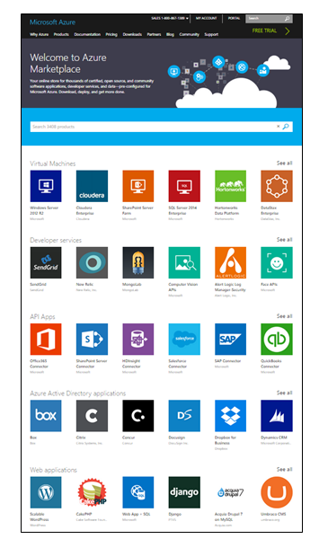

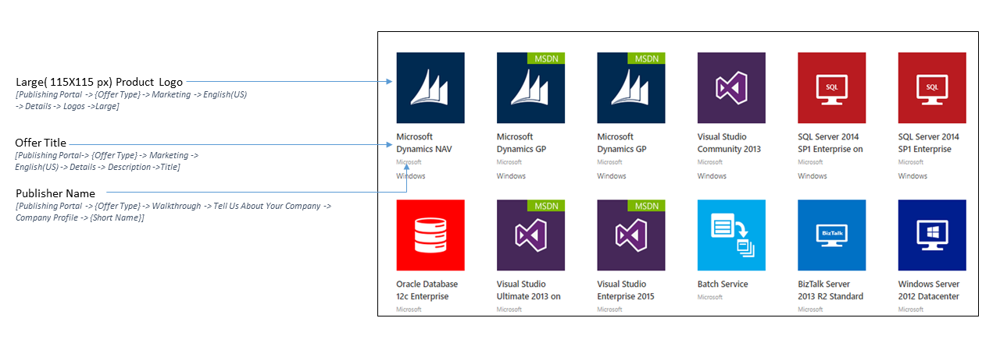

*Listing of offers on the Azure Marketplace website*

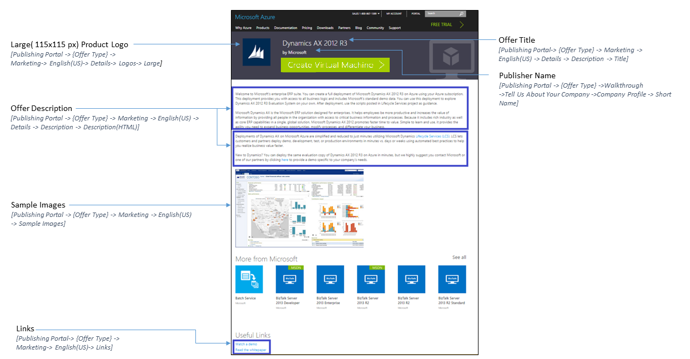

*Offer description details on the Azure Marketplace website*

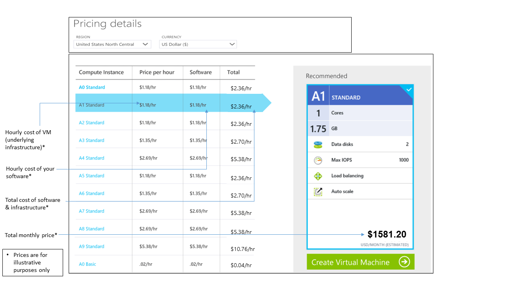

*Offer description pricing details on the Azure Marketplace website*

### Azure Portal
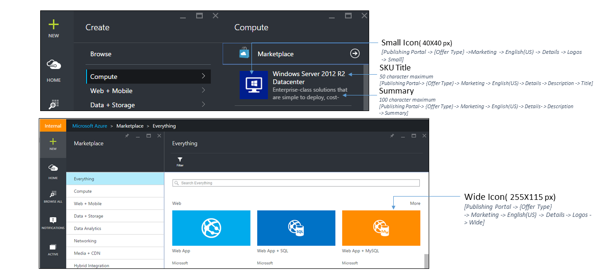

*Listing of offers in the Azure Portal*

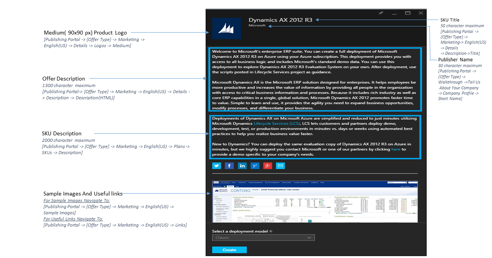

*Offer description details in the Azure portal*

## Next steps
Now that your Marketplace content is loaded, let's move forward with testing your offer in staging. However, you must select the appropriate offer type from the list below, as steps vary by offer type.

- [Test your VM offer in staging](marketplace-publishing-vm-image-test-in-staging.md)
- [Test your Solution template offer in staging](marketplace-publishing-solution-template-test-in-staging.md)

## See also

- [Getting started: How to publish an offer to the Azure Marketplace](marketplace-publishing-getting-started.md)

[img-map-acom]:media/marketplace-publishing-push-to-staging/pubportal-mapping-acom.jpg
[img-map-portal]:media/marketplace-publishing-push-to-staging/pubportal-mapping-azure-portal.jpg
[img-map-link]:media/marketplace-publishing-push-to-staging/marketing-content-guide-links.jpg
[img-map-logo]:media/marketplace-publishing-push-to-staging/marketing-content-guide-logos.jpg
[img-map-title]:media/marketplace-publishing-push-to-staging/marketing-content-guide-publisher-offer.png

[link-pubportal]:https://publish.windowsazure.com
[link-push-to-production]:marketplace-publishing-push-to-production.md
