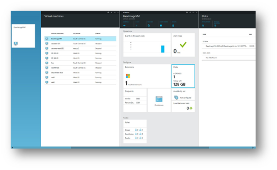
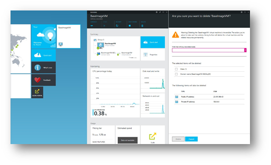
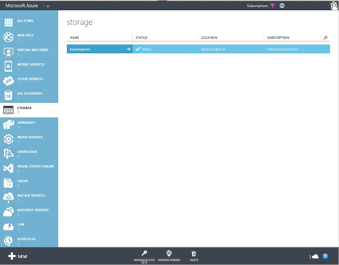
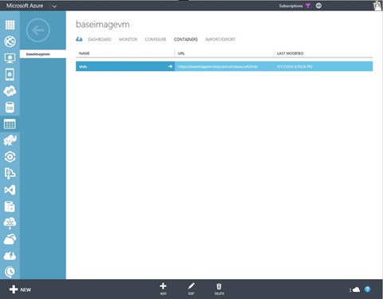
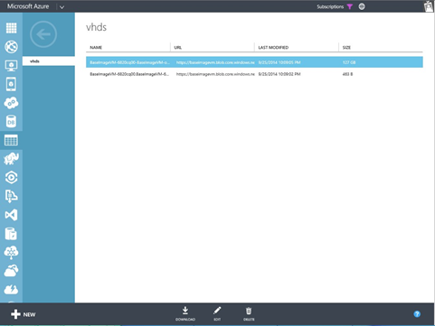
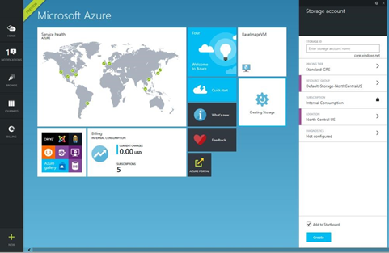
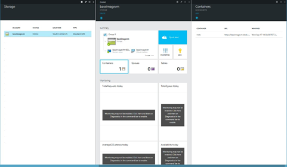

<properties
   pageTitle="Creating an on-premises virtual machine image for the Azure Marketplace | Microsoft Azure"
   description="Understand and execute the steps to create an on-premises VM image and deploy to the Azure Marketplace for others to purchase."
   services="marketplace-publishing"
   documentationCenter=""
   authors="HannibalSII"
   manager=""
   editor=""/>

<tags
  ms.service="marketplace"
  ms.devlang="na"
  ms.topic="article"
  ms.tgt_pltfrm="Azure"
  ms.workload="na"
  ms.date="04/29/2016"
  ms.author="hascipio; v-divte"/>

# Develop an on-premises virtual machine image for the Azure Marketplace
We strongly recommend that you develop Azure virtual hard disks (VHDs) directly in the cloud by using Remote Desktop Protocol. However, if you must, it is possible to download a VHD and develop it by using on-premises infrastructure.  

For on-premises development, you must download the operating system VHD of the created VM. These steps would take place as part of step 3.3, above.  

## Download a VHD image
### Locate a blob URL
In order to download the VHD, first locate the blob URL for the operating system disk.

Locate the blob URL from the new [Microsoft Azure portal](https://portal.azure.com):

1.	Go to **Browse** > **VMs**, and then select the deployed VM.
2.	Under **Configure**, select the **Disks** tile, which opens the Disks blade.

  

3.	Select the **OS Disk**, which opens another blade that displays disk properties, including the VHD location.
4.	Copy this blob URL.

  

5.	Now, delete the deployed VM without deleting the backing disks. You can also stop the VM instead of deleting it. Do not download the operating system VHD when the VM is running.

  

### Download a VHD
After you know the blob URL, you can download the VHD by using the [Azure portal](http://manage.windowsazure.com/) or PowerShell.  
> [AZURE.NOTE] At the time of this guide’s creation, the functionality to download a VHD is not yet present in the new Microsoft Azure portal.  

**Download the operating system VHD via the current [Azure portal](http://manage.windowsazure.com/)**

1.	Sign in to the Azure portal if you have not done so already.
2.	Click the **Storage** tab.
3.	Select the storage account within which the VHD is stored.

  

4.	This displays storage account properties. Select the **Containers** tab.

  

5.	Select the container in which the VHD is stored. By default, when created from the portal, the VHD is stored in a vhds container.

  

6.	Select the correct operating system VHD by comparing the URL to the one you saved.
7.	Click **Download**.

  

### Download a VHD by using PowerShell
In addition to using the Azure portal, you can use the [Save-AzureVhd](http://msdn.microsoft.com/library/dn495297.aspx) cmdlet to download the operating system VHD.

        Save-AzureVhd –Source <storageURIOfVhd> `
        -LocalFilePath <diskLocationOnWorkstation> `
        -StorageKey <keyForStorageAccount>
For example,
        Save-AzureVhd -Source “https://baseimagevm.blob.core.windows.net/vhds/BaseImageVM-6820cq00-BaseImageVM-os-1411003770191.vhd” -LocalFilePath “C:\Users\Administrator\Desktop\baseimagevm.vhd” -StorageKey <String>

> [AZURE.NOTE] **Save-AzureVhd** also has a **NumberOfThreads** option that can be used to increase parallelism to make the best use of available bandwidth for the download.

## Upload VHDs to an Azure storage account
If you prepared your VHDs on-premises, you need to upload them into a storage account in Azure. This step takes place after creating your VHD on-premises but before obtaining certification for your VM image.

### Create a storage account and container
We recommend that VHDs be uploaded into a storage account in a region in the United States. All VHDs for a single SKU should be placed in a single container within a single storage account.

To create a storage account, you can use the [Microsoft Azure portal](https://portal.azure.com/), PowerShell, or the Linux command-line tool.  

**Create a storage account from the Microsoft Azure portal**

1.	Click **New**.
2.	Select **Storage**.
3.	Fill in the storage account name, and then select a location.

  

4.	Click **Create**.
5.	The blade for the created storage account should be open. If not, select **Browse** > **Storage Accounts**. On the Storage account blade, select the storage account created.
6.	Select **Containers**.

   

7.	On the Containers blade, select **Add**, and then enter a container name and the container permissions. Select **Private** for container permissions.

> [AZURE.TIP] We recommend that you create one container per SKU that you are planning to publish.

  

### Create a storage account by using PowerShell
Using PowerShell, create a storage account by using the [New-AzureStorageAccount](http://msdn.microsoft.com/library/dn495115.aspx) cmdlet.

        New-AzureStorageAccount -StorageAccountName “mystorageaccount” -Location “West US”

Then you can create a container within that storage account by using the [NewAzureStorageContainer](http://msdn.microsoft.com/library/dn495291.aspx) cmdlet.

        New-AzureStorageContainer -Name “containername” -Permission “Off”

> [AZURE.NOTE] Those commands assume that the current storage account context has already been set in PowerShell.   Refer to [Setting up Azure PowerShell](marketplace-publishing-powershell-setup.md) for more details on PowerShell setup.
 
### Create a storage account by using the command-line tool for Mac and Linux
From [Linux command-line tool](../virtual-machines/virtual-machines-linux-cli-manage.md), create a storage account as follows.

        azure storage account create mystorageaccount --location "West US"

Create a container as follows.

        azure storage container create containername --account-name mystorageaccount --accountkey <accountKey>

## Upload a VHD
After the storage account and container are created, you can upload your prepared VHDs. You can use PowerShell, the Linux command-line tool, or other Azure Storage management tools.

### Upload a VHD via PowerShell
Use the [Add-AzureVhd](http://msdn.microsoft.com/library/dn495173.aspx) cmdlet.

        Add-AzureVhd –Destination “http://mystorageaccount.blob.core.windows.net/containername/vmsku.vhd” -LocalFilePath “C:\Users\Administrator\Desktop\vmsku.vhd”

### Upload a VHD by using the command-line tool for Mac and Linux
With the [Linux command-line tool](../virtual-machines/command-line-tools/), use the following:
        azure vm image create <image name> --location <Location of the data center> --OS Linux <LocationOfLocalVHD>

## See also
- [Creating a virtual machine image for the Marketplace](marketplace-publishing-vm-image-creation.md)
- [Setting up Azure PowerShell](marketplace-publishing-powershell-setup.md)
