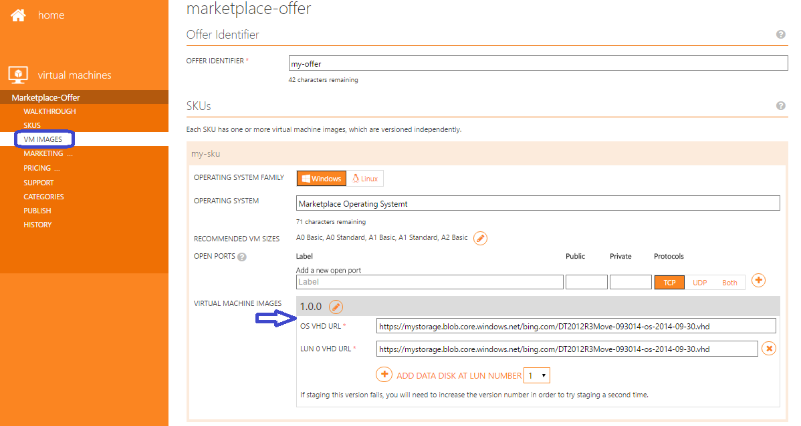
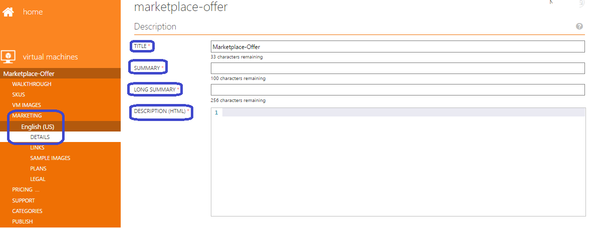
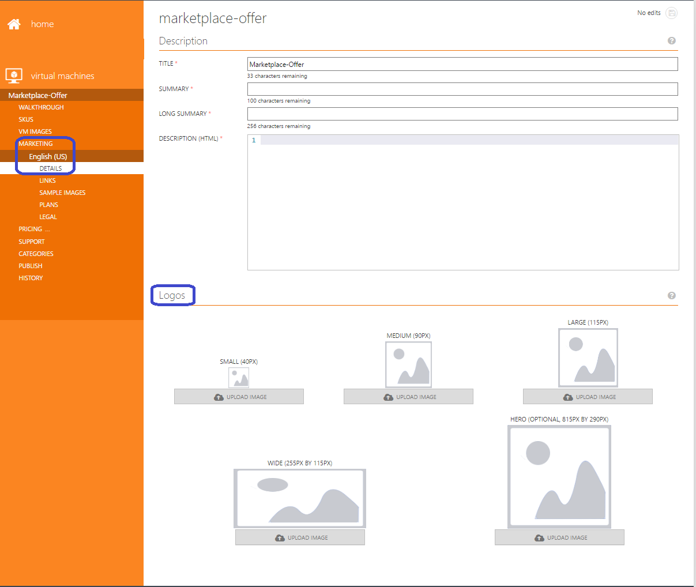
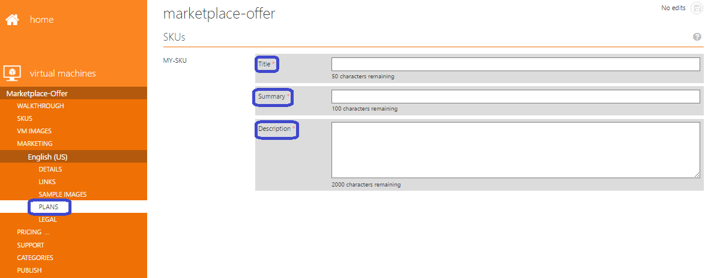
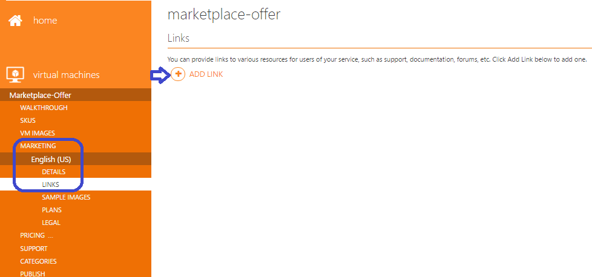
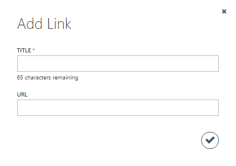
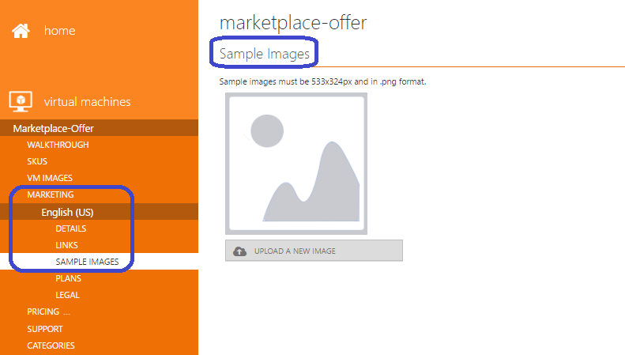
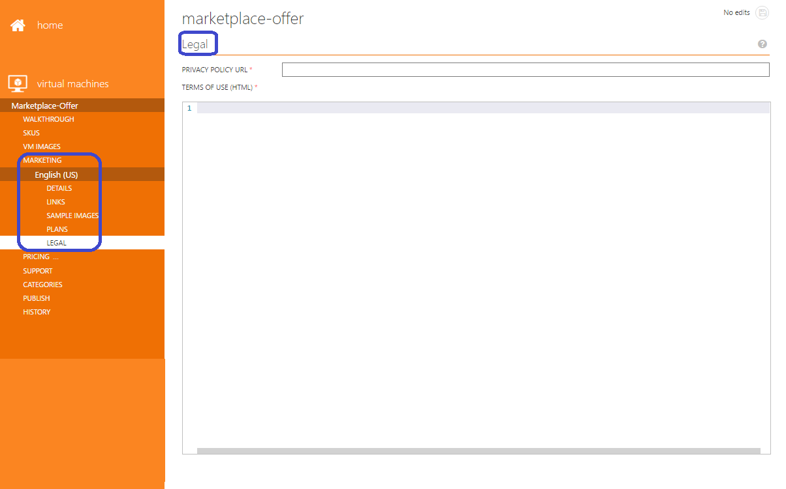
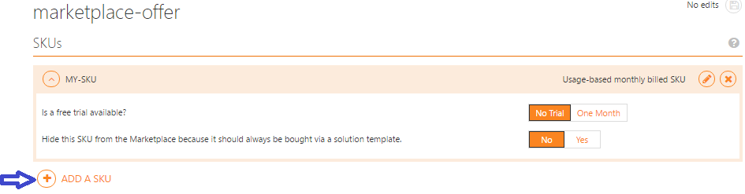
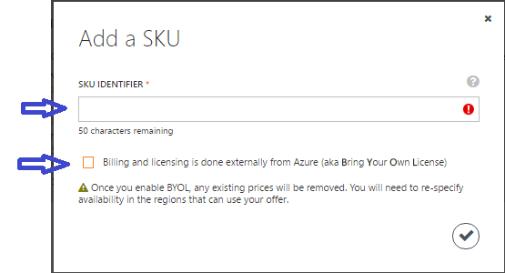

<properties
   pageTitle="Managing your virtual machine image on the Azure Marketplace | Microsoft Azure"
   description="Detailed guide on how to manage your virtual machine image on the Azure Marketplace after initial publication."
   services="Azure Marketplace"
   documentationCenter=""
   authors="HannibalSII"
   manager=""
   editor=""/>

<tags
   ms.service="marketplace"
   ms.devlang="na"
   ms.topic="article"
   ms.tgt_pltfrm="Azure"
   ms.workload="na"
   ms.date="06/01/2016"
   ms.author="hascipio;"/>

# Post-production guide for virtual machine offers in the Azure Marketplace

This article explains how you can update a live Virtual Machine offer in the Azure Marketplace. It also guides you on the process of adding one or more new SKUs to an existing offer and remove a live Virtual Machine offer or SKU from the Azure Marketplace.

**Once the SKU is live in the Azure Marketplace, you cannot update the details given below:**

- **SKU Identifier**
- **Publisher Identifier**
- **Offer Identifier**
- **Pricing change**
- **Billing model change**
- **Removal of billing regions**

## 1. How to update the technical details of a SKU

You can update a VM image and re-publish your offer by following the steps given below:

1. Login to the [Publishing portal](https://publish.windowsazure.com).
2. Navigate to the **VIRTUAL MACHINES** tab and select your offer.
3. From the left hand side menu, click on the **VM IMAGES** tab.
4. From the **SKUs** section of the VM IMAGES tab, locate the SKU that you want to update. After that update the version number of the SKU. The new version should be of X.Y.Z format where X, Y, Z are integers. Version changes should only be incremental.
5. In the **OS VHD URL** box, update the shared access signature URI created for the operating system VHD and save the changes.
6. After making the changes, navigate to the **PUBLISH** tab and click on the button **PUSH TO STAGING**. For detailed guidance on testing your offer in the staging environment please refer to this [link](marketplace-publishing-vm-image-test-in-staging.md)
7. Once you have tested your offer in staging, navigate to the **PUBLISH** tab in the Publishing portal and click on the button **REQUEST APPROVAL TO PUSH TO PRODUCTION** to re-publish your offer in the Azure Marketplace.

    

## 2. How to update the non-technical details of an offer or a SKU

You can update the non-technical (marketing, legal, support, categories) details of your live offer or SKU in the Azure Marketplace.

### 2.1 Update the offer description and logos

You can update the offer details and re-publish your offer by following the steps below:

1. Login to the [Publishing portal](https://publish.windowsazure.com).
2. Navigate to the **VIRTUAL MACHINES** tab and select your offer.
3. From the left hand side menu, click on the **MARKETING** tab.
4. Click on the **ENGLISH (US)** button.
5. From the left hand side menu, click on the **DETAILS** tab. Under the *DESCRIPTION* section of the **DETAILS** tab you can update the offer title, offer summary, offer long summary and save the changes.

    >[AZURE.NOTE] Please take care of the following while you are updating the SKU details.
    **Do not enter duplicate text under the offer description and the SKU description. Do not enter duplicate text under the SKU title and the offer long summary. Do not enter duplicate text under the SKU title and the offer summary.**

    

6. Under the *LOGOS* section of the **DETAILS** tab, you can update the logos. However, ensure that the logos follow the [Azure Marketplace guidelines](marketplace-publishing-push-to-staging.md#step-1-provide-marketplace-marketing-content) (refer to the section Step 1: Provide Marketplace marketing content -> Details-> Azure Marketplace Logo Guidelines).

    >[AZURE.NOTE] Hero icon is optional. You can choose not to upload a Hero icon. However, once Hero icon is uploaded, then there is no provision to delete it from the Publishing portal. In that case, you must follow the [Hero icon guidelines](marketplace-publishing-push-to-staging.md#step-1-provide-marketplace-marketing-content) (refer to the section Step 1: Provide Marketplace marketing content -> Details-> Additional guidelines for the Hero logo banner).

7. After making the changes, navigate to the **PUBLISH** tab and click on the button **PUSH TO STAGING**. For detailed guidance on testing your offer in the staging environment please refer to this [link](marketplace-publishing-vm-image-test-in-staging.md).
8. Once you have tested your offer in staging, navigate to the **PUBLISH** tab in the Publishing portal and click on the button **REQUEST APPROVAL TO PUSH TO PRODUCTION** to re-publish your offer in the Azure Marketplace.

    

### 2.2. Update the SKU description

You can update the SKU details and re-publish your offer by following the steps below:

1. Login to the [Publishing portal](https://publish.windowsazure.com)
2. Navigate to the **VIRTUAL MACHINES** tab and select your offer.
3. From the left hand side menu, click on the **MARKETING** tab.
4. Click on the **ENGLISH (US)** button.
5. From the left hand side menu, click on the **PLANS** tab. Under the *SKUs* section of the **PLANS** tab you can update the SKU title, SKU summary and SKU description details and save the changes.

    >[AZURE.NOTE] Please take care of the following while you are updating the SKU details. **Do not enter duplicate text under the offer description and the SKU description. Do not enter duplicate text under the SKU's title and the offer long summary. Do not enter duplicate text under the SKU Title and the offer summary.**

6. After making the changes, navigate to the **PUBLISH** tab and click on the button **PUSH TO STAGING**. For detailed guidance on testing your offer in the staging environment please refer to this link
7. Once you have tested your offer in staging, navigate to the **PUBLISH** tab in the Publishing portal and click on the button **REQUEST APPROVAL TO PUSH TO PRODUCTION** to re-publish your offer in the Azure Marketplace.

    

### 2.3 Change the existing links or add new links

You can change the existing links or add new links and then re-publish your offer by following the steps below:

1. Login to the [Publishing portal](https://publish.windowsazure.com)
2. Navigate to the **VIRTUAL MACHINES** tab and select your offer.
3. From the left hand side menu, click on the **MARKETING** tab.
4. Click on the **ENGLISH (US)** button.
5. From the left hand side menu, click on the **LINKS** tab.
6. If you want to add a new link, then under the *Links* section click on the **ADD LINK** button. The *“Add Link”* dialog box will open. In this dialog box, you can add the link Title and URL fields and save the changes. You can enter any link which contains information that may help the customers.
7. If you want to update or delete an existing link, then select the appropriate link and click on the edit button or the delete button accordingly.

    >[AZURE.NOTE] Please make sure that the links which you have entered in this section are working properly, as these links get validated during your production request process.

8. After making the changes, navigate to the **PUBLISH** tab and click on the button **PUSH TO STAGING**. For detailed guidance on testing your offer in the staging environment please refer to this [link](marketplace-publishing-vm-image-test-in-staging.md).
9. Once you have tested your offer in staging, navigate to the **PUBLISH** tab in the Publishing portal and click on the button **REQUEST APPROVAL TO PUSH TO PRODUCTION** to re-publish your offer in the Azure Marketplace.

    

    

### 2.4 Change an existing sample image or add a new sample image

You can change an existing sample images or add new sample images and then re-publish your offer by following the steps below:

>[AZURE.NOTE] Only one sample image is displayed in the [https://portal.azure.com](https://portal.azure.com).

1. Login to the [Publishing portal](https://publish.windowsazure.com)
2. Navigate to the **VIRTUAL MACHINES** tab and select your offer.
3. From the left hand side menu, click on the **MARKETING** tab.
4. Click on the **ENGLISH (US)** button.
5. From the left hand side menu, click on the **SAMPLE IMAGES** tab.
6. If you want to add a new sample image, then under the *Sample Images* section click on the **UPLOAD A NEW IMAGE** button and then save the changes.

    >[AZURE.NOTE] Including a sample image is an optional step.

7. If you want to update or delete an existing sample image, then locate the appropriate sample image and then click on the **REPLACE IMAGE** button or the delete button accordingly.

8. After making the changes, navigate to the **PUBLISH** tab and click on the button **PUSH TO STAGING**. For detailed guidance on testing your offer in the staging environment please refer to this [link](marketplace-publishing-vm-image-test-in-staging.md).
9. Once you have tested your offer in staging, navigate to the **PUBLISH** tab in the Publishing portal and click on the button **REQUEST APPROVAL TO PUSH TO PRODUCTION** to re-publish your offer in the Azure Marketplace.

    

### 2.5 Update the legal content

You can update the legal content and re-publish your offer by following the steps below:

1. Login to the [Publishing portal](https://publish.windowsazure.com)
2. Navigate to the **VIRTUAL MACHINES** tab and select your offer.
3. From the left hand side menu, click on the **MARKETING** tab.
4. Click on the **ENGLISH (US)** button.
5. From the left hand side menu, click on the **LEGAL** tab. Under the *Legal* section you can update your policies/terms of use. Enter or paste the policies/terms in the *Terms of Use* textbox and save the changes.
6. The character limit for the legal terms of use is 1,000,000 characters.
7. After making the changes, navigate to the **PUBLISH** tab and click on the button **PUSH TO STAGING**. For detailed guidance on testing your offer in the staging environment please refer to this [link](marketplace-publishing-vm-image-test-in-staging.md)
8. Once you have tested your offer in staging, navigate to the **PUBLISH** tab in the Publishing portal and click on the button **REQUEST APPROVAL TO PUSH TO PRODUCTION** to re-publish your offer in the Azure Marketplace.

    

### 2.6 Update the support information

You can update the support information and re-publish your offer by following the steps below:

1. Login to the [Publishing portal](https://publish.windowsazure.com)
2. Navigate to the **VIRTUAL MACHINES** tab and select your offer.
3. From the left hand side menu, click on the **SUPPORT** tab.
4. Under the *Engineering Contact* section of the **SUPPORT** tab you can update the contact details. These details are used for internal communication between the partner and Microsoft only.
5. Under the *Customer Support* section of the **SUPPORT** tab you can update the Support contact details like **Name, Email, Phone** and **Support URL**. These details are used for internal communication between the partner and Microsoft only.

    >[AZURE.NOTE] If you want to provide only email support, provide a dummy phone number under the **Customer Support** section. In this case, your provided email will be used instead.

6. After making the changes, navigate to the **PUBLISH** tab and click on the button **PUSH TO STAGING**. For detailed guidance on testing your offer in the staging environment please refer to this [link](marketplace-publishing-vm-image-test-in-staging.md)
7. Once you have tested your offer in staging, navigate to the **PUBLISH** tab in the Publishing portal and click on the button **REQUEST APPROVAL TO PUSH TO PRODUCTION** to re-publish your offer in the Azure Marketplace.

    

### 2.7 Update the categories

You can update the categories section for your offer and re-publish your offer by following the steps below:

1. Login to the [Publishing portal](https://publish.windowsazure.com)
2. Navigate to the **VIRTUAL MACHINES** tab and select your offer.
3. From the left hand side menu, click the **CATEGORIES** tab.
4. Under the *Categories* section you can update the categories for your offer and save the changes. You can select up to five categories for the Azure Marketplace gallery.
5. After making the changes, navigate to the **PUBLISH** tab and click on the button **PUSH TO STAGING**. For detailed guidance on testing your offer in the staging environment please refer to this [link](marketplace-publishing-vm-image-test-in-staging.md)
6. Once you have tested your offer in staging, navigate to the **PUBLISH** tab in the Publishing portal and click on the button **REQUEST APPROVAL TO PUSH TO PRODUCTION** to re-publish your offer in the Azure Marketplace.

    

## 3. How to add a new SKU under a live offer

You can add a new SKU under your live offer by following the steps given below:

1. Login to the [Publishing portal](https://publish.windowsazure.com).
2. Navigate to the **VIRTUAL MACHINES** tab and select your offer.
3. From the left hand side menu, click on the **SKUs** tab. After that click on the button **ADD A SKU**.  A new dialog box will open. Enter a SKU identifier in lower case. Check the checkbox for bring-your-own billing model(BYOL) if you want to publish the new SKU with BYOL billing model. Otherwise, uncheck the check box for BYOL. After that click on the tick mark in the dialog box to create a new SKU. If you did not opt for the BYOL billing model for the new SKU, then the billing model will be automatically set to Hourly for the new SKU. If you want to enable the 30days free trial for Hourly billing model, then click on the “One Month” option for “Is a free trial available?”. Otherwise select “NO TRIAL”. [Note: The option “Is a free trial available?” is only shown if you have NOT selected BYOL in the dialog box while creating the new SKU.]

    >[AZURE.IMPORTANT] The option “Hide this SKU from the Marketplace because it should always be bought via a solution template” should be marked as “YES” ONLY if you are approved for publishing a solution template offer in the Azure Marketplace. Otherwise, this option should always be marked as “NO”.

4. Now from the left hand side menu, click on the **VM IMAGES** tab and find out the new SKU which you have created.
5. To set up the new SKU, refer to the STEP 5 of this [link](marketplace-publishing-vm-image-creation.md#5-obtain-certification-for-your-vm-image) for guidance.
6. To add the marketing material for the new SKU, refer to the section Step 1: Provide Marketplace marketing content -> Details-> point numbers 2 to 5 of this [link](marketplace-publishing-push-to-staging.md#step-1-provide-marketplace-marketing-content).
7. To add the pricing information for the new SKU, refer to the section 2.1. Set your VM prices of this [link](marketplace-publishing-push-to-staging.md#step-2-set-your-prices)
8. After making the changes, navigate to the **PUBLISH** tab and click on the button **PUSH TO STAGING**. For detailed guidance on testing your offer in the staging environment please refer to this [link](marketplace-publishing-vm-image-test-in-staging.md)
9. Once you have tested your offer in staging, navigate to the **PUBLISH** tab in the Publishing portal and click on the button **REQUEST APPROVAL TO PUSH TO PRODUCTION** to re-publish your offer in the Azure Marketplace.

    

    

## 4.	How to delete a live offer or SKU from the Azure Marketplace

There are various aspects that need to be taken care of in case of a request to remove a live offer. Please follow the steps below to get guidance from the support team to remove a live offer/SKU from the Azure Marketplace:

1.	Raise a support ticket using this [link](https://support.microsoft.com/en-us/getsupport?wf=0&tenant=ClassicCommercial&oaspworkflow=start_1.0.0.0&locale=en-us&supportregion=en-us&pesid=15635&ccsid=635993707583706681)
2.	Select Problem type as **“Managing offers”** and select Category as **“Modifying an offer and/or SKU already in production”**
3.	Submit the request

The support team will guide you through the offer/SKU deletion process.

>[AZURE.NOTE] You can always delete the offer while it is in a Draft status (i.e., not in STAGING or PRODUCTION) by clicking on the **DISCARD DRAFT** button under the **HISTORY** tab.

## See Also
- [Getting Started: How to publish an offer to the Azure Marketplace](marketplace-publishing-getting-started.md)
- [Understanding seller insights reporting](marketplace-publishing-report-seller-insights.md)
- [Understanding payout reporting](marketplace-publishing-report-payout.md)
- [How to change your Cloud Solution Provider reseller incentive](marketplace-publishing-csp-incentive.md)
- [Troubleshooting common publishing problems in the Marketplace](marketplace-publishing-support-common-issues.md)
- [Get support as a publisher](marketplace-publishing-get-publisher-support.md)
- [Creating a VM image on-premises](marketplace-publishing-vm-image-creation-on-premise.md)
- [Create a virtual machine running Windows in the Azure preview portal](../virtual-machines/virtual-machines-windows-hero-tutorial.md)
