# Post-production guide for virtual machine offers in the Azure Marketplace
This article explains how you can update a live virtual machine offer in the Azure Marketplace. It guides you through the process of adding one or more new SKUs to an existing offer. It also guides you through the process of removing a live virtual machine offer or SKU from the Marketplace.

After an offer/SKU is staged in the [Azure portal](http://portal.azure.com), you can't change the following text boxes:

* **Offer Identifier**: In the Publishing portal, go to **virtual machines** and select your offer. Then click **VM IMAGES** > **Offer Identifier**.
* **SKU Identifier**: In the Publishing portal, go to **virtual machines** and select your offer. Then click **SKUS** > **Add a SKU**.
* **Publisher Namespace**: In the Publishing portal, go to **virtual machines** > **Walkthrough** > **Tell Us About Your Company** (found under “Step 2 Register Your Company”) > **Publisher Namespace** > **Namespace**.

After the offer/SKU is listed in the [Marketplace](http://azure.microsoft.com/marketplace), you can't change the following text boxes:

* **Offer Identifier**: In the Publishing portal, go to **virtual machines** and select your offer. Then click **VM IMAGES** > **Offer Identifier**.
* **SKU Identifier**: In the Publishing portal, go to **virtual machines** and select your offer. Then click **SKUS** > **Add a SKU**.
* **Publisher Namespace**: In the Publishing portal, go to **virtual machines** > **Walkthrough** > **Tell Us About Your Company** (found under "Step 2 Register") **Publisher Namespace** > **Namespace**.
* **Ports**: In the Publishing portal, go to **virtual machines** and select your offer. Then click **VM IMAGES** > **Open Ports**.
* **Pricing change of listed SKU(s)**
* **Billing model change of listed SKU(s)**
* **Removal of billing regions of listed SKU(s)**
* **Changing the data disk count of listed SKU(s)**

## Update the technical details of a SKU
To add a new version to the listed SKU and republish your offer, follow these steps:

1. Sign in to the [Publishing portal](https://publish.windowsazure.com).
2. Go to the **virtual machines** tab, and select your offer.
3. In the menu on the left, click the **VM IMAGES** tab.
4. In the **SKUs** section, locate the SKU that you want to update.
5. Add a new version number for the SKU, and click the **+** button. The new version should be in an X.Y.Z format, where X, Y, and Z are integers. Version changes should only be incremental.
6. In the **OS VHD URL** box, enter the shared access signature URI created for the operating system VHD and save the changes.

   > [!IMPORTANT]
   > You can't increment/decrement the data disk count of a listed SKU. You need to create a new SKU in this case. For detailed guidance, refer to the section [Add a new SKU under a listed offer](#add-a-new-sku-under-a-listed-offer).
   >
   >
7. Go to the **PUBLISH** tab, and click **PUSH TO STAGING**. For detailed guidance on testing your offer in the staging environment, see [Test your VM offer for the Marketplace](marketplace-publishing-vm-image-test-in-staging.md).
8. After you've tested your offer in staging, go to the **PUBLISH** tab in the Publishing portal. Click **REQUEST APPROVAL TO PUSH TO PRODUCTION** to republish your offer in the Marketplace.

    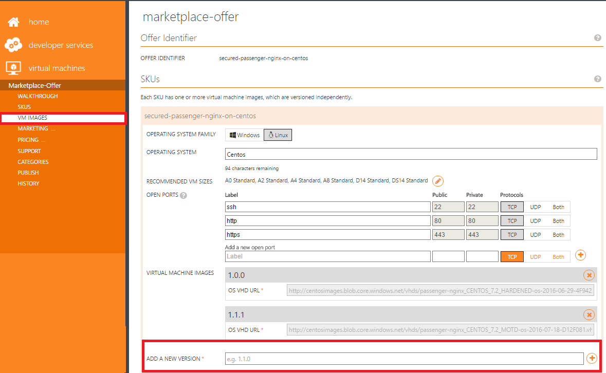

## Update the nontechnical details of an offer or a SKU
You can update the nontechnical (marketing, legal, support, categories) details of your live offer or SKU in the Marketplace.

### Update the offer description and logos
To update the offer details and republish your offer, follow these steps:

1. Sign in to the [Publishing portal](https://publish.windowsazure.com).
2. Go to the **virtual machines** tab, and select your offer.
3. In the menu on the left, click the **MARKETING** tab.
4. Click **English (US)**.
5. Click the **DETAILS** tab. In the **Description** section, update the offer **TITLE**, **SUMMARY**, and **LONG SUMMARY** and save the changes.

   > [!NOTE]
   > When you update the SKU details, be aware of these restrictions: 
   * Do not enter duplicate text for the offer description and the SKU description.
   * Do not enter duplicate text for the SKU title and the offer long summary. 
   * Do not enter duplicate text for the SKU title and the offer summary.
   >
   >

    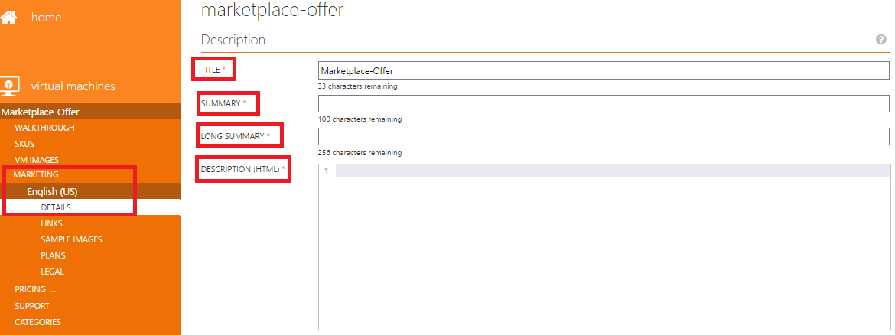
6. In the **LOGOS** section of the **DETAILS** tab, update the logos. Ensure that the logos follow the [Azure Marketplace guidelines](marketplace-publishing-push-to-staging.md#step-1-provide-marketplace-marketing-content).

   > [!NOTE]
   > A hero icon is optional. You can choose not to upload a hero icon. However, after a hero icon is uploaded, there is no provision to delete it from the Publishing portal. Follow the [hero icon guidelines](marketplace-publishing-push-to-staging.md#step-1-provide-marketplace-marketing-content).
   >
   >
7. Go to the **PUBLISH** tab, and click **PUSH TO STAGING**. For detailed guidance on testing your offer in the staging environment, see [Test your VM offer for the Marketplace](marketplace-publishing-vm-image-test-in-staging.md).
8. After you've tested your offer in staging, go to the **PUBLISH** tab in the Publishing portal. Click **REQUEST APPROVAL TO PUSH TO PRODUCTION** to republish your offer in the Marketplace.

    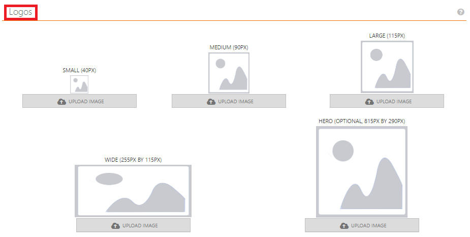

### Update the SKU description
To update the SKU details and republish your offer, follow these steps:

1. Sign in to the [Publishing portal](https://publish.windowsazure.com).
2. Go to the **virtual machines** tab, and select your offer.
3. In the menu on the left, click the **MARKETING** tab.
4. Click **English (US)**.
5. Click the **PLANS** tab. In the **SKUs** section, update the SKU **TITLE**, **SUMMARY**, and **DESCRIPTION** and save the changes.

   > [!NOTE]
   > When you update the SKU details, be aware of these restrictions: 
   * Do not enter duplicate text for the offer description and the SKU description. 
   * Do not enter duplicate text for the SKU title and the offer long summary. 
   * Do not enter duplicate text for the SKU title and the offer summary.
   >
   >
6. Go to the **PUBLISH** tab, and click **PUSH TO STAGING**. For detailed guidance on testing your offer in the staging environment, see [Test your VM offer for the Marketplace](marketplace-publishing-vm-image-test-in-staging.md).
7. After you've tested your offer in staging, go to the **PUBLISH** tab in the Publishing portal. Click **REQUEST APPROVAL TO PUSH TO PRODUCTION** to republish your offer in the Marketplace.

    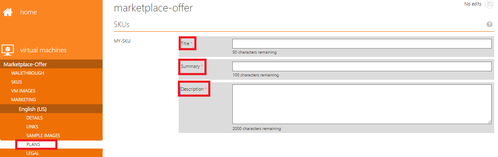

### Change existing links or add new links
To change existing links or add new links and then republish your offer, follow these steps:

1. Sign in to the [Publishing portal](https://publish.windowsazure.com).
2. Go to the **virtual machines** tab, and select your offer.
3. In the menu on the left, click the **MARKETING** tab.
4. Click **English (US)**.
5. Click the **LINKS** tab.
6. To add a new link, in the **Links** section, click **+ ADD LINK**. In the **Add Link** dialog box, enter the link **TITLE** and **URL** and save the changes. You can enter any link that contains information that might help customers.
7. To update or delete an existing link, select the link and click the **Edit** button or the **Delete** button.

   > [!NOTE]
   > Ensure that the links that you've entered in this section are working properly, because these links get validated during your production request process.
   >
   >
8. Go to the **PUBLISH** tab, and click **PUSH TO STAGING**. For detailed guidance on testing your offer in the staging environment, see [Test your VM offer for the Marketplace](marketplace-publishing-vm-image-test-in-staging.md).
9. After you've tested your offer in staging, go to the **PUBLISH** tab in the Publishing portal. Click **REQUEST APPROVAL TO PUSH TO PRODUCTION** to republish your offer in the Marketplace.

    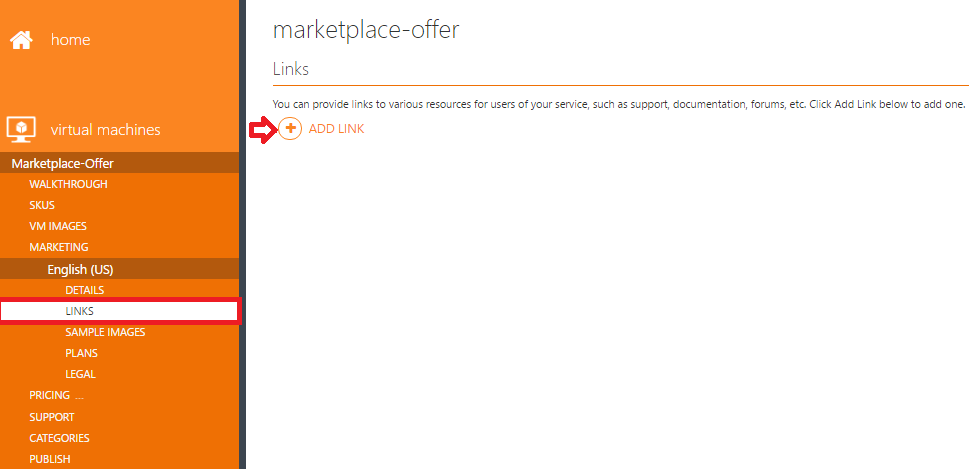

    

### Change an existing sample image or add a new sample image
To change an existing sample image or add new sample images and then republish your offer, follow these steps:

> [!NOTE]
> Only one sample image is displayed in the [Azure portal](https://portal.azure.com).
>
>

1. Sign in to the [Publishing portal](https://publish.windowsazure.com).
2. Go to the **virtual machines** tab, and select your offer.
3. In the menu on the left, click the **MARKETING** tab.
4. Click **English (US)**.
5. Click the **SAMPLE IMAGES** tab.
6. To add a new sample image, in the **Sample Images** section, click **UPLOAD A NEW IMAGE** and save the changes.

   > [!NOTE]
   > Including a sample image is optional.
   >
7. Go to the **PUBLISH** tab, and click **PUSH TO STAGING**. For detailed guidance on testing your offer in the staging environment, see [Test your VM offer for the Marketplace](marketplace-publishing-vm-image-test-in-staging.md).
8. After you've tested your offer in staging, go to the **PUBLISH** tab in the Publishing portal. Click **REQUEST APPROVAL TO PUSH TO PRODUCTION** to republish your offer in the Marketplace.

    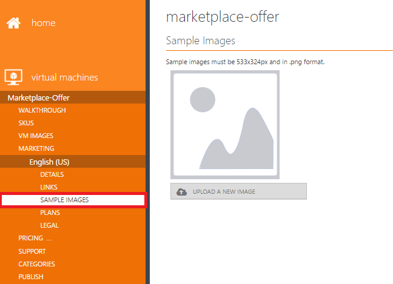

### Update the legal content
To update the legal content and republish your offer, follow these steps:

1. Sign in to the [Publishing portal](https://publish.windowsazure.com).
2. Go to the **virtual machines** tab, and select your offer.
3. In the menu on the left, click the **MARKETING** tab.
4. Click **English (US)**.
5. Click the **LEGAL** tab. In the **Legal** section, update your policies/terms of use. Enter or paste the policies/terms in the **TERMS OF USE** box and save the changes.
6. The character limit for the legal terms of use is 1 million characters.
7. Go to the **PUBLISH** tab, and click **PUSH TO STAGING**. For detailed guidance on testing your offer in the staging environment, see [Test your VM offer for the Marketplace](marketplace-publishing-vm-image-test-in-staging.md).
8. After you've tested your offer in staging, go to the **PUBLISH** tab in the Publishing portal. Click **REQUEST APPROVAL TO PUSH TO PRODUCTION** to republish your offer in the Marketplace.

    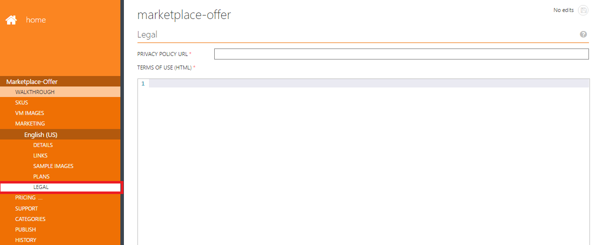

### Update the support information
To update the support information and republish your offer, follow these steps:

1. Sign in to the [Publishing portal](https://publish.windowsazure.com).
2. Go to the **virtual machines** tab, and select your offer.
3. In the menu on the left, click the **SUPPORT** tab.
4. In the **Engineering Contact** section, update the engineering contact details. These details are used for internal communication between the partner and Microsoft only.
5. In the **Customer Support** section, update the support contact details and the **SUPPORT URL**. These details are used for internal communication between the partner and Microsoft only.

   > [!NOTE]
   > If you want to provide only email support, enter a dummy phone number in the **Customer Support** section. In this case, the email you provided is used instead.
   >
   >
6. Go to the **PUBLISH** tab, and click **PUSH TO STAGING**. For detailed guidance on testing your offer in the staging environment, see [Test your VM offer for the Marketplace](marketplace-publishing-vm-image-test-in-staging.md).
7. After you've tested your offer in staging, go to the **PUBLISH** tab in the Publishing portal. Click **REQUEST APPROVAL TO PUSH TO PRODUCTION** to republish your offer in the Marketplace.

    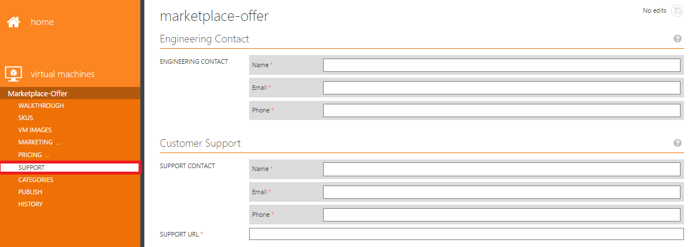

### Update the categories
To update the categories section for your offer and republish your offer, follow these steps:

1. Sign in to the [Publishing portal](https://publish.windowsazure.com).
2. Go to the **virtual machines** tab, and select your offer.
3. In the menu on the left, click the **CATEGORIES** tab.
4. In the **Categories** section, update the categories for your offer and save the changes. You can choose up to five categories for the Azure Marketplace gallery.
5. Go to the **PUBLISH** tab, and click **PUSH TO STAGING**. For detailed guidance on testing your offer in the staging environment, see [Test your VM offer for the Marketplace](marketplace-publishing-vm-image-test-in-staging.md).
6. After you've tested your offer in staging, go to the **PUBLISH** tab in the Publishing portal. Click **REQUEST APPROVAL TO PUSH TO PRODUCTION** to republish your offer in the Marketplace.

    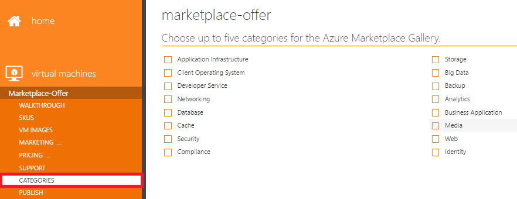

## Add a new SKU under a listed offer
To add a new SKU in your live offer, follow these steps:

1. Sign in to the [Publishing portal](https://publish.windowsazure.com).
2. Go to the **virtual machines** tab, and select your offer.
3. In the menu on the left, click the **SKUS** tab. Then click **Add a SKU**. 
4. In the dialog box, enter a **SKU Identifier** in lowercase. Select the **Bring your own license (BYOL) billing model** check box if you want to publish the new SKU with a BYOL billing model. Otherwise, clear the check box. Click the tick mark to create a new SKU. If you didn't choose the BYOL billing model, the billing model is automatically set to hourly. If you want the 30-day free trial for the hourly billing model, select **One Month** for **Is a free trial available?** Otherwise, select **No Trial**. (**Is a free trial available?** appears only if you haven't selected BYOL while creating the new SKU.)

   > [!IMPORTANT]
   > **Hide this SKU from the Marketplace because it should always be bought via a solution template** should be **Yes** *only* if you're approved for publishing a solution template. Otherwise, this option should always be **No**.
   >
   >
4. In the menu on the left, click the **VM IMAGES** tab and find out the new SKU that you've created.
5. To set up the new SKU, see [Obtain certification for your VM image](marketplace-publishing-vm-image-creation.md#5-obtain-certification-for-your-vm-image) for guidance.
6. To add marketing material for the new SKU, see [Provide Marketplace marketing content](marketplace-publishing-push-to-staging.md#step-1-provide-marketplace-marketing-content).
7. To add pricing information for the new SKU, see [Set your prices](marketplace-publishing-push-to-staging.md#step-2-set-your-prices).
8. Go to the **PUBLISH** tab, and click **PUSH TO STAGING**. For detailed guidance on testing your offer in the staging environment, see [Test your VM offer for the Marketplace](marketplace-publishing-vm-image-test-in-staging.md).
9. After you've tested your offer in staging, go to the **PUBLISH** tab in the Publishing portal. Click **REQUEST APPROVAL TO PUSH TO PRODUCTION** to republish your offer in the Marketplace.

    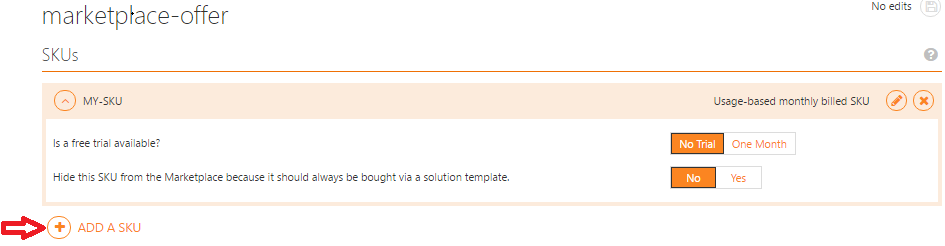

    

## Change the data disk count for a listed SKU
You can't increment/decrement the data disk count of a listed SKU. You need to create a new SKU in this case. For detailed guidance, refer to the section [Add a new SKU under a listed offer](#add-a-new-sku-under-a-listed-offer).

## Delete a listed offer from the Marketplace
Various aspects need to be taken care of in the case of a request to remove a live offer. To get guidance from the support team to remove a listed offer from the Marketplace, follow these steps:

1. Raise a support ticket on the [Create an incident](https://support.microsoft.com/en-us/getsupport?wf=0&tenant=ClassicCommercial&oaspworkflow=start_1.0.0.0&locale=en-us&supportregion=en-us&pesid=15635&ccsid=635993707583706681) page.

2. Select **Problem type** as **Managing offers**, and select **Category** as **Modifying an offer and/or SKU already in production**.
3. Submit the request.

The support team guides you through the offer/SKU deletion process.

> [!NOTE]
> You can always delete the offer while it is in Draft status (but not Staging or Production). On the **HISTORY** tab, click **DISCARD DRAFT**.
>
>

## Delete a listed SKU from the Marketplace
To delete a listed SKU from the Marketplace, follow these steps:

1. Sign in to the [Publishing portal](https://publish.windowsazure.com).

2. Go to the **virtual machines** tab, and select your offer.
3. In the pane on the left, click the **SKUS** tab.
4. Select the SKU that you want to delete, and click the **Delete** button.
5. Go to the **PUBLISH** tab in the Publishing portal. Click **REQUEST APPROVAL TO PUSH TO PRODUCTION** to republish the offer in the Marketplace.
6. After the offer is republished in the Marketplace, the SKU is deleted from the Marketplace and the Azure portal.

## Delete the current version of a listed SKU from the Marketplace
To delete the current version of a listed SKU from the Marketplace, follow these steps: 

1. Sign in to the [Publishing portal](https://publish.windowsazure.com).

2. Go to the **virtual machines** tab, and select your offer.
3. In the menu on the left, click the **VM IMAGES** tab.
4. Select the SKU whose current version you want to delete, and click the **Delete** button.
5. Go to the **PUBLISH** tab in the Publishing portal. Click **REQUEST APPROVAL TO PUSH TO PRODUCTION** to republish the offer in the Marketplace.
6. After the offer gets republished in the Marketplace, the current version of the listed SKU is deleted from the Marketplace and the Azure portal. The SKU is then rolled back to its previous version.

## Revert the listing price to production values
To revert the listing price to production values, follow these steps:

1. Sign in to the [Publishing portal](https://publish.windowsazure.com).
2. Go to the **virtual machines** tab, and select your offer.
3. In the menu on the left, click the **PRICING** tab.
4. Select a region whose pricing you want to reset.

    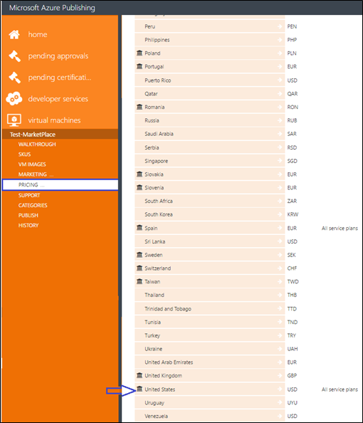
5. For SKUs with an hourly billing model, reset the prices for all the cores as they are in production for the selected region. For SKUs with a BYOL billing model, make the SKU available in the region by selecting the check box for the SKU in the **EXTERNALLY-LICENSED (BYOL) SKU AVAILABILITY** section.

    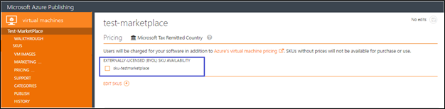
6. Click **AUTOPRICE OTHER MARKETS BASED ON PRICES IN UNITED STATES**.

   > [!NOTE]
   > The button’s label might be different depending on the region that you select. Because we selected United States, the button is labeled **AUTOPRICE OTHER MARKETS BASED ON PRICES IN UNITED STATES**.
   >
   >

    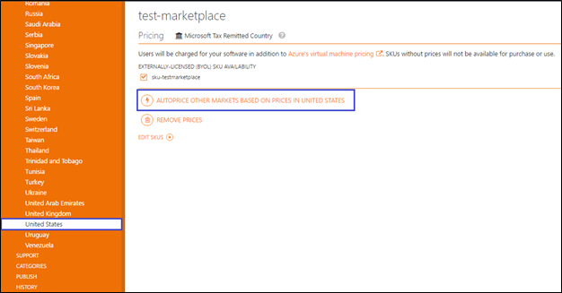
7. On page 1 of the Autoprice wizard, choose the base market and click the **arrow** button.

    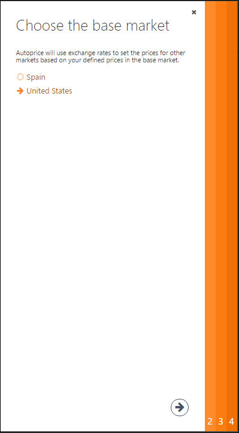
8. On page 2, choose service plans and meters (cores), and click the **arrow** button.

    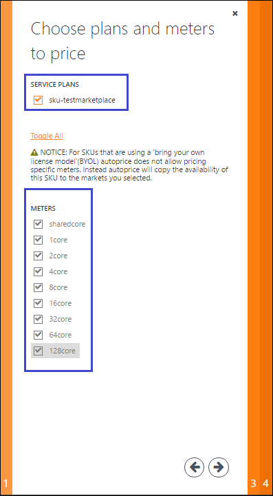
9. On page 3, click **Toggle All** to select all regions. Or you can manually select check boxes for specific regions. Click the **arrow** button.

    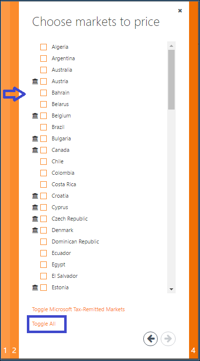
10. On page 4, review the exchange rates and click **Finish**. The wizard resets the pricing according to your selections.

11. On the **PRICING** tab, click **VIEW SUMMARY AND CHANGES**.
    For **View Version**, select **Draft**, and for **Compare with**, select **Production**. If you see no pricing difference, the pricing reverted to the production values successfully.

    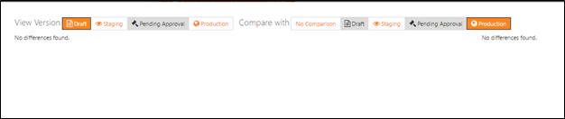
12. Go to the **PUBLISH** tab, and click **PUSH TO STAGING**. For detailed guidance on testing your offer in the staging environment, see [Test your VM offer for the Marketplace](marketplace-publishing-vm-image-test-in-staging.md).
13. After you've tested your offer in staging, go to the **PUBLISH** tab in the Publishing portal. Click **REQUEST APPROVAL TO PUSH TO PRODUCTION** to republish your offer in the Marketplace.

## Revert the billing model to production values
To revert the billing model to production values, follow these steps:

1. Sign in to the [Publishing portal](https://publish.windowsazure.com).

2. Go to the **virtual machines** tab, and select your offer.
3. In the menu on the left, click the **SKUS** tab.
4. Click the **Edit** button to revert the billing model. In the window that opens, select or clear the **Billing and licensing is done externally from Azure (aka Bring Your Own License)** check box.

    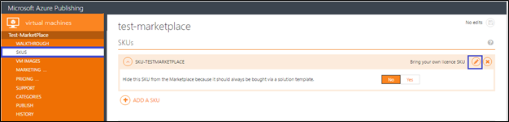
5. Follow the steps in "Revert the listing price to production values" in this article.
6. Go to the **PUBLISH** tab, and click **PUSH TO STAGING**. For detailed guidance on testing your offer in the staging environment, see [Test your VM offer for the Marketplace](marketplace-publishing-vm-image-test-in-staging.md).
7. After you've tested your offer in staging, go to the **PUBLISH** tab in the Publishing portal. Click **REQUEST APPROVAL TO PUSH TO PRODUCTION** to republish your offer in the Marketplace.

## Revert the visibility setting of a listed SKU to the production value
To revert the visibility setting of a listed SKU to the production value, follow these steps:

1. Sign in to the [Publishing portal](https://publish.windowsazure.com).

2. Go to the **virtual machines** tab, and select your offer.
3. In the menu on the left, click the **SKUS** tab.
4. Select your SKU, and revert the visibility setting of the SKU to the production value.

    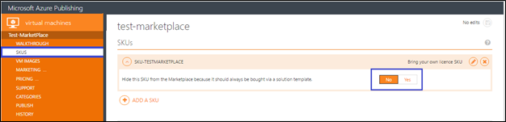
5. After you're done with the changes, click **REQUEST APPROVAL TO PUSH TO PRODUCTION** to republish your offer in the Marketplace.

## See also
* [Get Started: Publish an offer to the Azure Marketplace](marketplace-publishing-getting-started.md)
* [Understand payout reporting](marketplace-publishing-report-payout.md)
* [Change your Cloud Solution Provider reseller incentive](marketplace-publishing-csp-incentive.md)
* [Troubleshoot common publishing problems in the Marketplace](marketplace-publishing-support-common-issues.md)
* [Get support as a publisher](marketplace-publishing-get-publisher-support.md)
* [Create a VM image on-premises](marketplace-publishing-vm-image-creation-on-premise.md)
* [Create a virtual machine running Windows in the Azure preview portal](../virtual-machines/virtual-machines-windows-hero-tutorial.md?toc=%2fazure%2fvirtual-machines%2fwindows%2ftoc.json)
