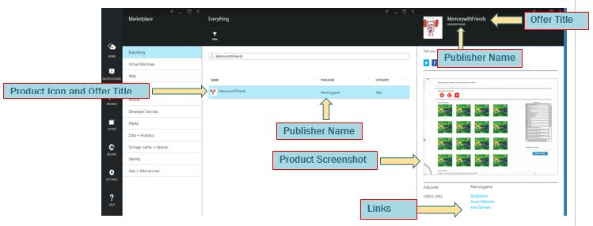

<properties
   pageTitle="Test your VM offer for the Marketplace | Microsoft Azure"
   description="Understand how to test your VM image for the Azure Marketplace."
   services="marketplace-publishing"
   documentationCenter=""
   authors="HannibalSII"
   manager=""
   editor=""/>

<tags
   ms.service="marketplace-publishing"
   ms.devlang="na"
   ms.topic="article"
   ms.tgt_pltfrm="na"
   ms.workload="na"
   ms.date="10/05/2015"
   ms.author="hascipio" />

# Testing your VM offer in Staging
Staging means deploying your SKU in a private “sandbox” where you can test and validate its functionality before deploying it to the Marketplace. The SKU will appear in staging just as it would to a customer who has deployed it. Your VM image must be certified to be pushed to staging.

## 1. Push your offer to Staging
1. Click **Push to Staging** in the **Publish** tab.

  

2. Correct any errors or discrepancies in which the Publishing Portal may notify you a this point.
3.	Provide the list of Azure subscriptions you will use to preview your offer in [Azure Preview portal](https://portal.azure.com) in the pop up box as shown in the screenshot above.
4. Login to the [Azure Preview Portal](http://portal.azure.com) using one of the above Azure subscriptions listed in the previous step.
5. Find your offer and validate your VM image points:
  - Marketing content is showing up correctly in the gallery

     

  - End-to-end deployment of VM image

 > [AZURE.NOTE] Your offer will remain in staging until you notify Microsoft that you are ready to push to production. This is an ideal time to have all members of the team check over everything in preparation for your offer going live.

## Next Steps
Now that you offer is in "Staging", once the onboarding team notifies, you can proceed to the final offer and/or SKU publishing phase, **Step 4**,  [Deploying your offer to the Marketplace](marketplace-publishing-push-to-production.md)

## See Also
- [Getting Started: How to publish an offer to the Azure Marketplace](marketplace-publishing-getting-started.md)
