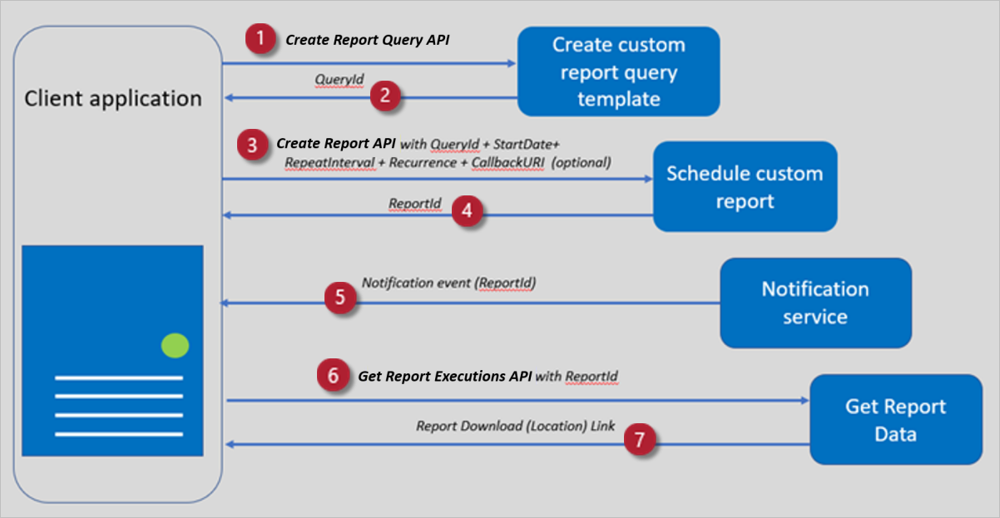

# Programmatic access paradigm

This diagram shows the API call pattern used to create a new report template, schedule the custom report, and retrieve failure data.

[](./media/analytics-programmatic-access/analytics-high-level-flow.png#lightbox)
***Figure 1: High-level flow of the API call pattern***

This list provides more details about Figure 1.

1. The Client Application can define the custom report schema/template by calling the [Create Report Query API](#create-report-query-api). Alternately, you can use a report template (`QueryId`) from the [list of system queries](analytics-system-queries.md).
1. On success, the Create Report Template API returns the `QueryId`.
1. The client application then calls the [Create Report API](#create-report-api) using the `QueryID` along with the report start date, Repeat Interval, Recurrence, and an optional Callback URI.
1. On success, the [Create Report API](#create-report-api) returns the `ReportID`.
1. The client application gets notified at the callback URI as soon as the report data is ready for download.
1. The client application then uses the [Get Report Executions API](#get-report-executions-api) to query the status of the report with the `Report ID` and date range.
1. On success, the report download link is returned and the application can initiate download of the data.

## Report query language specification

While we provide [system queries](analytics-system-queries.md) you can use to create reports, you can also create your own queries based on your business needs. To learn more about custom queries, see [Custom query specification](analytics-custom-query-specification.md).

## Create report query API

This API helps to create custom queries that define the dataset from which columns and metrics need to be exported. The API provides the flexibility to create a new reporting template based on your business needs.

You can also use the [system queries](analytics-system-queries.md) we provide. When custom report templates are not needed, you can call the [Create Report API](#create-report-api) directly using the [QueryIds](analytics-system-queries.md) of the system queries we provide.

The following example shows how to create a custom query to get _Normalized Usage and Estimated Financial Charges for PAID SKUs_ from the [ISVUsage](analytics-make-your-first-api-call.md#programmatic-api-call) dataset for the last month.

**Request syntax**

| Method | Request URI |
| ------------ | ------------- |
| POST | `https://api.partnercenter.microsoft.com/insights/v1/cmp/ScheduledQueries` |

**Request header**

| Header | Type | Description |
| ------------- | ------------- | ------------- |
| Authorization | string | Required. The Azure Active Directory (Azure AD) access token. The format is `Bearer <token>`. |
| Content-Type | `string` | `application/JSON` |

**Path parameter**

None

**Query parameter**

None

**Request payload example**

```json
{
    "Name": "ISVUsageQuery",
    "Description": "Normalized Usage and Estimated Financial Charges for PAID SKUs",
    "Query": "SELECT UsageDate, NormalizedUsage, EstimatedExtendedChargePC FROM ISVUsage WHERE SKUBillingType = 'Paid' ORDER BY UsageDate DESC TIMESPAN LAST_MONTH"
}
```

**Glossary**

This table provides the key definitions of elements in the request payload.

| Parameter | Required | Description | Allowed values |
| ------------ | ------------- | ------------- | ------------- |
| `Name` | Yes | Friendly name of the query | string |
| `Description` | No | Description of what the query returns | string |
| `Query` | Yes | Report query string | Data type: string<br>[Custom query](analytics-sample-queries.md) based on business need |

> [!NOTE]
> For custom query samples, see [Examples of sample queries](analytics-sample-queries.md).

**Sample response**

The response payload is structured as follows:

Response codes: 200, 400, 401, 403, 500

Response payload example:

```json
{
  "value": [
        {
            "queryId": "78be43f2-e35f-491a-8cd5-78fe14194f9c",
            "name": " ISVUsageQuery",
            "description": "Normalized Usage and Estimated Financial Charges for PAID SKUs”,
            "query": " SELECT UsageDate, NormalizedUsage, EstimatedExtendedChargePC FROM ISVUsage WHERE SKUBillingType = 'Paid' ORDER BY UsageDate DESC TIMESPAN LAST_MONTH",
            "type": "userDefined",
            "user": "142344300",
            "createdTime": "2021-01-06T05:38:34Z"
        }
    ],
    "totalCount": 1,
    "message": "Query created successfully",
    "statusCode": 200
}
```

**Glossary**

This table provides the key definitions of elements in the response.

| Parameter | Description |
| ------------ | ------------- |
| `QueryId` | Universally unique identifier (UUID) of the query you created |
| `Name` | Friendly name given to the query in the request payload |
| `Description` | Description given during creation of the query |
| `Query` | Report query passed as input during query creation |
| `Type` | Set to `userDefined` |
| `User` | User ID used to create the query |
| `CreatedTime` | UTC Time the query was created in this format: yyyy-MM-ddTHH:mm:ssZ |
| `TotalCount` | Number of datasets in the Value array |
| `StatusCode` | Result Code<br>The possible values are 200, 400, 401, 403, 500 |
| `message` | Status message from the execution of the API |

## Create report API

On creating a custom report template successfully and receiving the `QueryID` as part of [Create Report Query](#create-report-query-api) response, this API can be called to schedule a query to be executed at regular intervals. You can set a frequency and schedule for the report to be delivered. For system queries we provide, the Create Report API can also be called with [QueryId](analytics-sample-queries.md).

**Request syntax**

| Method | Request URI |
| ------------ | ------------- |
| POST | `https://api.partnercenter.microsoft.com/insights/v1/cmp/ScheduledReport` |

**Request header**

| Header | Type | Description |
| ------ | ---- | ----------- |
| Authorization | string | Required. The Azure Active Directory (Azure AD) access token. The format is `Bearer <token>`. |
| Content Type | string | `application/JSON` |

**Path parameter**

None

**Query parameter**

None

**Request payload example**

```json
{
  "ReportName": "ISVUsageReport",
  "Description": "Normalized Usage and Estimated Financial Charges for PAID SKUs",
  "QueryId": "78be43f2-e35f-491a-8cd5-78fe14194f9c ",
  "StartTime": "2021-01-06T19:00:00Z ",
  "RecurrenceInterval": 48,
  "RecurrenceCount": 20,
  "Format": "csv",
  "CallbackUrl": "https://<SampleCallbackUrl>"
}
```

**Glossary**

This table provides the key definitions of elements in the request payload.

| Parameter | Required | Description | Allowed values |
| ------------ | ------------- | ------------- | ------------- |
| `ReportName` | Yes | Name assigned to the report | string |
| `Description` | No | Description of the created report | string |
| `QueryId` | Yes | Report query ID | string |
| `StartTime` | Yes | UTC Timestamp at which the report generation will begin.<br>The format should be: yyyy-MM-ddTHH:mm:ssZ | string |
| `RecurrenceInterval` | Yes | Frequency in hours at which the report should be generated.<br>Minimum value is 4 and maximum value is 90. | integer |
| `RecurrenceCount` | No | Number of reports to be generated. | integer |
| `Format` | No | File format of the exported file.<br>Default format is .CSV. | CSV/TSV |
| `CallbackUrl` | No | Publicly reachable URL that can be optionally configured as the callback destination. | String (http URL) |
| `ExecuteNow` | No | This parameter should be used to create a report that will be executed only once. `StartTime`, `RecurrenceInterval`, and `RecurrenceCount` are ignored if this is set to `true`. The report is executed immediately in an asynchronous fashion. | true/false |
| `QueryStartTime` | No | Optionally specifies the start time for the query extracting the data. This parameter is applicable only for one time execution report which has `ExecuteNow` set to `true`. The format should be yyyy-MM-ddTHH:mm:ssZ | Timestamp as string |
| `QueryEndTime` | No | Optionally specifies the end time for the query extracting the data. This parameter is applicable only for one time execution report which has `ExecuteNow` set to `true`. The format should be yyyy-MM-ddTHH:mm:ssZ | Timestamp as string |

**Sample response**

The response payload is structured as follows:

Response code: 200, 400, 401, 403, 404, 500

Response payload:

```json
{
  "Value": [
    {
            "reportId": "72fa95ab-35f5-4d44-a1ee-503abbc88003",
            "reportName": "ISVUsageReport",
            "description": "Normalized Usage and Estimated Financial Charges for PAID SKUs",
            "queryId": "78be43f2-e35f-491a-8cd5-78fe14194f9c",
            "query": "SELECT UsageDate, NormalizedUsage, EstimatedExtendedChargePC FROM ISVUsage WHERE SKUBillingType = 'Paid' ORDER BY UsageDate DESC TIMESPAN LAST_MONTH",
            "user": "142344300",
            "createdTime": "2021-01-06T05:46:00Z",
            "modifiedTime": null,
            "startTime": "2021-01-06T19:00:00Z",
            "reportStatus": "Active",
            "recurrenceInterval": 48,
            "recurrenceCount": 20,
            "callbackUrl": "https://<SampleCallbackUrl>",
            "format": "csv"    
    }
  ],
  "TotalCount": 1,
  "Message": "Report created successfully",
  "StatusCode": 200
}
```

**Glossary**

This table provides the key definitions of elements in the response.

| Parameter | Description |
| ------------ | ------------- |
| `ReportId` | Universally unique identifier (UUID) of the report you created |
| `ReportName` | Name given to the report in the request payload |
| `Description` | Description given during creation of the report |
| `QueryId` | Query ID passed at the time you created the report |
| `Query` | Query text that will be executed for this report |
| `User` | User ID used to create the report |
| `CreatedTime` | UTC Time the report was created in this format: yyyy-MM-ddTHH:mm:ssZ |
| `ModifiedTime` | UTC Time the report was last modified in this format: yyyy-MM-ddTHH:mm:ssZ |
| `StartTime` | UTC Time the report execution will begin in this format: yyyy-MM-ddTHH:mm:ssZ |
| `ReportStatus` | Status of the report execution. The possible values are **Paused**, **Active**, and **Inactive**. |
| `RecurrenceInterval` | Recurrence interval provided during report creation |
| `RecurrenceCount` | Recurrence count provided during report creation |
| `CallbackUrl` | Callback URL provided in the request |
| `Format` | Format of the report files. The possible values are CSV or TSV. |
| `TotalCount` | Number of datasets in the Value array |
| `StatusCode` | Result Code<br>The possible values are 200, 400, 401, 403, 500 |
| `message` | Status message from the execution of the API |

## Get report executions API

You can use this method to query the status of a report execution using the `ReportId` received from the [Create Report API](#create-report-api). The method returns the report download link if the report is ready for download. Otherwise, the method returns the status. You can also use this API to get all the executions that have happened for a given report.

> [!IMPORTANT]
> This API has default query parameters set for `executionStatus=Completed` and  `getLatestExecution=true`. Hence, calling the API before the first successful execution of the report will return 404. Pending executions can be obtained by setting `executionStatus=Pending`.

**Request syntax**

| Method | Request URI |
| ------------ | ------------- |
| Get | `https://api.partnercenter.microsoft.com/insights/v1/cmp/ScheduledReport/execution/{reportId}?executionId={executionId}&executionStatus={executionStatus}&getLatestExecution={getLatestExecution}` |

**Request header**

| Header | Type | Description |
| ------ | ------ | ------ |
| Authorization | string | Required. The Azure Active Directory (Azure AD) access token. The format is `Bearer <token>`. |
| Content type | string | `application/json` |

**Path parameter**

None

**Query parameter**

| Parameter name | Required | Type | Description |
| ------------ | ------------- | ------------- | ------------- |
| `reportId` | Yes | string | Filter to get execution details of only reports with `reportId` given in this argument. Multiple `reportIds` can be specified by separating them with a semicolon “;”. |
| `executionId` | No | string | Filter to get details of only reports with `executionId` given in this argument. Multiple `executionIds` can be specified by separating them with a semicolon “;”. |
| `executionStatus` | No | string/enum | Filter to get details of only reports with `executionStatus` given in this argument.<br>Valid values are: `Pending`, `Running`, `Paused`, and `Completed` <br>The default value is `Completed`. Multiple statuses can be specified by separating them with a semicolon “;”. |
| `getLatestExecution` | No | boolean | The API will return details of the latest report execution.<br>By default, this parameter is set to `true`. If you choose to pass the value of this parameter as `false`, then the API will return the last 90 days execution instances. |

**Request payload**

None

**Sample response**

The response payload is structured as follows:

Response codes: 200, 400, 401, 403, 404, 500

Response payload example:

```json
{
    "value": [
        {
            "executionId": "a0bd78ad-1a05-40fa-8847-8968b718d00f",
            "reportId": "72fa95ab-35f5-4d44-a1ee-503abbc88003",
            "recurrenceInterval": 4,
            "recurrenceCount": 10,
            "callbackUrl": null,
            "format": "csv",
            "executionStatus": "Completed",
            "reportAccessSecureLink": "https://<path to report for download>",
            "reportExpiryTime": null,
            "reportGeneratedTime": "2021-01-13T14:40:46Z"
        }
    ],
    "totalCount": 1,
    "message": null,
    "statusCode": 200
}
```

Once report execution is complete, the execution status `Completed` is shown. You can download the report by selecting the URL in the `reportAccessSecureLink`.

**Glossary**

Key definitions of elements in the response.

| Parameter | Description |
| ------------ | ------------- |
| `ExecutionId` | Universally unique identifier (UUID) of the execution instance |
| `ReportId` | Report ID associated with the execution instance |
| `RecurrenceInterval` | Recurrence interval provided during report creation |
| `RecurrenceCount` | Recurrence count provided during report creation |
| `CallbackUrl` | Callback URL associated with the execution instance |
| `Format` | Format of the generated file at the end of execution |
| `ExecutionStatus` | Status of the report execution instance.<br>Valid values are: `Pending`, `Running`, `Paused`, and `Completed` |
| `ReportAccessSecureLink` | Link through which the report can be accessed securely |
| `ReportExpiryTime` | UTC Time after which the report link will expire in this format: yyyy-MM-ddTHH:mm:ssZ |
| `ReportGeneratedTime` | UTC Time at which the report was generated in this format: yyyy-MM-ddTHH:mm:ssZ |
| `TotalCount` | Number of datasets in the Value array |
| `StatusCode` | Result Code <br>The possible values are 200, 400, 401, 403, 404 and 500 |
| `message` | Status message from the execution of the API |

## Next steps
- You can try out the APIs through the [Swagger API URL](https://api.partnercenter.microsoft.com/insights/v1/cmp/swagger/index.html)
- [Get Started with programmatic access to analytics data](analytics-get-started.md)
