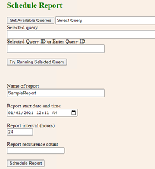

# Sample application for accessing commercial marketplace analytics data

Sample applications are created in C# and JAVA languages and are available on [GitHub](https://github.com/partneranalytics).

- [C# Sample Application](https://github.com/partneranalytics/ProgrammaticExportSampleAppISV)
- [JAVA Sample Application](https://github.com/partneranalytics/ProgrammaticExportSampleAppISV_Java)

You can choose to take inspiration from the sample application and build your own application in any language.

The sample application achieves the following goals:

- Generates an Azure Active Directory (Azure AD) token.
- Gets available datasets.
- Creates user-defined queries.
- Gets user-defined and system queries.
- Schedules a report.

The sample application doesn’t cover the method of calling APIs for other functionalities. However, the process of calling other APIs remains the same as outlined above.

## How to run the application

1. Clone the repository to a local system using this command:

    `git clone https://github.com/partneranalytics/ProgrammaticExportSampleAppISV.git`

    > [!NOTE]
    > For more instructions, refer to the `ProgrammaticExportSampleAppISV/README.md` file in the GitHub [repository](https://github.com/partneranalytics/ProgrammaticExportSampleAppISV.git).

1. To quickly run the app, update the client ID and client secret in the **appsettings.Development.json**

    :::image type="content" source="./media/analytics-programmatic-access/appsettings-development-json.png" alt-text="Illustrates a snippet of the appsettings.Development.json file.":::

Running the app will start a local web server and a page will open (`https://localhost:44365/ProgrammaticExportSampleApp/sample`).

This page will make API calls to the webserver running on the local machine, which in turn will make the actual programmatic access API calls.

## Code snippets

The basic structure of the C# code for doing the programmatic access API calls is as follows:

:::image type="content" source="./media/analytics-programmatic-access/code-snippets.png" alt-text="Screenshot of API calls.":::

## Next steps

- [APIs for accessing commercial marketplace analytics data](analytics-available-apis.md)
