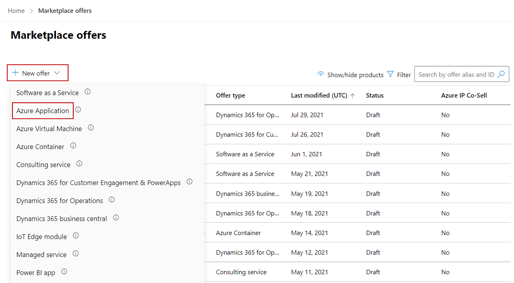

# Create an Azure application offer

As a commercial marketplace publisher, you can create an Azure application offer so potential customers can buy your solution. This article explains the process to create an Azure application offer for the Microsoft commercial marketplace.

## Before you begin

Before you can publish an Azure application offer, you must have a commercial marketplace account in Partner Center and ensure your account is enrolled in the commercial marketplace program. See [Create a commercial marketplace account in Partner Center](create-account.md) and [Verify your account information when you enroll in a new Partner Center program](/partner-center/verification-responses#checking-your-verification-status).

If you haven’t already done so, read [Plan an Azure application offer for the commercial marketplace](plan-azure-application-offer.md). It will provide the resources and help you gather the information and assets you’ll need when you create your offer.

## Create a new offer

1. Sign in to [Partner Center](https://partner.microsoft.com/dashboard/home).

1. On the Home page, select the **Marketplace offers** tile.

    

1. On the Marketplace offers page, select **+ New offer** > **Azure Application**.

    

1. In the **New Azure Application** dialog box, enter an **Offer ID**. This is a unique identifier for each offer in your account. This ID is visible in the URL of the commercial marketplace listing and Azure Resource Manager templates, if applicable. For example, if you enter test-offer-1 in this box, the offer web address will be `https://azuremarketplace.microsoft.com/marketplace/../test-offer-1`.

     * Each offer in your account must have a unique offer ID.
     * Use only lowercase letters and numbers. It can include hyphens and underscores, but no spaces, and is limited to 50 characters.
     * The Offer ID can't be changed after you select **Create**.

1. Enter an **Offer alias**. This is the name used for the offer in Partner Center.

     * This name is only visible in Partner Center and it’s different from the offer name and other values shown to customers.
     * The Offer alias can't be changed after you select **Create**.

1. Associate the new offer with a _publisher_. A publisher represents an account for your organization. You may have a need to create the offer under a particular publisher. If you don’t, you can simply accept the publisher account you’re signed in to.

    > [!NOTE]
    > The selected publisher must be enrolled in the [**Commercial Marketplace program**](marketplace-faq-publisher-guide.yml#how-do-i-sign-up-to-be-a-publisher-in-the-microsoft-commercial-marketplace-) and cannot be modified after the offer is created.

1. To generate the offer and continue, select  **Create**.

## Configure your Azure application offer setup details

On the **Offer setup** tab, under **Setup details**, you’ll choose whether to configure a test drive. You can also choose whether to connect your customer relationship management (CRM) system with your commercial marketplace offer.

### Enable a test drive (optional)

A test drive is a great way to showcase your offer to potential customers by giving them access to a preconfigured environment for a fixed number of hours. Offering a test drive results in an increased conversion rate and generates highly qualified leads. To Learn more about test drives, see [Test drive](plan-azure-application-offer.md#test-drive).

#### To enable a test drive

- Under **Test drive**, select the **Enable a test drive** check box.

### Customer lead management

When a customer expresses interest or deploys your product, you’ll receive a lead in the [Referrals workspace](https://partner.microsoft.com/dashboard/referrals/v2/leads) in Partner Center.

You can also connect the product to your customer relationship management (CRM) system to handle leads there.

> [!NOTE]
> Connecting to a CRM system is optional.

#### To configure the connection details in Partner Center

1. Under **Customer leads**, select the **Connect** link.
1. In the **Connection details** dialog box, select a lead destination from the list.
1. Complete the fields that appear. For detailed steps, see the following articles:

   - [Configure your offer to send leads to the Azure table](partner-center-portal/commercial-marketplace-lead-management-instructions-azure-table.md#configure-your-offer-to-send-leads-to-the-azure-table)
   - [Configure your offer to send leads to Dynamics 365 Customer Engagement](partner-center-portal/commercial-marketplace-lead-management-instructions-dynamics.md#configure-your-offer-to-send-leads-to-dynamics-365-customer-engagement)
   - [Configure your offer to send leads to HTTPS endpoint](partner-center-portal/commercial-marketplace-lead-management-instructions-https.md#configure-your-offer-to-send-leads-to-the-https-endpoint)
   - [Configure your offer to send leads to Marketo](partner-center-portal/commercial-marketplace-lead-management-instructions-marketo.md#configure-your-offer-to-send-leads-to-marketo)
   - [Configure your offer to send leads to Salesforce](partner-center-portal/commercial-marketplace-lead-management-instructions-salesforce.md#configure-your-offer-to-send-leads-to-salesforce)

1. To validate the configuration you provided, select the **Validate** link, if applicable.
1. To close the dialog box, select **Connect**.
1. Select **Save draft** before continuing to the next tab: Properties.

> [!NOTE]
> Make sure the connection to the lead destination stays up to date so your CRM system doesn't lose any leads.

Make sure you update these connections whenever something has changed. You can still access leads in the [Referrals workspace](https://partner.microsoft.com/dashboard/referrals/v2/leads) in Partner Center. If needed, you can  export leads from Partner Center in order to import them into your CRM.

## Next steps

- [Configure Azure application properties](azure-app-properties.md)

**Video tutorial**

- [Configuring Partner Center for Azure Managed Applications - Demo](https://go.microsoft.com/fwlink/?linkid=2196410)
