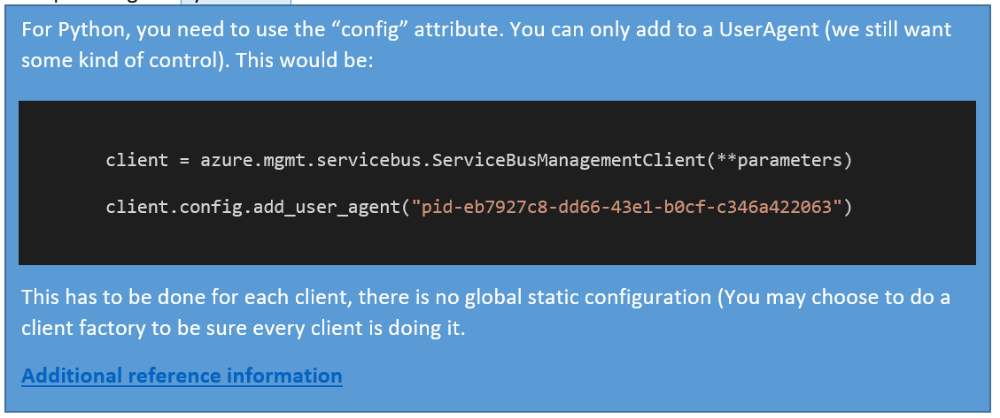
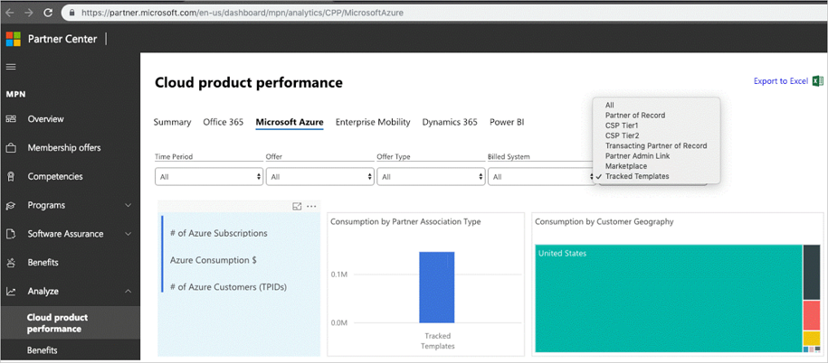
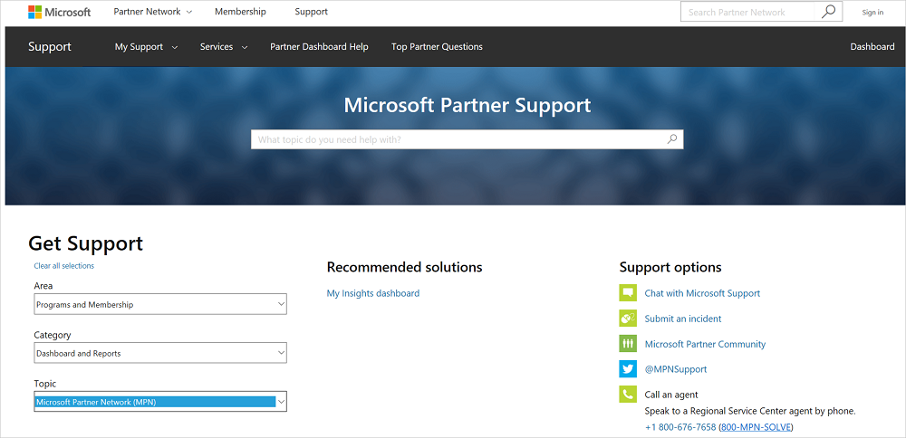
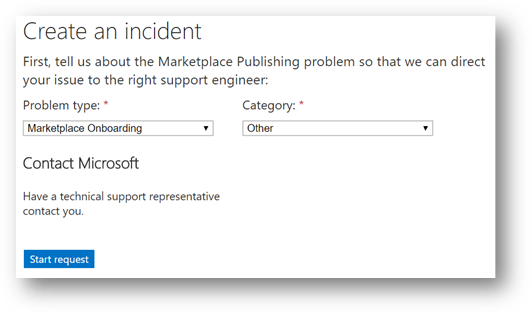

# Commercial Marketplace partner and customer usage attribution

Customer usage attribution is a method to associate Azure resources running in customer subscriptions, deployed to run your solution, with you as a partner. Forming these associations in internal Microsoft systems brings greater visibility to the Azure footprint running your software. When you adopt this tracking capability, you align with Microsoft sales teams and gain credit for Microsoft partner programs.

You can form the association via Azure Marketplace, the Quickstart repository, private GitHub repositories, and 1:1 customer engagements that create durable IP (such as development of an app).

Customer usage attribution supports three deployment options:

- Azure Resource Manager templates: Partners can use Resource Manager templates to deploy the Azure services to run the partner's software. Partners can create a Resource Manager template to define the infrastructure and configuration of their Azure solution. A Resource Manager template allows you and your customers to deploy your solution throughout its lifecycle. You can be confident that your resources are deployed in a consistent state.
- Azure Resource Manager APIs: Partners can call the Resource Manager APIs directly to deploy a Resource Manager template or to generate the API calls to directly provision Azure services.
- Terraform: Partners can use Terraform to deploy a Resource Manager template or directly deploy Azure services.

>[!IMPORTANT]
>- Customer usage attribution is not intended to track the work of systems integrators, managed service providers, or tools designed to deploy and manage software running on Azure.
>
>- Customer usage attribution is for new deployments and does NOT support tagging existing resources that have already been deployed.
>
>- Customer usage attribution is required for [Azure Application](./partner-center-portal/create-new-azure-apps-offer.md) offers published to Azure Marketplace.

[!INCLUDE [updated-for-az](../../includes/updated-for-az.md)]

## Create GUIDs

A GUID is a unique reference identifier that has 32 hexadecimal digits. To create GUIDs for tracking, you should use a GUID generator. The Azure Storage team has created a [GUID generator form](https://aka.ms/StoragePartners) that will email you a GUID of the correct format and can be reused across the different tracking systems.

> [!NOTE]
> It is highly recommended that you use [Azure Storage's GUID generator form](https://aka.ms/StoragePartners) to create your GUID. For more information, see our [FAQ](#faq).

We recommend you create a unique GUID for every offer and distribution channel for each product. You can opt to use a single GUID for the product's multiple distribution channels if you do not want reporting to be split.

If you deploy a product by using a template and it is available on both the Azure Marketplace and on GitHub, you can create and register two distinct GUIDS:

- Product A in Azure Marketplace
- Product A on GitHub

Reporting is done by Microsoft Partner Network ID and GUID.

You can also track usage at a more granular level by registering additional GUIDs and changing GUIDs between plans, where plans are variants of an offer.

## Register GUIDs

The GUIDs must be registered in Partner Center to enable customer usage attribution.

After you add a GUID to your template or in the user agent, and register the GUID in Partner Center, future deployments are tracked.

> [!NOTE]
> If you are publishing your [Azure Application](./partner-center-portal/create-new-azure-apps-offer.md) offer to the Azure Marketplace through Partner Center, any new GUID used inside your template will be automatically registered to your Partner Center profile when the template is uploaded.  

1. Sign in to [Partner Center](https://partner.microsoft.com/dashboard).

1. Sign up as a [commercial marketplace publisher](https://aka.ms/JoinMarketplace).

   * Partners are required to [have a profile in Partner Center](https://docs.microsoft.com/azure/marketplace/become-publisher). You're encouraged to list the offer in Azure Marketplace or AppSource.
   * Partners can register multiple GUIDs.
   * Partners can register GUIDs for non-marketplace solution templates and offers.

1. In the upper-right corner, select the settings gear icon, and then select **Developer settings**.

1. On the **Account settings page**, select **Add Tracking GUID.**

1. In the **GUID** box, enter your tracking GUID. Enter just the GUID without the **pid-** prefix. In the **Description** box, enter your offer name or description.

1. To register more than one GUID, select **Add Tracking GUID** again. Additional boxes appear on the page.

1. Select **Save**.

## Use Resource Manager templates
Many partner solutions are deployed using Azure Resource Manager templates. If you have a Resource Manager template that's available in the Azure Marketplace, on GitHub, or as a Quickstart, the process to modify your template to enable customer usage attribution is straight forward.

> [!NOTE]
> For more information on creating and publishing Solution Templates, see
> * [Create and deploy your first Resource Manager template](https://docs.microsoft.com/azure/azure-resource-manager/resource-manager-quickstart-create-templates-use-the-portal).
>* [Azure Application offer](./partner-center-portal/create-new-azure-apps-offer.md).
>* Video: [Building Solution Templates, and Managed Applications for the Azure Marketplace](https://channel9.msdn.com/Events/Build/2018/BRK3603).


To add a globally unique identifier (GUID), you make a single modification to the main template file:

1. [Create a GUID](#create-guids) using the suggested method and [register the GUID](#register-guids).

1. Open the Resource Manager template.

1. Add a new resource in the main template file. The resource needs to be in the **mainTemplate.json** or **azuredeploy.json** file only, and not in any nested or linked templates.

1. Enter the GUID value after the **pid-** prefix (e.g., pid-eb7927c8-dd66-43e1-b0cf-c346a422063).

1. Check the template for any errors.

1. Republish the template in the appropriate repositories.

1. [Verify GUID success in the template deployment](#verify-the-guid-deployment).

### Sample Resource Manager template code

To enable tracking resources for your template, you need to add the following additional resource under the resources section. Please make sure to modify the below sample code with your own inputs when you add it to the main template file.
The resource needs to be added in the **mainTemplate.json** or **azuredeploy.json** file only, and not in any nested or linked templates.

```
// Make sure to modify this sample code with your own inputs where applicable

{ // add this resource to the resources section in the mainTemplate.json (do not add the entire file)
    "apiVersion": "2018-02-01",
    "name": "pid-XXXXXXXX-XXXX-XXXX-XXXX-XXXXXXXXXXXX", // use your generated GUID here
    "type": "Microsoft.Resources/deployments",
    "properties": {
        "mode": "Incremental",
        "template": {
            "$schema": "https://schema.management.azure.com/schemas/2015-01-01/deploymentTemplate.json#",
            "contentVersion": "1.0.0.0",
            "resources": []
        }
    }
} // remove all comments from the file when complete
```

## Use the Resource Manager APIs

In some cases, you might prefer to make calls directly against the Resource Manager REST APIs to deploy Azure services. [Azure supports multiple SDKs](https://docs.microsoft.com/azure/?pivot=sdkstools) to enable these calls. You can use one of the SDKs, or call the REST APIs directly to deploy resources.

If you're using a Resource Manager template, you should tag your solution by following the instructions described earlier. If you aren't using a Resource Manager template and making direct API calls, you can still tag your deployment to associate usage of Azure resources.

### Tag a deployment with the Resource Manager APIs

To enable customer usage attribution, when you design your API calls, include a GUID in the user agent header in the request. Add the GUID for each offer or SKU. Format the string with the **pid-** prefix and include the partner-generated GUID. Here's an example of the GUID format for insertion into the user agent:


> [!NOTE]
> The format of the string is important. If the **pid-** prefix isn't included, it's not possible to query the data. Different SDKs track differently. To implement this method, review the support and tracking approach for your preferred Azure SDK.

#### Example: The Python SDK

For Python, use the **config** attribute. You can only add the attribute to a UserAgent. Here's an example:



> [!NOTE]
> Add the attribute for each client. There's no global static configuration. You might tag a client factory to be sure every client is tracking. For more information, see this [client factory sample on GitHub](https://github.com/Azure/azure-cli/blob/7402fb2c20be2cdbcaa7bdb2eeb72b7461fbcc30/src/azure-cli-core/azure/cli/core/commands/client_factory.py#L70-L79).

#### Tag a deployment by using the Azure PowerShell

If you deploy resources via Azure PowerShell, append your GUID by using the following method:

```powershell
[Microsoft.Azure.Common.Authentication.AzureSession]::ClientFactory.AddUserAgent("pid-eb7927c8-dd66-43e1-b0cf-c346a422063")
```

#### Tag a deployment by using the Azure CLI

When you use the Azure CLI to append your GUID, set the **AZURE_HTTP_USER_AGENT** environment variable. You can set this variable within the scope of a script. You can also set the variable globally for shell scope:

```
export AZURE_HTTP_USER_AGENT='pid-eb7927c8-dd66-43e1-b0cf-c346a422063'
```
For more information, see [Azure SDK for Go](https://docs.microsoft.com/azure/go/).

## Use Terraform

The support for Terraform is available through Azure Provider's 1.21.0 release: [https://github.com/terraform-providers/terraform-provider-azurerm/blob/master/CHANGELOG.md#1210-january-11-2019](https://github.com/terraform-providers/terraform-provider-azurerm/blob/master/CHANGELOG.md#1210-january-11-2019).  This support applies to all partners who deploy their solution via Terraform, and all resources deployed and metered by the Azure Provider (version 1.21.0 or later).

Azure provider for Terraform added a new optional field called [*partner_id*](https://www.terraform.io/docs/providers/azurerm/#partner_id) which is where you specify the tracking GUID that you use for your solution. The value of this field can also be sourced from the *ARM_PARTNER_ID* Environment Variable.

```
provider "azurerm" {
          subscription_id = "xxxxxxx-xxxx-xxxx-xxxx-xxxxxxxxxxxx"
          client_id = "xxxxxxx-xxxx-xxxx-xxxx-xxxxxxxxxxxx"
          ……
          # new stuff for ISV attribution
          partner_id = "xxxxxxx-xxxx-xxxx-xxxx-xxxxxxxxxxxx"}
```
Partners who want to get their deployment via Terraform tracked by customer usage attribution need to do the following:

* Create a GUID (the GUID should be added for each Offer or SKU)
* Update their Azure Provider to set the value of *partner_id* to the GUID (DO NOT pre-fix the GUID with "pid-", just set it to the actual GUID)


## Verify the GUID deployment

After you modify your template and run a test deployment, use the following PowerShell script to retrieve the resources that you deployed and tagged.

You can use the script to verify that the GUID is successfully added to your Resource Manager template. The script doesn't apply to Resource Manager API or Terraform deployments.

Sign in to Azure. Select the subscription with the deployment that you want to verify before you run the script. Run the script within the subscription context of the deployment.

The **GUID** and **resourceGroup** name of the deployment are required parameters.

You can get [the original script](https://gist.github.com/bmoore-msft/ae6b8226311014d6e7177c5127c7eba1#file-verify-deploymentguid-ps1) on GitHub.

```powershell
Param(
    [GUID][Parameter(Mandatory=$true)]$guid,
    [string][Parameter(Mandatory=$true)]$resourceGroupName
)

# Get the correlationId of the pid deployment

$correlationId = (Get-AzResourceGroupDeployment -ResourceGroupName
$resourceGroupName -Name "pid-$guid").correlationId

# Find all deployments with that correlationId

$deployments = Get-AzResourceGroupDeployment -ResourceGroupName $resourceGroupName | Where-Object{$_.correlationId -eq $correlationId}

# Find all deploymentOperations in a deployment by name
# PowerShell doesn't surface outputResources on the deployment
# or correlationId on the deploymentOperation

foreach ($deployment in $deployments){

# Get deploymentOperations by deploymentName
# then the resourceId for any create operation

($deployment | Get-AzResourceGroupDeploymentOperation | Where-Object{$_.properties.provisioningOperation -eq "Create" -and $_.properties.targetResource.resourceType -ne "Microsoft.Resources/deployments"}).properties.targetResource.id

}
```

## Report

You can find the report for customer usage attribution in your Partner Center dashboard ([https://partner.microsoft.com/dashboard/mpn/analytics/CPP/MicrosoftAzure](https://partner.microsoft.com/dashboard/mpn/analytics/CPP/MicrosoftAzure)). In order to see the report, you have to use your Partner Center credentials to sign in. If you encounter any issues with report or sign in, create a support request following the instruction in the Get support section.

Choose Tracked Template in the dropdown list of Partner Association Type to see the report.



## Notify your customers

Partners should inform their customers about deployments that use customer usage attribution. Microsoft reports the Azure usage that's associated with these deployments to the partner. The following examples include content that you can use to notify your customers about these deployments. In the examples, replace \<PARTNER> with your company name. Partners should make sure the notification aligns with their data privacy and collection policies, including options for customers to be excluded from tracking.

### Notification for Resource Manager template deployments

When you deploy this template, Microsoft is able to identify the installation of \<PARTNER> software with the Azure resources that are deployed. Microsoft is able to correlate the Azure resources that are used to support the software. Microsoft collects this information to provide the best experiences with their products and to operate their business. The data is collected and governed by Microsoft's privacy policies, which can be found at https://www.microsoft.com/trustcenter.

### Notification for SDK or API deployments

When you deploy \<PARTNER> software, Microsoft is able to identify the installation of \<PARTNER> software with the Azure resources that are deployed. Microsoft is able to correlate the Azure resources that are used to support the software. Microsoft collects this information to provide the best experiences with their products and to operate their business. The data is collected and governed by Microsoft's privacy policies, which can be found at https://www.microsoft.com/trustcenter.

## Get support

There are two support channels depending on the issues you are facing.

If you encounter any issues in the Partner Center, such as seeing the customer usage attribution report or signing in, create a support request with the Partner Center support team here: [https://partner.microsoft.com/support](https://partner.microsoft.com/support)



If you need assistance for Marketplace Onboarding and/or customer usage attribution in general, such as how to set up the customer usage attribution, follow the steps below:

1. Go to the [support page](https://go.microsoft.com/fwlink/?linkid=844975).

1. Under **Problem type**, select **Marketplace Onboarding**.

1. Choose the **Category** for your issue:

   - For usage association issues, select **Other**.
   - For access issues with the Azure Marketplace, select **Access Problem**.

     

1. Select **Start Request**.

1. On the next page, enter the required values. Select **Continue**.

1. On the next page, enter the required values.

   > [!IMPORTANT]
   > In the **Incident title** box, enter **ISV Usage Tracking**. Describe your issue in detail.

   

1. Complete the form, and then select **Submit**.

You can also receive technical guidance from a Microsoft Partner Technical Consultant for technical presales, deployment and app development scenarios to understand and incorporate customer usage attribution.

### How to submit a technical consultation request

1. Visit [Partner Technical Services](https://aka.ms/TechnicalJourney).
1. Select Cloud infrastructure and management, and a new page will open for you to view the technical journey.
1. Under Deployment Services, click the Submit a request button
1. Sign in using your MSA (MPN account) or your AAD (Partner Dashboard account); based on your sign-in credentials, an online request form will open:
    * Complete/review the contact information.
    * The consultation details may be pre-populated or select from the drop-downs.
    * Enter a title and the description of the problem (provide as much detail as possible).
1. Click Submit

View step-by-step instructions with screenshots at [Using Technical Presales and Deployment Services](https://aka.ms/TechConsultInstructions).

### What's next

You will be contacted by a Microsoft Partner Technical Consultant to set up a call to scope your needs.

## FAQ

**What's the benefit of adding the GUID to the template?**

Microsoft provides partners with a view of customer deployments of their solutions and insights on their influenced usage. Both Microsoft and the partner can use this information to drive closer engagement between sales teams. Both Microsoft and the partner can use the data to get a more consistent view of an individual partner's impact on Azure growth.

**After a GUID is added, can it be changed?**

Yes, a customer or implementation partner may customize the template and can change or remove the GUID. We suggest that partners proactively describe the role of the resource and GUID to their customers and partners to prevent removal or edits to the GUID. Changing the GUID affects only new, not existing, deployments, and resources.

**Can I track templates deployed from a non-Microsoft repository like GitHub?**

Yes, as long as the GUID is present when the template is deployed, usage is tracked. Partners must still register their GUIDs.

**Does the customer receive reporting as well?**

Customers can track their usage of individual resources or customer-defined resource groups within the Azure portal. Customers do not see usage broken out by GUID.

**Is this methodology similar to the Digital Partner of Record (DPOR)?**

This new method of connecting the deployment and usage to a partner's solution provides a mechanism to link a partner solution to Azure usage. DPOR is intended to associate a consulting (Systems Integrator) or management (Managed Service Provider) partner with a customer's Azure subscription.

**What's the benefit to using Azure Storage's GUID Generator form?**

Azure Storage's GUID Generator form is guaranteed to generate a GUID of the required format. Additionally, if you are using any of Azure Storage's data plane tracking methods, you can leverage the same GUID for Marketplace control plane tracking. This allows you to leverage a singled unified GUID for Partner attribution without having to maintain separate GUIDS.

**Can I use a private, custom VHD for a solution template offer in the Azure Marketplace?**

No, you cannot. The virtual machine image must come from the Azure Marketplace, see: [https://docs.microsoft.com/azure/marketplace/marketplace-virtual-machines](https://docs.microsoft.com/azure/marketplace/marketplace-virtual-machines).

You can create a VM offer in marketplace using your custom VHD and mark it as Private so that no one can see it. Then reference to this VM in your solution template.

**Failed to update *contentVersion* property for the main template?**

Likely a bug in some cases when the template is being deployed by using a TemplateLink from another template that expect older contentVersion for some reason. The workaround is to use the metadata property:

```
"$schema": "https://schema.management.azure.com/schemas/2015-01-01/deploymentTemplate.json#",
    "contentVersion": "1.0.0.0",
    "metadata": {
        "contentVersion": "1.0.1.0"
    },
    "parameters": {
```
