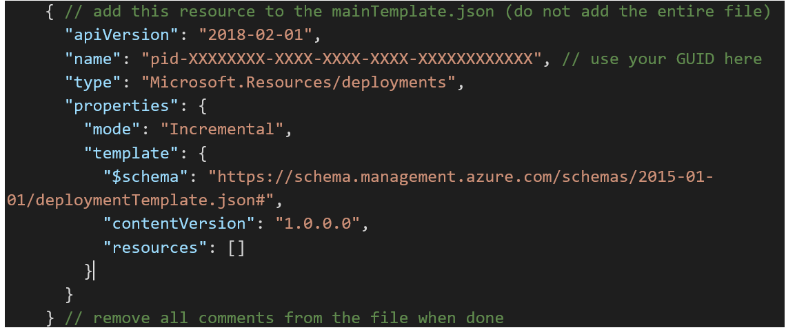
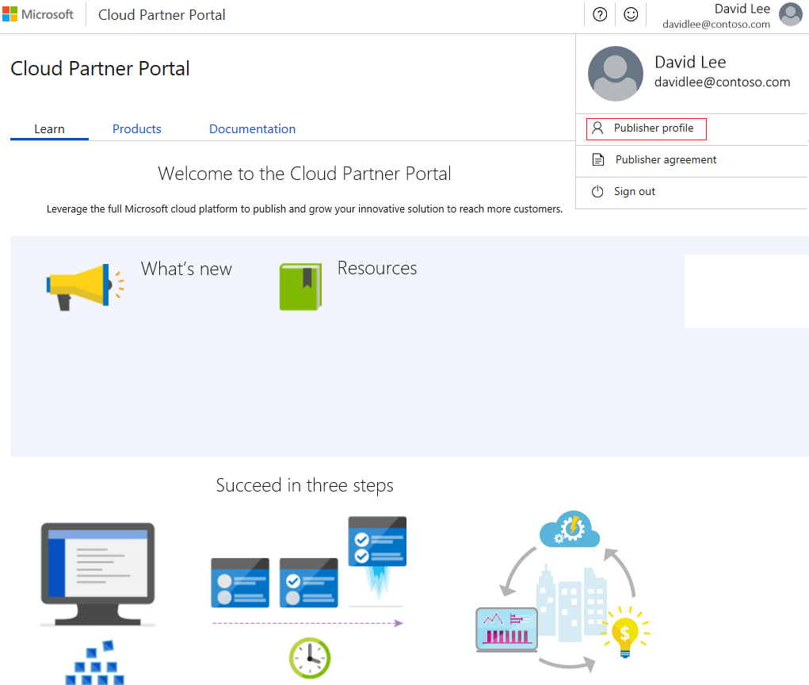
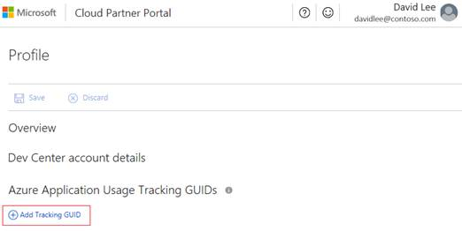
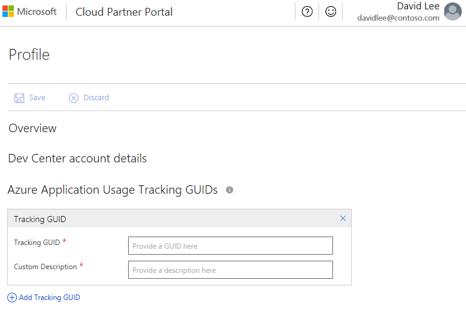
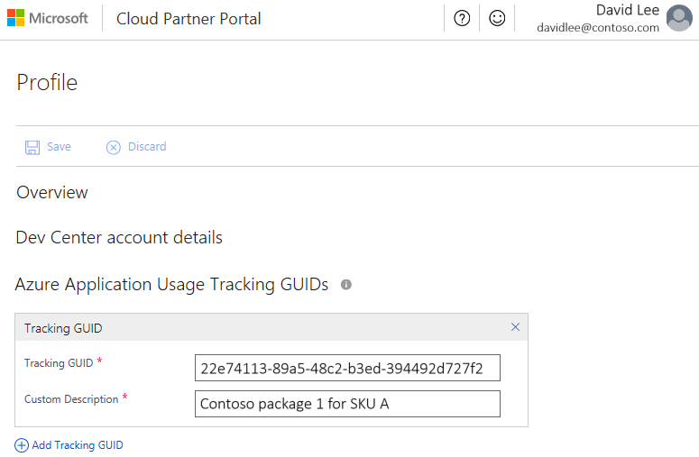
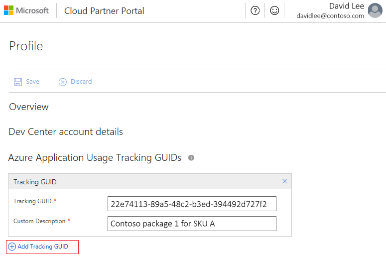
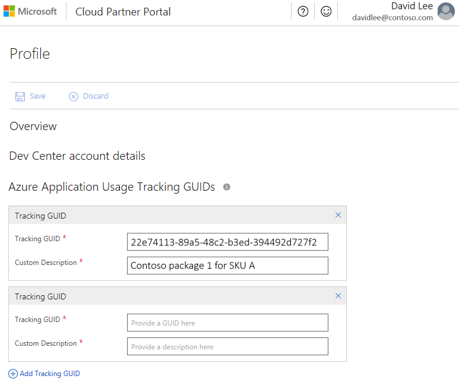
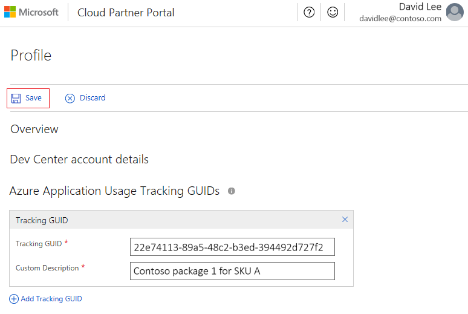

---  
title: Azure partner and customer usage attribution
description: Overview of how to track customer usage for Azure Marketplace solutions
services: Azure, Marketplace, Compute, Storage, Networking, Blockchain, Security
documentationcenter:
author: yijenj
manager: nunoc
editor:

ms.assetid: e8d228c8-f9e8-4a80-9319-7b94d41c43a6
ms.service: marketplace
ms.workload: 
ms.tgt_pltfrm: 
ms.devlang: 
ms.topic: article
ms.date: 10/05/2018
ms.author: yijenj

---  
# Azure partner customer usage attribution

As a software partner for Azure, your solutions require Azure components or they need to be deployed directly on the Azure infrastructure. Customers who deploy a partner solution and provision their own Azure resources can find it difficult to gain visibility into the status of the deployment, and get optics into the impact on Azure growth. When you add a higher level of visibility, you align with the Microsoft sales teams and gain credit for Microsoft partner programs.   

Microsoft now offers a method to help partners better track Azure usage of customer deployments of their software on Azure. The new method uses Azure Resource Manager to orchestrate the deployment of Azure services.

As a Microsoft partner, you can associate Azure usage with any Azure resources that you provision on a customer's behalf. You can form the association via the Azure Marketplace, the Quickstart repository, private GitHub repositories, and one-on-one customer engagement. To enable tracking, two approaches are available:

- Azure Resource Manager templates: Resource Manager templates or solution templates to deploy the Azure services to run the partner's software. Partners can create a Resource Manager template to define the infrastructure and configuration of their Azure solution. A Resource Manager template allows you and your customers to deploy your solution throughout its lifecycle. You can be confident that your resources are deployed in a consistent state. 

- Azure Resource Manager APIs: Partners can call the Resource Manager APIs directly to deploy a Resource Manager template or to generate the API calls to directly provision Azure services. 

## Use Resource Manager templates

Many partner solutions are deployed on a customer’s subscription by using Resource Manager templates. If you have a Resource Manager template that's available in the Azure Marketplace, on GitHub, or as a Quickstart, the process to modify your template to enable the new tracking method should be straight forward. If you aren't using an Azure Resource Manager template, here are a few links to help you better understand Resource Manager templates and how to create one: 

*	[Create and deploy your first Resource Manager template](https://docs.microsoft.com/azure/azure-resource-manager/resource-manager-create-first-template)
*	[Create a solution template for Azure Marketplace](https://docs.microsoft.com/azure/marketplace-publishing/marketplace-publishing-solution-template-creation)

## Add a GUID to your template

To add a globally unique identifier (GUID), you make a single modification to the main template file:

1. Create a GUID (for example, eb7927c8-dd66-43e1-b0cf-c346a422063).

1. Open the Resource Manager template.

1. Add a new resource in the main template file. The resource needs to be in the **mainTemplate.json** or **azuredeploy.json** file only, and not in any nested or linked templates.

1. Enter the GUID value after the **pid-** prefix (for example, pid-eb7927c8-dd66-43e1-b0cf-c346a422063).

1. Check the template for any errors.

1. Republish the template in the appropriate repositories.

### Sample template code



## Use the Resource Manager APIs

In some cases, you might prefer to make calls directly against the Resource Manager REST APIs to deploy Azure services. [Azure supports multiple SDKs](https://docs.microsoft.com/azure/#pivot=sdkstools) to enable these calls. You can use one of the SDKs, or call the REST APIs directly to deploy resources.

If you're using a Resource Manager template, you should tag your solution by following the instructions described earlier. If you aren't using a Resource Manager template and making direct API calls, you can still tag your deployment to associate usage of Azure resources. 

### Tag a deployment with the Resource Manager APIs

For this tracking approach, when you design your API calls, include a GUID in the user agent header in the request. Add the GUID for each offer or SKU. Format the string with the **pid-** prefix and include the partner-generated GUID. Here's an example of the GUID format for insertion into the user agent: 


> [!Note]
> The format of the string is important. If the **pid-** prefix isn't included, it's not possible to query the data. Different SDKs track differently. To implement this method, review the support and tracking approach for your preferred Azure SDK. 

### Example: The Python SDK

For Python, use the **config** attribute. You can only add the attribute to a UserAgent. Here's an example:


> [!Note]
> Add the attribute for each client. There's no global static configuration. You might tag a client factory to be sure every client is tracking. For more information, see this [client factory sample on GitHub](https://github.com/Azure/azure-cli/blob/7402fb2c20be2cdbcaa7bdb2eeb72b7461fbcc30/src/azure-cli-core/azure/cli/core/commands/client_factory.py#L70-L79).

#### Tag a deployment by using the Azure PowerShell

If you deploy resources via Azure PowerShell, append your GUID by using the following method:

```
[Microsoft.Azure.Common.Authentication.AzureSession]::ClientFactory.AddUserAgent("pid-eb7927c8-dd66-43e1-b0cf-c346a422063")
```

#### Tag a deployment by using the Azure CLI

When you use the Azure CLI to append your GUID, set the **AZURE_HTTP_USER_AGENT** environment variable. You can set this variable within the scope of a script. You can also set the variable globally for shell scope:

```
export AZURE_HTTP_USER_AGENT='pid-eb7927c8-dd66-43e1-b0cf-c346a422063'
```

## Register GUIDs and offers

To include a GUID in our tracking, the GUID must be registered.  

All registrations for template GUIDs are done via the Azure Marketplace Cloud Partner Portal (CPP). 

After you add the GUID to your template or in the user agent, and register the GUID in the CPP, all deployments are tracked. 

1. Apply to [Azure Marketplace](http://aka.ms/listonazuremarketplace) and get access to the CPP.

   * Partners are required to [have a profile in CPP](https://docs.microsoft.com/azure/marketplace/become-publisher). You're encouraged to list the offer in Azure Marketplace or AppSource.
   * Partners can register multiple GUIDs.
   * Partners can register a GUID for the non-Marketplace solution templates and offers.
 
1. Sign in to the [Cloud Partner Portal](https://cloudpartner.azure.com/).

1. In the upper-right corner, select your account icon, and then select **Publisher profile**.

   

1. On the **Profile page**, select **Add Tracking GUID.**

   

1. In the **Tracking GUID** box, enter your tracking GUID. Enter just the GUID without the **pid-** prefix. In the **Custom Description** box, enter your offer name or description.

   
   
   

1. To register more than one GUID, select **Add Tracking GUID** again. Additional boxes appear on the page.

   
   
   

1. Select **Save**.

   

After you add the GUID to your template or in the user agent, and register the GUID in the CPP, all deployments are tracked. 

## Verify the GUID deployment 

After you modify your template and run a test deployment, use the following PowerShell script to retrieve the resources that you deployed and tagged. 

You can use the script to verify that the GUID is successfully added to your Resource Manager template. The script doesn't apply to Resource Manager API deployment.

Sign in to Azure. Select the subscription with the deployment that you want to verify before you run the script. Run the script within the subscription context of the deployment.

The **GUID** and **resourceGroup** name of the deployment are required parameters.

You can get [the original script](https://gist.github.com/bmoore-msft/ae6b8226311014d6e7177c5127c7eba1#file-verify-deploymentguid-ps1) on GitHub.

```
Param(
    [GUID][Parameter(Mandatory=$true)]$guid,
    [string][Parameter(Mandatory=$true)]$resourceGroupName
)

# Get the correlationId of the pid deployment

$correlationId = (Get-AzureRmResourceGroupDeployment -ResourceGroupName 
$resourceGroupName -Name "pid-$guid").correlationId

# Find all deployments with that correlationId

$deployments = Get-AzureRmResourceGroupDeployment -ResourceGroupName $resourceGroupName | Where-Object{$_.correlationId -eq $correlationId}

# Find all deploymentOperations in a deployment by name
# PowerShell doesn't surface outputResources on the deployment
# or correlationId on the deploymentOperation

foreach ($deployment in $deployments){

# Get deploymentOperations by deploymentName
# then the resourceId for any create operation

($deployment | Get-AzureRmResourceGroupDeploymentOperation | Where-Object{$_.properties.provisioningOperation -eq "Create" -and $_.properties.targetResource.resourceType -ne "Microsoft.Resources/deployments"}).properties.targetResource.id

}
```

## Create GUIDs

A GUID is a unique reference number that has 32 hexadecimal digits. To create GUIDs for tracking, you should use a GUID generator. There are multiple [online GUID generators](https://www.bing.com/search?q=guid%20generator&qs=n&form=QBRE&sp=-1&ghc=2&pq=guid%20g&sc=8-6&sk=&cvid=0BAFAFCD70B34E4296BB97FBFA3E1B4E) that you can use.

Create a unique GUID for every offer and distribution channel. If you deploy two solutions by using a template and each one is available in the Azure Marketplace and on GitHub, you need to create four GUIDS:

*	Offer A in Azure Marketplace 
*	Offer A on GitHub
*	Offer B in Azure Marketplace 
*	Offer B on GitHub

Reporting is done by the partner value (Microsoft Partner ID) and the GUID. 

You can also track GUIDs at a more granular level like the SKU, where SKUs are variants of an offer.

## Notify your customers

Partners should inform their customers about deployments that use Resource Manager GUID tracking. Microsoft reports the Azure usage that's associated with these deployments to the partner. The following examples include content that you can use to notify your customers about these deployments. In the examples, replace \<PARTNER> with your company name. Partners should make sure the notification aligns with their data privacy and collection policies, including options for customers to be excluded from tracking. 

### Notification for Resource Manager template deployments

When you deploy this template, Microsoft is able to identify the installation of \<PARTNER> software with the Azure resources that are deployed. Microsoft is able to correlate the Azure resources that are used to support the software. Microsoft collects this information to provide the best experiences with their products and to operate their business. The data is collected and governed by Microsoft's privacy policies, which can be found at https://www.microsoft.com/trustcenter. 

### Notification for SDK or API deployments

When you deploy \<PARTNER> software, Microsoft is able to identify the installation of \<PARTNER> software with the Azure resources that are deployed. Microsoft is able to correlate the Azure resources that are used to support the software. Microsoft collects this information to provide the best experiences with their products and to operate their business. The data is collected and governed by Microsoft's privacy policies, which can be found at https://www.microsoft.com/trustcenter.

## Get support

If you need assistance, follow these steps.

1. Go to the [support page](https://go.microsoft.com/fwlink/?linkid=844975). 

1. Under **Problem type**, select **Marketplace Onboarding**.

1. Choose the **Category** for your issue:

   - For usage association issues, select **Other**.
   - For access issues with the Azure Marketplace CPP, select **Access Problem**.
   
    

1. Select **Start Request**.

1. On the next page, enter the required values. Select **Continue**.

1. On the next page, enter the required values.

   > [!Important] 
   > In the **Incident title** box, enter **ISV Usage Tracking**. Describe your issue in detail.
   
   

1. Complete the form, and then select **Submit**.

## FAQ

**What's the benefit of adding the GUID to the template?**

Microsoft provides partners with a view of customer deployments of their templates and insights on their influenced usage. Both Microsoft and the partner can use this information to drive closer engagement between sales teams. Both Microsoft and the partner can use the data to get a more consistent view of an individual partner's impact on Azure growth. 

**Who can add a GUID to a template?**

The tracking resource is intended to connect the partner's solution to the customer's Azure usage. The usage data is tied to a partner's Microsoft Partner Network identity (MPN ID). Reporting is available to partners in the CPP.

**After a GUID is added, can it be changed?**
 
Yes, a customer or implementation partner may customize the template and can change or remove the GUID. We suggest that partners proactively describe the role of the resource and GUID to their customers and partners to prevent removal or edits to the tracking GUID. Changing the GUID affects only new, not existing, deployments, and resources.

**When will reporting be available?**

A beta version of reporting should be available soon. Reporting will be integrated into the CPP.

**Can I track templates deployed from a non-Microsoft repository like GitHub?**

Yes, as long as the GUID is present when the template is deployed, usage is tracked. Partners are required to have a profile in the CPP to register related templates that are published outside of the Azure Marketplace. 

**Is there a difference if the template is deployed from Azure Marketplace versus other repositories like GitHub?**

Yes, partners who publish offers in the Azure Marketplace might receive more detailed data on deployments from the Azure Marketplace. Partners benefit from exposing their offer to customers on the Azure Marketplace portal and in the Azure portal. Offers in the Azure Marketplace also generate leads for the partner.

**What if I create a custom template for an individual customer engagement?**

You're still welcome to add the GUID to the template. If you use an existing registered GUID, it's included in the reporting. If you create a new GUID, you need to register the new GUID to have it included in the tracking.

**Does the customer receive reporting as well?**

Customers can track their usage of individual resources or customer-defined resource groups within the Azure portal.   

**Is this tracking methodology similar to the Digital Partner of Record (DPOR)?**

This new method of connecting the deployment and usage to a partner's solution provides a mechanism to link a partner solution to Azure usage. DPOR is intended to associate a consulting (Systems Integrator) or management (Managed Service Provider) partner with a customer's Azure subscription.   
