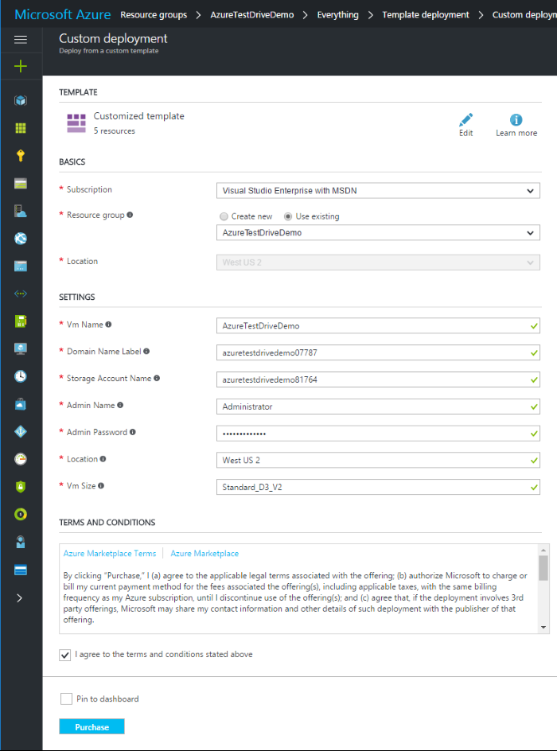
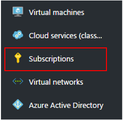
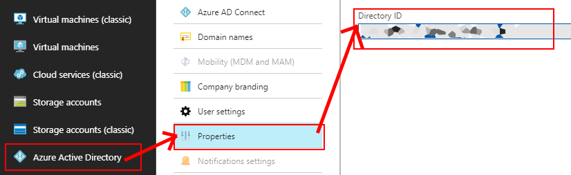
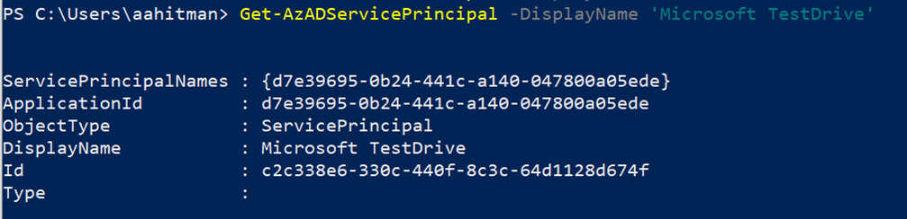
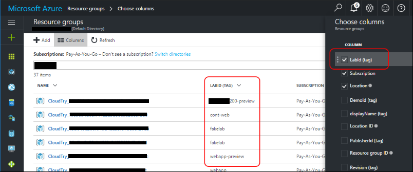

# Azure Resource Manager test drive

Use this type if you have an offer on Azure Marketplace or AppSource but want to build a test drive with only Azure resources. An Azure Resource Manager (ARM) template is a coded container of Azure resources that you design to best represent your solution. Test drive takes the provided ARM template and deploys all the resources it requires to a resource group. This is the only test drive option for virtual machine or Azure app offers.

If you are unfamiliar with what an ARM template is, read [What is Azure Resource Manager?](../azure-resource-manager/management/overview.md) and [Understand the structure and syntax of ARM templates](../azure-resource-manager/templates/syntax.md) to better understand how to build and test your own templates.

For information on a **hosted** or **logic app** test drive, see [What is a test drive?](what-is-test-drive.md)

> [!TIP]
> To see the customer's view of test drive in the commercial marketplace, see [What is Azure Marketplace?](/marketplace/azure-marketplace-overview#take-action-on-a-listing) and [What is Microsoft AppSource?](/marketplace/appsource-overview).

## Technical configuration

A deployment template contains all the Azure resources that comprise your solution. Products that fit this scenario use only Azure resources. Set the following properties in Partner Center:

- **Regions** (required) – Currently there are 26 Azure-supported regions where your test drive can be made available. For the best performance, we recommend choosing one region where you expect the largest number of customers to be located. You will need to make sure that your subscription is allowed to deploy all of the resources needed in each of the regions you are selecting.

- **Instances** – Select the type (hot or cold) and number of available instances, which will be multiplied by the number of regions where your offer is available.

  - **Hot** – This type of instance is deployed and awaiting access per selected region. Customers can instantly access *Hot* instances of a test drive, rather than having to wait for a deployment. The tradeoff is that these instances are always running on your Azure subscription, so they will incur a larger uptime cost. It is highly recommended to have at least one *Hot* instance, as most customers don't want to wait for full deployments, resulting in a drop-off in customer usage if no *Hot* instance is available.

  - **Cold** – This type of instance represents the total number of instances that can possibly be deployed per region. Cold instances require the entire Test Drive Resource Manager template to deploy when a customer requests the test drive, so *Cold* instances are much slower to load than *Hot* instances. The tradeoff is that you only have to pay for the duration of the test drive, it is *not* always running on your Azure subscription as with a *Hot* instance.

- **Test drive Azure Resource Manager template** – Upload the .zip containing your Azure Resource Manager template. Learn more about creating an Azure Resource Manager template in the quickstart article [Create and deploy Azure Resource Manager templates by using the Azure portal](../azure-resource-manager/templates/quickstart-create-templates-use-the-portal.md).

    > [!note]
    > To publish successfully, it is important to validate the formatting of the ARM template. Two ways to do this are (1) by using an [online API tool](/rest/api/resources/deployments/validate) or (2) with a [test deployment](../azure-resource-manager/templates/deploy-portal.md).

- **Test drive duration** (required) – Enter the number of hours the test drive will stay active. The test drive terminates automatically after this time period ends. Use only whole numbers (for example, "2" hours is valid, "1.5" is not).

## Write the test drive template

Once you have designed the desired package of resources, write and build the test drive ARM template. Because test drive runs deployments in a fully automated mode, test drive templates have some restrictions:

### Parameters

Most templates have a set of parameters that define resource names, resources sizes (such as types of storage accounts or virtual machine sizes), user names and passwords, DNS names, and so on. When you deploy solutions using Azure portal, you can manually populate all these parameters, pick available DNS names or storage account names, and so on.



However, test drive works automatically, without human interaction, so it only supports a limited set of parameter categories. If a parameter in the test drive ARM template doesn't fall into one of the supported categories, you must replace this parameter with a variable or constant value.

You can use any valid name for your parameters; test drive recognizes parameter category by using a metadata-type value. Specify metadata-type for every template parameter, otherwise your template will not pass validation:

```JSON
"parameters": {
  ...
  "username": {
    "type": "string",
    "metadata": {
      "type": "username"
    }
  },
  ...
}
```

> [!NOTE]
> All parameters are optional, so if you don't want to use any, you don't have to.

### Accepted Parameter Metadata Types

| Metadata Type   | Parameter Type  | Description     | Sample Value    |
|---|---|---|---|
| **baseuri**     | string          | Base URI of your deployment package| `https://<..>.blob.core.windows.net/<..>` |
| **username**    | string          | New random user name.| admin68876      |
| **password**    | secure string    | New random password | Lp!ACS\^2kh     |
| **session id**   | string          | Unique test drive session ID (GUID)    | b8c8693e-5673-449c-badd-257a405a6dee |

#### baseuri

Test drive initializes this parameter with a **Base Uri** of your deployment package so you can use this parameter to construct a Uri of any file included in your package.

> [!NOTE]
> The `baseUri` parameter cannot be used in conjunction with a custom script extension.

```JSON
"parameters": {
  ...
  "baseuri": {
    "type": "string",
    "metadata": {
      "type": "baseuri",
      "description": "Base Uri of the deployment package."
    }
  },
  ...
}
```

Use this parameter inside your template to construct a Uri of any file from your test drive deployment package. The following example shows how to construct a Uri of the linked template:

```JSON
"templateLink": {
  "uri": "[concat(parameters('baseuri'),'templates/solution.json')]",
  "contentVersion": "1.0.0.0"
}
```

#### username

Test drive initializes this parameter with a new random user name:

```JSON
"parameters": {
  ...
  "username": {
    "type": "string",
    "metadata": {
      "type": "username",
      "description": "Solution admin name."
    }
  },
  ...
}
```

Sample value: `admin68876`

You can use either random or constant usernames for your solution.

#### password

Test drive initializes this parameter with a new random password:

```JSON
"parameters": {
  ...
  "password": {
    "type": "securestring",
    "metadata": {
      "type": "password",
      "description": "Solution admin password."
    }
  },
  ...
}
```

Sample value:  `Lp!ACS^2kh`

You can use either random or constant passwords for your solution.

#### session ID

Test drive initializes this parameter with a unique GUID representing Test drive session ID:

```JSON
"parameters": {
  ...
  "sessionid": {
    "type": "string",
    "metadata": {
      "type": "sessionid",
      "description": "Unique test drive session id."
    }
  },
  ...
}
```

Sample value:
`b8c8693e-5673-449c-badd-257a405a6dee`

You can use this parameter to uniquely identify the test drive session, if it's necessary.

### Unique Names

Some Azure resources, like storage accounts or DNS names, requires globally unique names. This means that every time test drive deploys the ARM template, it creates a new resource group with a unique name for all its resources. Therefore, you must use the [uniquestring](../azure-resource-manager/templates/template-functions.md) function concatenated with your variable names on resource group IDs to generate random unique values:

```JSON
"variables": {
  ...
  "domainNameLabel": "[concat('contosovm',uniquestring(resourceGroup().id))]",
  "storageAccountName": "[concat('contosodisk',uniquestring(resourceGroup().id))]",
  ...
}
```

Ensure you concatenate your parameter/variable strings (`contosovm`) with a unique string output (`resourceGroup().id`), because this guarantees the uniqueness and reliability of each variable.

For example, most resource names cannot start with a digit, but unique string function can return a string, which starts with a digit. So, if you use raw unique string output, your deployments will fail.

You can find additional information about resource naming rules and
restrictions in [this article](/azure/cloud-adoption-framework/ready/azure-best-practices/naming-and-tagging).

### Deployment Location

You can make your test drive available in different Azure regions.

When test drive creates an instance of the Lab, it always creates a resource group in one of the selected regions, and then executes your deployment template in this group context. So, your template should pick the deployment location from resource group:

```JSON
"variables": {
  ...
  "location": "[resourceGroup().location]",
  ...
}
```

And then use this location for every resource for a specific Lab instance:

```JSON
"resources": [
  {
    "type": "Microsoft.Storage/storageAccounts",
    "location": "[variables('location')]",
    ...
  },
  {
    "type": "Microsoft.Network/publicIPAddresses",
    "location": "[variables('location')]",
    ...
  },
  {
    "type": "Microsoft.Network/virtualNetworks",
    "location": "[variables('location')]",
    ...
  },
  {
    "type": "Microsoft.Network/networkInterfaces",
    "location": "[variables('location')]",
    ...
  },
  {
    "type": "Microsoft.Compute/virtualMachines",
    "location": "[variables('location')]",
    ...
  }
]
```

Ensure your subscription is allowed to deploy all the resources you want in each of the regions you select. Also ensure your virtual machine images are available in all the regions you will enable, otherwise your deployment template will not work for some regions.

### Outputs

Normally with Resource Manager templates you can deploy without producing any output. This is because you know all the values you use to populate template parameters and you can always manually inspect properties of any resource.

For test drive Resource Manager templates, however, it's important to return to test drive all the information, which is required to get access to the lab (Website URIs, Virtual Machine host names, user names, and passwords). Ensure all your output names are readable because these variables are presented to the customer.

There are no any restrictions related to template outputs. Test drive converts all output values into strings, so if you send an object to the output, a user will see JSON string.

Example:

```JSON
"outputs": {
  "Host Name": {
    "type": "string",
    "value": "[reference(variables('pubIpId')).dnsSettings.fqdn]"
  },
  "User Name": {
    "type": "string",
    "value": "[parameters('adminName')]"
  },
  "Password": {
    "type": "string",
    "value": "[parameters('adminPassword')]"
  }
}
```

### Subscription Limits

Don't forget about subscription and service limits. For example, if you want to deploy up to ten 4-core virtual machines, you need to ensure the subscription you use for your lab allows you to use 40 cores. For more information about Azure subscription and service limits, see [Azure subscription and service limits, quotas, and constraints](../azure-resource-manager/management/azure-subscription-service-limits.md). As multiple test drives can be taken at the same time, verify that your subscription can handle the number of cores multiplied by the total number of concurrent test drives that can be taken.

### What to upload

The test drive ARM template is uploaded as a zip file, which can include various deployment artifacts, but must have one file named `main-template.json`. This is the ARM deployment template which test drive uses to instantiate a lab. If you have additional resources beyond this file, you can reference them as external resources inside the template or include them in the zip file.

During the publishing certification, test drive unzips your deployment package and puts its content into an internal test drive blob container. The container structure reflects the structure of your deployment package:

| package.zip                       | Test drive blob container         |
|---|---|
| `main-template.json`                | `https:\//\<\...\>.blob.core.windows.net/\<\...\>/main-template.json`  |
| `templates/solution.json`           | `https:\//\<\...\>.blob.core.windows.net/\<\...\>/templates/solution.json` |
| `scripts/warmup.ps1`                | `https:\//\<\...\>.blob.core.windows.net/\<\...\>/scripts/warmup.ps1`  |
|||

We call a Uri of this blob container Base Uri. Because every revision of your lab has its own blob container, every revision of your lab has its own Base Uri. Test drive can pass a Base Uri of your unzipped deployment package into your template through template parameters.

### Transform template examples for test drive

The process of turning an architecture of resources into a test drive Resource Manager template can be daunting. For additional help, see these examples of how to best transform current deployment templates at [What is a test drive?](what-is-test-drive.md#transforming-examples).

## Test drive deployment subscription details

The final section to complete is to be able to deploy the test drives automatically by connecting your Azure Subscription and Azure Active Directory (AD).


1. Obtain an **Azure Subscription ID**. This grants access to Azure services and the Azure portal. The subscription is where resource usage is reported and services are billed. If you do not already have a separate Azure subscription for test drives only, make one. You can find Azure Subscription IDs (such as `1a83645ac-1234-5ab6-6789-1h234g764ghty1`) by signing in to Azure portal and selecting **Subscriptions** from the left-nav menu.

   

2. Obtain an **Azure AD Tenant ID**. If you already have a Tenant ID available you can find it in **Azure Active Directory** > **Properties** > **Directory ID**:

   

   If you don't have a tenant ID, create a new one in Azure Active Directory. For help with setting up a tenant, see [Quickstart: Set up a tenant](../active-directory/develop/quickstart-create-new-tenant.md).

3. Provision the Microsoft Test-Drive application to your tenant. We will use this application to perform operations on your test drive resources.
    1. If you don't have it yet, install the [Azure Az PowerShell module](/powershell/azure/install-az-ps).
    1. Add the Service Principal for Microsoft Test-Drive application.
        1. Run `Connect-AzAccount` and provide credentials to sign in to your Azure account, which requires the Azure active directory **Global Administrator** [built-in role](../active-directory/roles/permissions-reference.md#global-administrator).
        1. Create a new service principal: `New-AzADServicePrincipal -ApplicationId d7e39695-0b24-441c-a140-047800a05ede -DisplayName 'Microsoft TestDrive'`.
        1. Ensure the service principal has been created: `Get-AzADServicePrincipal -DisplayName 'Microsoft TestDrive'`.
      

4. For **Azure AD App ID**, paste in this Application ID: `d7e39695-0b24-441c-a140-047800a05ede`.
5. For **Azure AD App Key**, since no secret is required, insert a dummy secret, such as "no-secret".
6. Since we are using the application to deploy to the subscription, we need to add the application as a contributor on the subscription, from the Azure portal or PowerShell:

   1. From the Azure portal:

       1. Select the subscription being used for the test drive.

       1. Select **Access control (IAM)**.

       1. Select **Add > Add role assignment**.

       :::image type="content" source="../../includes/role-based-access-control/media/add-role-assignment-menu-generic.png" alt-text="Screenshot showing Access control (IAM) page with Add role assignment menu open.":::

      1. On the **Role** tab, select **Contributor**.

      1. On the **Members** tab, select **User, group, or service principal**, and then choose **Select members**.

      1. Select the **Microsoft TestDrive** service principal that you created previously.

      1. On the **Review + assign** tab, select **Review + assign** to assign the role.

         For more information about role assignments, see [Assign Azure roles using the Azure portal](../role-based-access-control/role-assignments-portal.md)

   1. If using PowerShell:
      1. Run this to get the ServicePrincipal object-id: `(Get-AzADServicePrincipal -DisplayName 'Microsoft TestDrive').id`.
      1. Run this with the ObjectId and subscription ID: `New-AzRoleAssignment -ObjectId <objectId> -RoleDefinitionName Contributor -Scope /subscriptions/<subscriptionId>`.

> [!NOTE]
> Before deleting the old appID, go to the Azure portal, then **Resource groups**, and search for `CloudTry_`. Check the **Event initiated by** column.
>
> :::image type="content" source="media/test-drive/event-initiated-by-field.png" lightbox="media/test-drive/event-initiated-by-field.png" alt-text="Shows the Event Initiated By field":::
>
> Don't delete the old appID unless at least one resource (**Operation name**) is set to **Microsoft TestDrive**.
>
> To delete the appID, in the left nav menu select **Azure Active Directory** > **App Registrations**, then the **All applications** tab. Choose your application and select **Delete**.

## Republish

Now that all your test drive fields are complete, **Republish** your offer. Once your test drive has passed certification, test the customer experience in the preview of your offer:

1. Start a test drive in the UI.
1. Open your Azure subscription inside the Azure portal.
1. Verify that your test drive is deploying correctly.

   

Don't delete any test drive instances provisioned for your customers; the test drive service will automatically clean up these Resource Groups after a customer is finished with it.

Once you are comfortable with your Preview offering, it's time to **go live**! There is a final review process to double-check the entire end-to-end experience. If we reject the offer, we will email the engineering contact for your offer explaining what needs to be fixed.

## Next steps

- If you were following the instructions to create your offer in Partner Center, use the Back arrow to return to that topic.
- Learn more about other types of test drives at [What is a test drive?](what-is-test-drive.md).