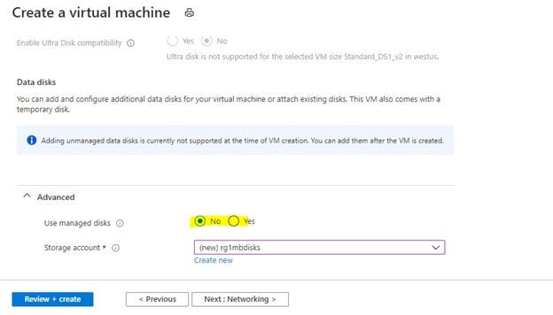
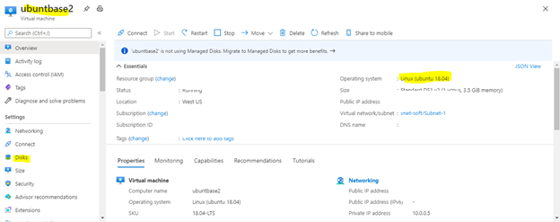
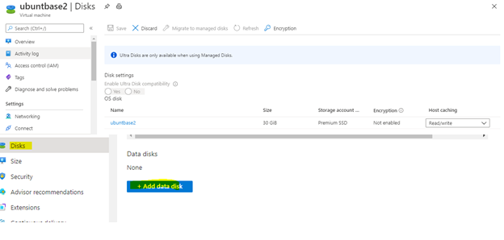
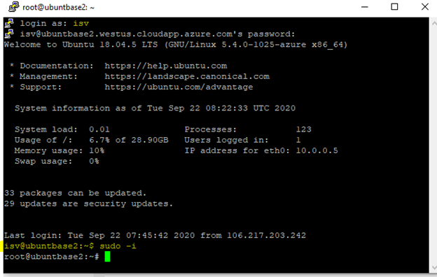
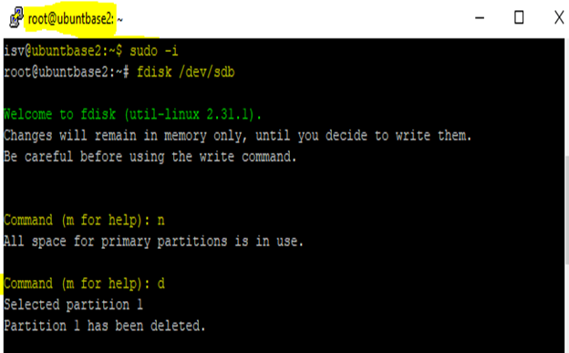
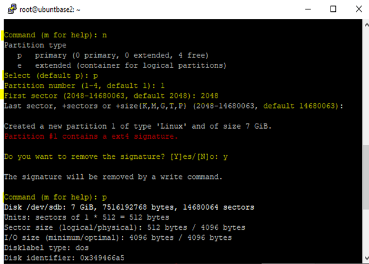
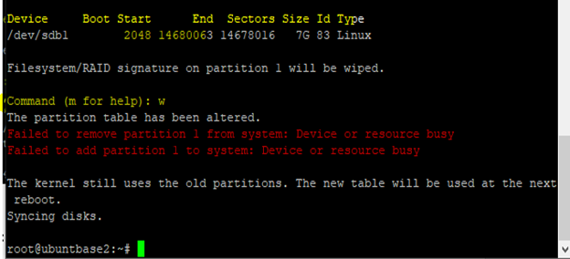
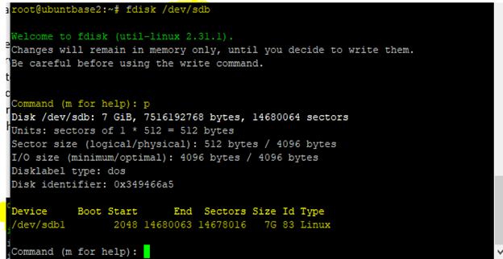
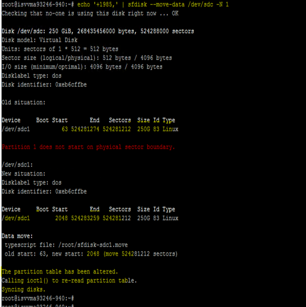

# Troubleshoot virtual machine certification

When you publish your virtual machine (VM) image to Azure Marketplace, the Azure team validates it to ensure that it's bootable, secure, and compatible with Azure. If your VM image fails any of the high-quality tests, it won't be published. You'll receive an error message that describes the issue.

This article explains common error messages during VM image publishing, along with related solutions.

> [!NOTE]
> If you have questions about this article or suggestions for improvement, contact [Partner Center support](https://aka.ms/marketplacepublishersupport).

## VM extension failure

Check to see whether your image supports VM extensions.

To enable VM extensions:

1. Select your Linux VM.
1. Go to **Diagnostics settings**.
1. Enable base matrices by updating the **Storage account**.
1. Select **Save**.

   

To verify that the VM extensions are properly activated:

1. In the VM, select the **VM extensions** tab, and then verify the status of the **Linux Diagnostics Extension**.
1. Check the provisioning status.

   - If the status is *Provisioning Succeeded*, the extensions test case has passed.  
   - If the status is *Provisioning Failed*, the extensions test case has failed, and you need to set the Hardened flag.

   

   If the VM extension fails, see [Use Linux Diagnostic Extension to monitor metrics and logs](../virtual-machines/extensions/diagnostics-linux.md) to enable it. If you don't want the VM extension to be enabled, contact the Support team, and ask them to disable it.

## VM provisioning issue

Check to ensure that you've followed the VM provisioning process rigorously before you submit your offer. To view the JSON format for provisioning the VM, see [Test a virtual machine image](azure-vm-image-test.md).

Provisioning issues can include the following failure scenarios:

|Scenario|Error|Reason|Solution|
|---|---|---|---|
|1|Invalid virtual hard disk (VHD)|If the specified cookie value in the VHD footer is incorrect, the VHD will be considered invalid.|Re-create the image and submit the request.|
|2|Invalid blob type|VM provisioning failed because the used block is a blob type instead of a page type.|Re-create the image and submit the request.|
|3|Provisioning timeout or not properly generalized|There's an issue with VM generalization.|Re-create the image with generalization and submit the request.|
|

> [!NOTE]
> For more information about VM generalization, see:
> - [Linux documentation](azure-vm-create-using-approved-base.md#generalize-the-image)
> - [Windows documentation](../virtual-machines/windows/capture-image-resource.md#generalize-the-windows-vm-using-sysprep)

## VHD specifications

### Conectix cookie and other VHD specifications

The 'conectix' string is part of the VHD specification. It's defined as the 8-byte cookie in the VHD footer that identifies the file creator. All VHD files created by Microsoft have this cookie.

A VHD formatted blob should have a 512-byte footer in this format:

|Hard disk footer fields|Size (bytes)|
|---|---|
Cookie|8
Features|4
File Format Version|4
Data Offset|8
Time Stamp|4
Creator Application|4
Creator Version|4
Creator Host OS|4
Original Size|8
Current Size|8
Disk Geometry|4
Disk Type|4
Checksum|4
Unique ID|16
Saved State|1
Reserved|427
|

### VHD specifications

To ensure a smooth publishing experience, ensure that your VHD meets the following criteria:

- The cookie contains the string 'conectix'.
- The disk type is Fixed.
- The VHD's virtual size is at least 20 MB.
- The VHD is aligned. The virtual size must be a multiple of 1 MB.
- The VHD blob length is equal to the virtual size plus the VHD footer length (512).

Download the [VHD specification](https://www.microsoft.com/download/details.aspx?id=23850).

## Software compliance for Windows

If your Windows image request is rejected because of a software compliance issue, you might have created a Windows image with an installed SQL Server instance. Instead, you need to take the relevant SQL Server version base image from Azure Marketplace.

Don't create your own Windows image with SQL Server installed in it. Use the approved SQL Server base images (Enterprise/Standard/web) from Azure Marketplace.

If you're trying to install Visual Studio or any Office-licensed product, contact the Support team for prior approval.

For more information about selecting an approved base, see [Create a virtual machine from an approved base](azure-vm-create-using-approved-base.md).

## Toolkit test case execution failed

The Microsoft Certification toolkit can help you run test cases and verify that your VHD or image is compatible with the Azure environment.

Download the [Microsoft Certification toolkit](azure-vm-image-test.md).

### Linux test cases

The following table lists the Linux test cases that the toolkit will run. Test validation is stated in the description.

|Scenario|Test case|Description|
|---|---|---|
|1|Bash history|Bash history files should be cleared before you create the VM image.|
|2|Linux Agent version|Azure Linux Agent 2.2.41 or later should be installed.|
|3|Required kernel parameters|Verifies that the following kernel parameters are set:  console=ttyS0 earlyprintk=ttyS0 rootdelay=300 |
|4|Swap partition on OS disk|Verifies that swap partitions aren't created on the OS disk.|
|5|Root partition on OS disk|Create a single root partition for the OS disk.|
|6|OpenSSL version|The OpenSSL version should be v0.9.8 or later.|
|7|Python version|Python version 2.6 or later is highly recommended.|
|8|Client Alive Interval|Set ClientAliveInterval to 180. On the application need, it can be set from 30 to 235. If you're enabling the SSH for your end users, this value must be set as explained.|
|9|OS architecture|Only 64-bit operating systems are supported.|
|10|Auto Update|Identifies whether Linux Agent Auto Update is enabled.|
|

### Common test-case errors

Refer to the following table for the common errors you might see when running test cases:

| Scenario | Test case | Error | Solution |
| --- | --- | --- | --- |
| 1 | Linux Agent version test case | The minimum Linux agent version is 2.2.41 or later. This requirement has been mandatory since May 1, 2020. | Update the Linux agent version. It should be 2.241 or later. For more information, visit [Linux Agent Version update page](https://support.microsoft.com/help/4049215/extensions-and-virtual-machine-agent-minimum-version-support). |
| 2 | Bash history test case | An error occurs if the size of the Bash history in your submitted image is more than 1 kilobyte (KB). The size is restricted to 1 KB to ensure that your Bash history file doesn't contain any potentially sensitive information. | Resolve by mounting the VHD to another working VM and make changes to reduce the size to 1 KB or less. For example, delete the `.bash` history files. |
| 3 | Required kernel parameter test case | You'll receive this error when the value for `console` isn't set to `ttyS0`. Check by running the following command:   `cat /proc/cmdline` | Set the value for `console` to `ttyS0`, and resubmit the request. |
| 4 | ClientAlive interval test case | If the toolkit gives you a failed result for this test case, there's an inappropriate value for `ClientAliveInterval`. | Set the value for `ClientAliveInterval` to less than or equal to 235, and then resubmit the request. |
|

### Windows test cases

The following table lists the Windows test cases that the toolkit will run, along with a description of the test validation:

|Scenario |Test cases|Description|
|---|---|---|
|1|OS architecture|Azure supports only 64-bit operating systems.|
|2|User account dependency|Application execution shouldn't be dependent on the administrator account.|
|3|Failover cluster|The Windows Server failover clustering feature isn't yet supported. The application shouldn't be dependent on this feature.|
|4|IPV6|IPv6 isn't yet supported in the Azure environment. The application shouldn't be dependent on this feature.|
|5|DHCP|Dynamic Host Configuration Protocol Server role isn't yet supported. The application shouldn't be dependent on this feature.|
|6|Hyper-V|Hyper-V Server role isn't yet supported. The application shouldn't be dependent on this feature.|
|7|Remote access|Remote Access (Direct Access) Server role isn't yet supported. The application shouldn't be dependent on this feature.|
|8|Rights Management Services|Rights Management Services. The server role isn't yet supported. The application shouldn't be dependent on this feature.|
|9|Windows Deployment Services|Windows Deployment Services. The server role isn't yet supported. The application shouldn't be dependent on this feature.|
|10|BitLocker Drive Encryption|BitLocker Drive Encryption isn't supported on the operating system hard disk, but it might be used on data disks.|
|11|Internet Storage Name Server|The Internet Storage Name Server feature isn't yet supported. The application shouldn't be dependent on this feature.|
|12|Multipath I/O|Multipath I/O. This server feature isn't yet supported. The application shouldn't be dependent on this feature.|
|13|Network Load Balancing|Network Load Balancing. This server feature isn't yet supported. The application shouldn't be dependent on this feature.|
|14|Peer Name Resolution Protocol|Peer Name Resolution Protocol. This server feature isn't yet supported. The application shouldn't be dependent on this feature.|
|15|SNMP Services|The Simple Network Management Protocol (SNMP) Services feature isn't yet supported. The application shouldn't be dependent on this feature.|
|16|Windows Internet Name Service|Windows Internet Name Service. This server feature isn't yet supported. The application shouldn't be dependent on this feature.|
|17|Wireless LAN Service|Wireless LAN Service. This server feature isn't yet supported. The application shouldn't be dependent on this feature.|
|

If you come across any failures with the preceding test cases, refer to the **Description** column in the table for the solution. For more information, contact the Support team.

## Data disk size verification

Data disk requests with a size greater than 1023 gigabytes (GB) won't be approved. This rule applies to both Linux and Windows.

Resubmit the request with a size less than or equal to 1023 GB.

## OS disk size validation

Refer to the following rules for limitations on OS disk size. When you submit any request, verify that the OS disk size is within the limitation for Linux or Windows.

|OS|Recommended VHD size|
|---|---|
|Linux|1 GB to 1023 GB|
|Windows|30 GB to 250 GB|
|

Because VMs allow access to the underlying operating system, ensure that the VHD size is sufficiently large for the VHD. Disks aren't expandable without downtime. Use a disk size from 30 GB to 50 GB.

|VHD size|Actual occupied size|Solution|
|---|---|---|
|>500 tebibytes (TiB)|n/a|Contact the Support team for an exception approval.|
|250-500 TiB|>200 gibibytes (GiB) difference from blob size|Contact the Support team for an exception approval.|
|

> [!NOTE]
> Larger disk sizes incur higher costs and will result in a delay during the setup and replication process. Because of this delay and cost, the Support team might seek justification for the exception approval.

## WannaCry patch verification test for Windows

To prevent a potential attack related to the WannaCry virus, ensure that all Windows image requests are updated with the latest patch.

You can verify the image file version from `C:\windows\system32\drivers\srv.sys` or `srv2.sys`.

The following table shows the minimum patched version of Windows Server:

|OS|Version|
|---|---|
|Windows Serve 2008 R2|6.1.7601.23689|
|Windows Server 2012|6.2.9200.22099|
|Windows Server 2012 R2|6.3.9600.18604|
|Windows Server 2016|10.0.14393.953|
|Windows Server 2019|NA|
|

> [!NOTE]
> Windows Server 2019 doesn't have any mandatory version requirements.

## SACK vulnerability patch verification

When you submit a Linux image, your request might be rejected because of kernel version issues.

Update the kernel with an approved version, and resubmit the request. You can find the approved kernel version in the following table. The version number should be equal to or greater than the number listed here.

If your image isn't installed with one of the following kernel versions, update it with the correct patches. Request the necessary approval from the Support team after the image is updated with these required patches:

- CVE-2019-11477
- CVE-2019-11478
- CVE-2019-11479

|OS family|Version|Kernel|
|---|---|---|
|Ubuntu|14.04 LTS|4.4.0-151| 
||14.04 LTS|4.15.0-1049-\*-azure|
||16.04 LTS|4.15.0-1049|
||18.04 LTS|4.18.0-1023|
||18.04 LTS|5.0.0-1025|
||18.10|4.18.0-1023|
||19.04|5.0.0-1010|
||19.04|5.3.0-1004|
|RHEL and Cent OS|6.10|2.6.32-754.15.3|
||7.2|3.10.0-327.79.2|
||7.3|3.10.0-514.66.2|
||7.4|3.10.0-693.50.3|
||7.5|3.10.0-862.34.2|
||7.6|3.10.0-957.21.3|
||7.7|3.10.0-1062.1.1|
||8.0|4.18.0-80.4.2|
||8.1|4.18.0-147|
||"7-RAW" (7.6)||
||"7-LVM" (7.6)|3.10.0-957.21.3|
||RHEL-SAP 7.4|TBD|
||RHEL-SAP 7.5|TBD|
|SLES|SLES11SP4 (including SAP)|3.0.101-108.95.2|
||SLES12SP1 for SAP|3.12.74-60.64.115.1|
||SLES12SP2 for SAP|4.4.121-92.114.1|
||SLES12SP3|4.4180-4.31.1 (kernel-azure)|
||SLES12SP3 for SAP|4.4.180-94.97.1|
||SLES12SP4|4.12.14-6.15.2 (kernel-azure)|
||SLES12SP4 for SAP|4.12.14-95.19.1|
||SLES15|4.12.14-5.30.1 (kernel-azure)|
||SLES15 for SAP|4.12.14-5.30.1 (kernel-azure)|
||SLES15SP1|4.12.14-5.30.1 (kernel-azure)|
|Oracle|6.10|UEK2 2.6.39-400.312.2 UEK3 3.8.13-118.35.2 RHCK 2.6.32-754.15.3 
||7.0-7.5|UEK3 3.8.13-118.35.2 UEK4 4.1.12-124.28.3 RHCK follows RHEL above|
||7.6|RHCK 3.10.0-957.21.3 UEK5 4.14.35-1902.2.0|
|CoreOS Stable 2079.6.0|4.19.43\*|
||Beta 2135.3.1|4.19.50\*|
||Alpha 2163.2.1|4.19.50\*|
|Debian|jessie (security)|3.16.68-2|
||jessie backports|4.9.168-1+deb9u3|
||stretch (security)|4.9.168-1+deb9u3|
||Debian GNU/Linux 10 (buster)|Debian 6.3.0-18+deb9u1|
||buster, sid (stretch backports)|4.19.37-5|
|

## Image size should be in multiples of megabytes

All VHDs on Azure must have a virtual size aligned to multiples of 1 megabyte (MB). If your VHD doesn't adhere to the recommended virtual size, your request might get rejected.

Follow guidelines when you convert from a raw disk to VHD. Ensure that the raw disk size is a multiple of 1 MB. For more information, see [Information for non-endorsed distributions](../virtual-machines/linux/create-upload-generic.md).

## VM access denied

An _access denied_ issue for running a test case on the VM might be caused by insufficient privileges.

Check that you've enabled proper access for the account on which the self-test cases are running. Enable access to run test cases if it's not enabled. If you don't want to enable access, you might share the self-test case results with the Support team.

To submit your request with SSH disabled image for certification process:

1. Run the [latest Certification Test Tool for Azure VMs](https://aka.ms/AzureCertificationTestTool) on your image.

2. Raise a [support ticket](https://aka.ms/marketplacepublishersupport). Make sure to attach the toolkit report and provide offer details:
   - Offer name
   - Publisher name
   - Plan ID/SKU and version

3. Resubmit your certification request.

## Download failure

Refer to the following table for any issues that arise when you download the VM image with a shared access signature (SAS) URL.

|Error|Reason|Solution|
|---|---|---|
|Blob not found|The VHD might either be deleted or moved from the specified location.|| 
|Blob in use|The VHD is used by another internal process.|The VHD should be in a used state when you download it with an SAS URL.|
|Invalid SAS URL|The associated SAS URL for the VHD is incorrect.|Get the correct SAS URL.|
|Invalid signature|The associated SAS URL for the VHD is incorrect.|Get the correct SAS URL.|
|HTTP conditional header|The SAS URL is invalid.|Get the correct SAS URL.|
|Invalid VHD name|Check to see whether any special characters, such as a percent sign `%` or quotation marks `"`, exist in the VHD name.|Rename the VHD file by removing the special characters.|
|

## First partition starts at 1 MB (2048 Sectors)

If you are [building your own image](azure-vm-create-using-own-image.md), ensure the first 2048 sectors (1 MB) of the OS disk is empty. Otherwise, your publishing will fail. This requirement is applicable to the OS disk only (not data disks). If you are building your image [from an approved base](azure-vm-create-using-approved-base.md), you can skip this requirement.

### Create a 1 MB (2048 sectors, each sector of 512 bytes) partition on an empty VHD

These steps apply to Linux only.

1. Create any kind of Linux VM, such as Ubuntu, Cent OS, or other. Fill the required fields and select **Next: Disks >**.

   

1. Create an unmanaged disk for your VM.

   Either use the default values or specify any value for fields like NIC, NSG, and public IP.

   

1. After you create the VM, select **Disks** in the left pane.

   

1. Attach your VHD as data disk to your VM for creating a partition table.

   1. Select **Add DataDisk** > **Existing Blob**.

      

   1. Find your VHD storage account.
   1. Select **Container** and then select your VHD.
   1. Select **OK**.

      

      Your VHD will be added as data disk LUN 0.

   1. Restart the VM.

1. After you restart the VM, log in to the VM using Putty or another client and run the `sudo  -i` command to gain root access.

   

1. Create a partition on your VHD.

   1. Enter `fdisk /dev/sdb` command.
   1. To view the existing partition list from your VHD, enter `p`.
   1. Enter `d` to delete all existing partitions available in your VHD. You can skip this step, if it's not required.

      

   1. Enter `n` to create new partition and select `p` for (primary partition).

   1. Enter 2048 as _first sector_ value. You can leave _last sector_ as the default value.

      >[!IMPORTANT]
      >Any existing data will be erased till 2048 sectors (each sector of 512 bytes). Backup of the VHD before you create a new partition.

      

   1. Type `w` to confirm the creation of partition.

      

   1. You can verify the partition table by running the command `n fdisk /dev/sdb` and typing `p`. You'll see that partition is created with 2048 offset value.

      

1. Detach the VHD from VM and delete the VM.

### Create a 1 MB (2048 sectors, each sector of 512 bytes) partition by moving existing data on VHD

These steps apply to Linux only.

1. Create any kind of Linux VM, such as Ubuntu, Cent OS, or other. Fill the required fields and select **Next: Disks >**.

   

1. Create an unmanaged disk for your VM.

   

   Either use the default values or specify any value for fields like NIC, NSG, and public IP.

1. After you create the VM, select **Disks** in the left pane.

   

1. Attach your VHD as data disk to your VM for creating a partition table.

   1. Attach your VHD as data disk to your VM for creating a partition table.

   1. Select **Add DataDisk** > **Existing Blob**.

      

   1. Find your VHD storage account.
   1. Select **Container** and then select your VHD.
   1. Select **OK**.

      

      Your VHD will be added as data disk LUN 0.

   1. Restart the VM.

1. Log in to the VM with Putty or another client and run `sudo  -i` command to gain root access.

   

1. Run the command `echo '+1M,' | sfdisk --move-data /dev/sdc -N 1`.

   

   >[!NOTE]
   >This command may take some time to complete because it depends upon the size of the disk.

1. Detach the VHD from VM and delete the VM.

## Default credentials

Never send default credentials with the submitted VHD. Adding default credentials makes the VHD more vulnerable to security threats. Instead, create your own credentials when you submit the VHD.
  
## DataDisk mapped incorrectly

A mapping issue can occur when a request is submitted with multiple data disks that aren't in sequence. For example, the numbering order for three data disks must be *0, 1, 2*. Any other order is treated as a mapping issue.

Resubmit the request with proper sequencing of data disks.

## Incorrect OS mapping

When an image is created, it might be mapped to or assigned the wrong OS label. For example, when you select **Windows** as a part of the OS name while you're creating the image, the OS disk should be installed only with Windows. The same requirement applies to Linux.

## VM not generalized

If all images that are taken from Azure Marketplace are to be reused, the operating system VHD must be generalized.

- For **Linux**, the following process generalizes a Linux VM and redeploys it as a separate VM.

  In the SSH window, enter the following command: `sudo waagent -deprovision+user`.

- For **Windows**, you generalize Windows images by using `sysreptool`.

  For more information about the `sysreptool` tool, see [System preparation (Sysprep) overview](/windows-hardware/manufacture/desktop/sysprep--system-preparation--overview).

## DataDisk errors

For solutions to errors that are related to the data disk, use the following table:

|Error|Reason|Solution|
|---|---|---|
|`DataDisk- InvalidUrl:`|This error might occur because of an invalid logical unit number (LUN) when the offer is submitted.|Verify that the LUN number sequence for the data disk is in Partner Center.|
|`DataDisk- NotFound:`|This error might occur because a data disk isn't located at a specified SAS URL.|Verify that the data disk is located at the specified SAS URL.|

## Remote access issue

You'll get this error if the Remote Desktop Protocol (RDP) option isn't enabled for the Windows image.

Enable RDP access for Windows images before you submit them.

## Bash history failed

You'll see this error if the size of the Bash history in your submitted image is more than 1 kilobyte (KB). The size is restricted to 1 KB to restrict the file from containing potentially sensitive information.

To delete the Bash history:

1. Deploy the VM and select the **Run Command** option on the Azure portal.

   

1. Select first option **RunShellScript** and then run the command: `cat /dev/null > ~/.bash_history && history -c`.

   

1. After the command runs successfully, restart the VM.

1. Generalize the VM, take the image VHD, and stop the VM.

1. Resubmit the generalized image.

## Request an exception on VM images for select tests

Publishers can request exceptions for a few tests performed during VM certification. Exceptions are provided in rare cases when a publisher provides evidence to support the request. The Certification team reserves the right to deny or approve exceptions at any time.

This section describes general scenarios in which publishers request an exception and how to request one.

### Scenarios for exception

Publishers generally request exceptions in the following cases:

- **Exception for one or more test cases**. Contact [Partner Center support](https://aka.ms/marketplacepublishersupport) to request exceptions for test cases.

- **Locked-down VMs / No root access**. A few publishers have scenarios where VMs need to be locked because they have software such as firewalls installed on the VM. In this case, download the [Certified Test Tool](https://aka.ms/AzureCertificationTestTool) and submit the report at [Partner Center support](https://aka.ms/marketplacepublishersupport).

- **Custom templates**. Some publishers publish VM images that require a custom Azure Resource Manager (ARM) template to deploy the VMs. In this case, submit the custom templates at [Partner Center support](https://aka.ms/marketplacepublishersupport) so it can be used by the Certification team for validation.

### Information to provide for exception scenarios

Contact [Partner Center support](https://aka.ms/marketplacepublishersupport) to request an exception for one of the scenarios, and include the following information:

- **Publisher ID**. Type your Partner Central portal Publisher ID.
- **Offer ID/name**. Enter the Offer ID or name.
- **SKU/Plan ID**. Type the VM offer Plan ID or SKU.
- **Version**. Enter the VM offer version that requires an exception.
- **Exception Type**. Choose from tests, locked-down VM, or custom templates.
- **Reason of request**. Include the reason for the exception request, plus any information on test exemptions.
- **Timeline**. Enter the end date for your exception.
- **Attachment**. Attached important evidence documents:

  - For locked-down VMs, attach the test report.
  - For custom templates, provide the custom ARM template as attachment.

  If you fail to include these attachments, your request will be denied.

## Address a vulnerability or an exploit in a VM offer

This section describes how to provide a new VM image when a vulnerability or exploit is discovered with one of your VM images. It only applies to Azure VM offers published to Azure Marketplace.

> [!NOTE]
> You can't remove the last VM image from a plan or stop-sell the last plan for an offer.

Do one of the following actions:

- If you have a new VM image to replace the vulnerable VM image, see [Provide a fixed VM image](#provide-a-fixed-vm-image).
- If you don't have a new VM image to replace the only VM image in a plan, or if you're done with the plan, [stop selling the plan](partner-center-portal/update-existing-offer.md#stop-selling-an-offer-or-plan).
- If you don't plan to replace the only VM image in the offer, we recommend you [stop selling the offer](partner-center-portal/update-existing-offer.md#stop-selling-an-offer-or-plan).

### Provide a fixed VM image

To provide a fixed VM image to replace a VM image that has a vulnerability or exploit:

1. Provide a new VM image to address the security vulnerability or exploit.
1. Remove the VM image with the security vulnerability or exploit.
1. Republish the offer.

#### Provide a new VM image to address the security vulnerability or exploit

To complete these steps, prepare the technical assets for the VM image you want to add. For more information, see [Create a virtual machine using an approved base](azure-vm-create-using-approved-base.md) or [Create a virtual machine using your own image](azure-vm-create-using-own-image.md) and [Generate a SAS URI for your VM image](azure-vm-get-sas-uri.md).

1. Sign in to [Partner Center](https://partner.microsoft.com/dashboard/home).
1. In the left pane, select **Commercial Marketplace** > **Overview**.
1. In the **Offer alias** column, select the offer.
1. On the **Plan overview** tab, in the **Name** column, select the appropriate plan.
1. On the **Technical configuration** tab, under **VM Images**, select **+ Add VM Image**.

   > [!NOTE]
   > You can add only one VM image to one plan at a time. To add multiple VM images, publish the first one before you add the next VM image.

1. In the boxes that appear, provide a new disk version and the virtual machine image.
1. Select **Save draft**.

Next, remove the VM image with the security vulnerability.

#### Remove the VM image with the security vulnerability or exploit

1. Sign in to [Partner Center](https://partner.microsoft.com/dashboard/home).
2. In the left pane, select **Commercial Marketplace** > **Overview**.
3. In the **Offer alias** column, select the offer.
4. On the **Plan overview** tab, in the **Name** column, select the appropriate plan.
5. On the **Technical configuration** tab, under **VM Images**, next to the VM image you want to remove, select **Remove VM Image**.
6. In the dialog box, select **Continue**.
7. Select **Save draft**.

Next, republish the offer.

#### Republish the offer

1. Select **Review and publish**.
2. If you need to provide any information to the certification team, add it to the **Notes for certification** box.
3. Select **Publish**.

To complete the publishing process, see [Review and publish offers](review-publish-offer.md).

### VM images with limited access or requiring custom templates

#### Locked down (or) SSH disabled offer

  Images which are published with either SSH disabled(for Linux) or RDP disabled (for Windows) are treated as Locked down VMs. There are special business scenarios due to which Publishers only allow restricted access to no/a few users. 
  During validation checks, Locked down VMs might not allow execution of certain certification commands.

#### Custom templates

   In general, all the images which are published under single VM offers will follow standard ARM template for deployment. However, there are scenarios where publisher might requires customization while deploying VMs (e.g. multiple NIC(s) to be configured).
    
   Depending on the below scenarios (non-exhaustive), publishers will use custom templates for deploying the VM:

   * VM requires additional network subnets.
   * Additional metadata to be inserted in ARM template.
   * Commands that are prerequisite to the execution of ARM template.

### VM extensions   

   Azure virtual machine (VM) extensions are small applications that provide post-deployment configuration and automation tasks on Azure VMs. For example, if a virtual machine requires software installation, anti-virus protection, or to run a script inside of it, a VM extension can be used. 

   Linux VM extension validations require the following to be part of the image:
* Azure Linux Agent greater 2.2.41
* Python version above 2.8 

For more information, please visit [VM Extension](https://docs.microsoft.com/azure/virtual-machines/extensions/diagnostics-linux).
     
## Next steps

- [Configure VM offer properties](azure-vm-create-properties.md)
- [Active marketplace rewards](partner-center-portal/marketplace-rewards.md)
- If you have questions or feedback for improvement, contact [Partner Center support](https://aka.ms/marketplacepublishersupport).
 
