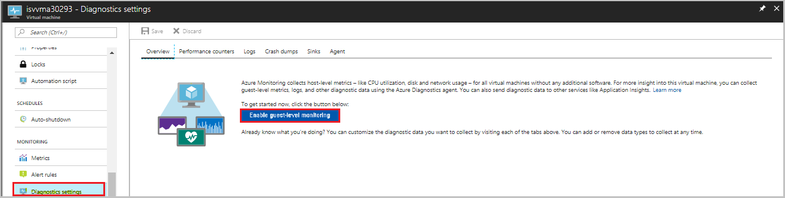
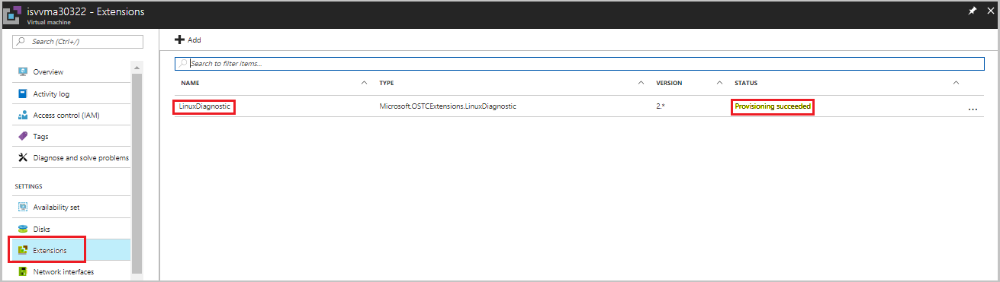
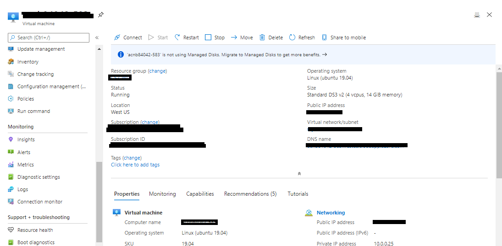
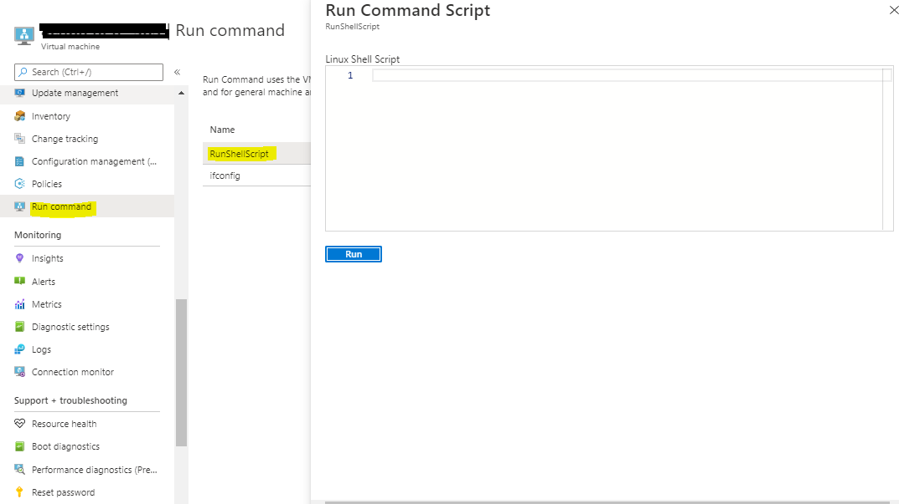

# VM certification troubleshooting

When you publish your virtual machine (VM) image to Azure Marketplace, the Azure team validates it to ensure its bootability, security, and Azure compatibility. If any of the high-quality tests fail, the publishing will fail, and you'll receive an error message that describes the issue.

This article explains common error messages during VM image publishing, along with related solutions.

> [!NOTE]
> If you have questions or feedback for improvement, please contact Partner Center [support](https://aka.ms/marketplacepublishersupport).

## Approved base image

When you submit a request to republish your image with updates, the part-number verification test case might fail. If it fails, your image won't be approved.

This failure occurs when you use a base image that belongs to another publisher and you've updated the image. In this situation, you won't be allowed to publish your image.

To fix this issue, retrieve the image from Azure Marketplace and make changes to it. For more information, see the following articles:

- [Linux images](../virtual-machines/linux/endorsed-distros.md?toc=/azure/virtual-machines/linux/toc.json)
- [Windows images](azure-vm-create-using-approved-base.md)

> [!Note]
> If you are using a Linux base image not taken from Marketplace, you can offset the first partition by 2048 KB. This allows the unformatted space to be used for adding new billing info and allows Azure to go ahead with publishing your VM to Marketplace.  

## VM extension failure

Check to see whether your image supports VM extensions.

To enable VM extensions, do the following:

1. Select your Linux VM.
1. Go to **Diagnostics settings**.
1. Enable Base matrices by updating the **Storage account**.
1. Select **Save**.

   

To verify that the VM extensions are properly activated, do the following:

1. In the VM, select the **VM extensions** tab, and then verify the status of the **Linux Diagnostics Extension**.
1. 
    * If the status is *Provisioning Succeeded*, the extensions test case has passed.  
    * If the status is *Provisioning Failed*, the extensions test case has failed and you need to set the Hardened flag.

      

      If the VM extension fails, see [Use Linux Diagnostic Extension to monitor metrics and logs](../virtual-machines/extensions/diagnostics-linux.md) to enable it. If you don't want the VM extension to be enabled, contact the Support team, and ask them to disable it.

## VM provisioning issue

Check to ensure that you've followed the VM provisioning process rigorously before you submit your offer. To view the JSON format for provisioning the VM, see [Test a virtual machine image](azure-vm-image-test.md).

Provisioning issues can include the following failure scenarios:

|Scenario|Error|Reason|Solution|
|---|---|---|---|
|1|Invalid virtual hard disk (VHD)|If the specified cookie value in the VHD footer is incorrect, the VHD will be considered invalid.|Re-create the image and submit the request.|
|2|Invalid blob type|VM provisioning failed because the used block is a blob type instead of a page type.|Re-create the image and submit the request.|
|3|Provisioning timeout or not properly generalized|There's an issue with VM generalization.|Re-create the image with generalization and submit the request.|
|

> [!NOTE]
> For more information about VM generalization, see:
> - [Linux documentation](azure-vm-create-using-approved-base.md#generalize-the-image)
> - [Windows documentation](../virtual-machines/windows/capture-image-resource.md#generalize-the-windows-vm-using-sysprep)

## Software compliance for Windows

If your Windows image request is rejected because of a software compliance issue, you might have created a Windows image with the installed SQL server instance instead of taking the relevant SQL version base image from Azure Marketplace.

Don't create your own Windows image with SQL server installed in it. Instead, use the approved SQL base images (Enterprise/Standard/web) from Azure Marketplace.

If you're trying to install Visual Studio or any Office-licensed product, contact the Support team for prior approval.

For more information about selecting an approved base, see [Create a virtual machine from an approved base](azure-vm-create-using-approved-base.md).

## Tool kit test case execution failed

The Microsoft Certification toolkit can help you run test cases and verify that your VHD or image is compatible with the Azure environment.

Download the [Microsoft Certification toolkit](azure-vm-image-test.md).

## Linux test cases

The following table lists the Linux test cases that the toolkit will run. Test validation is stated in the description.

|Scenario|Test case|Description|
|---|---|---|
|1|Bash history|Bash history files should be cleared before you create the VM image.|
|2|Linux Agent version|Azure Linux Agent 2.2.41 or later should be installed.|
|3|Required kernel parameters|Verifies that the following kernel parameters are set:  console=ttyS0 earlyprintk=ttyS0 rootdelay=300|
|4|Swap partition on OS disk|Verifies that swap partitions aren't created on the OS disk.|
|5|Root partition on OS disk|Create a single root partition for the OS disk.|
|6|OpenSSL version|The OpenSSL version should be v0.9.8 or later.|
|7|Python version|Python version 2.6 or later is highly recommended.|
|8|Client Alive Interval|Set ClientAliveInterval to 180. On the application need, it can be set from 30 to 235. If you're enabling the SSH for your end users, this value must be set as explained.|
|9|OS architecture|Only 64-bit operating systems are supported.|
|10|Auto Update|Identifies whether Linux Agent Auto Update is enabled.|

### Common errors found while executing previous test cases

The following table lists common errors that are found while executing previous test cases:
 
|Scenario|Test case|Error|Solution|
|---|---|---|---|
|1|Linux Agent version test case|The minimum Linux agent version is 2.2.41 or later. This requirement has been mandatory since May 1, 2020.|Please update Linux agent version and it should be 2.241 or later. For more information you can visit [Linux Agent Version update page](https://support.microsoft.com/help/4049215/extensions-and-virtual-machine-agent-minimum-version-support).|
|2|Bash history test case|You'll see an error if the size of the bash history in your submitted image is more than 1 kilobyte (KB). The size is restricted to 1 KB to ensure that any potentially sensitive information isn't captured in your bash history file.|To resolve this problem, mount the VHD to any other working VM and make any changes you want (for example, delete the *.bash* history files) to reduce the size to less than or equal to 1 KB.|
|3|Required kernel parameter test case|You'll receive this error when the value for **console** isn't set to **ttyS0**. Check by running the following command: `cat /proc/cmdline`|Set the value for **console** to **ttyS0**, and resubmit the request.|
|4|ClientAlive interval test case|If the toolkit result gives you a failed result for this test case, there is an inappropriate value for **ClientAliveInterval**.|Set the value for **ClientAliveInterval** to less than or equal to 235, and then resubmit the request.|

### Windows test cases

The following table lists the Windows test cases that the toolkit will run, along with a description of the test validation:

|Scenario |Test cases|Description|
|---|---|---|---|
|1|OS architecture|Azure supports only 64-bit operating systems.|
|2|User account dependency|Application execution shouldn't be dependent on the administrator account.|
|3|Failover cluster|The Windows Server failover clustering feature isn't yet supported. The application shouldn't be dependent on this feature.|
|4|IPV6|IPv6 isn't yet supported in the Azure environment. The application shouldn't be dependent on this feature.|
|5|DHCP|Dynamic Host Configuration Protocol Server role isn't yet supported. The application shouldn't be dependent on this feature.|
|6|Hyper-V|Hyper-V Server role isn't yet supported. The application shouldn't be dependent on this feature.|
|7|Remote access|Remote Access (Direct Access) Server role isn't yet supported. The application shouldn't be dependent on this feature.|
|8|Rights Management Services|Rights Management Services. The server role isn't yet supported. The application shouldn't be dependent on this feature.|
|9|Windows Deployment Services|Windows Deployment Services. The server role isn't yet supported. The application shouldn't be dependent on this feature.|
|10|BitLocker Drive Encryption|BitLocker Drive Encryption isn't supported on the operating system hard disk, but it might be used on data disks.|
|11|Internet Storage Name Server|The Internet Storage Name Server feature isn't yet supported. The application shouldn't be dependent on this feature.|
|12|Multipath I/O|Multipath I/O. This server feature isn't yet supported. The application shouldn't be dependent on this feature.|
|13|Network Load Balancing|Network Load Balancing. This server feature isn't yet supported. The application shouldn't be dependent on this feature.|
|14|Peer Name Resolution Protocol|Peer Name Resolution Protocol. This server feature isn't yet supported. The application shouldn't be dependent on this feature.|
|15|SNMP Services|The Simple Network Management Protocol (SNMP) Services feature isn't yet supported. The application shouldn't be dependent on this feature.|
|16|Windows Internet Name Service|Windows Internet Name Service. This server feature isn't yet supported. The application shouldn't be dependent on this feature.|
|17|Wireless LAN Service|Wireless LAN Service. This server feature isn't yet supported. The application shouldn't be dependent on this feature.|
|

If you come across any failures with the preceding test cases, refer to the **Description** column in the table for the solution. If you require more information, contact the Support team.

## Data disk size verification

If the size of any request that's submitted with the data disk is greater than 1023 gigabytes (GB), the request won't be approved. This rule applies to both Linux and Windows.

Resubmit the request with a size less than or equal to 1023 GB.

## OS disk size validation

Refer to the following rules for limitations on OS disk size. When you submit any request, verify that the OS disk size is within the limitation for Linux or Windows.

|OS|Recommended VHD size|
|---|---|
|Linux|30 GB to 1023 GB|
|Windows|30 GB to 250 GB|
|

As VMs allow access to the underlying operating system, ensure that the VHD size is sufficiently large for the VHD. Because disks aren’t expandable without downtime, use a disk size from 30 GB to 50 GB.

|VHD size|Actual occupied size|Solution|
|---|---|---|
|>500 tebibytes (TiB)|n/a|Contact the Support team for an exception approval.|
|250-500 TiB|>200 gibibytes (GiB) difference from blob size|Contact the Support team for an exception approval.|
|

> [!NOTE]
> Larger disk sizes incur higher costs and will incur a delay during the setup and replication process. Because of this delay and cost, the Support team might seek justification for the exception approval.

## WannaCry patch verification test for Windows

To prevent a potential attack related to the WannaCry virus, ensure that all Windows image requests are updated with the latest patch.

To check the Windows Server patched version for the OS detail and the minimum version it will support, refer to the following table:

The image file version can be verified from `C:\windows\system32\drivers\srv.sys` or `srv2.sys`.

> [!NOTE]
> Windows Server 2019 doesn't have any mandatory version requirements.

|OS|Version|
|---|---|
|Windows Serve 2008 R2|6.1.7601.23689|
|Windows Server 2012|6.2.9200.22099|
|Windows Server 2012 R2|6.3.9600.18604|
|Windows Server 2016|10.0.14393.953|
|Windows Server 2019|NA|
|

## SACK vulnerability patch verification

When you submit a Linux image, your request might be rejected because of kernel version issues.

Update the kernel with an approved version, and resubmit the request. You can find the approved kernel version in the following table. The version number should be equal to or greater than the number listed here.

If your image isn't installed with one of the following kernel versions, update it with the correct patches. Request the necessary approval from the Support team after the image is updated with these required patches:

- CVE-2019-11477
- CVE-2019-11478
- CVE-2019-11479

|OS family|Version|Kernel|
|---|---|---|
|Ubuntu|14.04 LTS|4.4.0-151|
||14.04 LTS|4.15.0-1049-*-azure|
||16.04 LTS|4.15.0-1049|
||18.04 LTS|4.18.0-1023|
||18.04 LTS|5.0.0-1025|
||18.10|4.18.0-1023|
||19.04|5.0.0-1010|
||19.04|5.3.0-1004|
|RHEL and Cent OS|6.10|2.6.32-754.15.3|
||7.2|3.10.0-327.79.2|
||7.3|3.10.0-514.66.2|
||7.4|3.10.0-693.50.3|
||7.5|3.10.0-862.34.2|
||7.6|3.10.0-957.21.3|
||7.7|3.10.0-1062.1.1|
||8.0|4.18.0-80.4.2|
||8.1|4.18.0-147|
||"7-RAW" (7.6)||
||"7-LVM" (7.6)|3.10.0-957.21.3|
||RHEL-SAP 7.4|TBD|
||RHEL-SAP 7.5|TBD|
|SLES|SLES11SP4 (including SAP)|3.0.101-108.95.2|
||SLES12SP1 for SAP|3.12.74-60.64.115.1|
||SLES12SP2 for SAP|4.4.121-92.114.1|
||SLES12SP3|4.4180-4.31.1 (kernel-azure)|
||SLES12SP3 for SAP|4.4.180-94.97.1|
||SLES12SP4|4.12.14-6.15.2 (kernel-azure)|
||SLES12SP4 for SAP|4.12.14-95.19.1|
||SLES15|4.12.14-5.30.1 (kernel-azure)|
||SLES15 for SAP|4.12.14-5.30.1 (kernel-azure)|
||SLES15SP1|4.12.14-5.30.1 (kernel-azure)|
|Oracle|6.10|UEK2 2.6.39-400.312.2 UEK3 3.8.13-118.35.2 RHCK 2.6.32-754.15.3
||7.0-7.5|UEK3 3.8.13-118.35.2 UEK4 4.1.12-124.28.3 RHCK follows RHEL above|
||7.6|RHCK 3.10.0-957.21.3 UEK5 4.14.35-1902.2.0|
|CoreOS Stable 2079.6.0|4.19.43*|
||Beta 2135.3.1|4.19.50*|
||Alpha 2163.2.1|4.19.50*|
|Debian|jessie (security)|3.16.68-2|
||jessie backports|4.9.168-1+deb9u3|
||stretch (security)|4.9.168-1+deb9u3|
||Debian GNU/Linux 10 (buster)|Debian 6.3.0-18+deb9u1|
||buster, sid (stretch backports)|4.19.37-5|
|

## Image size should be in multiples of megabytes

All VHDs on Azure must have a virtual size aligned to multiples of 1 megabyte (MB). If your VHD doesn't adhere to the recommended virtual size, your request might get rejected.

Follow guidelines when you're converting from a raw disk to VHD, and ensure that the raw disk size is a multiple of 1 MB. For more information, see [Information for non-endorsed distributions](../virtual-machines/linux/create-upload-generic.md).

## VM access denied

If you come across access denied issues while you're running the test cases on the VM, it might be because of insufficient privileges to run the test cases.

Check to see whether proper access is enabled for the account on which the self-test cases are running. If access is not enabled, enable it to run the test cases. If you don't want to enable access, you might share the self-test case results with the Support team.

## Download failure

Refer to the following table for any issues that arise when you download the VM image by using a shared access signature (SAS) URL.

|Scenario|Error|Reason|Solution|
|---|---|---|---|
|1|Blob not found|The VHD might either be deleted or moved from the specified location.||
|2|Blob in use|The VHD is used by another internal process.|The VHD should be in a used state when you download it by using an SAS URL.|
|3|Invalid SAS URL|The associated SAS URL for the VHD is incorrect.|Get the correct SAS URL.|
|4|Invalid signature|The associated SAS URL for the VHD is incorrect.|Get the correct SAS URL.|
|6|HTTP conditional header|The SAS URL is invalid.|Get the correct SAS URL.|
|7|Invalid VHD name|Check to see whether any special characters, such as a percent sign (%) or quotation marks ("), exist in the VHD name.|Rename the VHD file by removing the special characters.|
|

## First MB (2048 KB) partition (Only for Linux)

When you submit the VHD, ensure that the first 2048 KB of the VHD is empty. Otherwise, your request will fail*.

>[!NOTE]
>*For certain special images, such as those built on top of Azure Windows base images taken from Azure Marketplace, we check for a Billing tag and ignore the MB partition if the billing tag is present and matches our internal available values.

## Default credentials

Always ensure that default credentials aren't sent with the submitted VHD. Adding default credentials makes the VHD more vulnerable to security threats. Instead, create your own credentials when you submit the VHD.
  
## DataDisk mapped incorrectly

When a request is submitted with multiple data disks, but their order isn't in sequence, this is considered a mapping issue. For example, if there are three data disks, the numbering order must be *0, 1, 2*. Any other order is treated as a mapping issue.

Resubmit the request with proper sequencing of data disks.

## Incorrect OS mapping

When an image is created, it might be mapped to or assigned the wrong OS label. For example, when you select **Windows** as a part of the OS name while you're creating the image, the OS disk should be installed only with Windows. The same requirement applies to Linux.

## VM not generalized

If all images that are taken from Azure Marketplace are to be reused, the operating system VHD must be generalized.

* For **Linux**, the following process generalizes a Linux VM and redeploys it as a separate VM.

  In the SSH window, enter the following command: `sudo waagent -deprovision+user`

* For **Windows**, you generalize Windows images by using `sysreptool`.

For more information about this tool, see [System preparation (Sysprep) overview]( https://docs.microsoft.com/windows-hardware/manufacture/desktop/sysprep--system-preparation--overview).

## DataDisk errors

For solutions to errors that are related to the data disk, use the following table:

|Error|Reason|Solution|
|---|---|---|
|`DataDisk- InvalidUrl:`|This error might occur because of an invalid number specified for the logical unit number (LUN) when the offer is submitted.|Verify that the LUN number sequence for the data disk is in Partner Center.|
|`DataDisk- NotFound:`|This error might occur because of a data disk not being located at a specified SAS URL.|Verify that the data disk is located at the SAS URL that's specified in the request.|
|

## Remote access issue

If the Remote Desktop Protocol (RDP) option isn't enabled for the Windows image, you will receive this error.

Enable RDP access for Windows images before you submit them.

## Bash history failed

You'll see this error if the size of the bash history in your submitted image is more than 1 kilobyte (KB). The size is restricted to 1 KB to ensure that any potentially sensitive 
information isn't captured in your bash history file.

Below are the steps to delete the “Bash History”.

Step 1.	Deploy the VM and click on “Run Command” option on Azure portal.

Step 2.	Select first option “RunShellScript” and run the below command.

Command: “cat /dev/null > ~/.bash_history && history -c”

Step 3. After successful executing the command, Restart the VM.

Step 4. Generalize the VM, take the Image VHD and Stop the VM.

Step 5. Re-Submit the generalized image.

## Requesting exceptions (custom templates) on VM images for selective tests

Publishers can request exceptions for few tests performed during VM certification. Exceptions are provided in extremely rare cases when publisher provides evidence to support the request. The Certification team reserves the right to deny or approve exceptions at any time.

In the sections below, we will talk about main scenarios where exceptions are requested and how to request one.

### Scenarios for exception

There are generally three scenarios/cases where publishers request exceptions.

- **Exception for one or more test cases** – Publishers contact Partner Center [support](https://aka.ms/marketplacepublishersupport) to request exceptions for test cases.

- **Locked-down VMs/No root access** – Few publishers have scenarios where VMs need to be locked as they have software such as firewalls installed on the VM. In this case, publishers can download the [Certified Test Tool](https://aka.ms/AzureCertificationTestTool) and submit the report at Partner Center [support](https://aka.ms/marketplacepublishersupport).

- **Custom templates** – Some publishers publish VM images that require a custom ARM template to deploy the VMs. In this case, publishers should submit the custom templates at Partner Center [support](https://aka.ms/marketplacepublishersupport) so the same can be used by the Certification team for validation.

### Information to provide for exception scenarios

Publishers should contact Partner Center [support](https://aka.ms/marketplacepublishersupport) for requesting exceptions for the above scenario with the additional following information:

   1. Publisher ID – The publisher ID on Partner Center portal
   2. Offer ID/name – The Offer ID/name for which exception is requested
   3. SKU/Plan ID – The plan ID/sku of the VM offer for which exception is requested
   4. Version – The version of the VM offer for which exception is requested
   5. Exception Type –Tests, Locked Down VM, Custom Templates
   6. Reason of request – Reason for this exception and information on tests to be exempted
   7. Timeline - Date till which this exception has been requested
   8. Attachment - Attach any importance evidence documents. For Locked Down VMs, attach the test report and for custom templates, provide the custom ARM template as attachment. Failure to attach report for Locked Down VMs and custom ARM template for custom templates will result in denial of request

## Address a vulnerability or exploit in a VM offer

This section describes how to provide a new VM image when a vulnerability or exploit is discovered with one of your VM images. This applies only to Azure Virtual Machine offers published to the Azure Marketplace.

> [!NOTE]
> You can't remove the last VM image from a plan or stop-sell the last plan for an offer.

Do one of the following:

- If you have a new VM image to replace the vulnerable VM image, see [Provide a fixed VM image](#provide-a-fixed-vm-image) below.
- If you don't have a new VM image to replace the only VM image in a plan, or if you're done with the plan, [stop selling the plan](partner-center-portal/update-existing-offer.md#stop-selling-an-offer-or-plan).
- If you don't plan to replace the only VM image in the offer, we recommend you [stop selling the offer](partner-center-portal/update-existing-offer.md#stop-selling-an-offer-or-plan).

### Provide a fixed VM image

To provide a fixed VM image to replace a VM image that has a vulnerability or exploit, do the following:

1. Provide a new VM image to address the security vulnerability or exploit.
2. Remove the VM image with the security vulnerability or exploit.
3. Republish the offer.

#### Provide a new VM image to address the security vulnerability or exploit

To complete these steps you'll need to prepare the technical assets for the VM image you want to add. For more information, see [Prepare technical assets](azure-vm-create-technical-assets.md) and [Generate a SAS URI for your VM image](azure-vm-get-sas-uri.md).

1. Sign in to [Partner Center](https://partner.microsoft.com/dashboard/home).
2. In the left-navigation menu, select **Commercial Marketplace** > **Overview**.
3. In the **Offer alias** column, select the offer.
4. On the **Plan overview** tab, in the **Name** column, select the plan you want to add the VM to.
5. On the **Technical configuration** tab, under **VM Images** , select **+ Add VM Image**.

> [!NOTE]
> You can add only one VM image to one plan at a time. To add multiple VM images, publish the first one and wait until it reaches the Publisher sign-off stage, then add the next VM image.

6. In the boxes that appear, provide a new disk version and the virtual machine image.
7. Select **Save draft**.

Continue with the next section below to remove the VM image with the security vulnerability.

#### Remove the VM image with the security vulnerability or exploit

1. Sign in to [Partner Center](https://partner.microsoft.com/dashboard/home).
2. In the left-navigation menu, select **Commercial Marketplace** > **Overview**.
3. In the **Offer alias** column, select the offer.
4. On the **Plan overview** tab, in the **Name** column, select the plan with the VM you want to remove.
5. On the **Technical configuration** tab, under **VM Images** , next to the VM image you want to remove, select **Remove VM Image**.
6. In the dialog box that appears, select **Continue**.
7. Select **Save draft**.

Continue with the next section below to republish the offer.

#### Republish the offer

1. Select **Review and publish**.
2. If you need to provide any information to the certification team, add it to the **Notes for certification** box.
3. Select **Publish**.

To complete the publishing process, see [Review and publish offers](review-publish-offer.md).

## Next steps

- [Configure VM offer properties](azure-vm-create-properties.md)
- [Active marketplace rewards](partner-center-portal/marketplace-rewards.md)
- If you have questions or feedback for improvement, contact Partner Center [support](https://aka.ms/marketplacepublishersupport).
