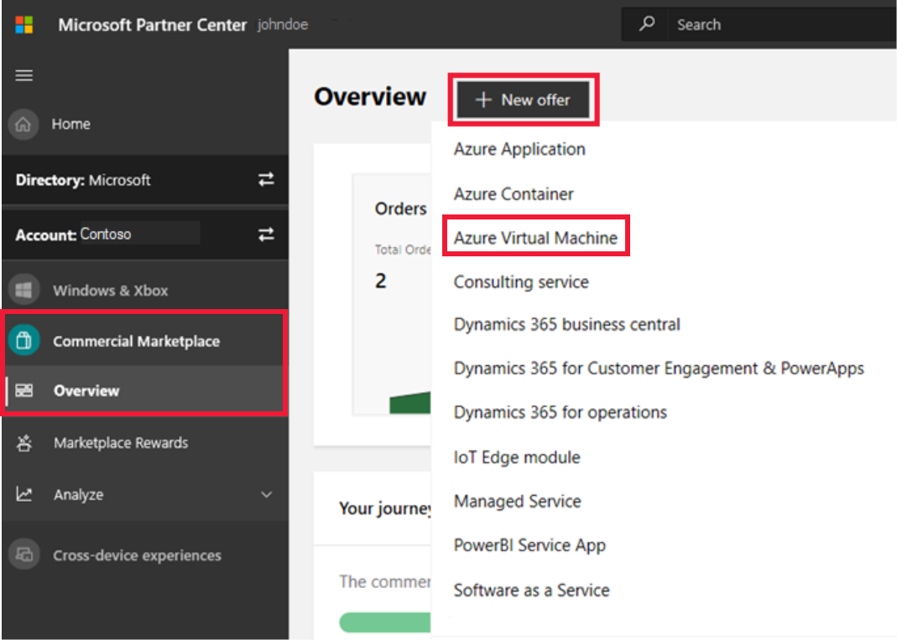

# How to create a virtual machine offer on Azure Marketplace

This article describes how to create an Azure virtual machine offer for [Azure Marketplace](https://azuremarketplace.microsoft.com/). It addresses both Windows-based and Linux-based virtual machines that contain an operating system, a virtual hard disk (VHD), and up to 16 data disks.

Before you start, [create a commercial marketplace account in Partner Center](create-account.md). Ensure that your account is enrolled in the commercial marketplace program.

## Before you begin

If you haven't done so yet, review [Plan a virtual machine offer](marketplace-virtual-machines.md). It will explain the technical requirements for your virtual machine and list the information and assets you’ll need when you create your offer.

## Create a new offer

1. Sign in to [Partner Center](https://partner.microsoft.com/dashboard/home).
2. On the left pane, select **Commercial Marketplace** > **Overview**.
3. On the **Overview** page, select **+ New offer** > **Azure Virtual Machine**.

    

> [!NOTE]
> After your offer is published, any edits you make to it in Partner Center appear on Azure Marketplace only after you republish the offer. Be sure to always republish an offer after making changes to it.

Enter an **Offer ID**. This is a unique identifier for each offer in your account.

- This ID is visible to customers in the web address for the Azure Marketplace offer and in Azure PowerShell and the Azure CLI, if applicable.
- Use only lowercase letters and numbers. The ID can include hyphens and underscores, but no spaces, and is limited to 50 characters. For example, if you enter **test-offer-1**, the offer web address will be `https://azuremarketplace.microsoft.com/marketplace/../test-offer-1`.
- The Offer ID can't be changed after you select **Create**.

Enter an **Offer alias**. The offer alias is the name that's used for the offer in Partner Center.

- This name is not used on Azure Marketplace. It is different from the offer name and other values that are shown to customers.

Select **Create** to generate the offer and continue. Partner Center opens the **Offer setup** page.

## Enable a test drive (optional)

A test drive is a great way to showcase your offer to potential customers by giving them access to a preconfigured environment for a fixed number of hours. Offering a test drive results in an increased conversion rate and generates highly qualified leads. To learn more about test drives, see [What is a test drive?](./what-is-test-drive.md).

> [!TIP]
> A test drive is different from a free trial. You can offer either a test drive, free trial, or both. They both provide customers with your solution for a fixed period-of-time. But, a test drive also includes a hands-on, self-guided tour of your product’s key features and benefits being demonstrated in a real-world implementation scenario.

To enable a test drive, select the **Enable a test drive** check box. You will configure the test drive later. With test drive, configuring a CRM is required (see next section).

## Configure customer leads management

[!INCLUDE [Customer leads](includes/customer-leads.md)] 

Select **Save draft** before continuing to the next tab in the left-nav menu, **Properties**.

## Next steps

- [How to configure virtual machine offer properties](azure-vm-create-properties.md)
- [Offer listing best practices](gtm-offer-listing-best-practices.md)