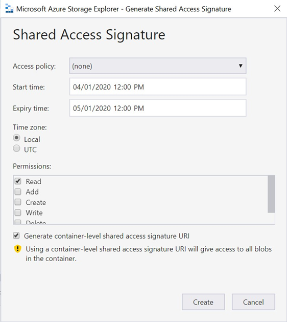
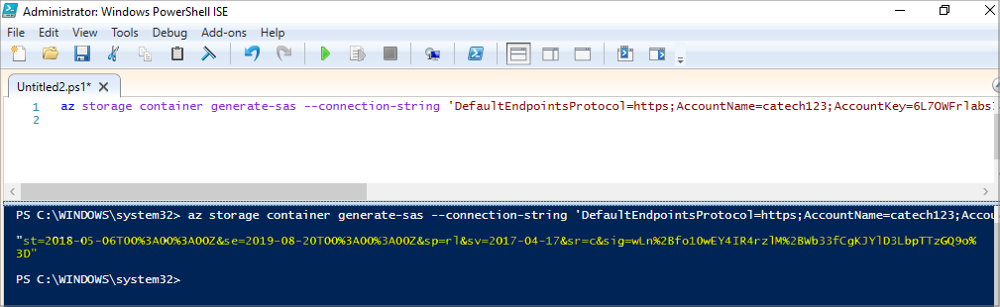
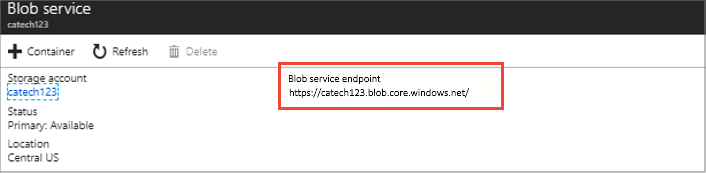

# How to generate a SAS URI for a VM image

> [!NOTE]
> You don’t need a SAS URI to publish your VM. You can simply share an image in Parter Center. Refer to [Create a virtual machine using an approved base](./azure-vm-create-using-approved-base.md) or [Create a virtual machine using your own image](./azure-vm-create-using-own-image.md) instructions.

Generating SAS URIs for your VHDs has these requirements:

- Only List and Read permissions are required. Don’t provide Write or Delete access.
- The duration for access (expiry date) should be a minimum of three weeks from when the SAS URI is created.
- To protect against UTC time changes, set the start date to one day before the current date. For example, if the current date is June 16, 2020, select 6/15/2020.

## Extract vhd from a VM

> [!NOTE]
> You can skip this step if you already have a vhd uploaded in a Storage Account.

To extract the vhd from your VM, you need to take a snapshot of your VM disk and extract vhd from the snapshot.

Start by taking a snapshot of the VM disk:

1. Sign in to the Azure portal.
2. Starting at the upper-left, select Create a resource, then search for and select Snapshot.
3. In the Snapshot blade, select Create.
4. Enter a Name for the snapshot.
5. Select an existing resource group or enter the name for a new one.
6. For Source disk, select the managed disk to snapshot.
7. Select the Account type to use to store the snapshot. Use Standard HDD unless you need it stored on a high performing SSD.
8. Select Create.

### Extract the VHD

Use the following script to export the snapshot into a VHD in your storage account.

```azurecli
#Provide the subscription Id where the snapshot is created
$subscriptionId=yourSubscriptionId

#Provide the name of your resource group where the snapshot is created
$resourceGroupName=myResourceGroupName

#Provide the snapshot name
$snapshotName=mySnapshot

#Provide Shared Access Signature (SAS) expiry duration in seconds (such as 3600)
#Know more about SAS here: https://docs.microsoft.com/en-us/azure/storage/storage-dotnet-shared-access-signature-part-1
$sasExpiryDuration=3600

#Provide storage account name where you want to copy the underlying VHD file. Currently, only general purpose v1 storage is supported.
$storageAccountName=mystorageaccountname

#Name of the storage container where the downloaded VHD will be stored.
$storageContainerName=mystoragecontainername

#Provide the key of the storage account where you want to copy the VHD 
$storageAccountKey=mystorageaccountkey

#Give a name to the destination VHD file to which the VHD will be copied.
$destinationVHDFileName=myvhdfilename.vhd

az account set --subscription $subscriptionId

$sas=$(az snapshot grant-access --resource-group $resourceGroupName --name $snapshotName --duration-in-seconds $sasExpiryDuration --query [accessSas] -o tsv)

az storage blob copy start --destination-blob $destinationVHDFileName --destination-container $storageContainerName --account-name $storageAccountName --account-key $storageAccountKey --source-uri $sas
```

### Script explanation
This script uses following commands to generate the SAS URI for a snapshot and copies the underlying VHD to a storage account using the SAS URI. Each command in the table links to command specific documentation.


|Command  |Notes  |
|---------|---------|
| az disk grant-access    |     Generates read-only SAS that is used to copy the underlying VHD file to a storage account or download it to on-premises    |
|  az storage blob copy start   |    Copies a blob asynchronously from one storage account to another. Use az storage blob show to check the status of the new blob.     |
|

## Generate the SAS address

There are two common tools used to create a SAS address (URL):

1. **Azure Storage Explorer** – Available on the Azure portal.
2. **Azure CLI** – Recommended for non-Windows operating systems and automated or continuous integration environments.

### Using Tool 1: Azure Storage Explorer

1. Go to your **Storage Account**.
1. Open **Storage Explorer**.

    :::image type="content" source="media/create-vm/storge-account-explorer.png" alt-text="Storage account window.":::

3. In the **Container**, right-click the VHD file and select **Get Share Access Signature**.
4. In the **Shared Access Signature** dialog box, complete the following fields:

    1. Start time – Permission start date for VHD access. Provide a date that is one day before the current date.
    2. Expiry time – Permission expiration date for VHD access. Provide a date at least three weeks beyond the current date.
    3. Permissions – Select the Read and List permissions.
    4. Container-level – Check the Generate container-level shared access signature URI check box.

    

5. To create the associated SAS URI for this VHD, select **Create**.
6. Copy the URI and save it to a text file in a secure location. This generated SAS URI is for container-level access. To make it specific, edit the text file to add the VHD name.
7. Insert your VHD name after the vhds string in the SAS URI (include a forward slash). The final SAS URI should look like this:

    `<blob-service-endpoint-url> + /vhds/ + <vhd-name>? + <sas-connection-string>`

8. Repeat these steps for each VHD in the plans you will publish.

### Using Tool 2: Azure CLI

1. Download and install [Microsoft Azure CL](/cli/azure/install-azure-cli)I. Versions are available for Windows, macOS, and various distros of Linux.
2. Create a PowerShell file (.ps1 file extension), copy in the following code, then save it locally.

    ```azurecli-interactive
    az storage container generate-sas --connection-string ‘DefaultEndpointsProtocol=https;AccountName=<account-name>;AccountKey=<account-key>;EndpointSuffix=core.windows.net’ --name <container-name> --permissions rl --start ‘<start-date>’ --expiry ‘<expiry-date>’
    ```

3. Edit the file to use the following parameter values. Provide dates in UTC datetime format, such as 2020-04-01T00:00:00Z.

    - account-name – Your Azure storage account name.
    - account-key – Your Azure storage account key.
    - start-date – Permission start date for VHD access. Provide a date one day before the current date.
    - expiry-date – Permission expiration date for VHD access. Provide a date at least three weeks after the current date.

    Here's an example of proper parameter values (at the time of this writing):

    ```azurecli-interactive
    az storage container generate-sas --connection-string ‘DefaultEndpointsProtocol=https;AccountName=st00009;AccountKey=6L7OWFrlabs7Jn23OaR3rvY5RykpLCNHJhxsbn9ON c+bkCq9z/VNUPNYZRKoEV1FXSrvhqq3aMIDI7N3bSSvPg==;EndpointSuffix=core.windows.net’ --name <container-name> -- permissions rl --start ‘2020-04-01T00:00:00Z’ --expiry ‘2021-04-01T00:00:00Z’
    ```

1. Save the changes.
2. Using one of the following methods, run this script with administrative privileges to create a SAS connection string for container-level access:

    - Run the script from the console. In Windows, right-click the script and select **Run as administrator**.
    - Run the script from a PowerShell script editor such as [Windows PowerShell ISE](/powershell/scripting/components/ise/introducing-the-windows-powershell-ise). This screen shows the creation of a SAS connection string within this editor:

    [](media/vm/create-sas-uri-power-shell-ise.png#lightbox)

6. Copy the SAS connection string and save it to a text file in a secure location. Edit this string to add the VHD location information to create the final SAS URI.
7. In the Azure portal, go to the blob storage that includes the VHD associated with the new URI.
8. Copy the URL of the blob service endpoint:

    

9. Edit the text file with the SAS connection string from step 6. Create the complete SAS URI using this format:

    `<blob-service-endpoint-url> + /vhds/ + <vhd-name>? + <sas-connection-string>`

## Verify the SAS URI

Check the SAS URI before publishing it on Partner Center to avoid any issues related to SAS URI post submission of the request. This process is optional but recommended.

- The URI includes your VHD image filename, including the filename extension `.vhd`.
- `Sp=rl` appears near the middle of your URI. This string shows Read and List access is specified.
- When `sr=c` appears, this means that container-level access is specified.
- Copy and paste the URI into a browser to test-download the blob (you can cancel the operation before the download completes).

## Next steps

- If you run into issues, see [VM SAS failure messages](azure-vm-sas-failure-messages.md).
- [Sign in to Partner Center](https://partner.microsoft.com/dashboard/account/v3/enrollment/introduction/partnership)
- [Create a virtual machine offer on Azure Marketplace](azure-vm-create.md)