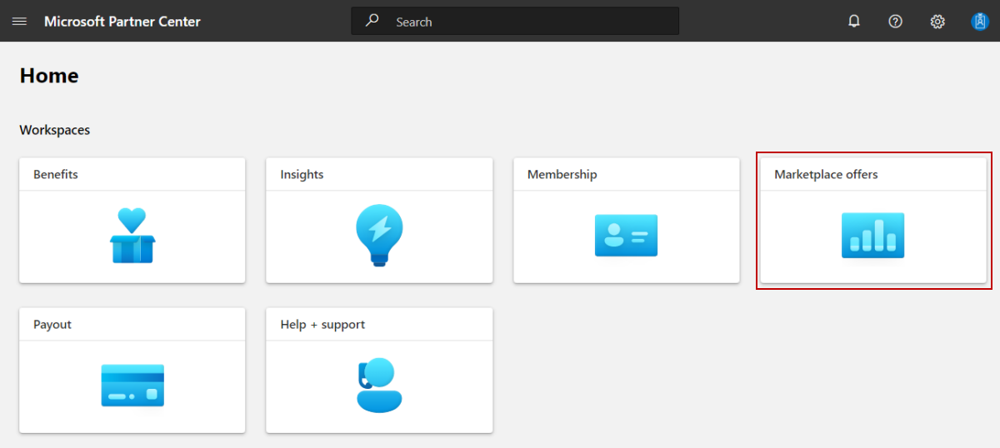
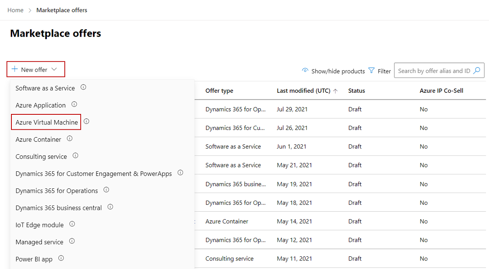

# Create a virtual machine offer on Azure Marketplace

This article describes how to create an Azure virtual machine offer for [Azure Marketplace](https://azuremarketplace.microsoft.com/). It addresses both Windows-based and Linux-based virtual machines that contain an operating system, a virtual hard disk (VHD), and up to 16 data disks.

Before you start, [create a commercial marketplace account in Partner Center](create-account.md). Ensure that your account is enrolled in the commercial marketplace program.

## Before you begin

Before you can publish an Azure Container offer, you must have a commercial marketplace account in Partner Center and ensure your account is enrolled in the commercial marketplace program. See [Create a commercial marketplace account in Partner Center](create-account.md) and [Verify your account information when you enroll in a new Partner Center program](/partner-center/verification-responses#checking-your-verification-status).

If you haven't done so yet, review [Plan a virtual machine offer](marketplace-virtual-machines.md). It will explain the technical requirements for your virtual machine and list the information and assets you’ll need when you create your offer.

## Create a new offer

1. Sign in to [Partner Center](https://go.microsoft.com/fwlink/?linkid=2166002).

1. On the Home page, select the **Marketplace offers** tile.

    

1. On the Marketplace offers page, select **+ New offer** > **Azure Virtual Machine**.

    

    > [!NOTE]
    > After an offer is published, any edits you make to it in Partner Center appear on Azure Marketplace only after you republish the offer. Be sure to always republish an offer after making changes to it.

1. Enter an **Offer ID**. This is a unique identifier for each offer in your account.

    - This ID is visible to customers in the web address for the Azure Marketplace offer and in Azure PowerShell and the Azure CLI, if applicable.
    - Use only lowercase letters and numbers. The ID can include hyphens and underscores, but no spaces, and is limited to 50 characters. For example, if you enter **test-offer-1**, the offer web address will be `https://azuremarketplace.microsoft.com/marketplace/../test-offer-1`.
    - The Offer ID can't be changed after you select **Create**.

1. Enter an **Offer alias**. The offer alias is the name that's used for the offer in Partner Center.

    - This name is not used on Azure Marketplace. It is different from the offer name and other values that are shown to customers.

1. Associate the new offer with a _publisher_. A publisher represents an account for your organization. You may have a need to create the offer under a particular publisher. If you don’t, you can simply accept the publisher account you’re signed in to.

    > [!NOTE]
    > The selected publisher must be enrolled in the [**Commercial Marketplace program**](marketplace-faq-publisher-guide.yml#how-do-i-sign-up-to-be-a-publisher-in-the-microsoft-commercial-marketplace-) and cannot be modified after the offer is created.

1. Select **Create** to generate the offer and continue. Partner Center opens the **Offer setup** page.

## Test drive (optional)

[!INCLUDE [Test drives section](includes/test-drives.md)]

For VM offers, Azure Resource Manager (ARM) deployment is the only test drive option available. The deployment template must contain all the Azure resources that comprise your solution.

To enable a test drive, select the **Enable a test drive** check box; this will enable a Test drive tab in the left-nav menu. You will configure and create the listing of your test drive using that tab later in [Configure a VM test drive](azure-vm-test-drive.md).

When a customer activates a test drive, you’ll receive a lead in the [Referrals workspace](https://partner.microsoft.com/dashboard/referrals/v2/leads) in Partner Center.

You can also connect the offer to your customer relationship management (CRM) system to manage leads there.

> [!NOTE]
> Connecting to a CRM system is optional.

## Customer leads

When a customer expresses interest or deploys your product, you’ll receive a lead in the [Referrals workspace](https://partner.microsoft.com/dashboard/referrals/v2/leads) in Partner Center.

You can also connect the product to your customer relationship management (CRM) system to handle leads there.

> [!NOTE]
> Connecting to a CRM system is optional.

To configure the lead management in Partner Center:

1. Under **Customer leads**, select the **Connect** link.
1. In the **Connection details** dialog box, select a lead destination.
1. Complete the fields that appear. For detailed steps, see the following articles:

   - [Configure your offer to send leads to the Azure table](./partner-center-portal/commercial-marketplace-lead-management-instructions-azure-table.md#configure-your-offer-to-send-leads-to-the-azure-table)
   - [Configure your offer to send leads to Dynamics 365 Customer Engagement](./partner-center-portal/commercial-marketplace-lead-management-instructions-dynamics.md#configure-your-offer-to-send-leads-to-dynamics-365-customer-engagement) (formerly Dynamics CRM Online)
   - [Configure your offer to send leads to HTTPS endpoint](./partner-center-portal/commercial-marketplace-lead-management-instructions-https.md#configure-your-offer-to-send-leads-to-the-https-endpoint)
   - [Configure your offer to send leads to Marketo](./partner-center-portal/commercial-marketplace-lead-management-instructions-marketo.md#configure-your-offer-to-send-leads-to-marketo)
   - [Configure your offer to send leads to Salesforce](./partner-center-portal/commercial-marketplace-lead-management-instructions-salesforce.md#configure-your-offer-to-send-leads-to-salesforce)

1. To validate the configuration you provided, select the **Validate** link.
1. Select **Connect**.

    For more information, see [Customer leads from your commercial marketplace offer](partner-center-portal/commercial-marketplace-get-customer-leads.md).

1. Select **Save draft** before continuing to the next tab in the left-nav menu, **Properties**.

## Next steps

- [Configure virtual machine offer properties](azure-vm-properties.md)
- [Offer listing best practices](gtm-offer-listing-best-practices.md)
