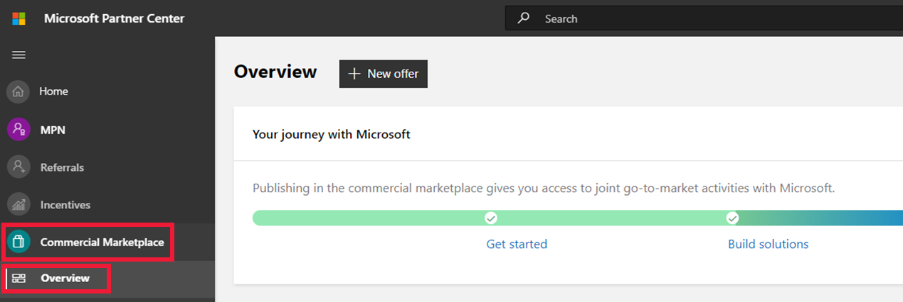
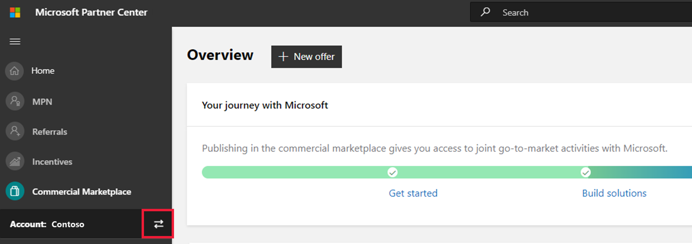
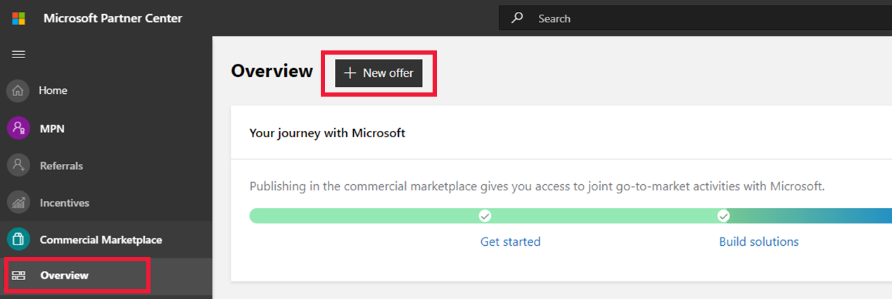
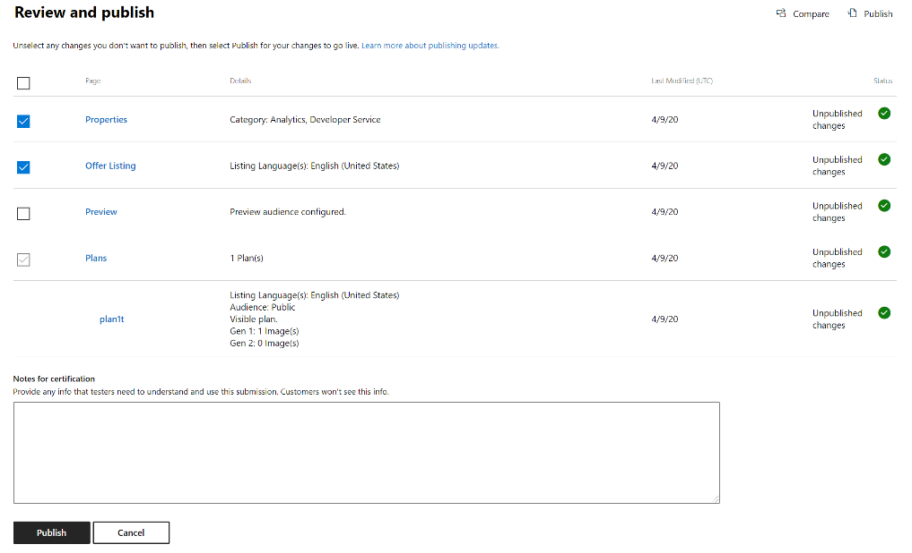
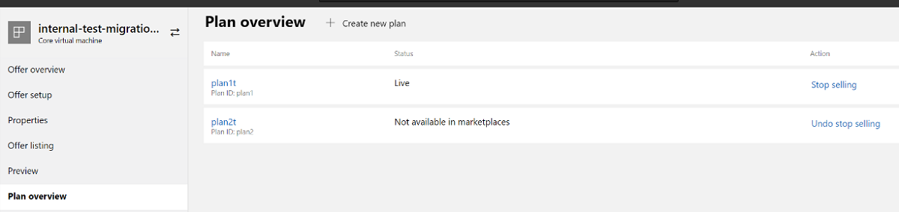
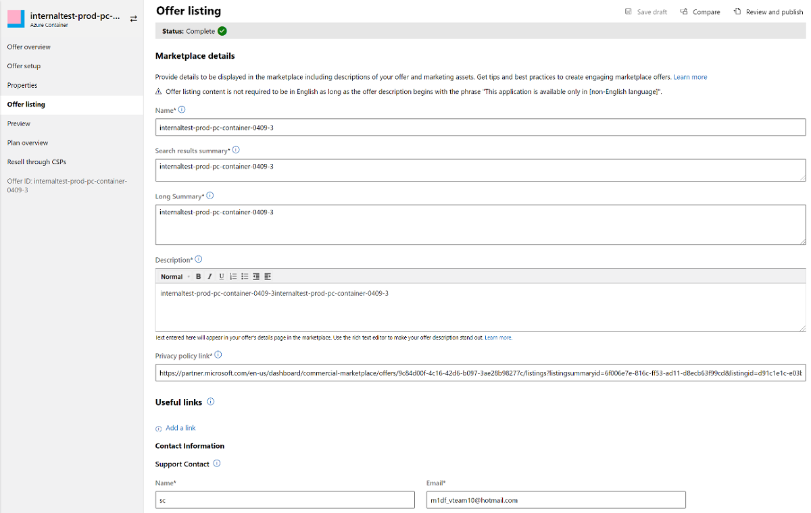
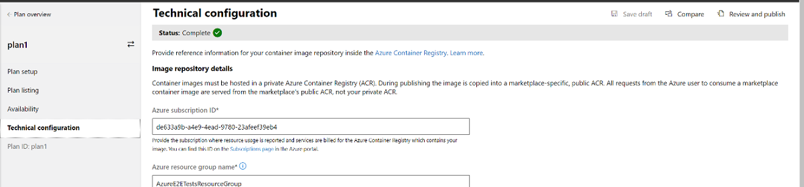
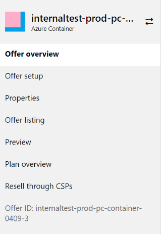
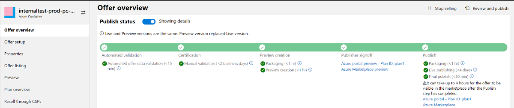

# Frequently asked questions about transitioning from the Cloud Partner Portal to Partner Center

The Cloud Partner Portal has transitioned to Partner Center. Partner Center offers a streamlined, integrated experience for publishing new offers on [Microsoft AppSource](https://appsource.microsoft.com/) or [Azure Marketplace](https://azuremarketplace.microsoft.com/) and for managing existing offers that were migrated from the Cloud Partner Portal. All the functions of the Cloud Partner Portal are available in Partner Center. This article addresses commonly asked questions about this.

## What does the transition to Partner Center mean for me?

You can continue doing business as usual in Partner Center:

| Area | Changes |
| --- | --- |
| Account | No need to create a new Partner Center account; you can use your existing Cloud Partner Portal credentials to log into Partner Center where you will now manage your account, users, permissions, and billing. The publishing agreement and company profile information are migrated to your new Partner Center account, along with any payout profile information, user accounts and permissions, and active offers. Learn more at [Manage your commercial marketplace account in Partner Center](partner-center-portal/manage-account.md). |
| Offer publishing and offer management experience | We've moved your offer data from the Cloud Partner Portal to Partner Center. You will now access your offers in Partner Center, which offers an improved user experience and intuitive interface. Learn how to [Update an existing offer in the Commercial Marketplace](partner-center-portal/update-existing-offer.md). |
| Availability of your offers in the commercial marketplace | No changes. If your offer is live in the commercial marketplace it will continue to be live. |
| New purchases and deployments | No changes. Your customers can continue purchasing and deploying your offers with no interruptions. |
| Payouts | Any purchases and deployments will continue to be paid out to you as normal. Learn more about [Getting paid in the commercial marketplace](partner-center-portal/get-paid.md). |
| API integrations with existing [Cloud Partner Portal APIs](cloud-partner-portal-api-overview.md) | Existing Cloud Partner Portal APIs are still supported and your existing integrations still work. Learn more at [Will the Cloud Partner Portal REST APIs be supported?](#are-the-cloud-partner-portal-rest-apis-still-supported) |
| Analytics | You can continue to monitor sales, evaluate performance, and optimize your offers in the commercial marketplace by viewing analytics in Partner Center. Learn more at [Access analytic reports for the commercial marketplace in Partner Center](partner-center-portal/analytics.md). |
|||

## Do I need to create a new account to manage my offers in Partner Center?

No, your account will be preserved. This means that if you're an existing partner, you can use your existing Cloud Partner Portal account credentials to sign in to Partner Center. Don't create a new account or any offers created in Cloud Partner Portal and moved to Partner Center won't be associated with it.

## What pages in Partner Center correspond to pages I used in the Cloud Partner Portal?

Following are Partner Center links for pages commonly used in the Cloud Partner Portal. If you saved the Cloud Partner Portal links as bookmarks, you'll want to update them.

| Cloud Partner Portal page | Cloud Partner Portal page link | Partner Center page link |
| --- | --- | --- |
| All offers page | [https://cloudpartner.azure.com/#alloffers](https://cloudpartner.azure.com/#alloffers) | [https://partner.microsoft.com/dashboard/commercial-marketplace/overview](https://partner.microsoft.com/dashboard/commercial-marketplace/overview) |
| All publishers page | [https://cloudpartner.azure.com/#publishers](https://cloudpartner.azure.com/#publishers) | [https://partner.microsoft.com/dashboard/account/v3/publishers/list](https://partner.microsoft.com/dashboard/account/v3/publishers/list) |
| Publisher profile | [https://cloudpartner.azure.com/#profile](https://cloudpartner.azure.com/#profile) | [https://partner.microsoft.com/dashboard/account/management](https://partner.microsoft.com/dashboard/account/management) |
| Users page | [https://cloudpartner.azure.com/#users](https://cloudpartner.azure.com/#users) | [https://partner.microsoft.com/dashboard/account/usermanagement](https://partner.microsoft.com/dashboard/account/usermanagement) |
| History page | [https://cloudpartner.azure.com/#history](https://cloudpartner.azure.com/#history) | The History feature is not yet supported in Partner Center. |
| Insights dashboard | [https://cloudpartner.azure.com/#insights](https://cloudpartner.azure.com/#insights) | [https://partner.microsoft.com/dashboard/commercial-marketplace/analytics/summary](https://partner.microsoft.com/dashboard/commercial-marketplace/analytics/summary) |
| Payout report | [https://cloudpartner.azure.com/#insights/payout](https://cloudpartner.azure.com/#insights/payout) | [https://partner.microsoft.com/dashboard/payouts/reports/incentivepayments](https://partner.microsoft.com/dashboard/payouts/reports/incentivepayments) |
|||

## What about offers I published in the Cloud Partner Portal?

The offers were moved to Partner Center and will be accessible to you after you sign in to Partner Center, with the exception of Dynamics Nav Managed Service and Cortana Intelligence offers. If your offer was live in the commercial marketplace, it will continue to be live and your customers will continue to be able to purchase and deploy it without interruptions. See the next question, **What offers were moved to Partner Center?**, for more details.

## What offers were moved to Partner Center?

All offer types previously supported in the Cloud Partner Portal are supported in Partner Center, with the exception of Dynamics Nav Managed Service and Cortana Intelligence offers.

For the offer types supported in Partner Center, all offers were moved regardless of their status; draft, de-listed, and preview-only offers also moved.

| Offer type | Moved to Partner Center? | Next steps |
| --- | --- | --- |
| SaaS | Yes | Sign in to Partner Center to create new offers and manage offers that were created in Cloud Partner Portal. Learn more at [Create a new SaaS offer in the commercial marketplace](partner-center-portal/create-new-saas-offer.md). |
| Virtual Machine | Yes | Sign in to Partner Center to create new offers and manage offers that were created in Cloud Partner Portal. Learn more at [Create an Azure virtual machine offer on Azure Marketplace](partner-center-portal/azure-vm-create-offer.md). |
| Azure application | Yes | Sign in to Partner Center to create new offers and manage offers that were created in Cloud Partner Portal. Learn more at [Create an Azure application offer](partner-center-portal/create-new-azure-apps-offer.md). |
| Dynamics 365 Business Central | Yes | Sign in to Partner Center to create new offers and manage offers that were created in Cloud Partner Portal. Learn more at [Create a Dynamics 365 Business Central offer](partner-center-portal/create-new-business-central-offer.md). |
| Dynamics 365 for Customer Engagement & PowerApps | Yes | Sign in to Partner Center to create new offers and manage offers that were created in Cloud Partner Portal. Learn more at [Create a Dynamics 365 for Customer Engagement & PowerApps offer](partner-center-portal/create-new-customer-engagement-offer.md). |
| Dynamics 365 for Operations | Yes | Sign in to Partner Center to create new offers and manage offers that were created in Cloud Partner Portal. Learn more at [Create a Dynamics 365 for Operations offer](partner-center-portal/create-new-operations-offer.md). |
| Power BI App | Yes | Sign in to Partner Center to create new offers and manage offers that were created in Cloud Partner Portal. Learn more at [Create a Power BI app for AppSource](partner-center-portal/create-power-bi-app-offer.md). |
| IoT Edge module | Yes | Sign in to Partner Center to create new offers and manage offers that were created in Cloud Partner Portal. Learn more at [Create, configure, and publish an IoT Edge module offer in Azure Marketplace](partner-center-portal/azure-iot-edge-module-creation.md). |
| Container | Yes | Sign in to Partner Center to create new offers and manage offers that were created in Cloud Partner Portal. Learn more at [Create an Azure container offer](partner-center-portal/create-azure-container-offer.md). |
| Consulting Service | Yes | Sign in to Partner Center to create new offers and manage offers that were created in Cloud Partner Portal. Learn more at [Create a consulting service offer](partner-center-portal/create-consulting-service-offer.md). |
| Managed Service | Yes | Sign in to Partner Center to create new offers and manage offers that were created in Cloud Partner Portal. Learn more at [Create a Managed Service offer](partner-center-portal/create-new-managed-service-offer.md). |
| Dynamics Nav Managed Service | No | Microsoft has evolved Dynamics NAV Managed Service into [Dynamics 365 Business Central](https://docs.microsoft.com/dynamics365/business-central/), so we de-listed Dynamics NAV Managed Service live offers from AppSource. These offers are no longer discoverable by customers and haven't been moved to Partner Center. To make your offers available in AppSource, adapt them to Dynamics 365 Business Central offers and submit them in [Partner Center](https://partner.microsoft.com/). Learn more at [Create a Dynamics 365 Business Central offer](partner-center-portal/create-new-business-central-offer.md). |
| Cortana Intelligence | No | Microsoft has evolved the product road map for Cortana Intelligence, so we de-listed Cortana Intelligence live offers from AppSource. These offers are no longer discoverable by customers and haven't been moved to Partner Center. To make your offers available in the commercial marketplace, adapt your offers to Software as a Service (SaaS) offers and submit them in [Partner Center](hhttps://partner.microsoft.com/). Learn more at [SaaS offer creation checklist in Partner Center](partner-center-portal/offer-creation-checklist.md). |

## I can't find my Cloud Partner Portal offers in Partner Center

What you see in Partner Center depends on the programs you are enrolled in, the accounts you belong to, and the user roles and permissions you have been assigned. There are many Partner Center programs available and you may be enrolled in multiple programs. You may also have access to multiple accounts with the same user credentials.

The offers you created in Cloud Partner Portal are available in Partner Center under the **Commercial Marketplace** program and under the account used to create the offers. To make sure you are viewing the right program and the right account, follow the steps below. For other troubleshooting tips, see [Manage your Partner Center account](https://docs.microsoft.com/partner-center/partner-center-account-setup).

### Access the right program in Partner Center

1. Sign in to [Partner Center](https://partner.microsoft.com/dashboard/commercial-marketplace/overview) with the same credentials used to sign into the Cloud Partner Portal. The navigation pane on the left displays options associated with the programs you are enrolled in.

    Example: assume you have access to three programs: the MPN program, the Referrals program, and the Commercial Marketplace program. When you sign into Partner Center, you will see these three programs on the navigation pane.

2. Select **Commercial Marketplace** > **Overview** to access your offers.

    If you don't see the Commercial Marketplace program in the navigation pane on the left, you may be in the wrong account. Follow the steps in the next section to access the right account.

    

### Access the right account in Partner Center

If you are part of multiple accounts, in Partner center you will see an account picker button marked by two arrows in the navigation menu on the left. Select the account picker button to view a list of all the accounts you belong to. Select any account on the list to switch to it and see all the programs and information pertaining to that account. If you don't see an account picker button in the navigation menu, you are a member of a single account.

## How do I create new offers?

Access the Commercial marketplace program in [Partner Center](https://partner.microsoft.com/dashboard/commercial-marketplace/overview) to create new offers. On the Overview page, select **+ New offer**.

## I can't sign in and need to open a support ticket

If you can't sign in to your account, you can open a [support ticket](https://partner.microsoft.com/support/v2/?stage=1) here.

## Where are instructions for using Partner Center?

Go to the [commercial marketplace documentation](https://docs.microsoft.com/azure/marketplace/), then expand **Commercial Marketplace Portal in Partner Center**. To see help articles for creating offers in Partner Center, expand **Create a new offer**.

## What are the publishing and offer management differences?

Here are some differences between the Cloud Partner Portal and Partner Center.

### Modular publishing capabilities

Partner Center provides a modular publishing option that lets you select the changes you want to publish instead of always publishing all updates at once. For example, the following screen shows that the only changes selected to be published are the changes to **Properties** and  **Offer Listing**. The changes you make in the Preview page will not be published.

The updates that you don't publish are saved as drafts. Continue to use your offer preview to verify your offer before making it live to the public.

### Enhanced preview options

Partner Center includes a [compare feature](partner-center-portal/update-existing-offer.md#compare-changes-to-marketplace-offers) with improved filtering options. This gives you the ability to compare against the preview and live versions of the offer.

### Branding and navigation changes

You'll notice some branding changes. For example, *SKUs* are branded as *Plans* in Partner Center:

Also, the information you previously provided in the **Marketplace** or **Storefront Details**  (Consulting Service, Power BI app) pages in the Cloud Partner Portal is now collected on the **Offer listing** page in Partner Center:

The information you previously provided for SKUs in a single page in the Cloud Partner Portal may now be collected throughout several pages in Partner Center:

- Plan set up page
- Plan listing page
- Plan availability page
- Plan technical configuration page, as shown here:
](media/cpp-pc-faq/technical-configuration.png#lightbox)

Your offer ID is now shown on the left-navigation bar of the offer:

### Stop selling an offer

You can request to [stop selling an offer](partner-center-portal/update-existing-offer.md#stop-selling-an-offer-or-plan) on the marketplace directly from the Partner Center portal. The option is available on the **Offer overview** page for your offer.

  

## Are the Cloud Partner Portal REST APIs still supported?

The Cloud Partner Portal APIs are integrated with Partner Center and will continue to work. The transition to Partner Center introduces small changes. Review the table below to ensure your code continues to work in Partner Center.

| API | Change description | Impact |
| --- | --- | --- |
| POST Publish, GoLive, Cancel | For migrated offers, the response header will have a different format but will continue to work in the same way, denoting a relative path to retrieve the operation status. | When sending any of the corresponding POST requests for an offer, the Location header will have one of two formats depending on the migration status of the offer: <ul><li>Non-migrated offers: `/api/operations/{PublisherId}${offerId}$2$preview?api-version=2017-10-31`</li><li>Migrated offers: `/api/publishers/{PublisherId}/offers/{offereId}/operations/408a4835-0000-1000-0000-000000000000?api-version=2017-10-31`</li></ul>|
| GET Operation | For offers that previously supported a 'notification-email' field in the response, this field will be deprecated and no longer returned for migrated offers. | For migrated offers, we'll no longer send notifications to the list of emails specified in the requests. Instead, the API service will align with the notification email process in Partner Center to send emails. Specifically, notifications of operation progress will be sent to the email address set in the Seller contact info section of your account settings in Partner Center.  Ensure the email address set in the Seller contact info section in the [Account settings](https://partner.microsoft.com/dashboard/account/management) in Partner Center is correct to receive notifications. |
|||