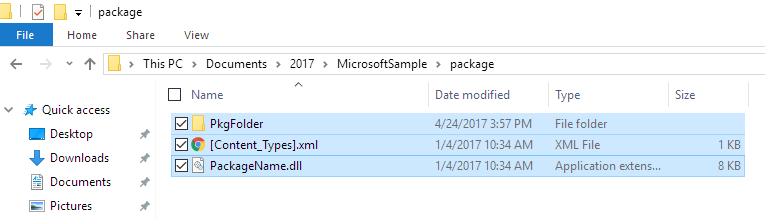
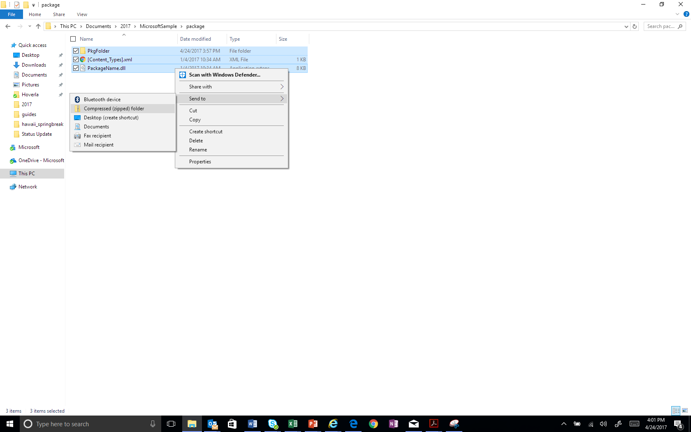
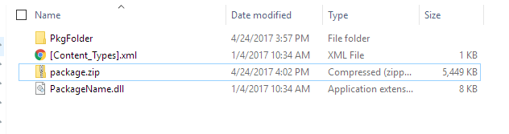
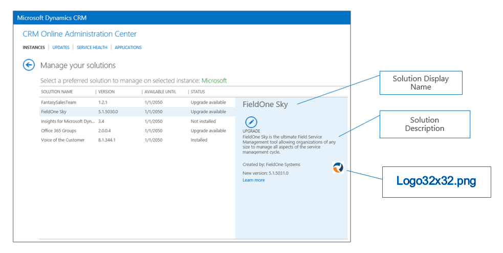
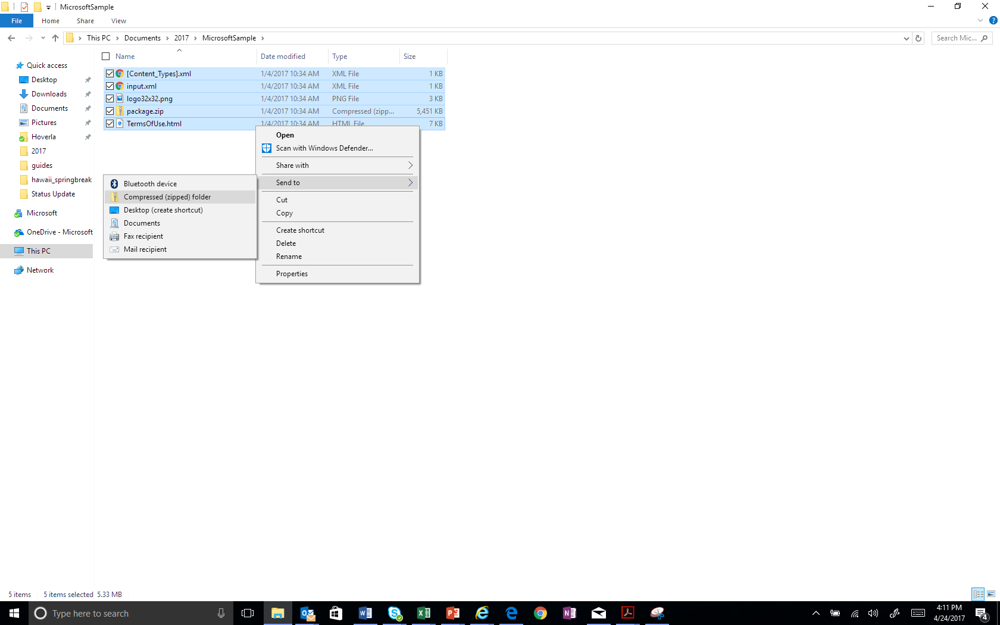

# AppSource Package Preparation

In addition to a solution.zip file, you'll need an **AppSource Package**. This is a .zip file that includes all the assets needed to automate the process of deploying your solution into the customers' CRM environment. The **AppSource Package** has the following components

* Package for the Package Deployer
* **Content_Types.xml** file with the assets you use
* xml file with your App-specific data
* 32x32 logo that will display with your listing in the Admin Center
* License terms, privacy policy

The steps below will help you create your AppSource Package.

## a. Create a Package for the Package Deployer

The Package for the Package Deployer is one part of the AppSource Package.

To create a Package for the Package Deployer, use the following instructions: [https://msdn.microsoft.com/library/dn688182.aspx](https://msdn.microsoft.com/library/dn688182.aspx). When complete, your package will consist of the assets below:

1. Package folder: contains all solutions, configuration data, flat files, and the contents for your package. _Note: In the example that follows we will assume the package folder is called "PkgFolder"_
2. dll: The assembly contains the custom code for your package. _Note: In the example that follows we will assume this file is called "MicrosoftSample.dll."_

Now, you need to create a file called "**Content_Types.xml**" This file will list all of the assets extensions that are part of your package. Here is example code for the file.

    <?xml version="1.0" encoding="utf-8"?>
        <Types xmlns="http://schemas.openxmlformats.org/package/2006/content-types">
        <Default Extension="xml" ContentType="application/octet-stream" />
        <Default Extension="xaml" ContentType="application/octet-stream" />
        <Default Extension="dll" ContentType="application/octet-stream" />
        <Default Extension="zip" ContentType="application/octet-stream" />
        <Default Extension="jpg" ContentType="application/octet-stream" />
        <Default Extension="gif" ContentType="application/octet-stream" />
        <Default Extension="png" ContentType="application/octet-stream" />
        <Default Extension="htm" ContentType="application/octet-stream" />
        <Default Extension="html" ContentType="application/octet-stream" />
        <Default Extension="db" ContentType="application/octet-stream" />
        <Default Extension="css" ContentType="application/octet-stream" />
    </Types>

The final step is to zip the following into one file. Call it **package.zip**. It will contain

1. PkgFolder (including everything inside the folder)
2. dll
3. **Content_Types.xml**

Steps to create package.zip:

1. Put your package folder, **Content_Types.xml** file, and PackageName.dll into one directory.

2. Select all the items in the folder, right-click and choose Send To Compressed (zip) folder

3. Change the name to package.zip

## b. Create an AppSource Package

The AppSource Package requires a few additional files.

1. jpg (32x32 resolution)
2. html (HTML formatted file)
3. **Content_Types.xml** (same as above)
4. xml

Here is example code for input.xml. See definitions in the below table.

    <PvsPackageData>
        <ProviderName>Microsoft</ProviderName>
        <PackageFile>package.zip</PackageFile>
        <SolutionAnchorName>SampleSolution.zip</SolutionAnchorName>
        <StartDate>01/01/2016</StartDate>
        <EndDate>01/01/2021</EndDate>
        <SupportedCountries>US,CA</SupportedCountries>
        <LearnMoreLink>http://www.microsoft.com</LearnMoreLink>
        <Locales>
        <PackageLocale Code="1033" IsDefault="true">
        <Logo>logo32x32.png</Logo>
        <Terms>
        <PackageTerm File="TermsOfUse.html" />
        </Terms>
        </PackageLocale>
        </Locales>
    </PvsPackageData>
 
**Where:**

|Field|Details|
|---|---|
|ProviderName|Who is the solution coming from. If a Microsoft team, this should be Microsoft.|
|PackageFile |Package Deployer assets zipped together with a content\_types.xml file. This zip file should contain the package deployer assembly, and the folder with the package deployer assets. That is, package.zip|
|SolutionAnchorName |Name of the solution zip file in the package deployer that is used for the display name and description of solution assets.|
| StartDate| This is the date that the solution package will become available. The format is MM/DD/YYYY|
|EndDate|This is the date that the solution package will stop being available. The format is MM/DD/YYYY |
|SupportedCountries |This is a comma-delimited list of countries that should see this package. Contact online services for a list of all current country codes. At the time, of this writing the list was: AE,AL,AM,AO,AR,AT,AU,AZ,BA,BB,BD,BE,BG,BH,BM,BN,BO,BR,BY,CA,CH,CI,CL,CM,CO,CR,CV,CW,CY,CZ,DE,DK,DO,DZ,EC,EE,EG,ES,FI,FR,GB,GE,GH,GR,GT,HK,HN,HR,HU,ID,IE,IL,IN,IQ,IS,IT,JM,JO,JP,KE,KG,KN,KR,KW,KY,KZ,LB,LK,LT,LU,LV,LY,MA,MC,MD,ME,MK,MN,MO,MT,MU,MX,MY,NG,NI,NL,NO,NZ,OM,PA,PE,PH,PK,PL,PR,PS,PT,PY,QA,RO,RS,RU,RW,SA,SE,SG,SI,SK,SN,SV,TH,TM,TN,TR,TT,TW,UA,US,UY,UZ,VE,VI,VN,ZA,ZW |
|LearnMoreLink | URL to the more info page for this package. |
|Locales|One instance of this node for each UX Language you want to support in the Preferred solution UX. This node contains children that describe the locale, logo, and terms for each language|
|Locales: PackageLocale.Code|LCID of the language for this node. Example: US English is 1033|
|Locales: PackageLocale.IsDefault|Indicates that this is the default language. This is used as the fall back language if the UX Language chosen by the customer is not available.|
|Locales: Logo|This if the logo you wish to use for this package. Size for Icon is 32x32. Formats permitted are PNG and JPG|
|Locales:Terms: PackageTerm.File|This is the file name of the HTML doc that contains your license terms.|

Here is where the logo will display:

The final step is to zip the following into one file.

1. zip (created earlier)
2. **Content_Types.xml**
3. xml
4. png
5. html

Rename the file to something appropriate for your app. We prefer that you include your company name and app name. For example: **_Microsoft_SamplePackage.zip**.
