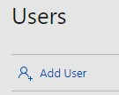
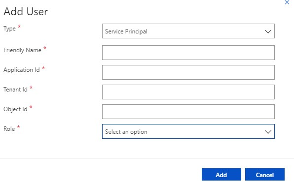

API Prerequisites
================

> [!NOTE]
> The Cloud Partner Portal APIs are integrated with Partner Center and will continue to work after your offers are migrated to Partner Center. The integration introduces small changes. Review the changes listed in [Cloud Partner Portal API Reference](https://docs.microsoft.com/azure/marketplace/cloud-partner-portal-orig/cloud-partner-portal-api-overview) to ensure your code continues to work after the migration to Partner Center.

There are two required programmatic assets that you need to use the Cloud Partner Portal APIs: a service principal and an Azure Active Directory (Azure AD) access token.


Create a service principal in your Azure Active Directory tenant
----------------------------------------------------------------

First, you need to create a service principal in your Azure AD tenant. This tenant will be assigned its own set of permissions in the Cloud Partner Portal. Your code will call APIs using as this tenant instead of using your personal credentials.  For a full explanation of creating a service principal, see [Use portal to create an Azure Active Directory application and service principal that can access resources](https://docs.microsoft.com/azure/azure-resource-manager/resource-group-create-service-principal-portal).


Add the service principal to your account
-----------------------------------------

Now that you've created the service principal in your tenant, you can add it
as a user to your Cloud Partner Portal account. Just like a user, the
service principal can be an owner or a contributor to the portal.

Use the following steps to add the service principal:

1. Sign onto the Cloud Partner Portal. 
2. Click on **Users** on the left menubar and choose **Add User**.

   

3. From the **Type** dropdown, select **Service Principal** and add the following details:

-   A **Friendly Name** for the service principal, for example `spAccount`.
-   The **Application ID**. To find this identifier, go to the [Azure
    portal](https://portal.azure.com), click **Azure Active Directory**,
    choose **App registrations**, and click on your app.
-   The **Tenant ID**, also known as the **Directory ID**, for your
    Azure AD tenant. You can find this identifier in the Azure Active Directory
    page in the [Azure portal](https://portal.azure.com), under
    **Properties**.
-   The **Object ID** for your service principal object. You can get
    this identifier from the Azure portal. Go to **Azure Active Directory**, choose
    **App registrations**, click on your app and click on the app name
    under **Managed application in local directory**. Then, go to the
    **Properties** page, to find the Object ID. Make sure you are not
    grabbing the initial Object ID that is on your app, but instead the Object
    ID in the managed application.
-   The **Role** associated with the account, which will be used for
    RBAC.

     

1. Click **Add** to add the service principal to your account.

   


Get an Azure AD access token
----------------------------

The Cloud Partner Portal APIs use the following assets and protocols during authentication:

- A JSON Web Token (JWT) bearer token to request access to resources
- The [OpenID Connect](https://openid.net/connect/) (OIDC) protocol to verify identity
- [Azure Active Directory (Azure AD)](https://docs.microsoft.com/azure/active-directory/active-directory-whatis) as the identity authority

There are two principle approaches to programmatically acquiring a JWT token:

- Use the Microsoft Authentication Library for .NET ([MSAL.NET](https://github.com/AzureAD/microsoft-authentication-library-for-dotnet)).  This higher-level approach is recommended for .NET developers. 
- Make an **HTTP POST** request to the Azure AD oauth **token** endpoint, which takes the form:

``` HTTP
POST https://login.microsoftonline.com/<tenant-id>/oauth2/token
    client_id: <application-id>
    client_secret:<application-secret>
    grant_type: client_credentials
    resource: https://cloudpartner.azure.com
```

Now, you can pass this token as part of the authorization header for API requests.

``` HTTP
GET https://cloudpartner.azure.com/api/offerTypes?api-version=2016-08-01-preview 
    Accept: application/json
    Authorization: Bearer <access-token>
```
> [!NOTE]
> For all the APIs in this reference, the authorization header is always assumed passed, so it not explicitly mentioned.

If you run into authentication errors in your request, see [Troubleshooting authentication
errors](./cloud-partner-portal-api-troubleshooting-authentication-errors.md).
