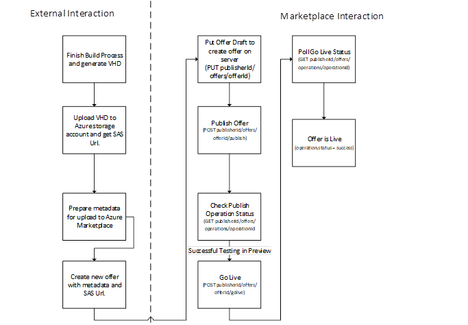
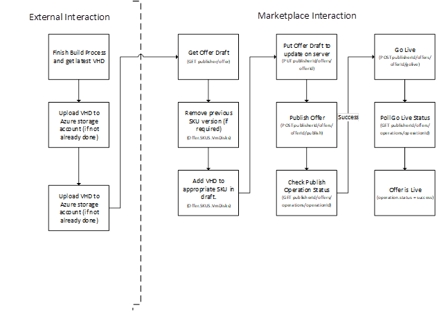

Automate offer publishing
=========================

You can also programmatically automate the VM publishing workflow, using the APIs 
in the [API Reference](./cloud-partner-portal-api-overview.md) section. There are 
two distinct scenarios to consider while
planning automation: offer initial publishing and subsequent offer publishing.


Offer initial publishing
-------------------------

When you publish an offer for the first time, it requires a few additional steps before uploading to the marketplace.  For example, you must prepare the metadata and create an offer draft. The initial publishing workflow is shown in the following diagram.



The following sample code demonstrates these steps.

``` csharp
  CreateOfferAndPublish()
  {
      offer = CreateOfferObject()
      // Set all offer attributes
      offer.offerTypeId = "microsoft-azure-virtualmachines",
      // Create offer on server
     result = CloudPartnerPortal.Client.PutOffer(offer);
      if(result.status != success)
      {
        // Do failure actions here
      }
      // Publish created offer
      Operation op = CloudPartnerPortal.Client.Publish(offer.offerName);
      if(op.HTTPStatus != OK)
      {
        /*Queuing the publish failed, check error message and dofailure actions*/
        return failure;
      }
      // Return success as operation is successfully queued
      return success;
  }

  ValidateAndGoLive()    
  {
      // Confirm the version in preview slot is the version that needs to go live
      offer = CloudPartnerPortal.Client.GetOffer(offerName, “Preview”);
      if(!offer[skuName].containsVersion(VMDisk.Version))
      {
          UpdateOfferAndPublish()
      }
      // Go Live on offer and check result
      Operation op = CloudPartnerPortal.Client.Publish(offer.offerName);
      if(op.HTTPStatus != OK)
      {
          // Queuing the publish failed, check error message and do failure actions
          return failure;
      }  
     
      // Return success as operation is successfully queued
      return success;
  }
```


Subsequent offer publishing
---------------------------

Once the virtual machine (VM) offer is integrated into a continuous integration pipeline,
you can automate the publishing workflow to run every time a new virtual hard disk
(VHD) is created.  This workflow is illustrated by the following diagram and sample code.



``` csharp
    UpdateOfferAndPublish()
    {
        // The routine wakes up after a build finishes. 
        // It determines if the current offer is undergoing publishing and take appropriate action
        // Wake up and get draft offer using offer name
        offer = CloudPartnerPortal.Client.GetOffer(offerName);
        if(!offer[skuName].containsVersion(VMDisk.Version))
        {
                // Update the list of VMs with new virtual machine. 
                // This assumes that less than 8 disks are present in the SKU
                // If 8 disks are already present, the client must remove one of the previous disks before adding new disk
                offer[skuName].addDisk(VMDisk)
                // Update the offer on server with new VMDisk
                CloudPartnerPortal.Client.PutOffer(offer);
        }
        // Publish offer and check result. Publish is idempotent, so if a publish was already in progress with latest version, this would return success.
        Operation op = CloudPartnerPortal.Client.Publish(offer.offerName);
        if(op.HTTPStatus != OK)
        {
              // Queuing the publish failed, check error message and do failure actions
              return failure;
        }
        
        // Return success as operation is successfully queued
        return success;
    }

    CheckLastOperationStatus()
    {
        Operation op = CloudPartnerPortal.Client.GetLastOpertation(offer.offerName)
        if(op.status == completed)
        {
            return success;
        }
        if(op.status == failure)
           // Do failure actions here
        
        else 
           // Last operation is still running
           // Go to sleep.           
    }

    ValidateAndGoLive()
    {
        // Confirm the version in preview slot is the version that needs to go live
        offer = CloudPartnerPortal.Client.GetOffer(offerName, “Preview”);
        if(!offer[skuName].containsVersion(VMDisk.Version))
        {
            UpdateOfferAndPublish()
        }
        // Go Live on offer and check result
        Operation op = CloudPartnerPortal.Client.Publish(offer.offerName);
        if(op.HTTPStatus != OK)
        {
              // Queuing the publish failed, check error message and do failure actions
              return failure;
        }
        // Return success as operation is successfully queued
        return success;
    }
```
