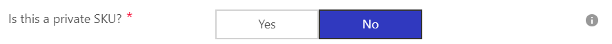
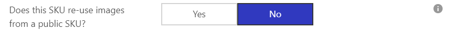
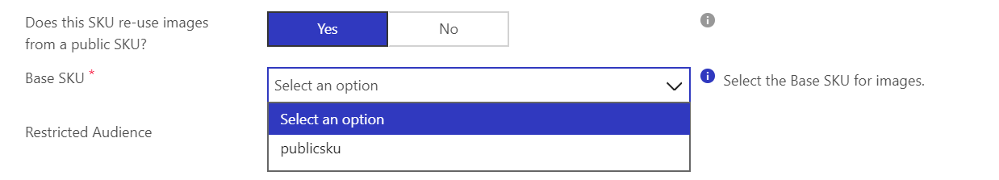
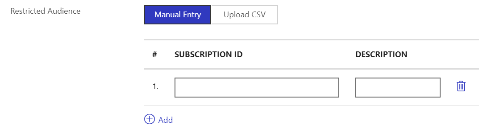
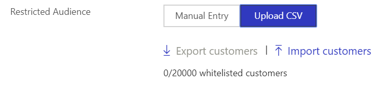
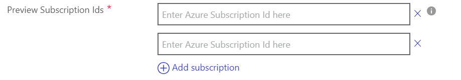

Private SKUs and Plans
============

Private SKUs enable you to restrict the availability of SKUs to specific
customers. When a SKU is marked private, it's not available in any
public catalog including on [Azure
Marketplace](https://azuremarketplace.microsoft.com) and the [Azure
portal](https://portal.azure.com). On the Azure portal, only customers
with access to the SKU can see it. Additionally, they would also be
prompted that they have access to private offers.

>[!NOTE]
>Private SKUs must have new unique SKU/Plan Ids to avoid any
conflict with your public SKUs.

You can use private SKUs to handle the following scenarios:

1.  Publish software that you want only available publicly to specific
    customers and not publicly available.
2.  Publish variations of public software at a customized price for
    specific customers.
3.  Publish variations of public software with a customized description
    and terms (via new offer).

If you only want to change the price, you can reuse the disks from
another SKU in the same offer. With private SKUs, you don't have to resubmit disks across SKUs.

Mark a SKU private
---------------------

To mark a SKU as private, toggle the option asking if the SKU is
private:



You can reuse the disks in another SKU and modify the pricing or the description. To reuse the disks, select **Yes** as a response to the "Does this SKU reuse images from a public SKU" prompt.

If the SKU is marked as private and the offer has other SKUs with
reuseable disks, you are required to indicate that the SKU reuses disks
from another SKU. You are also required to specify the target
audience for the private SKU.

>[!NOTE]
>After it's published, a public SKU can't be made private.

Select an image
------------------

You can provide new disks for the private SKU or reuse the same disks already provided in another SKU, only modifying the pricing or description. To reuse the disks, select **Yes**  as a response to the "Does this SKU reuse image from a public SKU" prompt.



After confirming that the SKU reuses images, select the source or *base* SKU for the images:



When you publish the offer, the images from the selected SKU would be
made available under the private SKU ID with the custom rates/terms. The
private SKU would only be visible to the targeted audience.

For image updates, you would only be required to update the underlying
SKU's image. Behind the scenes, the image for the private SKU will also
be updated automatically. Similarly, if you delete the image from the
underlying SKU, the image would also be removed from the private SKU.

Restricting the audience
------------------------

Private offers can be found and deployed only by targeted users.
Currently we support targeting users using subscription Ids.

These subscriptions can be entered via a manual entry form **for up to
10 subscriptions**, or by uploading a CSV file, which allows **for up to
20,000 subscriptions**.

Manual Entry for restricted audience:



CSV Upload for restricted audience:



Sample CSV file content:

            Type,Id,Description
            SubscriptionId,7738d703-3135-4e8d-8b81-1e70379abd9d,Private Customer

When you switch from manual entry to CSV upload view or from CSV to
manual entry, the old list of subscription Ids with access to the SKU is
not retained. A warning is displayed and the list is only overwritten
upon saving the offer.

Managing private audiences
-------------------------

**In order to update the audience without re-publishing the entire offer you make the audience changes you want (using either the UI or the API) and then initiate the "Sync Private Audiences" action.**

If your audience is 10 or fewer subscriptions, you can manage it entirely using the CPP UI.

If your audience is more than 10 subscriptions, you can manage it using a CSV file that you can either upload to the CPP UI or using the API.

If you are using the API and don't want to maintain a CSV file, you can manage the audience directly using API per the instructions below.

> [!NOTE]
> Use the Azure subscription ID (Plans and SKUs) or Tenant ID (Plans only) to add an audience to your private offer.

###  Managing subscriptions with the API

You can use the API to either upload a CSV or manage your audience directly (without using a CSV). In general, you simply need to retrieve your offer, update the `restrictedAudience` object, then submit those changes back to your offer in order to add or remove audience members.

Here's how to programmatically update your audience list:

1. [Retrieve your offer](../cloud-partner-portal-api-retrieve-specific-offer.md) data:

    ```
    GET https://cloudpartner.azure.com/api/publishers//offers/?api-version=2017-10-31&includeAllPricing=true
    ```

2. Find restricted audience objects in each SKU of the offer using this JPath query:

    ```
    $.definition.plans[*].restrictedAudience
    ```
3. Update the restricted audience object(s) for your offer.

    **If you originally uploaded the subscription list for your private offer from CSV file:**

    Your *restrictedAudience* object(s) will look like this.
    ```
    "restrictedAudience": {
                  "uploadedCsvUri": "{SasUrl}"
    }
    ```

    For each restricted audience object:

    a. Download the content of `restrictedAudience.uploadedCsvUri`. The content is simply a CSV file with headers. For example:

        type,id,description
        subscriptionId,541a269f-3df2-486e-8fe3-c8f9dcf28205,sub1
        subscriptionId,c0da499c-25ec-4e4b-a42a-6e75635253b9,sub2

    b. Add or delete subscriptions in the downloaded CSV file as needed.

    c. Upload the updated CSV file to a location, such as [Azure Blob storage](../../storage/blobs/storage-blobs-overview.md) or [OneDrive](https://onedrive.live.com), and create a read-only link to your file. This will be your new *SasUrl*.

    d. Update the `restrictedAudience.uploadedCsvUri` key with your new *SasUrl*.

    **If you manually entered the original list of subscriptions for your private offer from the Cloud Partner Portal:**

    Your *restrictedAudience* object(s)
 will look something like this:

    ```
    "restrictedAudience": {
        "manualEntries": [{
            "type": "subscriptionId",
            "id": "541a269f-3df2-486e-8fe3-c8f9dcf28205",
            "description": "sub1"
            }, {
            "type": "subscriptionId",
            "id": "c0da499c-25ec-4e4b-a42a-6e75635253b9",
            "description": "sub2"
            }
        ]}
    ```

    a. For each restricted audience object, add or delete entries in the `restrictedAudience.manualEntries` list as needed.

4. When finished updating all the *restrictedAudience* objects for each SKU of your private offer, [update the offer](../cloud-partner-portal-api-creating-offer.md):

    ```
    PUT https://cloudpartner.azure.com/api/publishers/<publisherId>/offers/<offerId>?api-version=2017-10-31
    ```
    With that, your updated audience list is now in effect.

Previewing private offers
-------------------------

During the preview/staging step, only the offer level preview
subscriptions will be able to access the SKU. At this testing stage
you can preview the offer as it would appear to your
target customers.

Offer Level Preview Subscriptions to access staged offers:



After the offer is live, only the restricted audience subscriptions
(entered via manual entry or CSV) will be able to view and deploy the
private SKU. We recommend that you **always include your own
subscriptions in the restricted audience** for the private SKU for
validation purposes.

>[!NOTE]
>For debugging purposes, Microsoft support and engineering
teams will also have access to these private offers.
