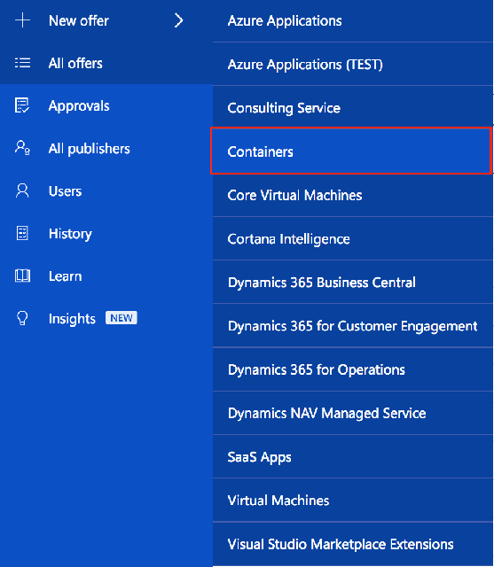
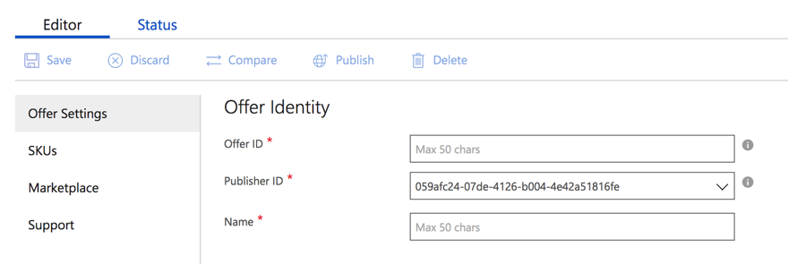
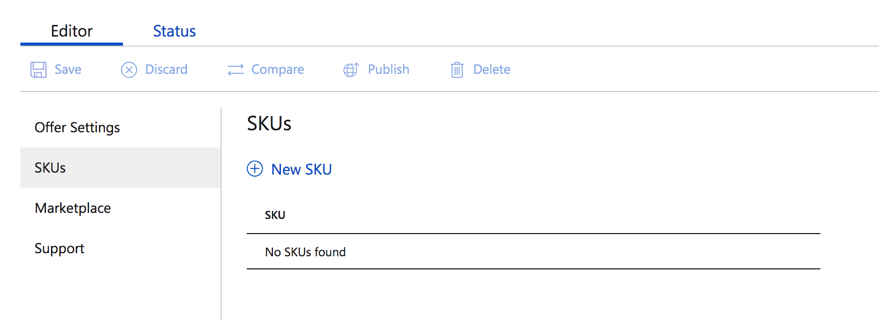
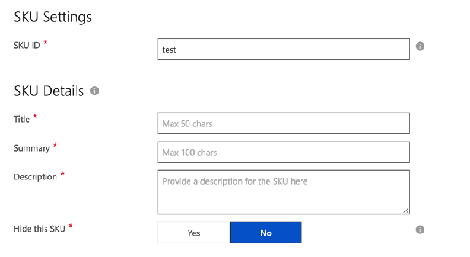
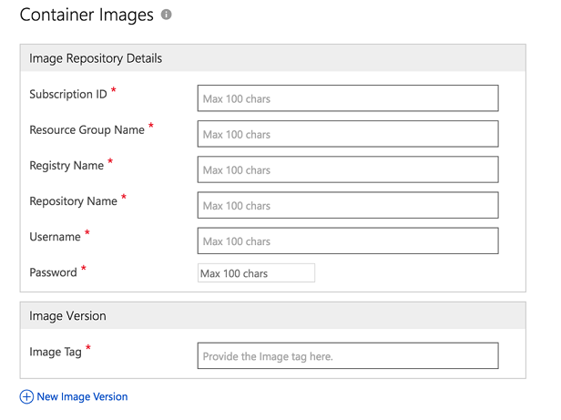
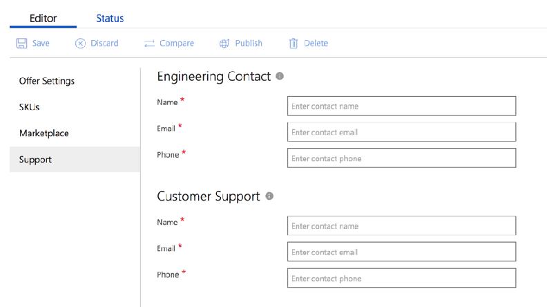

Publishing a Container Image in the Cloud Partner Portal
========================================================

This article describes how to publish a new container image in the Cloud
Partner Portal.

Use the following steps to publish a new container image.

1. Select **New offer** and then select **Containers**

    

2. In the Offer Settings tab, under Offer Identity, enter the **Offer ID**, **Publisher ID**, and **Name**.

    

3. In the SKUs tab, select **New SKU**.
    >[!NOTE]
    >You can add more than one SKU.

    

4. Provide SKU and container information. Each SKU corresponds to a container image. There are two parts to a SKU:

    -   SKU metadata
    -   Container metadata

    The SKU metadata contains the display info for the container images.

    

    The container metadata has reference information of your image
repository details inside Azure container registry (ACR). Azure
Marketplace then copies this image into the public marketplace
registry, and is made available for customers after certification. All
requests from the Azure user to consume a container image are served
from the Marketplace container registry.

   

    The Image Repository Details in the previous screen capture contains the following fields:

    -   **Subscription ID** - The Azure subscription id where ACR registry
    is present.
    -   **Resource group name** - The resource group name of the ACR
    registry.
    -   **Registry name** - The ACR registry name.
    -   **Repository name** - The repository name. Once set, this value
    cannot be changed later. This should be given an unique name so that
    no other offer under your account has the same name.
    -   **Username** - The username associated with ACR (admin username).
    -   **Password** - The password associated with ACR.

    >[!NOTE]
    >The username and password are required to ensure that partners
have access to the ACR mentioned in the publishing process.

    While publishing a container image, you can also provide one or more
    image tags. In addition to an image tag, partners can also provide SHA
    digests. Please be sure to add a **test tag** to your image so that you
    can identify the image during testing.

5. In the Marketplace tab, add your marketing-specific content.

    

6. In the Support tab, enter your engineering contact and customer support
information.

   

7. Select **Publish** to publish the offer. After you select Publish, you'll see a timeline that shows the steps involved for publishing your container image.
