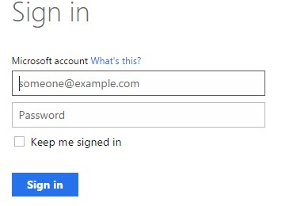
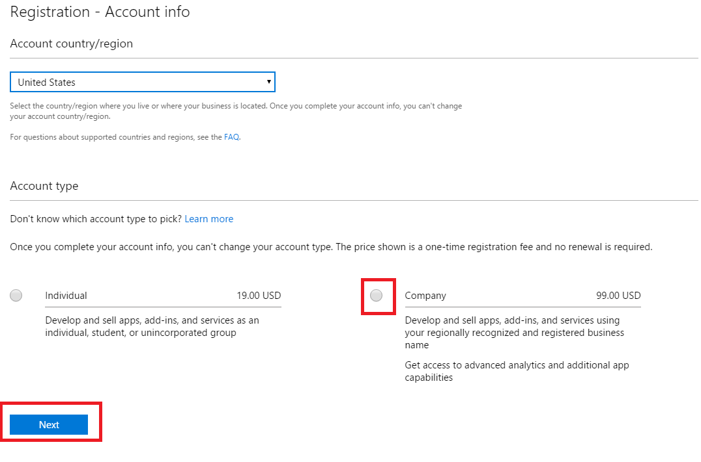
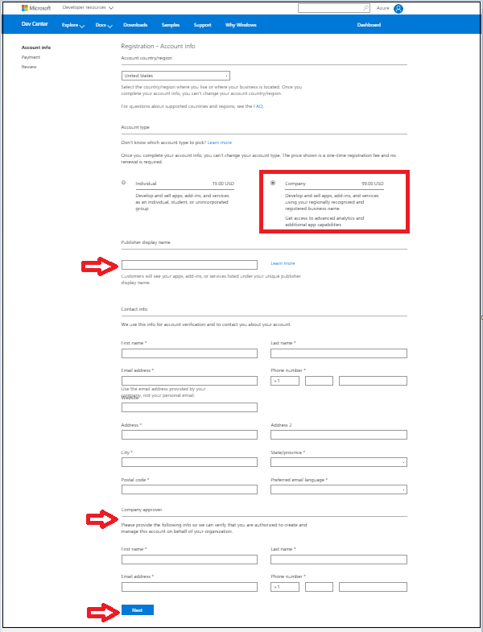
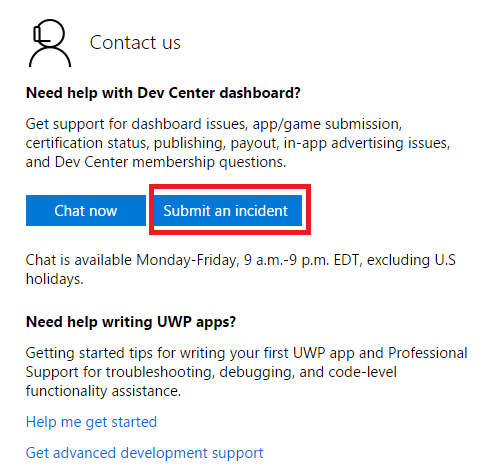
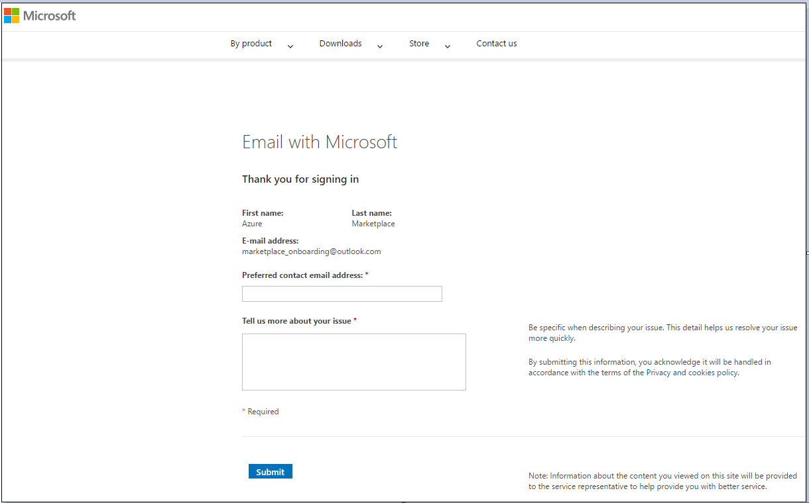

Create a Microsoft Developer account
====================================

This article describes how to become an approved Microsoft Developer for Azure Marketplace publishing.

## Create a Microsoft account

To start the publishing process, you'll need to complete the
**Microsoft Developer Center** registration. You'll use the same
registered account on the **[Cloud Partner
Portal](https://cloudpartner.azure.com/)** to start the publishing
process.

### General account guidelines

We recommend that you only have one Microsoft account for your Azure
Marketplace offerings. This account shouldn't be specific to services or offers.

The address that forms the user name should be on your domain and
controlled by your IT team. All the publishing related activities should be done through this account.

>[!WARNING]
>Words like "Azure" and "Microsoft" aren't supported for Microsoft account registration. Avoid using these words to complete the account creation and registration process.

### Company account guidelines

Follow these guidelines if more than one person will need to access the account by logging in with the Microsoft account that opened the account.

>[!IMPORTANT]
>To allow multiple users to access your Dev Center account, we recommend using Azure Active Directory to assign roles to individual users. They can access the account by signing in with their individual Azure AD credentials. For more information, see [Manage account users](https://docs.microsoft.com/windows/uwp/publish/manage-account-users).

-   Create your Microsoft account using an email address that belongs to your company\'s domain, but not to a single individual. For example, windowsapps\@fabrikam.com.
-   Limit access to this Microsoft account to the smallest possible
    number of developers.
-   Set up a corporate email distribution list that includes everyone who needs to access the developer account, and add this email address to your security info. This allows all of the employees on the list to receive security codes when needed and to manage your Microsoft account's security info. If setting up a distribution list isn't feasible, the owner of the individual email account will need to be available to access and share the security code when prompted (such as when new security info is added to the account or when it must be accessed from a new device.)
-   Add a company phone number that doesn't require an extension and is accessible to key team members.
-   In general, have developers use trusted devices to log in to your company's developer account. All key team members should have
    access to these trusted devices. This will reduce the need for
    security codes to be sent when accessing the account.
-   If you need to allow access to the account from a non-trusted PC, limit that access to a maximum of five developers. Ideally, these developers should access the account from machines that share the same geographical and network location.
-   Frequently review your [company's security info](https://account.live.com/proofs/Manage) to make sure it's    current.

>[!IMPORTANT]
>Your developer account should be accessed primarily from trusted PCs. This is critical because there is a limit to the number of codes generated per account, per week. It also enables the most seamless sign-in experience.
>
>For more information, see [additional developer account guidelines and security](https://msdn.microsoft.com/windows/uwp/publish/opening-a-developer-account#additional-guidelines-for-company-accounts).

### To create a Microsoft account

1.  Open a new Chrome Incognito or Internet Explorer InPrivate browsing session to ensure that you're not signed in to an existing account.
2.  Register the email (using the previous guidelines) as a Microsoft account by using this [link](https://signup.live.com/signup.aspx). Complete the following sign up instructions:

    - When registering your account as a Microsoft account, you need to provide a valid phone number for the system to send you an account verification code as a text message or an automated call.
    - When registering your account as a Microsoft account, you need to provide a valid email id for receiving an automated email for account verification.
    - Verify the email address sent to the DL.

    You're now ready to use the new Microsoft account in the
    Microsoft Developer Center.

## Register your account in Microsoft Developer Center

The Microsoft Developer Center is used to register the company
information once. The registrant must be a valid representative of the company, and must provide their personal information as a way to
validate their identity. The person registering must use a Microsoft
account that is shared for the company, **and the same account must be used in the Cloud Partner Portal.** You should check to make sure your company does not already have a Microsoft Developer Center account before you attempt to create one. During the process, we will collect company address information, bank account information, and tax information. These are typically obtainable from finance or business contacts.

>[!IMPORTANT]
>You must complete the following Developer profile components in order to progress through the various phases of offer creation and deployment.

| Developer profile    	| To start draft 	| Staging   	| Publish free and solution  template 	| Publish  commercial 	|
|----------------------	|----------------	|-----------	|-------------------------------------	|---------------------	|
| Company registration 	| Must have      	| Must have 	| Must have                           	| Must have           	|
| Tax profile ID       	| Optional       	| Optional  	| Optional                            	| Must have           	|
| Bank account         	| Optional       	| Optional  	| Optional                            	| Must have           	|

>[!NOTE]
>Bring Your Own License (BYOL) is only supported for virtual machines and is considered a free offering.

### Register your company account

1. Open a new Internet Explorer InPrivate or Chrome Incognito
browsing session to ensure that you're not signed in to a personal
account.

2. Go to the [Windows Dev Center](https://dev.windows.com/registration?accountprogram=azure)
to register yourself as a seller. Please read the
following important note before you proceed.

   

    >[!IMPORTANT]
    >Ensure that the email id or distribution list (a distribution list is recommended to remove dependency from individuals) which you will be using for registering in the Dev Center is at first registered as a Microsoft account. If not, then please register using this link. Also, any email id under the Microsoft company domain cannot be used for Dev Center registration.`

   

3. Run the "Help us protect your account" wizard, to verify your identity using a phone number or email address.

4. In Registration-Account Info, select your
**Account country/region** from the dropdown list and then select **Next**.

   

    >[!WARNING]
    >"Sell-from" Countries/Regions: In order to sell your services on the Azure Marketplace, your registered entity needs to be from one of the approved "sell-from" countries/regions shown in the dropdown list. This restriction is for payout and taxation reasons. For more information, see the Marketplace participation policies.

5. Select **Company** as your "Account Type" and then select **Next**.

    >[!IMPORTANT]
    >To better understand account types and decide which type is best for you, view page Account types, locations, and fees shown in the next screen capture.

    

6. Enter the **Publisher display name**. This is typically the name of your company.

    >[!NOTE]
    >The publisher display name entered in the Dev Center isn't displayed in the Azure Marketplace after your offer is listed. But this information is needed to finish the registration process.

7. Enter the **Contact info** for the account verification.

    >[!IMPORTANT]
    >You must provide accurate contact information because it will be used in our verification process for your company to be approved in the Developer Center.`

8. Enter the contact information for the **Company Approver**. The Company approver is the person who can verify that you are authorized to create an account in the Dev Center on behalf of your organization. After you provide this information, select **Next** to move to the **Payment section**.

    

9. Enter payment information for your account. If you have a
promo code that covers the cost of registration, you can enter that
here. Otherwise, provide your credit card info (or PayPal in supported markets). Select **Next** to move on to the final **Review**.

   

10. Review your account information and confirm that everything is
correct. Read and accept the terms and conditions of the [Microsoft Azure Marketplace Publisher Agreement](https://go.microsoft.com/fwlink/?LinkID=699560). Check the box
to indicate you have read and accepted these terms.

11. Select **Finish** to confirm your registration. A confirmation message is sent to your email address.

12. If you're planning to only publish free offers, select [Go to the Cloud Partner Portal](https://cloudpartner.azure.com/) and
skip to "Register your account in the cloud partner portal" in this article.

### Commercial offers

If you're planning to publish commercial offers, such as a Virtual Machine offer using an hourly billing model, you have to provide tax and banking information. To this, sign into your Developer Center account and select **Update your account
information**. Follow the instructions in the next section, "Add banking and tax information".

>[!IMPORTANT]
>You won't be able to push a commercial offer to production without providing bank account and tax information.

If you prefer to update your bank and tax information later, then you can skip to "Register your account in the cloud partner portal" in this article.

>[!NOTE]
>We recommend providing bank account and tax information as soon as possible because it takes time to validate tax information.

### Add banking and tax information

To publish commercial offers for purchase, you need to add payout and tax information and submit it for validation in the Developer Center.

**To provide bank information**

1.  Sign in to the [Microsoft Developer Center](https://dev.windows.com/registration?accountprogram=azure) with your Microsoft account.
2.  Select **Payout account** in the left menu, under **Choose payment method**, select **Bank account** or **PayPal**.

    >[!NOTE]
    >If you have commercial offers that customers purchase in the Marketplace, this is the account where you will receive payout for those purchases.
3.  Enter the payment information, and then select **Save**.

    >[!IMPORTANT]
    >If you need to update or change your payout account, follow the preceding steps to replace the current information with the new information.
    >
    >Changing your payout account can delay your payments by up to one payment cycle. This delay occurs because we need to verify the account change, just as we did when you first set up the payout account. You'll still get paid for the full amount after your account has been verified; any payments due for the current payment cycle will be added to the next one.

4.  Select **Next**.

**To provide tax information**

1.  Sign in to the [Microsoft Developer Center](https://dev.windows.com/registration?accountprogram=azure)
    with your Microsoft account (if needed).
2.  On the left menu, select **Tax profile**.
3.  On the **Set up your tax form** page:
    - Select the country or region where you have permanent residency.
    - Select the country or region where you hold primary citizenship.
    - Select **Next**.
4.  Enter your tax details, and then select **Next**.

>[!WARNING]
>You won't be able to push to your commercial offers to production without providing bank account and tax information in your Microsoft Developer Center account.

### Developer Center registration issues

If you have issues with Developer Center registration, use the following steps to open a support ticket.

1.  Go to the [support link](https://developer.microsoft.com/windows/support).
2.  Under **Contact Us**, select **Submit an incident**.
    
3.  For **Problem type**, select "Help with Dev Center"and for **Category**, select "Publish and manage apps". Select **Start email**.

    

4.  You'll be given a sign in page. Use any Microsoft account to
    sign in. If you don't have a Microsoft account then [create one](https://signup.live.com/signup?uaid=0089f09ccae94043a0f07c2aaf928831&lic=1).\

5.  Provide detailed information about the issue and select **Submit** to send the ticket.

    

## Register your account in the cloud partner portal

You use the [Cloud Partner Portal](https://cloudpartner.azure.com/) to publish and manage your offer(s).

1.  Open a new Chrome Incognito or Internet Explorer InPrivate browsing session to ensure that you're not signed in to a personal account.
2.  Go to [Cloud Partner Portal](https://cloudpartner.azure.com/).
3.  If you're a new user and signing in to the [Cloud Partner    Portal](https://cloudpartner.azure.com/) for the first time, then you must sign in using the same email id that's registered with  your Dev Center account. This ensures that your Dev Center account and the cloud partner portal account are linked to each other.

Later you can add the other members of the company who are working on the application. You can them as contributors or owners in the cloud partner portal by following the steps in the next section.

If you are added as a contributor/owner in the cloud partner portal
portal, then you can sign in with your own account.

>[!TIP]
>The participation policies are described on the Azure website.

## Manage users as owners or contributors in the cloud partner portal

[Steps to manage users on cloud partner portal](./cloud-partner-portal-manage-users.md)

## Next steps

Now that your account is created and registered, you can start the Azure marketplace publishing process.
