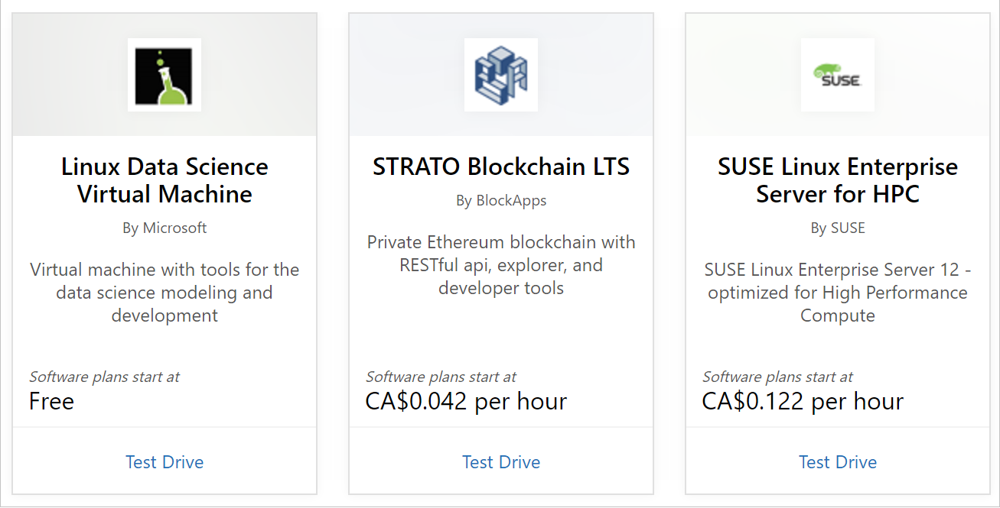
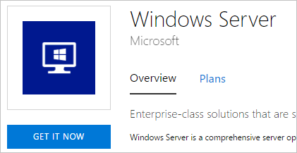
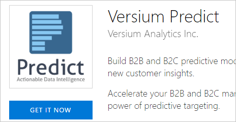
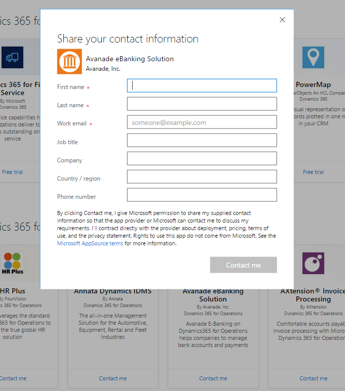
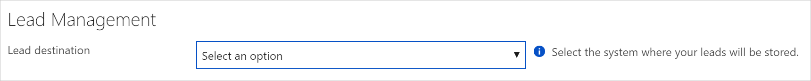

Get customer leads
==================

This article explains how to create customer leads using the Cloud Partner Portal. You can connect these leads to your CRM system, and integrate them into your sales pipeline.

## Leads

Leads are customers that are interested in, or are deploying your products from the [Azure Marketplace](https://azuremarketplace.microsoft.com/) or from [AppSource](https://appsource.microsoft.com).

### Azure Marketplace

1.  Customer takes a "Test Drive" of your offer. Test Drives are an
    accelerated opportunity for you to share your business instantly
    with potential customers without any barriers to entry. All Test
    Drives generate a lead for a customer that's interested in
    trying your product to learn more. Learn more about Test Drives at  [Azure Marketplace Test Drive](https://azuremarketplace.azureedge.net/documents/azure-marketplace-test-drive-program.pdf).

    
 

<!-- -->

1. Customer consents to sharing their information after selecting "Get it now". This lead is an **initial interest** lead, where we
   share information about customer who has expressed interest in getting your product. The lead is the top of the acquisition funnel.

   

1. Customer selects "Purchase" in the [Azure Portal](https://portal.azure.com/) to get your product. This lead is an **active** lead, where we share information about a customer who has started to deploy your product.

   

### AppSource

1.  Customer took a "Test Drive" for your offer. Test Drives are an
    accelerated opportunity for you to share your business instantly
    with potential customers without any barriers to entry. All Test
    Drives will generate a lead of a customer that's interested in
    trying your product to learn more. Learn more about Test Drives at [AppSource Test Drive](https://appsource.microsoft.com/blogs/want-to-try-an-app-take-a-test-drive).

    

2.  Customer consents to sharing their information after selecting 
    "Get it now". This lead is an **initial interest** lead, where we
    share information about customer who expresses interest in getting your product. The lead is the top of the acquisition funnel.

      

3.  Customer selects "Contact me" on your offer. This lead is an
    **active** lead, where we share information about a customer who asks to be followed up with about your product.

    

Lead Data
---------

Each lead you receive during the customer acquisition process has data in specific fields. Because you'll get leads from multiple steps, the best way to handle the leads is to de-duplicate and personalize the follow-ups. This way each customer is getting an appropriate message, and you're creating a unique relationship.

### Lead Source

The format for a lead source is **Source**-**Action** |  **Offer**

**Sources**: "AzureMarketplace", "AzurePortal", "TestDrive", and
"AppSource (SPZA)"

**Actions**:
- "INS" -- Installation. This action is on Azure Marketplace or
AppSource when a customer buys your product.
- "PLT" -- Stands for Partner Led Trial. This action is on AppSource when a customer uses the Contact me option.
- "DNC" -- Do Not Contact. This action is on AppSource when a
Partner who was cross listed on your app page gets requested to be
contacted. We're sharing the heads up that this customer was cross
listed on your app, but they don't need to be contacted.
- "Create" -- This action is only inside the Azure Portal and is generated when a customer purchases your offer to their account.
- "StartTestDrive" -- This action is for only for Test Drives, and is generated when a customer starts their test drive.

**Offers**

The following examples show unique identifiers that are assigned to a publisher and a specific offer: checkpoint.check-point-r77-10sg-byol, bitnami.openedxcypress, and docusign.3701c77e-1cfa-4c56-91e6-3ed0b622145a.

### Customer Info

The fields in the following example show the customer information that's contained in a lead.
- FirstName: John
- LastName: Smith
- Email: jsmith\@microsoft.com
- Phone: 1234567890
- Country: US
- Company: Microsoft
- Title: CTO

>[!Note]
>Not all the data in the previous example is always available for each lead.

We are actively working on enhancing leads, so if there is a data field that you do not see here but would like to have, please [send us your feedback](mailto:AzureMarketOnboard@microsoft.com).

How to connect your CRM system with the Cloud Partner Portal
------------------------------------------------------------

To start getting leads, we've built our Lead Management connector on the Cloud Partner Portal so that you can easily plug in your CRM
information, and we will make the connection for you. Now you can easily leverage the leads generated by the marketplace without a significant engineering effort to integrate with an external system.

We can write leads into a variety of CRM systems or directly to an Azure Storage Table where you can manage the leads however you'd like. Each of the following links provide instructions for connecting to possible lead destinations:

-   [Dynamics CRM Online](./cloud-partner-portal-lead-management-instructions-dynamics.md) to get the instructions on how to configure Dynamics CRM Online for getting leads.
-   [Marketo](./cloud-partner-portal-lead-management-instructions-marketo.md) to get the instructions for setting up Marketo Lead Configuration to get leads.
-    [Salesforce](./cloud-partner-portal-lead-management-instructions-salesforce.md) to get instructions for setting up your Salesforce instance to get leads.
-    [Azure Table](./cloud-partner-portal-lead-management-instructions-azure-table.md) to get the instructions for setting up your Azure storage account for getting leads in an Azure table.
-   [Https Endpoint](./cloud-partner-portal-lead-management-instructions-https.md) to get the instructions for setting up your Https Endpoint to get leads.

After you configure your lead destination and Publish your offer, we'll validate the connection and send you a
test lead. When you are viewing the offer before you go live, you can
also test your lead connection by trying to acquire the offer yourself in the preview environment. It's important to make sure that your lead settings stay up-to-date so that you don't lose any leads, so make sure you update these connections whenever something has changed on your end.

What next?
----------

Once the technical set up is in place, you should incorporate these
leads into your current sales & marketing strategy and operational
processes. We are very interested in better understanding your overall sales process and want to work closely with you on providing
high-quality leads and enough data to make you successful. We welcome
your feedback on how we can optimize and enhance the leads we send you with additional data to help make these customers successful. Please let us know if you're interested in [providing
feedback](mailto:AzureMarketOnboard@microsoft.com) and suggestions to
enable your sales team to be more successful with Marketplace Leads.
