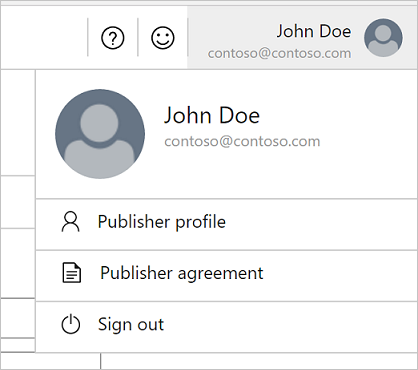

# Getting started with the Cloud Partner Portal

This article provides a walk-through of the Cloud Partner Portal. Learn what you can do using the Cloud Partner Portal to work with offers on [Azure Marketplace](https://azuremarketplace.microsoft.com/) and on
[AppSource](https://appsource.microsoft.com/).

Portal tour
-----------

The Cloud Partner Portal contains everything you need to offer and operate a successful business on the cloud. Here's a quick overview of the parts of this site that you'll likely use the most often.

### Left navigation bar

When you first land on the portal, you should see the collapsible navigation bar. This is where you can navigate among menu items.

Use the menu bar to get more information about each of the following items:

- **New offer** - Kick off a new offer here.
- **All offers** - Check the state and status of all your current offers.
- **Users** - [Manage and control access for your
    company](./cloud-partner-portal-manage-users.md).
- **Learn** - Jump-start your learning, and stay up-to-date on what's new in the Partner Portal.
- **Insights** - Find insights and usage information about your products and customers by visiting the Insights Portal.

### Offer page

Continuing the tour, once you start a new offer or come back to edit your offer, you'll do a lot of work in the offer page. This is where you configure all the settings for your offer and check its status.

On the Offer page you can:
- Add content or check your offer's status by toggling between two top level modes: **Editor** and **Status**.
- Use the **Action bar** to explicitly manage your offer's changes by saving and discarding your input.
- Navigate between the required **Forms** for each offer as you change your offer's settings.

### Menu bar

Finally, on the top of your screen you'll always be able to navigate to the top menu bar. This menu contains interactive actions for support and feedback. You can also access all your Publisher account information.

-   **Need help?** - If you're ever confused and need help, create a support request, and find links to the documentation.
-   **Feedback** - Have something you want to say? Let us know here. Microsoft wants to make the Azure Marketplace, the AppSource publishing process, and the overall cloud partner portal experience as easy and as intuitive as possible. We triage and review all feedback, and we'll always respect your privacy. We only contact you when you ask for more information.
- **Publisher account** - When you first visit the portal you'll see the publisher agreement contract to accept becoming a publisher. From then on, this is where you can make edits to your publisher profile or revisit the contract. This is also where you connect your Dev Center account to be able to sell your offers.
