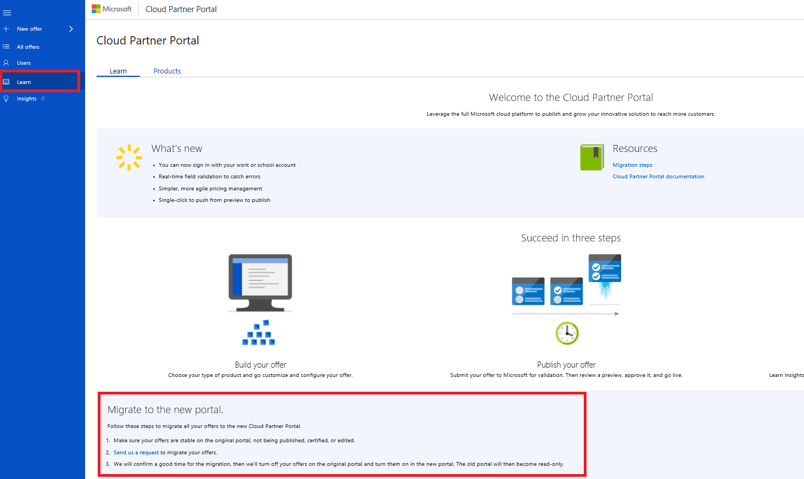

# How to migrate to the new Cloud Partner Portal

Migrating to the Cloud Partner Portal is a significant step. In response to your feedback on the publishing process, we made serious investments in the portal. These investments focused on ease of use and improvements to the publishing experience. 

-   Support for Organizational Id logins
-   Real-time field validation to catch errors
-   Simplified Publishing Workflow

We've made it easy to migrate your offers, so if you're ready for an improved publishing experience, review the following migration steps.

Make your migration a success by reviewing the following migration stages.

## Decide you're ready to migrate

Before migrating your offers to the Cloud Partner Portal, make sure you fully understand what is going to happen.

**Am I migrating all my offers?**

Today we are migrating all Virtual Machine offers. Each
of your draft, staged, or listed Virtual Machine offers will be migrated.

Other types of offer, such as Solution Templates and Test Drives, will continue to function on the old portal for the time being.

**Will my live offer continue to work?**

Yes, this migration will not affect your live offers. We also have pre-populated your publisher account information so that you can immediately make updates to your offer in the new portal after migration is finished. Staged offers will become a draft and you'll need to
publish them in the new portal.

**When I migrate, can I change my offers' pricing?**

No, for all of your live offers, the pricing still needs to be the same because we don't support price changes in this migration.

**What if my offer is in staging/publishing state?**

Your migration will fail if any of your offers are currently being published or staged on the old portal. It's important when you're picking a migration time to make sure your offers are all in a published/staged state.

**How does the new role-based access work?**

In the new portal, your admin becomes the owner of the publishing profile and all co-admins become contributors. If you want to edit anything in your publishing profile, you should go to the new portal.

To manage your users, if you want to add someone to work on an offer on the old portal, you still add them as a co-admin on the old portal. If you want to add someone to work on an offer on the new portal, you'll add them as a contributor on the new portal.

**When I migrate is it final?**

When we migrate your offers, we'll mark all your old portal actions on those offers as read only and block creates on the old portal. You can continue to edit and work with all your migrated offers where you left off, but only in the new portal.

## Submit a request to migrate

Once you've decided you are ready to plan your migration, submit to migrate on the Learn page on the Cloud Partner Portal with your Publisher Name and Id.

## Confirm a date to migrate

We migrate offers every week on Tuesday from 10am -- 1pm PST, and ask you to confirm a time to transfer at least 24 hours in advance from the owner of the publishing account. If you need to migrate at a different time such that it doesn't interfere with your workflow, we'll work with you
to find the best time.

You can expect an email notification to let you know that the migration is finished, and that you can now continue to work on the new portal.

## Settle in and enjoy!

After the migration, you should be good to go on the new portal. From now on your offers are going to be read only on the old portal, and all future creations and edits should come from the new portal!

**Something went wrong in my migration, what should I do?**
 
If your migration fails, we will revert the changes and reschedule another time to migrate for you. Please feel free to reach out to us through the feedback tool if you have any questions once your migration is finished.
