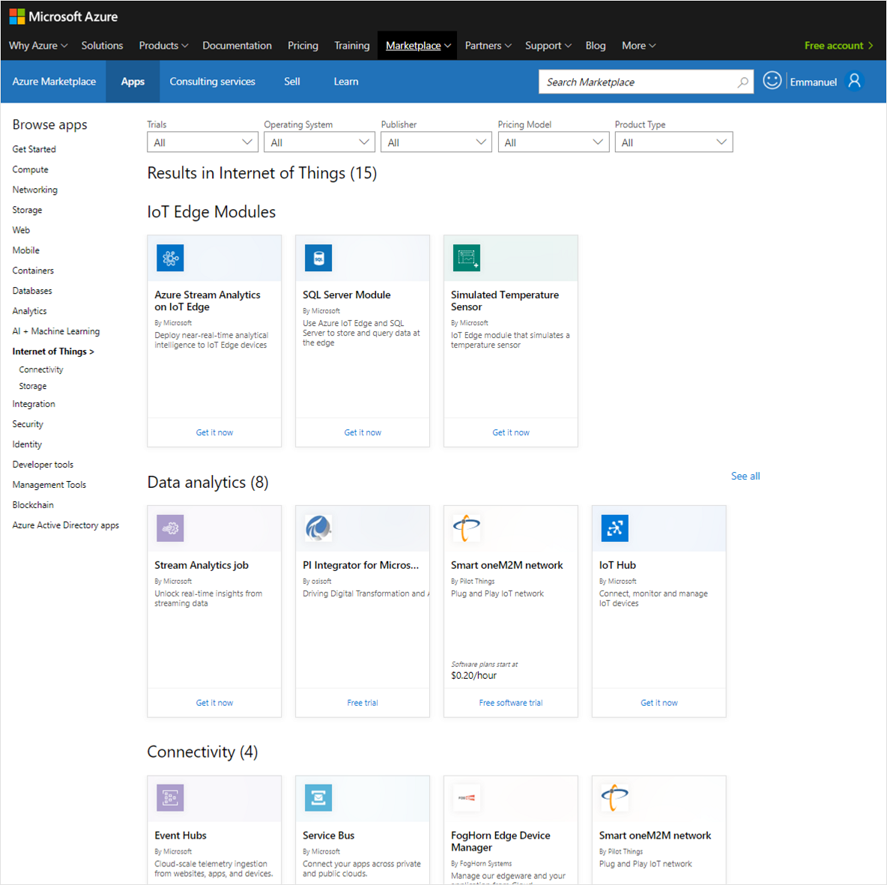

# IoT Edge Module Marketplace Frequently Asked Questions

## What is the Edge Module Marketplace?

The IoT Edge Module Marketplace is a list of *certified* pre-built Edge modules that are *discoverable* through the Azure Marketplace.

## Where will Edge modules be visible? 

In the [Azure portal marketplace](https://ms.portal.azure.com/) (authenticated
experience), under the Internet of Things category, tagged as "IoT Edge Module".

And in the [Azure marketplace
website](https://azuremarketplace.microsoft.com/en-us/marketplace/apps/category/internet-of-things?page=1)
(anonymous experience) under the Internet of Things category, tagged as "IoT
Edge Module".

## Is it open to partners?

Not yet. Currently, only Microsoft-authored modules are published in the IoT Edge section of the marketplace. 

## Why should partners publish their IoT Edge modules?

-   To increase their product visibility by adding this channel to market and showcasing their solutions.

-   To get more leads. As part of the Azure Marketplace, they can get details about who is interested in their solution.

-   To be among the first to leverage more monetization capabilities.

## What is the onboarding process?

While not yet open, the onboarding process will be done through the Azure
Marketplace. Detailed guidelines are in the [Azure Marketplace and AppSource publishing guide](https://docs.microsoft.com/azure/marketplace/marketplace-publishers-guide). Refer to the transact listing type for Containers. 

Partners will first need to become a Publisher for the Azure Marketplace. Then they'll be able to onboard their Edge modules through the [Cloud Partner Portal](./cloud-partner-portal-getting-started-with-the-cloud-partner-portal.md).

## Are there any monetization capabilities?

Not out of the box for now. Our first goal is to open a marketplace with *free* or *bring your own license* Edge modules. We'll be adding more monetization capabilities, such as a consumption billing model.

## What is bring-your-own-license (BYOL)?

The official definition in the [Microsoft Azure Marketplace Participation Policies](https://azure.microsoft.com/support/legal/marketplace/participation-policies/) is:

- *Customers obtain outside of the Azure Marketplace the right to access or use the offering and are not charged Azure Marketplace fees for use of the offering in the Azure Marketplace.*

It's up to partners to license their software and collect revenues
for it.

## Can partners publish a “freemium” module?

Yes freemium modules, which are modules available for free but with some restrictions, will be considered as any other publication.

## Is intellectual property protected?

An Edge module is a Docker compatible container. It's up to partners to protect their intellectual property (IP) packaged in the distributed containers.

## Where will the modules be hosted?

IoT Edge modules will be hosted in a Microsoft-owned container registry that will be anonymously query-able, like Docker Hub.

## What are the integration plans between the Azure Marketplace and the Azure IoT tools?

We'll build tighter integration between the Azure Marketplace and the Azure IoT tools. Examples of what we have in mind are to enable some browsing of the IoT Edge module marketplace directly from the IoT Hub portal or directly from Visual Studio Code.

## Which operating system or architecture should my container support?

IoT Edge modules must support the same OS / architecture matrix as IoT
Edge in production. This list is maintained in [Azure IoT Edge Support](https://docs.microsoft.com/azure/iot-edge/support). For example,
a module must currently support Linux x64 and Linux ARM32.

## Are there any other certification constraints to be aware of?

We’re still working on the exact set of certification constraints. Our guiding principles are:

-   Promoting quality over quantity.

-   IoT Edge-specific containers (not random ones).

-   Production grade.

-   1-click deployment (at least with a set of default configuration values provided).

## Any other questions?

Contact [Azure IoT Edge on-boarding](mailto:azureiotedgeonboarding@service.microsoft.com).
