# Lead management instructions for Azure Table

This article describes how to configure Azure Table for storing sales leads. Azure Table lets you store and customize customer information.


## How to configure Azure Table

1. If you don't have an Azure account, you can [create a free trial account](https://azure.microsoft.com/pricing/free-trial/).
2. After your Azure account is active, sign in to the [Azure portal](https://portal.azure.com).
3. In the Azure portal, create a storage account using the following procedure.  
    1. Select **+Create a resource** in the left menubar.  The **New** pane (blade) will be displayed to the right.
    2. Select **Storage** in the **New** pane.  A **Featured** list is displayed to the right.
    3. Select **Storage Account** to begin account creation.  Follow the instructions in the article [Create a storage account](https://docs.microsoft.com/azure/storage/common/storage-quickstart-create-account?tabs=azure-portal).

    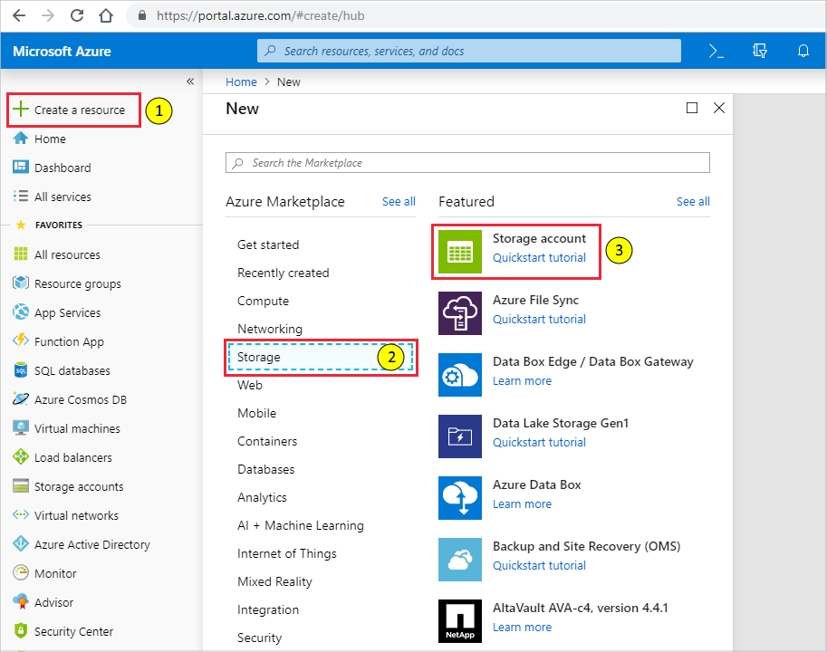

    For more information about storage accounts, select [Quickstart tutorial](https://docs.microsoft.com/azure/storage/).  For more information about storage pricing, see [storage pricing](https://azure.microsoft.com/pricing/details/storage/).

4. Wait until your storage account is provisioned, a process that typically takes a few minutes.  Then access your storage account from the **Home** page of the Azure portal by selecting **See all your resources** or by selecting **All resources** from the left navigation menubar of the Azure portal.

    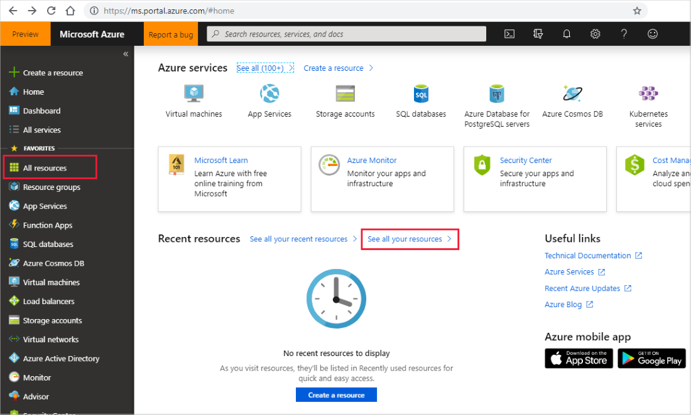

5. From your storage account pane, copy the storage account connection string for the key and paste it into the **Storage Account Connection String** field on the Cloud Partner Portal. An example of a connection sting is:

```sql
DefaultEndpointsProtocol=https;AccountName=myAccountName;AccountKey=myAccountKey;EndpointSuffix=core.windows.net
```

  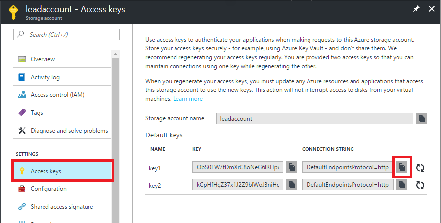

You can use [Azure storage explorer](https://azurestorageexplorer.codeplex.com/) or other similar tool to see the data in your storage table. You can also export the data from Azure tables.


## Use Microsoft Flow with an Azure Table (*optional*) 

You can use [Microsoft Flow](https://docs.microsoft.com/flow/) to automate notifications every time a lead is added to Azure table. If you don’t have an account, you can [sign up for a free account](https://flow.microsoft.com/).


### Lead notification example

Use this example as a guide to create a basic flow that automatically sends an email notification when a new lead is added to an Azure table. This example sets up a recurrence to send lead information every hour if table storage is updated.

1. Sign in to your Microsoft Flow account.
2. On the left navigation bar, select **My flows**.
3. On the top navigation bar, select **+ New**.  
4. On the dropdown list, select **+ Create from blank**
5. Under Create a flow from blank, select **Create from blank**.

   

6. On the connectors and triggers search page, select **Triggers**.
7. Under **Triggers**, select **Recurrence**.
8. In the **Recurrence** window, keep the default setting of 1 for **Interval**. From the **Frequency** dropdown list, select **Hour**.

   >[!NOTE] 
   >Although this example uses a 1-hour interval, you can select the interval and frequency that’s best for your business needs.

   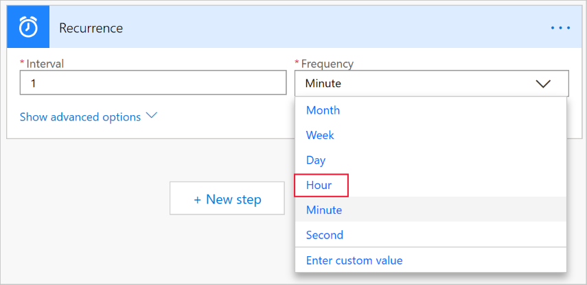

9. Select **+ New step**.
10. Search for “Get past time”, and then select **Get past time** under Actions. 

    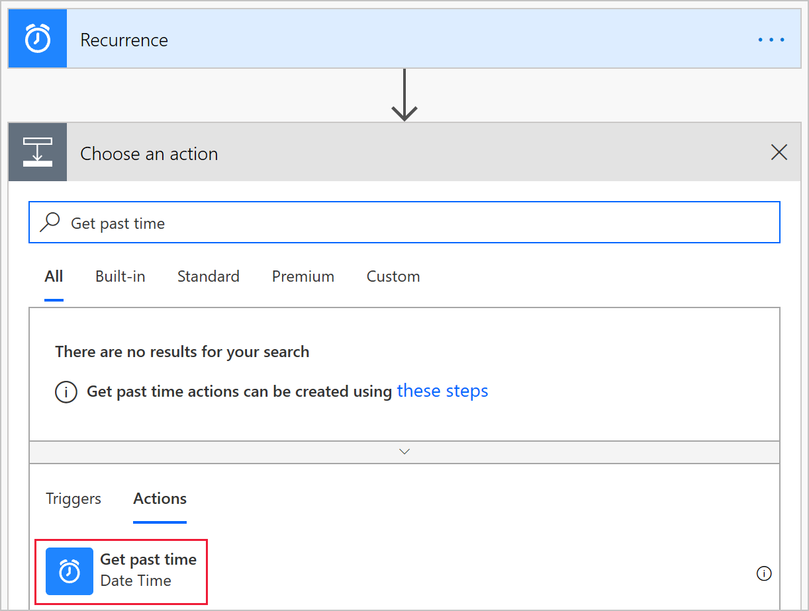

11. In the **Get past time** window, set the **Interval** to 1.  From the **Time unit** dropdown list, select **Hour**.
    >[!IMPORTANT] 
    >Make sure that this Interval and Time unit matches the Interval and Frequency you configured for Recurrence.

    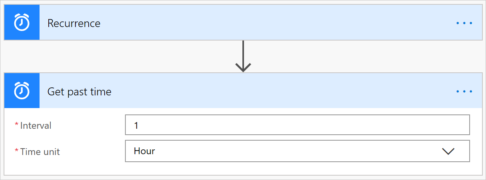

    >[!TIP] 
    >You can check your flow at any time to verify each step is configured correctly. To check your flow, select **Flow checker** from the Flow menu bar.

In next set of steps, you’ll connect to your Azure table, and set up the processing logic to handle new leads.

1. After the Get past time step, select **+ New step**, and then search for “Get entities”.
2. Under **Actions**, select **Get entities**, and then select **Show advanced options**.
3. In the **Get entities** window, provide information for the following fields:

   - **Table** – Enter the name of your Azure Table Storage. The next screen capture shows the prompt when “MarketPlaceLeads” is entered for this example. 

     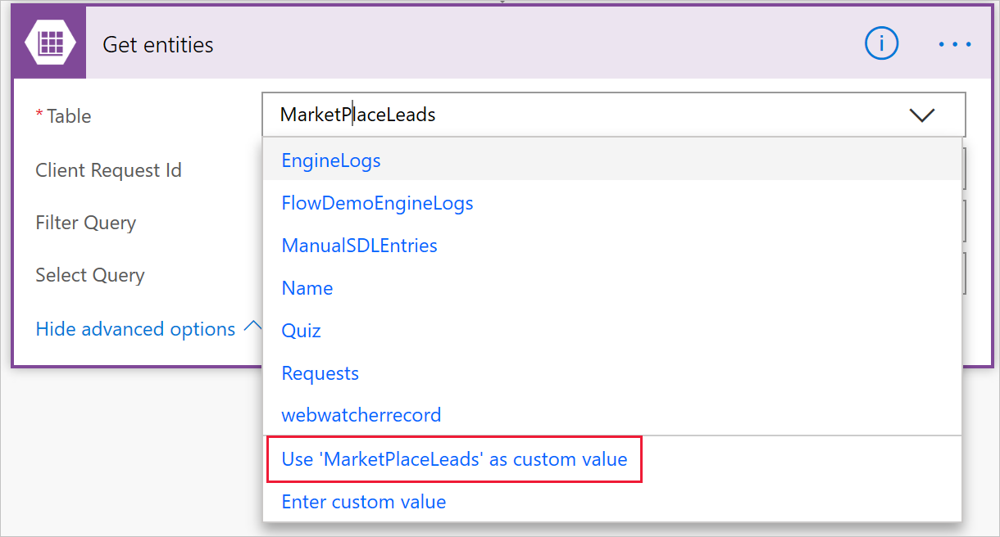

   - **Filter query** – Click this field and the **Get past time** icon is displayed in a popup window. Select **Past time** to use this as timestamp to filter the query. Alternatively, you can paste the following function into the field: CreatedTime `Timestamp gt datetime'@{body('Get_past_time')}'` 

     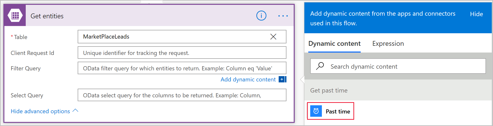

4. Select **New step** to add a condition to scan the Azure table for new leads.

   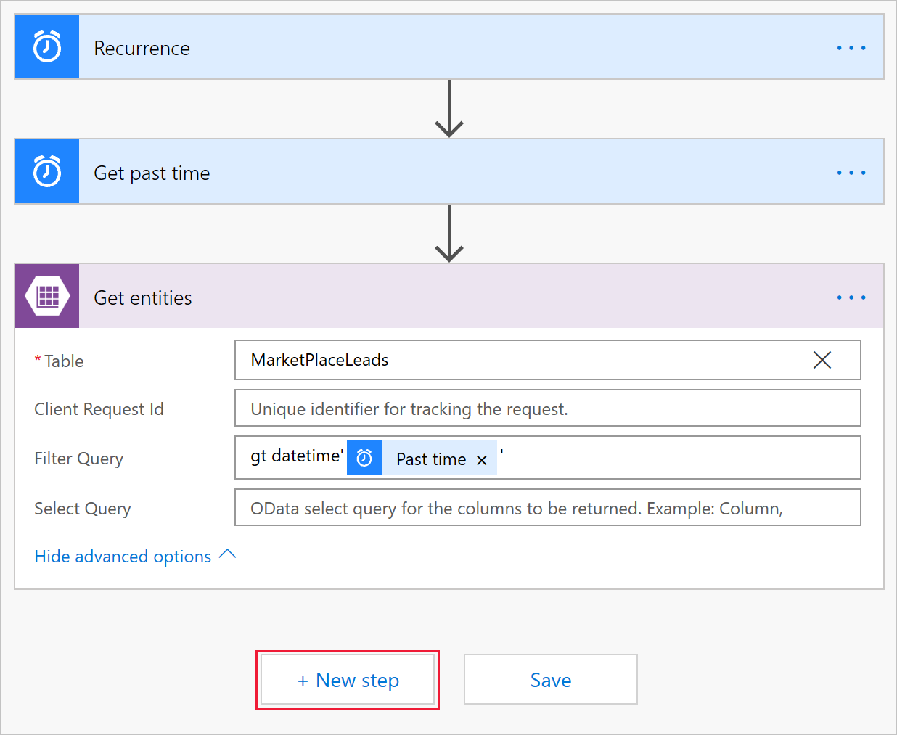

5. In the **Choose an action** window, select **Actions**, and then select the **Condition** control.

     

6. In the **Condition** window, select the **Choose a value** field, and then select **Expression** in the popup window.
7. Paste `length(body('Get_entities')?['value'])` into the ***fx*** field. Select **OK** to add this function. To finish setting up the condition:

   - Select “is greater than” from the dropdown list.
   - Enter 0 as the value 

     

8. Set up the action to take based on the result of the condition.

     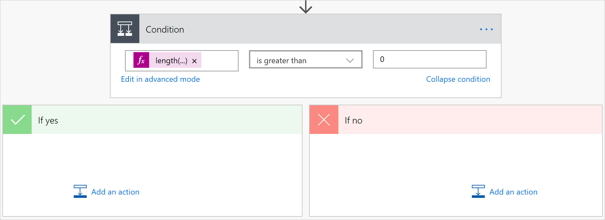

9. If the condition resolves to **If no**, don’t do anything. 
10. If the condition resolves to **If yes**, trigger an action that connects your Office 365 account to send an email. Select **Add an action**.
11. Select **Send an email**. 
12. In the **Send an email** window, provide information for the following fields:

    - **To** - Enter an email address for everyone that will get this notification.
    - **Subject** – Provide a subject for the email. For example: New leads!
    - **Body**:   Add the text that you want to include in each email (optional) and then paste in body  `body('Get_entities')?['value']` as a function to insert lead information.

      >[!NOTE] 
      >You can insert additional static or dynamic data points to the body of this email.

      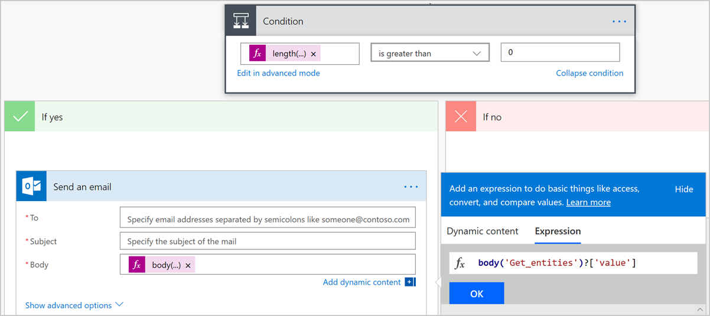

13. Select **Save** to save the flow. Microsoft Flow will automatically test the flow for errors. If there aren’t any errors, your flow starts running after it’s saved.

The next screen capture shows an example of how the final flow should look.

[](./media/cloud-partner-portal-lead-management-instructions-azure-table/msflow-end-to-end.png)

(*Click on the image to enlarge.*)


### Manage your flow

Managing your flow after it’s running is easy.  You have complete control over your flow. For example, you can stop it, edit it, see a run history, and get analytics. The next screen capture shows the options that are available to manage a flow. 

 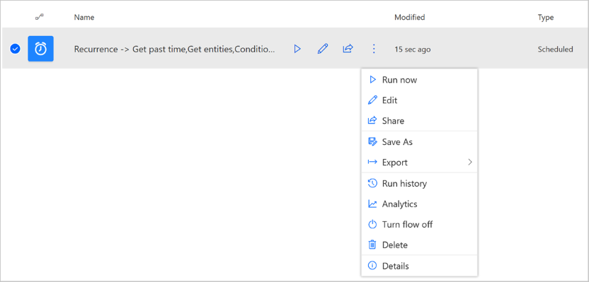

The flow keeps running until you stop it by using the **Turn flow off** option.

If you’re not getting any lead email notifications, it means that new leads haven’t been added to the Azure table. If there are any flow failures, you’ll get an email like the example in the next screen capture.

 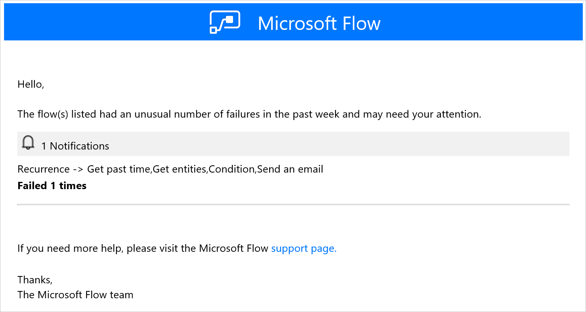


## Next steps

[Configure customer leads](https://docs.microsoft.com/azure/marketplace/cloud-partner-portal-orig/cloud-partner-portal-get-customer-leads)
